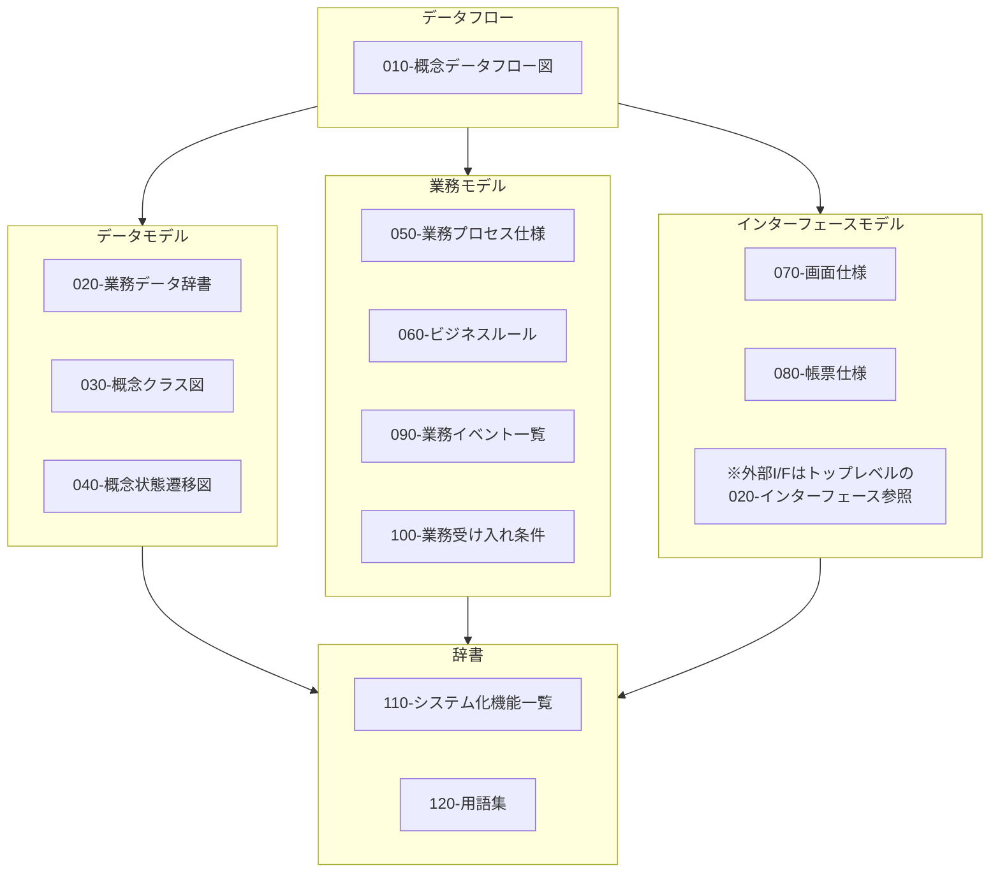

# ドキュメントの内容ガイド

本リポジトリでは、システム開発における各種ドキュメントのテンプレートとサンプルを提供しています。仕様駆動開発に適した、**生成AIが扱い易く、人も理解できて、記述も負担にならない**、そんな仕様書の内容についてガイドを示します。

ドキュメントは、渡辺幸三先生が提唱する[三要素分析法](https://dbc.in.coocan.jp/methodology.html)に基づく業務・システム設計を念頭に構成しています。

三要素分析法とは、企業システムに特化した設計方法論で、業務をデータフロー図を頂点に、(1)ER図（データモデル）、(2)アクションツリー図（業務モデル）、(3)機能展開図（機能モデル）の３つの要素で分析・設計する方法論です。三要素分析法を用いることで、業務とシステムの整合性を高め、効率的なシステム開発が可能となります。

---

## 000-プロジェクト

このプロジェクトで何を達成したいかを関係者で共有します。各ドキュメントの目的と主な内容、サンプルイメージは以下の通りです。

| ドキュメント                         | 目的                                     | 主な内容                                             | サンプル（抜粋イメージ）                                                                                             |
| ------------------------------------ | ---------------------------------------- | ---------------------------------------------------- | -------------------------------------------------------------------------------------------------------------------- |
| 010-プロジェクト概要                 | プロジェクトの背景と狙いを共有する       | 背景・目的・必要性・期待効果・前提条件               | 「本プロジェクトは、店舗在庫の欠品率を年間○％削減することを目的とする。」                                            |
| 020-プロジェクトスコープ             | 対象範囲／対象外を明確にする             | 対象業務、対象システム、対象期間、スコープ外         | 「対象：店舗〜本部の在庫・発注業務／対象外：仕入先側システム改修」                                                   |
| 030-プロジェクト課題と解決アプローチ | 取り組むべき課題と解決策の方針を整理する | 課題一覧、原因、解決策候補、選択したアプローチと理由 | 「課題：欠品が多い／解決策案：安全在庫見直し、自動発注導入… 採用：自動発注＋見直し（理由：効果とコストのバランス）」 |

---

## 010-業務仕様

現行の業務やあるべき業務を概念的なモデルとして整理・可視化します。三要素分析法のデータフロー図を中心に、データモデル、業務モデル、インターフェースモデル※の各要素を網羅的に記述します。各々のドキュメントとの関係は以下の通りです。

※本ドキュメントでは、「業務モデル」がやや曖昧な表現で誤解を招く可能性があるため、インターフェースモデルとして再定義しています。

| ドキュメント           | 目的                                             | 主な内容                                                 | サンプル（抜粋イメージ）                                                                |
| ---------------------- | ------------------------------------------------ | -------------------------------------------------------- | --------------------------------------------------------------------------------------- |
| 010-概念データフロー図 | 業務レベルの情報の流れを可視化                   | 「誰が・いつ・何を・誰に」などの情報フロー図             | 「店員 → POS『販売データ』→ 在庫管理 → 発注管理『発注候補』」                           |
| 020-業務データ辞書     | 業務で扱う“項目”の意味を揃える                   | 項目名、説明、単位、入力者、利用シーン、関連用語ID       | 「項目名：発注点／説明：用語集T-001参照／入力：商品マスタ画面（バイヤー）」             |
| 030-概念クラス図       | 業務上のエンティティ関係を整理                   | 商品・在庫・発注・店舗などの概念と関連                   | 「商品 1.._在庫、店舗 1.._ 在庫、発注 1..\* 発注明細」                                  |
| 040-概念状態遷移図     | 業務オブジェクトの状態変化を整理                 | 状態、遷移イベント、遷移条件、禁止遷移                   | 「注文：『登録』→『承認』→『出荷済』→『完了』」                                         |
| 050-業務プロセス仕様   | 業務プロセスの処理内容を定義する                 | プロセスID、開始条件、前提、Input、Process、Output       | 「bp-001: 開始条件:在庫不足、Input:商品マスタ、Process:発注候補を生成、Output: 発注書」 |
| 060-ビジネスルール     | 複数プロセスから参照される横断的な判断を定義する | ルールID、条件、結果、例外、根拠                         | 「br-001: 在庫数＜発注点 の場合、自動発注候補を生成する。」                             |
| 070-画面仕様           | 業務ユーザー視点の画面要件を定義                 | 画面名、目的、項目一覧、入力制約、ボタン動作、メッセージ | 「画面：在庫一覧／項目：商品コード、商品名、在庫数、在庫状態…」                         |
| 070-帳票仕様           | 業務ユーザー視点の帳票要件を定義                 | 帳票名、目的、表示項目一覧                               | 「帳票：商品一覧／項目：商品コード、商品名、発注点、…」                                 |
| 090-業務イベント一覧   | 業務上の重要な出来事を整理                       | イベントID、名称、トリガー、入力・出力データ、関係ロール | 「ev-001: 販売発生／トリガー：会計完了／出力：販売伝票、在庫減少イベント」              |
| 100-業務受け入れ条件   | 業務側から見た“OKライン”を明確化                 | 業務シナリオ、期待結果、判定基準、関係KPI                | 「uc-01 欠品アラート：欠品候補商品は前日までに一覧化され、バイヤーが対応できる。」      |
| 110-システム化機能一覧 | システムで実現する機能を一覧化する               | 機能ID、機能名、対応業務・イベント、実現手段、優先度     | 「sf-001 在庫照会／対象：ev-001／手段：画面 inv-001／優先度：高」                       |
| 120-用語集             | 用語の意味を統一する                             | 用語、定義、備考、類似語・禁止語                         | 「発注点：在庫がこの数量を下回ったときに発注候補とみなす基準数量。」                    |

---

## 020-インターフェース

| ドキュメント       | 目的                                   | 主な内容                                                               | サンプル（抜粋イメージ）                                                              |
| ------------------ | -------------------------------------- | ---------------------------------------------------------------------- | ------------------------------------------------------------------------------------- |
| 010-API仕様        | 画面や外部から利用されるAPIを定義      | エンドポイント、HTTPメソッド、リクエスト／レスポンス、ステータスコード | 「GET /api/inventories?storeId=… → 200: Inventory[]／404: NotFound」                  |
| 020-外部システムIF | 他システムとの連携仕様を定義           | 対象システム、データ項目、フォーマット、伝送方法、スケジュール         | 「仕入先システムへ発注データを日次CSV(UTF-8)でSFTP送信」                              |
| 030-メッセージ仕様 | イベント／キューのメッセージ仕様を定義 | トピック・キュー名、メッセージ構造、バージョン、再送・冪等方針         | 「topic: stock.changed payload:{productId, storeId, beforeQty, afterQty, changedAt}」 |

---

## 030-アーキテクチャ

| ドキュメント           | 目的                                 | 主な内容                                                       | サンプル（抜粋イメージ）                                                 |
| ---------------------- | ------------------------------------ | -------------------------------------------------------------- | ------------------------------------------------------------------------ |
| 010-C4コンテキスト図   | システムと外部主体の関係を俯瞰する   | ユーザー、外部システム、本システムの関係図                     | 「店舗スタッフ／バイヤー／外部仕入先システム ↔ 在庫・発注管理システム」 |
| 020-C4コンテナ図       | システム内部の“箱”構成を定義         | Web/UI、API、バッチ、DB、メッセージ基盤などの構成              | 「Webフロント、APIサーバ、ジョブサーバ、RDB、Kafka」                     |
| 030-C4コンポーネント図 | コンテナ内の主要コンポーネントを定義 | サービス、リポジトリ、アダプタなど主要コンポーネントと依存関係 | 「在庫サービス、発注サービス、マスタ管理サービス、認証コンポーネント…」  |
| 040-インフラ構成概要   | インフラのざっくり構成を共有         | 利用クラウド、VPC構成、ネットワーク、環境構成（本番・検証）    | 「AWS／東京リージョン、VPC1つ、ALB → EC2(API) → RDS(PostgreSQL)」        |

---

## 040-システム設計

| ドキュメント            | 目的                                 | 主な内容                                                          | サンプル（抜粋イメージ）                                                       |
| ----------------------- | ------------------------------------ | ----------------------------------------------------------------- | ------------------------------------------------------------------------------ |
| 010-実装データフロー図  | 実装レベルの処理・データの流れを定義 | サービス間、バッチ、キュー、外部IFのデータフロー                  | 「POS→API『/sales』→SalesService→在庫更新イベント→発注バッチ」                 |
| 020-実装クラス図        | 実装クラス構造を定義                 | クラス、インターフェース、継承関係、パッケージ構成                | 「StockService → StockRepository、OrderService → OrderRepository」             |
| 030-DB設計/010-論理設計 | 論理テーブル構造を定義               | エンティティ、テーブル名、項目、論理型、主キー・外部キー          | 「TABLE: INVENTORY（product_id, store_id, qty, reorder_point,…）」             |
| 030-DB設計/020-物理設計 | 物理的なDB仕様を定義                 | 物理型、インデックス、パーティション、表領域など                  | 「qty: INTEGER／IDX_INV_PRODUCT_STORE(product_id, store_id) 作成」             |
| 040-シーケンス図        | 処理の時系列の流れを明確化           | ユースケースごとのコンポーネント間メッセージ                      | 「ユーザー→画面→API→Service→Repository→DB の呼び順」                           |
| 050-実装画面仕様        | UI実装の詳細仕様を定義               | 画面ID、ルーティング、コンポーネント構成、バリデーション、API連携 | 「/inventory-list は GET /api/inventories を呼び、レスポンスをテーブル表示。」 |
| 060-バッチ・ジョブ設計  | バッチ処理の実装仕様を定義           | ジョブID、実行タイミング、入力・出力、リトライ、エラー動作        | 「JOB-001 自動発注候補作成：毎日2:00／入力：INVENTORY／出力：ORDER_CANDIDATE」 |
| 070-設定パラメータ一覧  | 変更可能な設定項目を整理             | パラメータ名、説明、既定値、範囲、上書き階層、反映方法            | 「reorder.threshold.default=10／上書き：環境・店舗単位／再起動不要」           |

---

## 050-品質

| ドキュメント             | 目的                               | 主な内容                                                     | サンプル（抜粋イメージ）                                                              |
| ------------------------ | ---------------------------------- | ------------------------------------------------------------ | ------------------------------------------------------------------------------------- |
| 010-非機能要件           | 性能・可用性などの品質要求を定義   | 性能、同時接続、可用性、保守性、運用性、セキュリティ         | 「在庫照会API：平常時P95 500ms以内、ピーク時100 RPSを処理可能とする。」               |
| 020-システム受け入れ条件 | システム全体としての合格基準を定義 | 機能・非機能・障害・移行などの受け入れ条件                   | 「性能試験で全てのNFRを満たし、重大障害0件であること。」                              |
| 030-アクセス制御         | 認証・認可のルールを定義           | ロール、権限一覧、画面/APIごとのアクセス可否、権限変更フロー | 「店舗スタッフ：自店舗在庫のみ閲覧可／店長：全店舗閲覧可。」                          |
| 040-エラー処理           | エラー時の挙動を統一する           | エラー分類、ユーザ向けメッセージ方針、ログ、リトライ         | 「外部APIタイムアウト：3回リトライ、失敗時はユーザに汎用メッセージ＋WARNログ出力。」  |
| 050-監査・モニタリング   | ログ・監視・監査証跡の方針を定義   | 監査ログ項目、保持期間、監視メトリクス、アラート条件         | 「監査ログ：誰が・いつ・どの商品を・どの値からどの値に変更したかを記録（7年保管）。」 |

---

## 060-テスト

| ドキュメント                   | 目的                       | 主な内容                                                       | サンプル（抜粋イメージ）                                              |
| ------------------------------ | -------------------------- | -------------------------------------------------------------- | --------------------------------------------------------------------- |
| 010-テスト戦略・方針           | 全体テストの考え方を示す   | テストレベルと目的、スコープ、環境、フェーズ間の入口／出口条件 | 「ドメインロジックは単体〜結合まで自動化、UIは主要シナリオのみE2E。」 |
| 020-テスト観点・テスト条件一覧 | 何を確認すべきかを整理     | 業務観点、例外観点、非機能観点、要件・機能IDとのトレース       | 「TC-INV-001：在庫自動発注（条件：在庫＜発注点）」                    |
| 030-単体テスト                 | 単体テスト設計・結果を記録 | クラス／メソッド単位のテストケース・期待値・結果               | 「StockService.adjust()：マイナス値禁止、0境界、正常加算…」           |
| 040-結合テスト                 | コンポーネント間結合の検証 | 結合パターン、ケース、期待値、結果                             | 「画面→API→Service→Repository→DB の一連動作確認。」                   |
| 050-システムテスト             | システム全体の動作確認     | 業務シナリオテスト、非機能テスト結果                           | 「日次業務のシナリオ（販売→発注→入荷）の通しテスト。」                |
| 060-受け入れテスト             | ユーザー受け入れ結果を記録 | 業務受け入れ条件との対応、判定、指摘・要望                     | 「UC-01：OK／UC-02：アラート閾値調整要望あり」                        |

---

## 080-移行

| ドキュメント           | 目的                            | 主な内容                                                         | サンプル（抜粋イメージ）                                                                  |
| ---------------------- | ------------------------------- | ---------------------------------------------------------------- | ----------------------------------------------------------------------------------------- |
| 010-業務移行方針       | 旧業務→新業務への移行方針を定義 | 移行方式（一斉／並行）、影響範囲、教育・マニュアル方針           | 「1ヶ月間は旧システムと並行稼働し、差異確認後に新システムへ一本化。」                     |
| 020-データ移行設計     | 旧DB→新DBの移行方法を定義       | 対象データ、マッピング、変換ルール、移行ツール／バッチ、検証方法 | 「旧 INV_OLD.qty → 新 INVENTORY.qty（単位変換なし）、無効商品は除外。」                   |
| 030-カットオーバー計画 | 本番切替の具体手順を定義        | 当日タイムライン、作業手順、担当者、リハーサル・ロールバック手順 | 「T-1h: 旧システム停止／T+0h: データ移行開始／T+2h: 新システム起動／T+4h:業務利用開始。」 |

---

## 090-決定記録

| ドキュメント | 目的                                 | 主な内容                                               | サンプル（抜粋イメージ）                                                                  |
| ------------ | ------------------------------------ | ------------------------------------------------------ | ----------------------------------------------------------------------------------------- |
| adr-xxxx     | 重要な設計・技術選択の決定理由を残す | 背景、決定した内容、検討した選択肢、採択理由、影響範囲 | 「adr-0001: DBとしてPostgreSQL採用。代替：MySQL／理由：既存資産・チーム経験・機能要件。」 |
