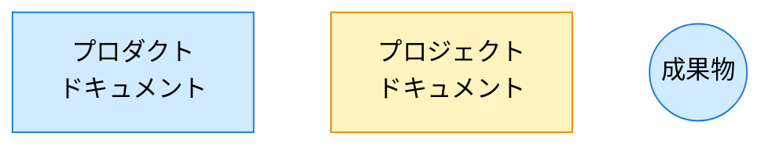
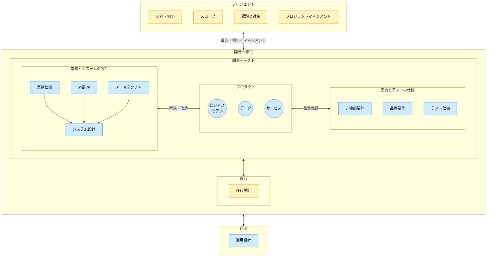

# ドキュメント構成ガイド

## ドキュメントの構成

### プロダクトドキュメント

プロダクトの最新状況を説明するドキュメントです。プロダクトを新規に構築する際に作成されて、プロダクトを改修する毎に更新されます。
プロダクトの、

- 業務とシステムの設計
- 品質とテストの仕様

について記載します。プロダクトのライフサイクルにわたって管理されます。

※品質は、性能・可用性・セキュリティ・ユーザビリティ等、プロダクトに求める品質特性とその目標水準を定義します。

プロダクトドキュメントは、

- 常に「現在の正」を表します。
- プロジェクト固有の判断や経緯は含めず、必要な場合はプロジェクトドキュメントから反映されます。
- ドキュメントの改定履歴はバージョン管理システムで管理します。

### プロジェクトドキュメント

プロダクトの構築時や改修時に、プロジェクト毎に作成されるドキュメントです。個別プロジェクト毎の、

- 目的・狙い、スコープ、課題と対策
- プロジェクトマネジメント

について記載します。プロジェクト完了後はアーカイブされます。

### 凡例

### ドキュメント構成図

