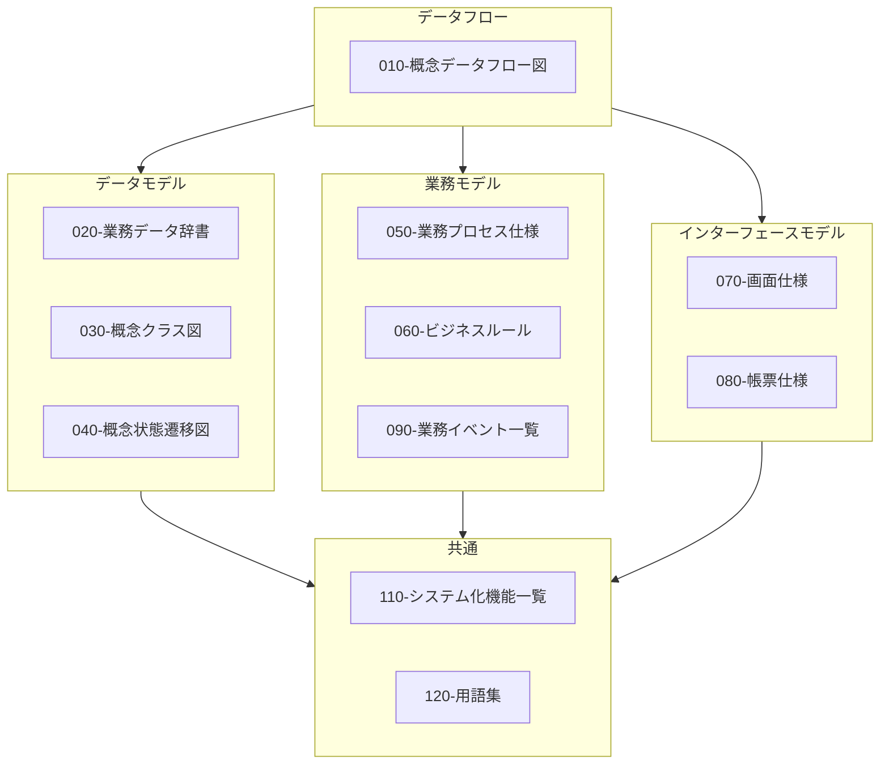

# ドキュメントの内容ガイド

本リポジトリでは、システム開発における各種ドキュメントのテンプレートとサンプルを提供しています。仕様駆動開発に適した、**生成AIが扱い易く、人も理解できて、記述も負担にならない**、そんな仕様書の内容についてガイドを示します。

---

## 000-プロジェクト

このプロジェクトで何を達成したいかを関係者で共有します。各ドキュメントの目的と主な内容は以下の通りです。

### 業務要求

<!-- prettier-ignore -->
| ドキュメント | 略称 | 目的 | 主な内容 |
| --- | --- | --- | --- |
| 010-プロジェクト概要 | | プロジェクトの背景と狙いを共有する | 背景・目的・必要性・期待効果・前提条件 |
| 020-プロジェクトスコープ | | 対象範囲／対象外を明確にする | 対象業務、対象システム、対象期間、スコープ外 |
| 030-プロジェクト課題と解決アプローチ | | 取り組むべき課題と解決策の方針を整理する | 課題一覧、原因、解決策候補、選択したアプローチと理由 |

### プロジェクトマネジメント

### 決定記録

<!-- prettier-ignore -->
| ドキュメント | 略称 | 目的 | 主な内容 |
| --- | --- | --- | --- |
| 090-決定記録 | ADR | 重要な設計・技術選択の決定理由を残す | 背景、決定した内容、検討した選択肢、採択理由、影響範囲 |

---

<details>
<summary>サンプル（抜粋イメージ）</summary>

### 業務要求

<!-- prettier-ignore -->
| ドキュメント | サンプル（抜粋イメージ） |
| --- | --- |
| 010-プロジェクト概要 | 本プロジェクトは、店舗在庫の欠品率を年間○％削減することを目的とする。 |
| 020-プロジェクトスコープ | 対象：店舗〜本部の在庫・発注業務／対象外：仕入先側システム改修 |
| 030-プロジェクト課題と解決アプローチ | 課題：欠品が多い／解決策案：安全在庫見直し、自動発注導入… 採用：自動発注＋見直し（理由：効果とコストのバランス） |

### プロジェクトマネジメント

### 決定記録

<!-- prettier-ignore -->
| ドキュメント | サンプル（抜粋イメージ） |
| --- | --- |
| 090-決定記録 | ID: adr-0001／DBとしてPostgreSQL採用／代替：MySQL／理由：既存資産・チーム経験・機能要件 |

</details>

---

## 010-業務仕様

業務仕様は、渡辺幸三先生が提唱する[三要素分析法](https://dbc.in.coocan.jp/methodology.html)に基づく業務・システム設計を念頭に構成しています。

三要素分析法とは、企業システムに特化した設計方法論で、業務をデータフロー図を頂点に、(1)ER図（データモデル）、(2)アクションツリー図（業務モデル）、(3)機能展開図（機能モデル）の３つの要素で分析・設計する方法論です。三要素分析法を用いることで、業務とシステムの整合性を高め、効率的なシステム開発が可能となります。

現行の業務やあるべき業務を概念的なモデルとして整理・可視化します。三要素分析法のデータフロー図を中心に、データモデル、業務モデル、インターフェースモデル※の各要素を網羅的に記述します。各々のドキュメントとの関係は以下の通りです。

※本ドキュメントでは、「業務モデル」がやや曖昧な表現で誤解を招く可能性があるため、インターフェースモデルとして再定義しています。



### ドキュメント一覧と概要

#### データフロー

<!-- prettier-ignore -->
| ドキュメント | 略称 | 目的 | 主な内容 |
| --- | --- | --- | --- |
| [010-概念データフロー図](../rules/cdfd-rules.md) | CDFD | 対象となる業務の全体構成・流れを可視化し、定義する | 業務（プロセス）とその間の情報の流れ・物の流れ、業務のきっかけとなるイベント、業務主体 など |

#### データモデル

<!-- prettier-ignore -->
| ドキュメント | 略称 | 目的 | 主な内容 |
| --- | --- | --- | --- |
| [020-業務データ辞書 / 業務データ辞書](../rules/bdd-rules.md) | BDD | データの意味や構造に関する共通理解を作る | 業務上の管理単位（エンティティ）とその属性（項目）の論理名・物理名・説明・制約 など |
| [020-業務データ辞書 / 概念データストア一覧](../rules/cdsl-rules.md) | CDSL | 概念データストア（情報の保管場所）を一覧で定義する | データストア名、対応プロセス、内容、更新タイミング、粒度、主な用途 など |
| [020-業務データ辞書 / 保管場所一覧](../rules/sll-rules.md) | SLL | 業務対象となる物の物理的な保管場所を一覧で定義する | 保管場所名、保管対象、内容・目的、関連プロセス、管理頻度 など |
| [020-業務データ辞書 / ステータス一覧](../rules/stl-rules.md) | STL | 業務上のエンティティが取り得る状態（ステータス）を一覧で定義する | 対象、ステータス名、呼称、説明 など |
| [020-業務データ辞書 / 分類一覧](../rules/cll-rules.md) | CLL | 業務上の分類（カテゴリ、種別、区分など）を一覧で定義する | 分類定義名、種別、分類名、説明など |
| [030-概念クラス図](../rules/ccd-mermaid-rules.md) | CCD | 業務上のエンティティ関係を図で定義する | 商品・在庫・発注・店舗などの概念と属性、関連（継承/親子/参照） など |
| [040-概念状態遷移図](../rules/cstd-rules.md) | CSTD | 業務オブジェクトの状態変化を図で定義する | 対象、状態、遷移、イベント、条件など |

#### 業務モデル

<!-- prettier-ignore -->
| ドキュメント | 略称 | 目的 | 主な内容 |
| --- | --- | --- | --- |
| [050-業務プロセス仕様](../rules/bps-rules.md) | BPS | 業務プロセスの処理内容を定義する | 業務プロセス概要、トリガー、前提、入力、処理、出力 など |
| [060-ビジネスルール](../rules/br-rules.md) | BR | 複数プロセスから参照される横断的な判断を定義する | ルール概要、入力、ルール、出力、例外 など |
| [090-業務イベント / 業務イベント一覧](../rules/bel-rules.md) | BEL | 業務上で発生する主要なイベントを一覧で定義する | イベントID、イベント名、何が起きたか、いつ、発生条件 など |
| [090-業務イベント / 業務イベント仕様](../rules/bev-rules.md) | BEV | 業務上で発生する主要なイベントを個別に定義する | イベントID、イベント名、何が起きたか、いつ、発生条件 など |

#### インターフェースモデル

<!-- prettier-ignore -->
| ドキュメント | 略称 | 目的 | 主な内容 |
| --- | --- | --- | --- |
| [070-画面仕様](../rules/uis-rules.md) | UIS | 業務ユーザー視点の画面の利用目的や表示項目、操作を定義する | 画面概要、利用目的、表示項目、操作、遷移、エラー表示 など |
| [080-帳票仕様](../rules/bds-rules.md) | BDS | 業務ユーザー視点の帳票の利用目的や表示項目を定義する | 帳票概要、利用目的、表示項目、出力タイミング など |

#### 共通

<!-- prettier-ignore -->
| ドキュメント | 略称 | 目的 | 主な内容 |
| --- | --- | --- | --- |
| [110-システム化機能一覧](../rules/sfl-rules.md) | SFL | システムで実現する機能を一覧で定義する | 機能ID、機能名、概要、関連プロセス、関連仕様ID など |
| [120-用語集](../rules/gl-rules.md) | GL | 用語の意味を統一的に定義する | 用語、定義、別名、分類、関連用語 など |

<details>

<summary>サンプル（抜粋イメージ）</summary>

#### データフローサンプル

<!-- prettier-ignore -->
| ドキュメント | サンプル（抜粋イメージ） |
| --- | --- |
| [010-概念データフロー図](../rules/cdfd-rules.md) | 在庫不足 → 店員が在庫台帳を確認して発注 → 仕入先へ発注書送付 |

#### データモデルサンプル

<!-- prettier-ignore -->
| ドキュメント | サンプル（抜粋イメージ） |
| --- | --- |
| [020-業務データ辞書](../rules/bdd-rules.md) | 項目名：発注点／説明：用語集T-001参照／単位：個数／許容値：0以上の整数 |
| [020-業務データ辞書 / 010-概念データストア一覧](../rules/cdsl-rules.md) | データストア：在庫／対応プロセス：販売・入荷／内容：商品名、入庫数、出庫数、現在庫数、賞味期限 |
| [020-業務データ辞書 / 020-保管場所一覧](../rules/sll-rules.md) | 保管場所：バックヤード／対象：商品在庫／内容・目的：店舗内在庫の一時保管／関連プロセス：調達・販売／管理頻度：毎日 |
| [020-業務データ辞書 / 030-ステータス一覧](../rules/stl-rules.md) | エンティティ：お金／ステータス：レジ内のお金／呼称：レジ現金／説明：営業中に使う釣り銭と売上金の合算 |
| [020-業務データ辞書 / 040-分類一覧](../rules/cll-rules.md) | 分類：商品区分／種別：業務分類／分類名：お菓子／説明：食品系商品 |
| [030-概念クラス図](../rules/ccd-mermaid-rules.md) | 伝票 "1" *-- "0..*" 明細 : 構成する／明細 "*" --> "1" 商品 : 商品を参照 |
| [040-概念状態遷移図](../rules/cstd-rules.md) | [*] --> 仕入前／仕入前 --> 仕入直後 : 納入商品の受入／仕入直後 --> 販売可能状態 : 検品 / 合格 |

#### 業務モデルサンプル

<!-- prettier-ignore -->
| ドキュメント | サンプル（抜粋イメージ） |
| --- | --- |
| [050-業務プロセス仕様](../rules/bps-rules.md) | bps-001: トリガー:在庫不足、入力:商品マスタ、処理:発注候補を生成、出力: 発注書 |
| [060-ビジネスルール](../rules/br-rules.md) | br-001: 在庫数＜発注点 の場合、自動発注候補を生成する。 |
| [090-業務イベント / 業務イベント一覧](../rules/bel-rules.md) | 「bel-main: イベント名：会計確定（販売）／何が起きたか：販売の会計が確定された |
| [090-業務イベント / 業務イベント仕様](../rules/bev-rules.md) | 「bev-001: イベント名：納品登録（仕入れ）／何が起きたか：仕入れの納品が確定された |

#### インターフェースモデルサンプル

<!-- prettier-ignore -->
| ドキュメント | サンプル（抜粋イメージ） |
| --- | --- |
| [070-画面仕様](../rules/uis-rules.md) | 画面：在庫一覧／項目：商品コード、商品名、在庫数、在庫状態 |
| [080-帳票仕様](../rules/bds-rules.md) | 帳票：商品一覧／項目：商品コード、商品名、発注点 |

#### 共通サンプル

<!-- prettier-ignore -->
| ドキュメント | サンプル（抜粋イメージ） |
| --- | --- |
| [110-システム化機能一覧](../rules/sfl-rules.md) | 機能名：商品登録／関連プロセス：管理、販売 |
| [120-用語集](../rules/gl-rules.md) | term: 発注点／definition: 在庫がこの数量を下回ったときに発注候補とみなす基準数量。 |

</details>

## 020-外部I/F仕様

### ドキュメント一覧と概要

<!-- prettier-ignore -->
| ドキュメント | 略称 | 目的 | 主な内容 |
| --- | --- | --- | --- |
| [010-外部システムI/F一覧](../rules/esil-rules.md) | ESIL | 外部システムとの連携を一覧(YAML)で定義する | 連携名、連携元、連携先（外部システム）、伝送方式、フォーマット、タイミング |
| [020-外部API仕様](../rules/eapis-rules.md) | EAPIS | 外部システムとのAPI連携をOpenAPI形式(YAML)で定義する | エンドポイント、HTTPメソッド、リクエスト／レスポンス、ステータスコード |
| [030-外部ファイル連携仕様](../rules/efes-rules.md) | EFES | 外部システムとのファイル連携をYAMLで定義する | ファイル形式、伝送方法、スケジュール、ファイル項目一覧 |
| [040-外部メッセージ仕様](../rules/ems-rules.md) | EMS | 他システムとのイベント／キューのメッセージ連携をAsyncAPI + CloudEvents(YAML)で定義する | チャネル名、メッセージ構造、エンドポイント、プロトコル |

<details>
<summary>サンプル（抜粋イメージ）</summary>

<!-- prettier-ignore -->
| ドキュメント | サンプル（抜粋イメージ） |
| --- | --- |
| [010-外部システムI/F一覧](../rules/esil-rules.md) | name: 発注データ送信／source: 発注管理／target:仕入先システム／direction: source_to_target |
| [020-外部API仕様](../rules/eapis-rules.md) | 「paths: /v1/payments／post: summary: 決済を作成する／response: '201' |
| [030-外部ファイル連携仕様](../rules/efes-rules.md) | file: name: inventory.json／description: 在庫スナップショット |
| [040-外部メッセージ仕様](../rules/ems-rules.md) | 「channels: inventory.stock.changed: description: 在庫が変更された通知 |

</details>

---

## 030-アーキテクチャ

### C4（構造・依存関係）

#### ドキュメント一覧と概要

<!-- prettier-ignore -->
| ドキュメント | 略称 | 目的 | 主な内容 |
| --- | --- | --- | --- |
| [010-C4コンテキスト図](../rules/cxd-rules.md) | CXD | 対象システムと「境界外」の人・外部システムとの関係を俯瞰的に定義する | ユーザー、外部システム、本システムの関係図 |
| [020-C4コンテナ図](../rules/cnd-rules.md) | CND | 対象システムを主要実行/配備単位に分割し、利用者・外部システム・データストアとの関係を定義する | Webアプリ、API、バッチ、DB、メッセージ基盤など |
| [030-C4コンポーネント図](../rules/cpd-rules.md) | CPD | 対象コンテナ内の主要コンポーネントに分解し、外部要素との関係を定義 | 人/ロール、対象コンテナ境界、DB、外部システムなど、と主要コンポーネントとの依存関係 |

<details>
<summary>サンプル（抜粋イメージ）</summary>

<!-- prettier-ignore -->
| ドキュメント | サンプル（抜粋イメージ） |
| --- | --- |
| 010-C4コンテキスト図 | 店員 -->\|"売上登録"\| 販売管理システム／店主 -->\|"商品・在庫管理"\| 販売管理システム |
| 020-C4コンテナ図 | 店員 -->\|"売上登録"\| Webアプリ／Webアプリ -->\|"API呼び出し"\| API／API -->\|"売上データ"\| 販売DB　|
| 030-C4コンポーネント図 | 売上受付 -->\|"売上データ"\| 販売DB／売上受付 -->\|"会計仕訳連携"\| 会計システム |

</details>

### インフラ・技術選定（実行基盤）

#### ドキュメント一覧と概要

<!-- prettier-ignore -->
| ドキュメント |  略称 | 目的 | 主な内容 |
| --- | --- | --- | --- |
| [040-インフラ構成図](../rules/ifd-mermaid-rules.md) | IFD | インフラの論理的な境界（環境 / ネットワーク / ゾーン）と、主要コンポーネント間の通信の流れを定義する | 実行環境、ネットワーク、論理ゾーン、Webアプリ、API Server、 DB など |
| [050-技術スタック一覧](../rules/tsl-rules.md) | TSL | システムで採用する技術（言語、フレームワーク、DB、メッセージ基盤、キャッシュ等）を、一覧として定義する | プログラミング言語、フレームワーク、ミドルウェア など |

<details>
<summary>サンプル（抜粋イメージ）</summary>

<!-- prettier-ignore -->
| ドキュメント | サンプル（抜粋イメージ） |
| --- | --- |
| 040-インフラ構成図 | 「インターネット --> ロードバランサー --> Web App --> API Server |
| 050-技術スタック一覧 | 「言語: Java 21／Web FW: Spring Boot／DB: PostgreSQL |

</details>

## 040-システム設計

### ドキュメント一覧と概要

<!-- prettier-ignore -->
| ドキュメント | 略称 | 目的 | 主な内容 |
| --- | --- | --- | --- |
| 010-実装データフロー図 || 実装レベルの処理・データの流れを定義 | サービス間、バッチ、キュー、外部IFのデータフロー |
| 020-実装クラス図 || 実装クラス構造を定義 | クラス、インターフェース、継承関係、パッケージ構成 |
| 030-DB設計/010-論理設計 || 論理テーブル構造を定義 | エンティティ、テーブル名、項目、論理型、主キー・外部キー |
| 030-DB設計/020-物理設計 || 物理的なDB仕様を定義 | 物理型、インデックス、パーティション、表領域など |
| 040-シーケンス図 || 処理の時系列の流れを明確化 | ユースケースごとのコンポーネント間メッセージ |
| 050-実装画面仕様 || UI実装の詳細仕様を定義 | 画面ID、ルーティング、コンポーネント構成、バリデーション、API連携 |
| 060-内部インターフェース || 内部のコンポーネント間インターフェースを定義 | REST API、メッセージキュー、メッセージ構造など |
| 070-バッチ・ジョブ設計 || バッチ処理の実装仕様を定義 | ジョブID、実行タイミング、入力・出力、リトライ、エラー動作 |
| 080-設定パラメータ一覧 || 変更可能な設定項目を整理 | パラメータ名、説明、既定値、範囲、上書き階層、反映方法 |

<details>
<summary>サンプル（抜粋イメージ）</summary>

<!-- prettier-ignore -->
| ドキュメント | サンプル（抜粋イメージ） | 記述ルールと作成指示 |
| --- | --- | --- |
| 010-実装データフロー図 | 「POS→API『/sales』→SalesService→在庫更新イベント→発注バッチ」 | rules: TBD |
| 020-実装クラス図 | 「StockService → StockRepository、OrderService → OrderRepository」 | rules: TBD |
| 030-DB設計/010-論理設計 | 「TABLE: INVENTORY（product_id, store_id, qty, reorder_point,…）」 | rules: TBD |
| 030-DB設計/020-物理設計 | 「qty: INTEGER／IDX_INV_PRODUCT_STORE(product_id, store_id) 作成」 | rules: TBD |
| 040-シーケンス図 | 「ユーザー→画面→API→Service→Repository→DB の呼び順」 | rules: TBD |
| 050-実装画面仕様 | 「/inventory-list は GET /api/inventories を呼び、レスポンスをテーブル表示。」 | rules: TBD |
| 060-内部インターフェース | 「GET /api/inventories?storeId=… → 200: Inventory[]／404: NotFound」 | rules: TBD |
| 070-バッチ・ジョブ設計 | 「JOB-001 自動発注候補作成：毎日2:00／入力：INVENTORY／出力：ORDER_CANDIDATE」 | rules: TBD |
| 080-設定パラメータ一覧 | 「reorder.threshold.default=10／上書き：環境・店舗単位／再起動不要」 | rules: TBD |

</details>

## 050-業務受入条件、060-非機能要件、070-システム受入条件

### ドキュメント一覧と概要

<!-- prettier-ignore -->
| ドキュメント | 略称 | 目的 | 主な内容 |
| --- | --- | --- | --- |
| [050-業務受入条件](../rules/bac-rules.md) | BAC | 業務として受け入れ可能であることを示す条件を定義する | 業務シナリオ、受入条件、前提、操作、期待結果 など |
| [060-非機能要件](../rules/nfr-rules.md) | NFR | 性能・可用性・セキュリティ等の品質要求を、測定可能・検証可能な形で定義する| 性能、同時接続、可用性、保守性、運用性、セキュリティ |
| [070-システム受入条件](../rules/sac-rules.md) | SAC | システム全体としての合格基準を定義する | 機能・非機能・障害・移行などの受け入れ条件 |

<details>
<summary>サンプル（抜粋イメージ）</summary>

<!-- prettier-ignore -->
| ドキュメント | サンプル（抜粋イメージ） |
| --- | --- | --- |
| [050-業務受入条件](../rules/bac-rules.md) | bac-0001 商品販売：レジ会計時に、商品販売（会計確定）が業務として成立し、売上と在庫が正しく記録されること |
| [060-非機能要件](../rules/nfr-rules.md) | 在庫照会API：平常時P95 500ms以内、ピーク時100 RPSを処理可能とする |
| [070-システム受入条件](../rules/sac-rules.md) | 主要な画面操作と主要 API が、平常時およびピーク時において業務上許容できる時間内で完了すること |

</details>

## 060-テスト

```plaintext
060-テスト/
├── 010-テスト戦略・方針.md      # テストの要件
├── 020-テスト観点・テスト条件.md # テストの仕様（全体）
├── 030-単体テスト/
│   ├── 010-単体テスト仕様.md
│   ├── 010-単体テスト仕様-在庫.md # 個別仕様
│   ├── 020-単体テスト設計.md
│   ├── 020-単体テスト設計-在庫.md # 個別設計
│   └── 030-単体テスト実装・実行.md
├── 040-内部結合テスト/
│   ├── 010-内部結合テスト仕様.md
│   ├── 010-内部結合テスト仕様-在庫.md
│   ├── 020-内部結合テスト設計.md
│   ├── 020-内部結合テスト設計-在庫.md
│   └── 030-内部結合テスト実装・実行.md
├── 050-外部結合テスト/
│   ├── 010-外部結合テスト仕様.md
│   ├── 010-外部結合テスト仕様-在庫.md
│   ├── 020-外部結合テスト設計.md
│   ├── 020-外部結合テスト設計-在庫.md
│   └── 030-外部結合テスト実装・実行.md
├── 060-総合テスト/
│   ├── 010-総合テスト仕様.md
│   ├── 010-総合テスト仕様-在庫.md
│   ├── 020-総合テスト設計.md
│   ├── 020-総合テスト設計-在庫.md
│   └── 030-総合テスト実装・実行.md
└── 070-受入テスト/
    ├── 010-受入テスト仕様.md
    ├── 010-受入テスト仕様-在庫.md
    ├── 020-受入テスト設計.md
    ├── 020-受入テスト設計-在庫.md
    └── 030-受入テスト実装・実行.md
```

※ 個別仕様のサフィックスは、対象ドキュメントの目的に合わせて「用語集」のtermから命名します。リンクされる可能性も鑑みなるべく固定できる名前を選びます。

### ドキュメント一覧と概要

<!-- prettier-ignore -->
| ドキュメント | 目的 | 主な内容 |
| --- | --- | --- |
| [010-テスト戦略・方針](../rules/tsp-rules.md) | 全体テストの考え方を示す（要件） | テストレベルと目的、対象/対象外（スコープ）、品質目標、体制/役割、環境、使用ツール、テストデータ方針、入口/出口条件、進め方・優先度、リスクと対策 |
| [020-テスト観点・条件](../rules/tpc-rules.md) | 何を確認すべきかを整理し、テスト条件を網羅する（仕様） | 業務観点・例外観点・非機能観点、確認対象の切り口、テスト条件（前提・入力・期待結果の粒度）、トレース（要求/機能ID/仕様ID）、優先度、適用テストレベル |
| [030-単体テスト / 仕様](../rules/uts-rules.md) | 単体テストとして確認する観点・条件を定義する（仕様） | 対象（クラス/関数/モジュール）、テスト範囲と対象外、観点（正常/異常/境界）、モック方針、テストデータ方針、カバレッジ目標、合格基準 |
| [030-単体テスト / 個別仕様](../rules/uts-detailed-rules.md) | 単体テスト仕様を対象（例：機能/モジュール/用語）ごとに分割して定義する（仕様） | 個別対象の範囲、観点、前提、テスト条件一覧、合格基準、関連する仕様ID/機能ID |
| [030-単体テスト / 設計](../rules/utd-rules.md) | 単体テストケースを設計し、実施結果を記録できる形にする（設計・結果） | テストケース（ID、観点、入力、期待結果）、前提/セットアップ、モック/スタブ設定、確認方法、実施結果（OK/NG、証跡、原因・対応）、カバレッジ実績 |
| [030-単体テスト / 個別設計](../rules/utd-detailed-rules.md) | 単体テスト設計を対象ごとに分割して管理する（設計・結果） | 個別対象のテストケース、テストデータ、実施結果、証跡、未実施/除外理由、関連する仕様ID/機能ID |
| [040-内部結合テスト / 仕様](../rules/its-rules.md) | 内部コンポーネント間の連携を確認する観点・条件を定義する（仕様） | 対象コンポーネントと結合範囲、インターフェース（API/イベント/DB）観点、主要フロー/例外フロー、トランザクション・整合性、エラー処理、ログ/監視観点、合格基準 |
| [040-内部結合テスト / 個別仕様](../rules/its-detailed-rules.md) | 内部結合テスト仕様を対象（機能/連携）ごとに分割して定義する（仕様） | 個別結合範囲、前提、テスト条件（シナリオ）一覧、合格基準、関連する仕様ID/機能ID |
| [040-内部結合テスト / 設計](../rules/itd-rules.md) | 内部結合テストケースを設計し、実施結果を記録できる形にする（設計・結果） | シナリオ/ケース（ID、手順、入力、期待結果）、テストデータ（DB/メッセージ）、スタブ/テストダブル方針、実施結果と証跡（ログ/トレース等）、障害・切り分けメモ |
| [040-内部結合テスト / 個別設計](../rules/itd-detailed-rules.md) | 内部結合テスト設計を対象（機能/連携）ごとに分割して管理する（設計・結果） | 個別シナリオ/ケース、テストデータ、実施結果、証跡、未実施/除外理由、関連する仕様ID/機能ID |
| [050-外部結合テスト / 仕様](../rules/ets-rules.md) | 外部システム連携を含む結合観点・条件を定義する（仕様） | 対象I/F（API/ファイル/メッセージ）、契約（スキーマ/コード/制約）、正常/異常（タイムアウト・リトライ・冪等・順序）、セキュリティ（認証/認可）、性能/レート制限、監査ログ、合格基準 |
| [050-外部結合テスト / 個別仕様](../rules/ets-detailed-rules.md) | 外部結合テスト仕様を連携単位で分割して定義する（仕様） | I/Fごとのテスト条件一覧（入力/期待/エラー）、前提（接続先・認証・テストデータ）、合格基準、関連する外部I/F仕様ID |
| [050-外部結合テスト / 設計](../rules/etd-rules.md) | 外部結合テストケースを設計し、実施結果を記録できる形にする（設計・結果） | ケース（ID、手順、送信データ、期待レスポンス/受信データ）、接続設定、スタブ/サンドボックス使用有無、実施結果と証跡（リクエスト/レスポンス、ログ）、障害記録 |
| [050-外部結合テスト / 個別設計](../rules/etd-detailed-rules.md) | 外部結合テスト設計を連携単位で分割して管理する（設計・結果） | I/Fごとのケース、テストデータ、実施結果、証跡、未実施/除外理由、関連する外部I/F仕様ID |
| [060-総合テスト / 仕様](../rules/sts-rules.md) | システム全体として業務シナリオが成立することを定義する（仕様） | エンドツーエンドの業務シナリオ、画面/API/バッチ/外部連携の通し観点、運用観点（ジョブ・監視・障害時）、非機能の観点（代表値）、合格基準 |
| [060-総合テスト / 個別仕様](../rules/sts-detailed-rules.md) | 総合テスト仕様をシナリオ/業務単位で分割して定義する（仕様） | 個別シナリオの前提、データ準備、テスト条件、期待結果、合格基準、関連する業務仕様ID/受入条件ID |
| [060-総合テスト / 設計](../rules/std-rules.md) | 総合テストのテストケースを設計し、実施結果を記録できる形にする（設計・結果） | ケース（ID、手順、入力/操作、期待結果）、テストデータと初期化手順、環境条件、実施結果、証跡（画面キャプチャ/ログ等）、障害管理（起票・再試験） |
| [060-総合テスト / 個別設計](../rules/std-detailed-rules.md) | 総合テスト設計をシナリオ/業務単位で分割して管理する（設計・結果） | 個別シナリオのケース、テストデータ、実施結果、証跡、未実施/除外理由、関連する業務仕様ID/受入条件ID |
| [070-受入テスト / 仕様](../rules/ats-rules.md) | 業務として受け入れ可能であることを確認する観点・条件を定義する（仕様） | 業務受入シナリオ、受入条件（合格基準）、利用者視点の操作・期待結果、例外時の扱い、データ準備、役割分担、エビデンス要件、判定/承認フロー |
| [070-受入テスト / 個別仕様](../rules/ats-detailed-rules.md) | 受入テスト仕様を業務シナリオ/受入条件単位で分割して定義する（仕様） | 個別受入シナリオの前提、テスト条件、期待結果、合格基準、関連する業務受入条件ID/システム受入条件ID |
| [070-受入テスト / 設計](../rules/ats-rules.md) | 受入テストの実施手順（ケース）を具体化し、結果を記録できる形にする（設計・結果） | ケース（ID、手順、操作、入力データ、期待結果）、実施結果（合否、コメント、証跡）、指摘事項と対応状況、最終判定 |
| [070-受入テスト / 個別設計](../rules/ats-detailed-rules.md) | 受入テスト設計を個別受入シナリオ単位で分割して管理する（設計・結果） | 個別ケース、テストデータ、実施結果、証跡、未実施/除外理由、関連する業務受入条件ID/システム受入条件ID |

<details>
<summary>サンプル（抜粋イメージ）</summary>

<!-- prettier-ignore -->
| ドキュメント | サンプル（抜粋イメージ） |
| --- | --- |
| 010-テスト戦略・方針 | 「ドメインロジックは単体〜結合まで自動化、UIは主要シナリオのみE2E。」 |
| 020-テスト観点・テスト条件一覧 | 「TC-INV-001：在庫自動発注（条件：在庫＜発注点）」 |
| 030-単体テスト | 「StockService.adjust()：マイナス値禁止、0境界、正常加算…」 |
| 040-結合テスト | 「画面→API→Service→Repository→DB の一連動作確認。」 |
| 050-システムテスト | 「日次業務のシナリオ（販売→発注→入荷）の通しテスト。」 |
| 060-受け入れテスト | 「UC-01：OK／UC-02：アラート閾値調整要望あり」 |

</details>

## 080-移行

### ドキュメント一覧と概要

<!-- prettier-ignore -->
| ドキュメント | 目的 | 主な内容 |
| --- | --- | --- |
| 010-業務移行方針 | 旧業務→新業務への移行方針を定義 | 移行方式（一斉／並行）、影響範囲、教育・マニュアル方針 |
| 020-データ移行設計 | 旧DB→新DBの移行方法を定義 | 対象データ、マッピング、変換ルール、移行ツール／バッチ、検証方法 |
| 030-カットオーバー計画 | 本番切替の具体手順を定義 | 当日タイムライン、作業手順、担当者、リハーサル・ロールバック手順 |

<details>
<summary>サンプル（抜粋イメージ）</summary>
<!-- prettier-ignore -->
| ドキュメント | サンプル（抜粋イメージ） |
| --- | --- |
| 010-業務移行方針 | 「1ヶ月間は旧システムと並行稼働し、差異確認後に新システムへ一本化。」 |
| 020-データ移行設計 | 「旧 INV_OLD.qty → 新 INVENTORY.qty（単位変換なし）、無効商品は除外。」 |
| 030-カットオーバー計画 | 「T-1h: 旧システム停止／T+0h: データ移行開始／T+2h: 新システム起動／T+4h:業務利用開始。」 |

</details>

## その他

| ドキュメント           | 略称 | 目的                             | 主な内容                                                     |
| ---------------------- | ---- | -------------------------------- | ------------------------------------------------------------ |
| 080-アクセス制御       |      | 認証・認可のルールを定義         | ロール、権限一覧、画面/APIごとのアクセス可否、権限変更フロー |
| 090-エラー処理         |      | エラー時の挙動を統一する         | エラー分類、ユーザ向けメッセージ方針、ログ、リトライ         |
| 100-監査・モニタリング |      | ログ・監視・監査証跡の方針を定義 | 監査ログ項目、保持期間、監視メトリクス、アラート条件         |

| ドキュメント           | サンプル（抜粋イメージ）                                                              |
| ---------------------- | ------------------------------------------------------------------------------------- |
| 030-アクセス制御       | 「店舗スタッフ：自店舗在庫のみ閲覧可／店長：全店舗閲覧可。」                          |
| 040-エラー処理         | 「外部APIタイムアウト：3回リトライ、失敗時はユーザに汎用メッセージ＋WARNログ出力。」  |
| 050-監査・モニタリング | 「監査ログ：誰が・いつ・どの商品を・どの値からどの値に変更したかを記録（7年保管）。」 |
