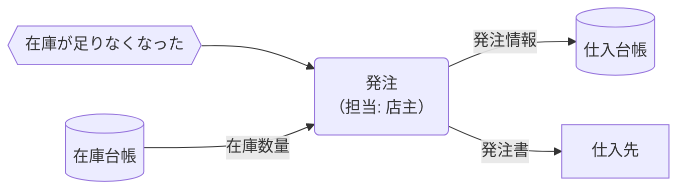

# 概念データフロー図 作成ルール

本ドキュメントは、業務分析・要求定義のために **概念データフロー図（Conceptual Data Flow Diagram: CDFD）** を、統一形式で作成するためのルールです。

このドキュメントの成果物は次の2つをセットで扱います。

- **プロセス概要**: 主要プロセスを表で定義する（言葉の定義・責務境界の定義）
- **業務フロー**: プロセス間の「情報の流れ」「物の流れ」「イベント」を図で定義する（流れの定義）。記述は Mermaid 記法を用いますが、記法そのもののルールは [cdfd-mermaid-rules.md](cdfd-mermaid-rules.md) を参照してください。

対象となる業務の全体構成と流れを可視化し、関係者間で合意を得ることを目的とします。

---

## 1. 全体方針

- 目的は、現行業務（AS-IS）または将来業務（TO-BE）の **情報/物/イベントの流れ** を、レビューしやすく合意できる形で残すことです。
- 図は「正確さ（過剰な詳細）」よりも「解釈が割れないこと（合意）」を優先します。
- 実装詳細（例: 物理テーブル名・物理カラム名・SQL全文、実装クラス/関数名、APIエンドポイント、UI操作手順の逐語列挙）は記載しません。但し、必要な外部システムとのインターフェースは含めます。
- 1ファイルは、次のいずれかの粒度を基本とします。
  - 全体（調達/販売/会計などのプロセスグループの関係）
  - 領域（調達、販売、会計などの 1 領域）

## 2. 用語定義

| 用語             | 定義                                                             |
| ---------------- | ---------------------------------------------------------------- |
| プロセス         | 業務またはシステム内の処理単位（例: 発注、受入、レジ締め）       |
| プロセスグループ | 関連する複数プロセスのまとまり（例: 調達、販売、会計）           |
| データストア     | 情報の保管場所（DB/ファイル/紙台帳など。概念レベルで表す）       |
| 物理保管         | 商品など現物の保管場所（例: バックヤード、売り場棚、レジ、金庫） |
| 外部主体         | システム/業務の外部にいる主体（例: 仕入先、顧客）                |
| イベント         | プロセスの開始契機となる出来事（例: 商品が納入された、閉店した） |
| 情報の流れ       | データ/情報が移動する流れ（`-->`）                               |
| 物の流れ         | 商品/現金など現物が移動する流れ（`==>`）                         |

## 3. ファイル構成（標準テンプレ）

各 CDFD ファイルは、次の構成を推奨します。

1. タイトル（例: `販売概念データフロー図（現状）`）
2. 記法参照（例: 「凡例と記号の意味は cdfd-mermaid-rules.md を参照」）
3. プロセス概要
4. 業務フロー
5. （任意）例外処理・補足フロー（Mermaid）

## 4. プロセス概要のルール

### 4.1 必須列

プロセス概要は **表** で記述し、少なくとも次の列を含めます（列順は推奨）。

| 列名                   | 説明                                                  |
| ---------------------- | ----------------------------------------------------- |
| プロセス               | プロセス名（短い日本語。例: 発注、受入、購買受付）    |
| 業務内容               | そのプロセスが業務として何をするか（1〜2文）          |
| 担当                   | 主担当ロール（例: 店主、店員、経理）。不明なら `未定` |
| 業務が発生するイベント | 起点となるイベント（例: 在庫が足りなくなった）        |
| インプット             | 参照/取得する主な情報や物（概念名で）                 |
| アウトプット           | 生成/更新/引き渡す主な情報や物（概念名で）            |

概要の表は横長になる可能性が高いため、`<!-- prettier-ignore -->`をつけて、Prettier の自動整形を無効化し、列揃えによる差分発生を抑制することを推奨します。

### 4.2 記述のコツ

- 「業務内容」は、手順の羅列にせず **目的が伝わる要約** にします。
- 「インプット/アウトプット」は、詳細項目や物理名ではなく **概念名** で揃えます（例: `仕入台帳`, `在庫台帳`, `レジ記録`）。
- 同じ語がファイル内で揺れないようにします（表と図で名称を一致）。

## 5. 業務フロー（Mermaid）のルール

Mermaid の記号・構文ルールは [cdfd-mermaid-rules.md](cdfd-mermaid-rules.md) に従います。ここでは **ドキュメントとして何を描くか** のルールを定義します。

### 5.1 必須要素

- プロセス（角丸長方形）
- 主要なデータストア（円柱）
- 主要な物理保管（必要がある場合）
- 外部主体（必要がある場合）
- 起点イベント（必要がある場合。概要フローでは省略可）
- 情報の流れ `-->`（ラベル必須）
- 物の流れ `==>`（必要な場合のみ。ラベル必須）

### 5.2 図の描き分け

次の「観点」を使って図を分けてよいです（例は既存サンプルに準拠）。

- 外部主体と物理保管に着目した概要フロー
- データストアに着目した概要フロー
- 例外処理（つけ回収、返品、キャンセル等）の補足フロー

### 5.3 ラベルのルール

- `-->` のラベルは「何の情報か」が分かる **名詞形**（例: `取引記録`, `在庫数量`, `請求情報`）。
- `==>` のラベルは「何の物か」が分かる表現（例: `納入商品`, `レジ現金`, `保管金`）。
- 長くなる場合は `<br>` で改行してよいです。

### 5.4 「表」と「図」の整合

- プロセス概要の表に記載したプロセスは、対応する図にも登場させます（省略する場合は理由を補足）。
- 表の「業務が発生するイベント」は、図ではイベントノードとして表現するか、またはイベント省略時はプロセスへの入力ラベルとして表現します。

## 6. 禁止事項

| 項目                                  | 理由                                   |
| ------------------------------------- | -------------------------------------- |
| 物理テーブル名・物理カラム名・SQL全文 | 概念レベル逸脱（DB設計に記述）         |
| 実装クラス/関数名、APIの内部詳細      | 実装依存で変更に弱い                   |
| UI操作手順の逐語列挙                  | UI変更に弱く、業務本質が埋もれる       |
| Mermaid の装飾を目的化（色/形の乱用） | ルール不統一でレビュー不能になりやすい |

## 7. よくある誤りと対策

- 表の「インプット/アウトプット」が抽象的すぎる → データストア/帳票/現物など、概念名で具体化する。
- 図に矢印はあるがラベルがない → 情報/物の中身が合意できないため、ラベル必須にする。
- 図と表で名称が揺れる → プロセス名/台帳名/イベント名を揃える。

## 8. サンプル（最小）

### 8.1 プロセス概要

<!-- prettier-ignore -->
| プロセス | 業務内容 | 担当 | 業務が発生するイベント | インプット | アウトプット |
| --- | --- | --- | --- | --- | --- |
| 発注 | 在庫状況に基づき仕入先へ必要数量を注文する。 | 店主 | 在庫が足りなくなった | 在庫台帳、商品一覧表 | 発注書、仕入台帳 |

### 8.2 業務フロー



## 9. 生成 AI への指示テンプレート

> - 以下のルールに従って、**概念データフロー図（CDFD）** のドキュメントを 1 ファイル作成してください。出力は **Markdown** とします。
> - 最低限、次の2つを必ず含めてください：
>   - **プロセス概要**: `プロセス / 業務内容 / 担当 / 業務が発生するイベント / インプット / アウトプット`
>     - 表形式で出力してください。また、表の前に `<!-- prettier-ignore -->` をつけて、Prettier の自動整形を無効化してください。
>   - **業務フロー**: ` ```mermaid` のコードブロック
> - Mermaid 図の記号は以下に従って下さい
>   - Mermaid の `flowchart` 構文を使ってデータフロー図（DFD）を書いてください。
>   - **プロセス**は角丸長方形 `()`、**プロセスグループ**はサブグラフ `subgraph ... end`、**データストア**（DB・ファイル・紙）は円柱 `[(  )]`、**物理保管場所**は `([ ])`、**外部主体**は四角 `[]`、**イベント**は六角形 `{{  }}` を使ってください。
>   - プロセスグループ内の複数プロセスを省略する場合は、1つの角丸長方形ノードで `...プロセス群` のように記載してください（例: `入荷プロセス群("入荷プロセス群")`）。
>   - ノードIDは日本語の短い識別子を使用し（例: `発注`, `在庫台帳`）、表示ラベルの主要語と一致させてください。担当併記や `<br>` などの装飾は **表示ラベル側のみ** に入れてください。
>   - 表示ラベルは日本語で、業務名やデータ内容が一目で分かるようにしてください。Mermaid のノード定義では `("..." )` / `["..."]` / `{{"..."}}` のように **表示ラベルをダブルクォートで囲って** ください。
>   - 業務プロセスの担当ロールは `<br>（担当: ロール）` の形式で表示ラベルに併記してください（省略も可）。ノードIDは担当併記前の業務名を用いてください。
>   - **情報の流れ**は `-->` を使い、edge ラベルに流れる情報の内容を日本語で記載してください。
>   - **物理的な流れ**（商品・現物）は `==>` を使い、edge ラベルに流れる物を記載してください。
>   - イベントは六角形ノードとして定義し、外部主体や他プロセスからイベントへ、イベントからプロセスへ `-->` で接続してください。ただし、概要のDFDではイベントノードを省略してもよいです。
>   - `凡例`は /docs/handbook/rules/cdfd-mermaid-rules.md を参照するように記載ください。
>   - 必要に応じて `<br>` を用いてノードやエッジラベルを改行してください。
>   - 結果は ` ```mermaid ～``` ` のコードブロックとして出力してください。
> - 禁止: 物理テーブル名・物理カラム名・SQL全文、実装クラス/関数名、APIエンドポイント、UI操作手順の逐語列挙。但し、必要な外部システムとのインターフェースは含めます。
