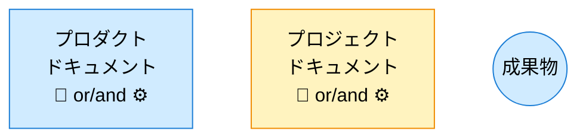
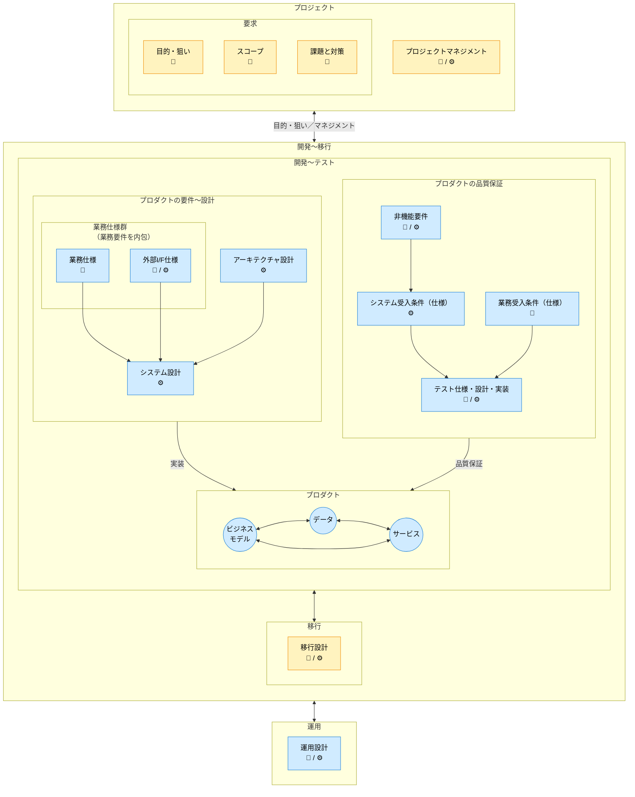

# ドキュメント構成ガイド

Document Structure Guide

SpecDojoで扱うドキュメントの全体構成について、以下のガイドラインを示します。

## 1. ドキュメントの分類

ドキュメントは、プロダクトドキュメントとプロジェクトドキュメントの2種類に分類されます。

### 1.1. プロダクトドキュメント

**プロダクトの最新状況を説明するドキュメントです**。

プロダクトを新規に構築する際に作成されて、プロダクトを改修する毎に更新されます。プロダクトの、

- 要件〜設計に関する定義
- 品質保証に関する定義
- 移行に関する定義

について記載します。プロダクトのライフサイクルにわたって管理されます。

プロダクトドキュメントは、

- 常に「現在の正」を表します。
- プロジェクト固有の判断や経緯は含めず、必要な場合はプロジェクトドキュメントから反映されます。
- ドキュメントの改定履歴はバージョン管理システムで管理します。

### 1.2. プロジェクトドキュメント

**プロダクトの構築時や改修時に、プロジェクト毎に作成されるドキュメントです**。

個別プロジェクト毎の、

- 業務要求: 目的・狙い、スコープ、課題と対策
- プロジェクトマネジメント

について記載します。プロジェクト完了後はアーカイブされます。

## 2. 前提となる工程のフロー

| フェーズ | 用語                   | 5W1H            | このガイドでの意味                        |
| -------- | ---------------------- | --------------- | ----------------------------------------- |
| 1        | 要求（Needs）          | Why             | ユーザー・業務の**目的・欲求・困りごと**  |
| 2        | 要件（Requirements）   | What (条件)     | システムとして**満たすべき条件**          |
| 3        | 仕様（Specifications） | What (振る舞い) | 振る舞い・I/F・ルールを**曖昧さなく定義** |
| 4        | 設計（Design）         | How (方式)      | 構造・方式・構成として**どう実現するか**  |
| 5        | 実装（Implementation） | How (具現)      | コード・設定としての実現                  |

## 3. ドキュメントオーナー

ドキュメントのオーナーは、以下の通りです。

| オーナー         | 記号 | 略称 | 役割                       |
| ---------------- | ---- | ---- | -------------------------- |
| ビジネスオーナー | 🧭   | BO   | 最終的な価値判断の主体     |
| エンジニア       | ⚙️   | EN   | 技術的実現と品質判断の主体 |

## 4. ドキュメントの構成

### 4.1. 凡例



### 4.2. ドキュメント構成図



※補足事項

- 図中のアーキテクチャ設計は、個別仕様に先立つ全体構造の設計を表します。
- 「要件含む」とは、業務仕様の冒頭に業務要件相当（対象範囲・成功条件・制約等）を含めることを指します。

## 5. ディレクトリ構成

```plaintext
docs/
├── ja/                   # 多言語化対応（将来: en/ etc.）
│   ├── handbook/
│   │   ├── guidelines/   # ドキュメント作成ガイド
│   │   ├── rules/        # ドキュメント記述規約
│   │   └── instructions/ # 生成AIへの指示テンプレート
│   ├── project-docs/
│   │   ├── prj-0001/ # プロジェクトの構築や改修時に追加されるドキュメント群
│   │   │   ├── 010-プロジェクト概要/
│   │   │   ├── 020-プロジェクトスコープ/
│   │   │   ├── 030-プロジェクト課題と解決アプローチ/
│   │   │   ├── 040-プロジェクトマネジメント/
│   │   │   └── 090-決定記録/
│   │   └── prj-0002/ ...
│   └── product-docs/
│       ├── 010-業務仕様/
│       ├── 020-外部IF仕様/
│       ├── 030-アーキテクチャ/
│       ├── 040-システム設計/
│       ├── 050-業務受入条件/
│       ├── 060-非機能要件/
│       ├── 070-システム受入条件/
│       ├── 080-テスト/
│       ├── 090-移行設計/
│       └── 100-運用設計/
└── en/                   # 将来の英語ドキュメント用ディレクトリ
```
