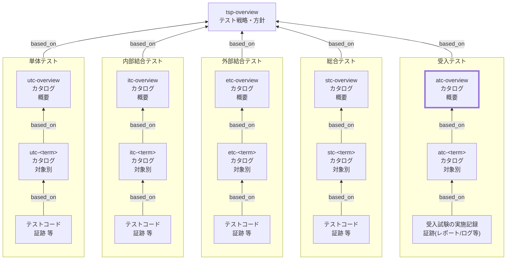

Acceptance Test Catalog (ATC) Overview Documentation Rules

本ドキュメントは、受入テストカタログ（ATC）の全体概要 `atc-overview` を統一形式で記述するためのルールです。
TSPに基づき、受入テストに共通するルールや方針を定義します。

個別受入テストカタログ（`atc-<term>`）の記述ルールは `atc-rules.md` を参照してください。

## 1. 全体方針

`atc-overview` は、受入テストカタログ（ATC）を **運用可能な最小情報** で統一し、
対象別カタログ（`atc-<term>`）の品質と一貫性を担保するための **共通ルール（SSOT）** とする。

- `atc-overview` は **「考え方・共通方針・共通定義」** を記述する（個別ケースは持たない）
- 個別の受入観点・条件・ケースは **`atc-<term>` に集約** し、詳細は **テスト実施記録／レポート／証跡** に寄せる
- 記述は **合意形成（顧客/PO/QA）に耐える** ことを優先し、長文化を避ける（方針は箇条書き中心）
- 「対象外」や「合否判定の原則」を明示し、受入テストの責任境界（何をもって受け入れるか/受け入れないか）を固定する
- `tsp-overview` の方針を根拠として、受入テストに共通する **対象単位・観点/条件の立て方・環境前提・合格基準・証跡** を定義する

## 2. 位置づけ（他ドキュメントとの関係）

`atc-overview` と他ドキュメントの関係を示します。



## 3. ファイル命名・ID規則

- 本ルールの対象ドキュメントの `id` は `atc-overview` 固定。対象別は `atc-<term>`（詳細は `atc-rules.md`）。
- ファイル名は `atc-010-受入テストカタログ-概要.md` 等、プロジェクト内で一意になるように命名する。
- `<term>` は用語集(GL) の論理名キー（英小文字kebab-case）を用いる（表示名は title に日本語で記載してよい）。

## 4. 推奨 Frontmatter 項目

### 4.1. 設定内容

Frontmatter は共通スキーマに従います（参照: [docs/shared/schemas/spec-frontmatter.schema.yaml](../../../shared/schemas/spec-frontmatter.schema.yaml) / [meta-document-metadata-rules.md](meta-document-metadata-rules.md)）。

| 項目       | 説明                                               | 必須 |
| ---------- | -------------------------------------------------- | ---- |
| id         | `atc-overview`（固定）                             | ○    |
| type       | `test` 固定                                        | ○    |
| title      | 受入テストカタログ: 概要（`<システム名>`）         | ○    |
| status     | `draft` / `ready` / `deprecated`                   | ○    |
| based_on   | 根拠となる仕様ID（ID配列。未指定時は `[]` を許容） | 任意 |
| supersedes | 置き換え関係（ID配列。未指定時は `[]` を許容）     | 任意 |

### 4.2. 推奨ルール

- `based_on` には最低限 `tsp-overview` を含める。
- BAC/NFR/BR/AC 等は、`atc-overview` の方針判断（対象単位・合格基準・証跡・例外）に **直接利用したものだけ** を `based_on` に列挙する。
- `based_on` / `supersedes` は ID 配列（未指定は `[]` 可）。

## 5. 本文構成（標準テンプレ）

`atc-overview` は以下の見出し構成を **順序固定** で配置します。

| 番号 | 見出し                                         | 必須 |
| ---- | ---------------------------------------------- | ---- |
| 1    | 本ドキュメントの目的と適用対象                 | ○    |
| 2    | 受入テスト対象の括り方と分割基準               | ○    |
| 3    | 対象外・除外理由（共通）                       | ○    |
| 4    | 受入観点の立て方（共通）                       | ○    |
| 5    | 条件の立て方（共通）                           | ○    |
| 6    | 受入テストの環境/データ/外部依存の扱い（共通） | ○    |
| 7    | ケース表の共通カラム                           | ○    |
| 8    | メモ / 将来課題                                | 任意 |

注意：次章の記述ガイドのMarkdown見出しはルール文章内の参照用です。
生成する `atc-overview` 本文の見出しは各章で指定された **番号付き** 形式に置き換えてください。

## 6. 記述ガイド

### 6.1. 本ドキュメントの目的と適用対象

生成する `atc-overview` 本文の見出しは **## 1. 本ドキュメントの目的と適用対象**

本節では、`atc-overview` が **何のために存在し、何に適用されるか** を明確にします。

- 目的：`atc-<term>` を同一基準で作成し、受入判断に必要な粒度・責任範囲・証跡の揃い方を統一する
- 適用対象：受入テスト（AT）に関するカタログ群（`atc-overview` / `atc-<term>`）
- 成果物の位置づけ：
  - `atc-overview`：受入テストの共通方針（SSOT）
  - `atc-<term>`：対象別の受入観点・条件・ケース表（SSOT）
  - 実施記録/レポート/ログ：合否の証跡（Evidence）

- SSOTの一次情報は `atc-overview` / `atc-<term>` とし、実施記録/レポート/ログは **判断の裏付け** として扱う
- 本書が扱う粒度：**受入基準・共通ルールまで**（個別ケースの列挙は禁止）

### 6.2. 受入テスト対象の括り方と分割基準

生成する `atc-overview` 本文の見出しは **## 2. 受入テスト対象の括り方と分割基準**

本節では、`atc-<term>` の `<term>` をどう切るか（受入単位の設計）を定義します。

- `<term>` は「ユーザ価値/業務成果のまとまり」（例：主要業務フロー、重要ユースケース群、運用シナリオ）とする
- 分割基準（推奨順）：
  1. **受入判断の単位**：受け入れる/受け入れないが明確に言える
  2. **業務成果の完了条件**：開始条件→完了条件が説明できる
  3. **関係者合意の境界**：PO/利用部門/運用の責任境界に沿う
  4. **リスク境界**：重大障害・法務/監査・金銭影響などのリスクが同質

- 過分割の禁止：`atc-<term>` が「1〜2ケースしかない」単位は原則統合する
- 肥大化の抑制：
  - ケースが過剰（例：50以上）になったら分割候補
  - 受入観点が混在（例：別業務成果が同居）する場合は分割候補

### 6.3. 対象外・除外理由（共通）

生成する `atc-overview` 本文の見出しは **## 3. 対象外・除外理由（共通）**

本節では、受入テスト（AT）で **やらないこと** と、その **理由**、および **例外条件** を明確にします。

#### 6.3.1. 記述ルール

- 形式は **「対象外」「除外理由」「代替レベル/代替手段」「例外」** のセットを基本とする
- 「対象外」は **責務分界**（UT/IT/ET/ST/AT/NFR/運用）に紐づけて書く
- 「例外」は乱用しない。例外を認める場合は **判断基準**（いつ/どの条件で）を明記する
- 個別対象（`atc-<term>`）固有の対象外は `atc-<term>` 側に書く。本節は **AT共通** に限定する

#### 6.3.2. 推奨フォーマット（表）

| 対象外（やらないこと） | 除外理由 | 代替レベル/代替手段 | 例外（ATで扱う条件） |
| ---------------------- | -------- | ------------------- | -------------------- |

- 「代替レベル/代替手段」は、どこで担保するか（ST/NFR/運用等）を必ず記載する
- 例外がない場合は `なし` とする

#### 6.3.3. 典型例（記載候補）

- 低レベルの内部仕様の検証（アルゴリズム詳細、内部例外分岐の網羅）
- 直積（全組合せ）網羅の確認（ATの目的は受入判断であり網羅性は別レベルで担保）
- 性能・負荷・耐久の厳密測定（p95/p99等はNFRへ）
- 端末/ブラウザ全網羅（ATでは代表構成、網羅は別途互換試験へ）

### 6.4. 受入観点の立て方（共通）

生成する `atc-overview` 本文の見出しは **## 4. 受入観点の立て方（共通）**

受入観点は「受入判断に必要な切り口」であり、対象別カタログの章立て（見出し）として用います。

- 観点の型（最低限この順で検討）：
  - 業務成果の成立（完了条件、ユーザ価値）
  - 重要分岐の成立（代表失敗、やり直し、取消、再実行）
  - 重要な契約/約束（通知、帳票、監査ログ、権限、データ整合）
  - 運用可能性（復旧手順、観測性、問い合わせに答えられる証跡）
  - 非機能（ATで扱う範囲のみ：操作感の重大劣化、致命的遅延の有無 等）

- 命名規則：**「名詞＋成立/保証/整合」**（例：`注文確定の成立` / `通知の保証` / `監査証跡の整合`）
- 粒度規則：
  - 観点は「条件が複数持てる」程度にまとめる（細分化し過ぎない）
  - 受入判断に結びつかない抽象観点は作らない（観点を再定義する）

### 6.5. 条件の立て方（共通）

生成する `atc-overview` 本文の見出しは **## 5. 条件の立て方（共通）**

条件は、受入観点を確認するための前提状態・入力状態・環境条件のバリエーションです。
ATでは「**代表性とリスク**」を優先し、ケース爆発を避けます。

- 入力（Input）：代表入力、現実的な境界（空/最大/形式不正のうち重要なもの）
- 状態（State）：代表ユーザ/権限、代表データ、代表ステータス（有効/無効、未確定/確定 等）
- 環境（Env）：代表端末/ブラウザ、代表設定、外部依存の代表状態（正常/代表失敗）
- 経路（Flow）：代表経路、重要分岐（失敗→復帰、再試行、取消、二重実行防止）

組合せルール（増やし過ぎ防止）：

- まず「代表（P0）」を作る（業務成果が成立する最短経路）
- 次に「重要分岐（P0/P1）」を追加（代表失敗、やり直し、取消、再実行）
- 最後に「重大リスク（P0）」を追加（不正権限、金銭/監査、データ破壊につながるもの）
- 原則として全組合せ（直積）は作らない。必要な場合は理由と管理方法を明記する

### 6.6. 受入テストの環境/データ/外部依存の扱い（共通）

生成する `atc-overview` 本文の見出しは **## 6. 受入テストの環境/データ/外部依存の扱い（共通）**

受入テストでは、合否判断の公平性と再現性を確保するため、環境・データ・外部依存の前提を固定します。

- 環境：
  - 受入環境（staging/uat等）と代表構成（主要ブラウザ/端末）を明記する
  - リリース候補版（ビルド番号/タグ）と実施期間の紐づけ方を定める

- データ：
  - 受入用データの準備・初期化・後始末（namespace/テナント/掃除手順）を共通化する
  - ケースは「データ大量列挙」ではなく、データセットID参照等で管理する

- 外部依存：
  - 原則：sandbox/疑似/検証用接続を利用し、本番影響を排除する
  - 依存先ごとに「検証方法（画面/ログ/受信箱/ダッシュボード）」を決める

- 証跡の最小セット（例）：
  - 実施者/日時/版、結果（pass/fail）、スクショ or 画面録画キー、ログ相関ID、必要な外部ID（決済ID等）

### 6.7. ケース表の共通カラム

生成する `atc-overview` 本文の見出しは **## 7. ケース表の共通カラム**

`atc-<term>` の末端（条件・ケース表）は、レビュー・合意・追跡性を確保するため、全termで同一カラム順を採用します。

必須カラム：

- `case_id`（ケースID）：対象別に一意なIDで変更しない
  - 推奨形式：`<level>-<term>-<perspective_key>-<nnn>`（`level` は `at`、`nnn` は3桁10刻み推奨）
  - `perspective_key` は kebab-case のキー文字列で、原則変更しない

- `条件`：入力/状態/環境/経路の要点（必要な要素のみ）
- `手順（最小）`：高位の最小手順（クリック列挙は禁止。操作の意図が分かる粒度）
- `期待値`：判定可能な合格条件（受入判断に必要な観測点を含める）

推奨カラム（運用必須）：

- `観測点（アサーション）`：画面/帳票/ログ相関ID/外部IDなど「見れば判定できるもの」
- `環境/依存`：代表構成、sandbox/疑似の前提
- `トレース`：要求/受入条件/契約（trace_key参照でもよい）
- `優先度`：P0/P1/P2（受入で外せないものを明確化）
- `実施形態`：manual/assisted/automated（受入の実施形態）
- `証跡`：実施記録/レポート/録画/ログ相関ID等の参照先

注意：

- 表の1行＝1受入シナリオ（条件×期待値が一意）
- 手順・期待値を冗長に書かず、詳細は実施記録/テストスクリプトへ寄せる

### 6.8. メモ / 将来課題

生成する `atc-overview` 本文の見出しは **## 8. メモ / 将来課題**

現時点で決めきれない事項や将来の改善点を記録します。
運用ルールとして必須になった時点で本文へ昇格させます。

- 将来検討（例）：
  - 受入の証跡フォーマット統一（テンプレ、保存先、命名）
  - 代表構成の見直し（端末/ブラウザ/権限ロール）
  - 受入の自動化範囲（回帰の一部を自動化する基準）
  - カタログlint（case_id重複、必須列欠落など）

## 7. 禁止事項

| 項目                                                               | 理由                                                                      |
| ------------------------------------------------------------------ | ------------------------------------------------------------------------- |
| `atc-overview` に個別ケース（条件・手順・期待値）を大量に列挙する  | `atc-overview` は共通方針のSSOTであり、個別は `atc-<term>` に集約するため |
| 受入環境・データ前提を対象ごとに無根拠に変更する                   | 合否判断の公平性と再現性が崩れるため                                      |
| 手順にUI操作のクリック列挙や画面要素の細部を大量に書く             | 変更に弱く、合意/レビューが困難になるため                                 |
| 期待値を曖昧に書く（例：「問題がないこと」「使えること」）         | 判定不能で合否が揺れ、証跡として機能しないため                            |
| `case_id` を後から変更する（参照があるのに変更する）               | トレース・証跡リンクが壊れ、履歴追跡が不能になるため                      |
| 対象外・除外理由（共通）と矛盾するケースを `atc-<term>` に記載する | 責任境界が崩れるため（例外は根拠と条件を明記）                            |

## 8. サンプル（最小）

注：以下はルール文書内の例示です。生成する `atc-overview` では `## 1...` から始まります。

```yaml
---
id: atc-overview
type: test
title: 受入テストカタログ: 概要
status: draft
based_on: [tsp-overview]
supersedes: []
---
```

### 8.1. 本ドキュメントの目的と適用対象

本ドキュメントは、受入テストカタログ（ATC）の全体概要 `atc-overview` を統一形式で記述するためのルールである。
`atc-overview` は受入判断に必要な「対象単位の切り方」「受入観点/条件の立て方」「環境・データ前提」「合格基準」「証跡方針」を定義し、
対象別カタログ `atc-<term>` の作成と運用の基盤とする。

### 8.2. 受入テスト対象の括り方と分割基準

`atc-<term>` の `<term>` はユーザ価値/業務成果のまとまり（主要業務フロー等）とする。
分割は受入判断の単位・完了条件・関係者合意の境界・リスク境界を基準とし、過分割と肥大化の双方を避ける。

### 8.3. 対象外・除外理由（共通）

受入テスト（AT）では、受入判断のための代表性と再現性を優先するため、以下は原則として対象外とする。

| 対象外（やらないこと）                             | 除外理由                                 | 代替レベル/代替手段 | 例外（ATで扱う条件） |
| -------------------------------------------------- | ---------------------------------------- | ------------------- | -------------------- |
| 内部実装の網羅（例外分岐の全網羅、内部関数の詳細） | 受入判断の目的から外れ、変更に弱い       | UT/IT/ST            | なし                 |
| 直積（全組合せ）網羅                               | ケース爆発で運用不能、代表性が落ちる     | UT/IT/ET            | 重大リスクのみ       |
| 性能の厳密測定（p95/p99、長時間耐久）              | 計測設計が別物で受入の枠を超える         | NFR                 | なし                 |
| 端末/ブラウザ全網羅                                | 受入環境の代表構成で十分、網羅は別途必要 | 互換試験/運用       | なし                 |

### 8.4. 受入観点の立て方（共通）

受入観点は業務成果の成立・重要分岐の成立・契約（通知/監査/権限）・運用可能性を基軸に立てる。
観点名は「名詞＋成立/保証/整合」で統一し、条件を複数持てる粒度にまとめる。

### 8.5. 条件の立て方（共通）

条件は入力・状態・環境・経路に分解し、代表→重要分岐→重大リスクの順で追加する。
全組合せ（直積）は原則作らず、必要時のみ理由と管理方法を明記する。

### 8.6. 受入テストの環境/データ/外部依存の扱い（共通）

受入環境と代表構成、受入用データの準備/初期化/後始末、外部依存（sandbox/疑似）の前提を固定し、
合否判断の再現性を担保する。証跡の最小セット（版/日時/結果/スクショ/ログ相関ID等）を共通化する。

### 8.7. ケース表の共通カラム

対象別カタログ `atc-<term>` の末端表は全termで共通のカラム順を採用する。
必須：case_id / 条件 / 手順（最小） / 期待値
推奨：観測点（アサーション）/ 環境・依存 / トレース / 優先度 / 実施形態 / 証跡

### 8.8. メモ / 将来課題

将来検討事項（例）：証跡テンプレ統一、代表構成の見直し、受入の自動化範囲、カタログlint等を記録する。
必須になった時点で本文へ昇格させる。

## 9. 生成 AI への指示テンプレート

生成 AI に `atc-overview` を作らせるときの指示テンプレートは `atc-overview-instruction.md` を参照してください。
