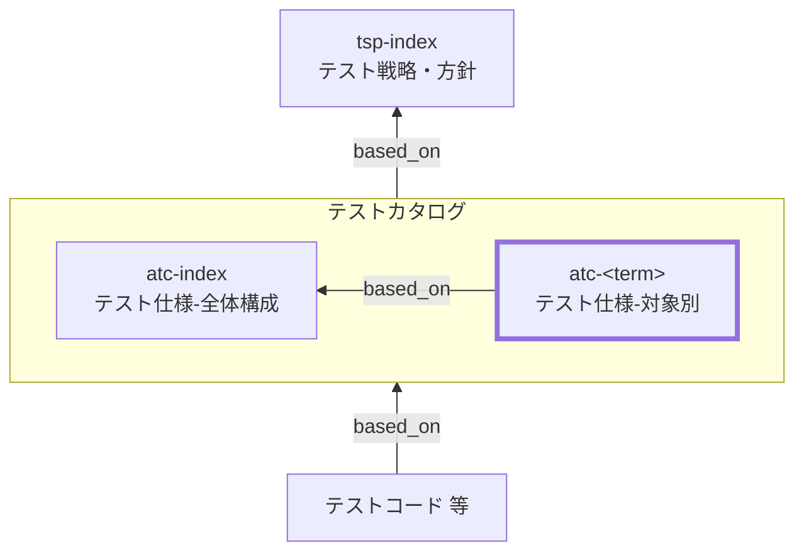

Acceptance Test Catalog (ATC) Documentation Rules

本ドキュメントは、受入テストカタログ（ATC）の対象別 `atc-<term>` を統一形式で記述するためのルールです。
`atc-index` を前提に、SSOT の本体として、対象ごとの **受入判断に必要な範囲（責務・境界・観点×条件＝ケース、トレース、証跡）** を明文化します。

## 1. 全体方針

個別 ATC（`atc-<term>`）は、受入テストにおける SSOT の本体として、対象ごとの受入判断単位と責務を明確化し、
観点×条件＝ケース（末端表）を最小情報で整理して、実施記録／レポート／ログ等の証跡へ確実に接続できる形で記述する。

- `atc-<term>` は **対象固有の情報のみ** を記述し、共通ルールは `atc-index` を参照する（重複記述しない）
- 受入テストの目的は「関係者が受け入れ可否を判断できること」であり、内部実装の網羅や詳細分岐の確認は目的外（必要なら別レベルへ）
- ケースは「表の1行＝1受入シナリオ」とし、手順と期待値は **合否判定可能** な粒度で簡潔に書く
- クリック列挙・画面要素の細部・大量データ列挙は避け、必要な詳細は **実施手順書／実施記録** 側へ寄せる（証跡で参照可能にする）
- すべての観点・ケースは、根拠仕様（`based_on` / `トレース`）と、証跡（実施記録／レポート／ログ）に接続されていること
- 環境・データ・外部依存の前提は受入判断の再現性に直結するため、対象ごとの差分は必ず明記する（共通は `atc-index`）

## 2. 位置づけ（他ドキュメントとの関係）

個別 ATC（`atc-<term>`）と他ドキュメントの関係を示します。



## 3. ファイル命名・ID規則

- `id` は `atc-<term>`（kebab-case。例: `atc-checkout`）。
- ファイル名は `atc-010-受入テストカタログ-<term>.md` 等（例: `atc-010-受入テストカタログ-会計確定.md`）。
- `<term>` は 用語集(GL) の論理名キー（英小文字kebab-case）を用いる（表示名は title / ファイル名で日本語を使用してよい）。

## 4. 推奨 Frontmatter 項目

### 4.1. 設定内容

Frontmatter は共通スキーマに従います（あわせてドキュメントのメタ情報の記述ルールも参照）。

- 参照スキーマ: [docs/shared/schemas/spec-frontmatter.schema.yaml](../../../shared/schemas/spec-frontmatter.schema.yaml)
- メタ情報ルール: [meta-document-metadata-rules.md](meta-document-metadata-rules.md)

| 項目       | 説明                                                                             | 必須 |
| ---------- | -------------------------------------------------------------------------------- | ---- |
| id         | ATC ID（個別: `atc-<term>`）                                                     | ○    |
| type       | `test` 固定                                                                      | ○    |
| title      | 受入テストカタログ: <対象名>                                                     | ○    |
| status     | `draft` / `ready` / `deprecated`                                                 | ○    |
| based_on   | 根拠仕様（最低限: `tsp-index`, `atc-index`。対象固有の根拠は本文トレースに集約） | ○    |
| part_of    | 集約ドキュメントへの所属（ID配列）                                               | 任意 |
| supersedes | 置き換え関係                                                                     | 任意 |

### 4.2. 推奨ルール

- `based_on` は原則 `[tsp-index, atc-index]` を最低限とする。
- 対象固有の根拠（`br-*` / `bac-*` / `spec-*` / `ac-*` / `nfr-*` 等）は本文「トレース」に集約する。
  機械処理上の都合で `based_on` にも列挙する場合は、本文トレースと矛盾しないこと。
- 記述内容が多くなる場合はドキュメントを分割し、`part_of` で集約ドキュメントに所属させる。
- `part_of` / `based_on` / `supersedes` は ID 配列（未指定は `[]` 可）。

## 5. 本文構成（標準テンプレ）

個別 ATC（`atc-<term>`）は以下の見出し構成を **順序固定** で配置します。

| 番号 | 見出し                      | 必須 |
| ---- | --------------------------- | ---- |
| 1    | 概要（`<term>`）            | ○    |
| 2    | 受入の責務（成果/完了条件） | ○    |
| 3    | 対象外                      | ○    |
| 4    | 環境/データ/外部依存        | ○    |
| 5    | トレース                    | ○    |
| 6    | 受入観点とケース            | ○    |

注意：次章の記述ガイドのMarkdown見出しはルール文章内の参照用であり、
生成する `atc-<term>` 本文の見出しは各章で指定された **番号付き** の形式に置き換えてください。

## 6. 記述ガイド

### 6.1. 概要（`<term>`）

生成する `atc-<term>` 本文の見出しは **## 1. 概要（&lt;term&gt;）**

本節では、対象（`<term>`）が何であり、どの受入判断単位を本カタログで扱うかを簡潔に示します。

- `<term>` の説明（1〜3行）：業務成果（ユーザ価値）として説明する
- 期待する利用者：PO/利用部門/QA/運用が、前提を把握できる内容にする
- 対象の粒度：`atc-index` の分割基準に従い、過分割／肥大化を避ける
- 関連する業務フロー名・主要画面/主要I/F（任意）：入口を示すために列挙してよい
- 詳細な仕様説明や背景は書かない（根拠はトレースで示す）

### 6.2. 受入の責務（成果/完了条件）

生成する `atc-<term>` 本文の見出しは **## 2. 受入の責務（成果/完了条件）**

本節では、「この対象が受入で何を保証すべきか（受入判断の責務）」を列挙します。

- 箇条書きで 3〜7 個程度を目安に、**成果が分かる動詞**で記述する
  - 例：注文が確定できる／取消できる／通知が届く／監査証跡が残る／権限で拒否される

- 責務は「観点」の上位概念（責務≠観点）。観点は責務を分解した切り口
- 正常系だけでなく、受入判断に必要な重要分岐（代表失敗/復帰/やり直し等）も含める
- 可能なら「観測できる成果（画面、帳票、通知、ログ相関ID等）」とセットで書く
- 責務に含まれないものは「対象外」へ移す

### 6.3. 対象外

生成する `atc-<term>` 本文の見出しは **## 3. 対象外**

本節では、「この対象カタログ（`atc-<term>`）ではやらないこと」を明示します。
`atc-index` の「対象外・除外理由（共通）」と矛盾しないことが前提です。

- 対象外は「なぜ除外するか（理由）」とセットで書く
- 可能なら「代替するレベル/手段」（ST/NFR/互換試験/運用検証 等）も併記する
- 対象固有の対象外（例：別業務成果、別termの責務）を明確にする
- 例外としてATで扱う場合は、条件・根拠・前提（環境/データ）を明記する

推奨フォーマット（簡易）：

- 対象外：xxx（理由：yyy、代替：zzz）

### 6.4. 環境/データ/外部依存

生成する `atc-<term>` 本文の見出しは **## 4. 環境/データ/外部依存**

本節では、受入シナリオの合否が揺れないよう、対象固有の前提（差分）を明確にします。
共通方針は `atc-index` に従い、ここでは **対象固有の追加/例外** を中心に書きます。

- 環境：
  - 代表構成（端末/ブラウザ/ロール）に対象固有の追加がある場合は明記
  - バージョン識別（タグ/ビルド番号）を証跡にどう残すか（差分があれば明記）

- データ：
  - 必要な前提データ（顧客/商品/権限/状態など）を「データセットID」等で参照可能にする
  - 初期化/後始末が対象固有で必要なら明記（例：採番の戻し、外部の受信箱掃除）

- 外部依存：
  - sandbox/疑似の接続先、確認手段（管理画面、受信箱、ダッシュボード、ログ）を明記
  - 外部依存が不安定な場合の扱い（再試行可否、判定保留条件など）が必要なら明記

- 観測点（アサーション）：
  - 画面・帳票・通知・ログ相関IDなど「誰が見ても判定できる」観測点を整理してよい

### 6.5. トレース

生成する `atc-<term>` 本文の見出しは **## 5. トレース**

本節では、`atc-<term>` の根拠となる上位成果物との対応関係（トレーサビリティ）を示します。
本カタログにおけるトレースの一次情報（SSOT）は **`## 5. トレース`** とし、観点・ケース表では **trace_key（`TR-xx`）参照** に統一します。

#### 6.5.1. 記述ルール（trace_key）

- 各トレース項目に **trace_key（`TR-xx`）** を付与する（例：`TR-01`, `TR-02` …、01始まり推奨）
- `trace_key` は **本ドキュメント内で一意**で、原則変更しない
- 観点・ケース表の `トレース` 列には **仕様IDを直書きせず**、`TR-xx` を列挙する
- ケース表に新しい根拠が必要になった場合は、**先に本節の表へ行追加**し、付与された `TR-xx` をケース表で参照する
- 採番は追加順。並び替えても trace_key は維持する。削除しても欠番は詰めない

#### 6.5.2. トレース表（標準フォーマット）

| trace_key | 仕様ID | 要点    | 備考 |
| --------- | ------ | ------- | ---- |
| TR-01     | ac-... | （1行） | 任意 |
| TR-02     | br-... | （1行） | 任意 |

- `要点` は「受入判断に使ったポイント」を **1行**で書く（冗長な仕様説明はしない）

### 6.6. 受入観点とケース

生成する `atc-<term>` 本文の見出しは **## 6. 受入観点とケース**

本節は `atc-<term>` の中心です。観点（見出し）→ ケース表（末端表）の順で構成します。

#### 6.6.1. 観点:<観点>

生成する `atc-<term>` 本文の見出しは **### 6.1. 観点:<観点>**

- 観点は `atc-index` の「受入観点の立て方（共通）」に従って命名する
- 観点の粒度は「条件が複数ぶら下がる」程度にまとめる（細かすぎる観点の乱立を避ける）
- 観点名（見出し）は改善のため変更してよいが、`perspective_key` は原則変更しない（変更が必要なら `supersedes` 等で追跡する）

##### 6.6.1.1. 意図

生成する `atc-<term>` 本文の見出しは **#### 6.1.1. 意図**

- 観点ごとに「意図（この観点で受入として保証すること）」を 1〜2 行で書く

##### 6.6.1.2. 条件・ケース表

生成する `atc-<term>` 本文の見出しは **#### 6.1.2. 条件・ケース表**

- ケース表の 1 行は「1受入シナリオ」を表す（条件×期待値が一意）
- `case_id` は以下を推奨し、原則変更しない
  - 形式：`<level>-<term>-<perspective_key>-<nnn>`
  - `level`：`at`
  - `perspective_key`：kebab-case（英小文字＋数字＋ハイフン）。原則変更しない
  - `nnn`：3桁、10刻み（010,020,030…）推奨

- 条件は「入力/状態/環境/経路」で表現する（必要な要素だけ書く。直積は禁止）
- 手順は高位の最小手順で書く（クリック列挙は禁止。操作の意図がわかる粒度）
- 期待値は判定可能に書く（画面・帳票・通知・ログ相関ID等の観測点を含める）
- 証跡は実施記録とレポートへ接続できる形で書く（例：実施記録ID、保存先、ログ相関ID）

推奨：観点ごとのケース数は「代表（P0）→重要分岐（P0/P1）→重大リスク（P0）」の順で増やし、直積（全組合せ）を避ける

## 7. 禁止事項

| 禁止事項                                                                   | 理由                                                               |
| -------------------------------------------------------------------------- | ------------------------------------------------------------------ |
| `atc-index` の共通方針を `atc-<term>` 側で勝手に上書きする                 | 受入判断の一貫性が崩れ、合意・監査・追跡が困難になるため           |
| ケース表にUIクリック手順や画面要素の細部を大量に列挙する                   | 変更に弱く、受入の意図が読めなくなるため                           |
| 期待値を曖昧に書く（例：「問題がないこと」「使えること」「ちゃんと表示」） | 合否判定不能で証跡にならないため                                   |
| `case_id` を変更する／再利用する                                           | トレース・証跡リンクが破壊され、履歴追跡が不能になるため           |
| `perspective_key` を観点名の修正に合わせて頻繁に変える                     | ID体系が不安定になり参照が壊れるため                               |
| 直積（全組合せ）のケースを無条件に作る                                     | ケース爆発で運用不能になるため（必要時は理由・範囲を明記）         |
| トレースや証跡を持たないケースを恒久的に残す                               | SSOTとして成立しないため（暫定なら期限/条件を明記）                |
| 外部依存が不安定なまま合否判定をする（判定条件/保留条件の定義なし）        | 受入判断が揺れて合意が崩れるため（必要なら「判定保留条件」を明記） |

## 8. サンプル（最小）

注：以下はルール文書内の例示です。生成する `atc-<term>` では `## 1...` から始まります。

```yaml
---
id: atc-checkout
type: test
title: 受入テストカタログ: 会計確定（checkout）
status: draft
part_of: []
based_on: [tsp-index, atc-index]
supersedes: []
---
```

### 8.1. 概要（checkout）

店頭販売における会計確定（支払い→確定→レシート/通知→在庫/売上反映）を受入判断単位として扱う。

### 8.2. 受入の責務（成果/完了条件）

- 正常な支払いが完了し、会計が確定できる
- 確定後にレシート（帳票）と取引識別子が参照できる
- 取消（または返金）により取引が期待どおりに無効化され、証跡が残る

### 8.3. 対象外

- 決済ゲートウェイの内部ロジックの詳細（理由：外部責務、代替：提供者の仕様/監査）
- 性能の厳密測定（理由：受入の枠外、代替：NFR）

### 8.4. 環境/データ/外部依存

- 環境：UAT（代表端末: iPad / 代表ブラウザ: Chrome）
- データ：受入データセット `DS-CHK-01`（商品/顧客/権限ロール）
- 外部依存：決済は sandbox、通知は検証用受信箱で確認
- 観測点：取引ID、帳票PDF、通知メール件名、ログ相関ID

### 8.5. トレース

| trace_key | 仕様ID        | 要点                          | 備考 |
| --------- | ------------- | ----------------------------- | ---- |
| TR-01     | ac-checkout-1 | 支払い成功時に確定できる      |      |
| TR-02     | ac-checkout-2 | 取消時に帳票/証跡が更新される |      |

### 8.6. 受入観点とケース

#### 8.6.1. 観点：会計確定の成立

##### 8.6.1.1. 意図

代表シナリオで、支払い完了から会計確定までが成立し、必要な成果物が確認できることを保証する。

##### 8.6.1.2. 条件・ケース表

| case_id                          | 条件                                         | 手順（最小）                    | 期待値                                     | 観測点（アサーション）            | 環境/依存    | トレース | 優先度 | 実施形態 | 証跡                             |
| -------------------------------- | -------------------------------------------- | ------------------------------- | ------------------------------------------ | --------------------------------- | ------------ | -------- | ------ | -------- | -------------------------------- |
| at-checkout-checkout-success-010 | 状態: 正常顧客 / 入力: 正常商品 / 経路: 成功 | 商品を選択し支払い→確定まで実施 | 会計が確定し取引ID・帳票・通知が確認できる | 取引ID、帳票PDF、通知件名、相関ID | 決済=sandbox | TR-01    | P0     | manual   | 実施記録#A-1001 / ログ相関ID=... |

## 9. 生成 AI への指示テンプレート

生成 AI に個別 ATC（`atc-<term>`）を作らせるときの指示テンプレートは `atc-instruction.md` を参照してください。
