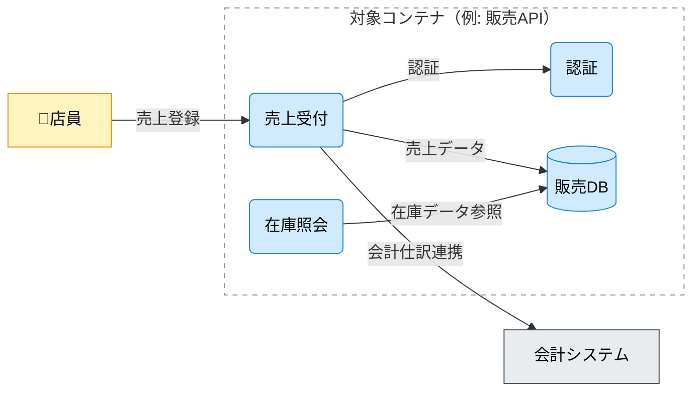

# C4コンポーネント図 ドキュメント作成ルール

C4 Component Diagram (CPD) Documentation Rules

本ドキュメントは、アーキテクチャ設計のために **C4コンポーネント図と、その図を説明する文章**を、統一した粒度・表現で作成するためのルールです。

この章の成果物は、次の2つをセットで扱います。

- **C4コンポーネント図（Mermaid）**: 対象コンテナ（実行/配備単位）の内部を主要コンポーネント（責務のまとまり）に分解し、外部要素との関係を俯瞰で合意する
- **説明（Markdown）**: 図の要素（人/境界/コンポーネント/DB/外部/関係）の意味を文章で合意する

Mermaid 記法そのもののルールは [cpd-mermaid-rules.md](cpd-mermaid-rules.md) を参照してください。

---

## 1. 全体方針

- CPD は「**対象コンテナの内部**が、どの主要コンポーネントで構成され、何とやり取りするか」を合意するための図である。
- 図に入れるのは **コンポーネント粒度**までとし、クラス/関数等の実装詳細は含めない。
- 1つの図には **対象コンテナを1つ**だけ置く（複数対象がある場合は図を分ける）。
- 図は「正確さ（過剰な詳細）」よりも「解釈が割れないこと（合意）」を優先する。

---

## 2. ファイル命名・ID規則

- ファイル名: `cpd-<番号>-<短い日本語名>.md`
  - 例: `cpd-010-販売API-コンポーネント.md`
- Frontmatter:
  - `id`: 小文字ハイフン形式（例: `cpd-sales-api-components`）
  - `title`: 「〇〇のC4コンポーネント図」のように対象が分かる表現

---

## 3. 推奨 Frontmatter 項目

Frontmatter の共通ルールは [meta-document-metadata-rules.md](meta-document-metadata-rules.md) に従います。

| 項目       | 説明                                           | 必須 |
| ---------- | ---------------------------------------------- | ---- |
| id         | ドキュメントID（小文字ハイフン）               | ○    |
| type       | `architecture` 固定                            | ○    |
| title      | ドキュメント名                                 | ○    |
| status     | `draft`/`ready`/`deprecated`                   | ○    |
| part_of    | 上位ドキュメントID（分割している場合）         | 任意 |
| based_on   | 根拠となる定義（用語集、外部IF、上位方針など） | 任意 |
| supersedes | 置き換え関係（古い図→新しい図）                | 任意 |

### 3.1 `based_on` の考え方（例）

- 用語集（`gl-...`）や業務データ辞書（`bdd-...`）
- 外部システムIFの仕様（IF章のドキュメント）
- 参照する上位の方針（ADR、非機能要件など）
- 上位のコンテナ図（CND）の該当ページ

---

## 4. CPDで合意すること（スコープ）

### 4.1 合意したいこと

- 対象コンテナ（Container Boundary）と、責務の一言（何をするコンテナか）
- 主要コンポーネント（Component）の一覧と、それぞれの責務（1〜2文）
- 主要DB（Database）がある場合、その役割（何を永続化するか）
- 外部システム（External Software System）と、連携の意図（何をやり取りするか）
- 関係（Relationship）の向きと意味（誰が主に呼び出す/依存するか）

### 4.2 合意しないこと（この図で扱わない）

- クラス設計、内部の関数構成、ソースコード構造の網羅
- APIエンドポイント、HTTPメソッド、リクエスト/レスポンスJSONなどのIF詳細
- 物理テーブル名・物理カラム名・SQL全文
- 画面遷移やクリック手順の逐語列挙

---

## 5. CPDの要素定義（図と文章の両方で説明する）

この章では、図に描いた要素について **最低限の説明**を併記し、レビュー可能にします。

### 5.1 Person（人/ロール）

Personは、対象コンテナに対して目的をもって関わる主体（人/役割/組織）です。

- 書くこと（推奨）:
  - ロール名（例: 店員、店主、経理担当）
  - どのコンポーネントを、何のために利用するか（例: UI で売上登録を行う）
- 書かないこと:
  - 個人名、UI操作手順の逐語列挙

### 5.2 Container Boundary（対象コンテナ境界）

境界は「この図で扱う対象コンテナの範囲」を表します。

- 書くこと（推奨）:
  - 境界に含めるもの（主要コンポーネント/主要DB等）
  - 境界に含めないもの（外部システム/外部サービス等）

### 5.3 Component（コンポーネント）

コンポーネントは、責務のまとまり（モジュール/サービス/層など）です。

- 書くこと（必須）:
  - コンポーネント名
  - 責務（1〜2文）
- 書くこと（推奨）:
  - 主な入出力の種類（例: 売上登録、在庫照会）
  - 関係するデータストア（例: 販売DBを更新する）
- 書かないこと:
  - 内部クラス/関数、パッケージ構成の網羅

### 5.4 Database（データベース）

Database は、対象コンテナが主に参照/更新する永続データストアです。

- 書くこと（推奨）:
  - DBの論理名（例: 販売DB、在庫DB）
  - 何を永続化するか（例: 売上・在庫・仕入の記録）
- 書かないこと:
  - 物理テーブル名・物理カラム名・SQL

### 5.5 External Software System（外部システム）

対象コンテナの外側にあり、対象コンテナが連携する相手（既存の別システム、SaaS、決済、会計など）です。

- 書くこと（推奨）:
  - 外部システム名（一般名でよい）
  - 連携の目的（例: 決済を依頼する、仕訳を送る）
  - 連携の方向性（誰が主に呼び出す/依存するか）
- 書かないこと:
  - API仕様の詳細、データ項目一覧（それらはIF仕様へ）

### 5.6 Relationship（関係）

関係は「やり取りの意味」を合意するための線です。CPDでは **すべての関係にラベル**を付けます。

- 書くこと（必須）:
  - 方向（誰が主に利用/依存/送信するか）
  - ラベル（短い日本語。名詞句または短い動詞句）
- 書かないこと:
  - HTTP詳細、データ項目列挙、SQL、実装条件式

---

## 6. 本文構成（標準テンプレ）

各 CPD 成果物は、以下見出しを順番に並べます。

1. 概要
2. C4コンポーネント図（Mermaid）
3. 要素の説明
4. 補足

---

## 7. 記述ガイド詳細

### 7.1 概要

- 「この図が何を表すか」「対象コンテナ」「前提」を1〜3文で書きます。

### 7.2 C4コンポーネント図（Mermaid）

- Mermaid のコードブロックで図を記述します。
- Mermaid 記法ルールは [cpd-mermaid-rules.md](cpd-mermaid-rules.md) に従います。
- 図には、少なくとも以下を含めます。
  - Person（いる場合）
  - 境界（Container Boundary）
  - 主要コンポーネント（5〜15個程度を目安）
  - 主要DB（ある場合）
  - 外部システム（ある場合）
  - 関係（Relationship。全矢印にラベル）

### 7.3 要素の説明

- 図に登場する要素を、レビューしやすい粒度で説明します。
- 推奨スタイル:
  - `###` レベルの小見出しで要素名（境界/人/コンポーネント/DB/外部/関係）
  - 1〜3文で意味・前提・境界条件（含む/含まない）を説明

### 7.4 補足

- 未確定な外部連携、境界が揺れている論点、図を分ける必要がありそうな論点を列挙します。

---

## 8. 命名・記述スタイル

- 用語はこの図の中で揺らさない（同じ要素を別名で呼ばない）。
- ラベルは短くし、長い場合は改行（`<br>`）で読みやすくする（詳細はIF仕様へ）。
- コンポーネント名は「責務が読める短い名前」を優先し、実装都合（ファイル名/クラス名）に寄せすぎない。

---

## 9. 禁止事項

次の記述は、CPDの粒度を超えるため避けます。

| 項目                                    | 理由                             |
| --------------------------------------- | -------------------------------- |
| 物理テーブル名・物理カラム名・SQL全文   | 図の粒度を超える（DB設計に記述） |
| APIエンドポイント/HTTP/JSON等の詳細     | IF仕様に記述する                 |
| 実装クラス/関数名、内部モジュールの網羅 | 変更に弱い・合意の対象がずれる   |
| 画面遷移やクリック手順の逐語列挙        | UI変更に弱い・図の目的から逸脱   |
| 矢印ラベルなしの関係                    | 何の関係か合意できない           |

---

## 10. レビュー観点（チェックリスト）

- 対象コンテナは1つに絞れているか
- 境界の内外が説明され、責任分界が曖昧でないか
- 主要コンポーネントが多すぎず（目安: 5〜15）、過不足なく俯瞰できるか
- Person/外部システム/DBがある場合、必要十分に含まれているか
- すべての関係にラベルがあり、意味が解釈一致するか
- 図が「クラス/実装詳細」や「IF詳細」に踏み込んでいないか

---

## 11. サンプル（簡易）

````markdown
---
id: cpd-sales-api-components
type: architecture
title: 販売APIのC4コンポーネント図
status: draft
part_of: []
based_on: []
---

## 概要

この図は「販売API（対象コンテナ）」を主要コンポーネントに分割し、利用者・外部システム・DBとの関係を俯瞰します。

## C4コンポーネント図（Mermaid）



## 要素の説明

### 対象コンテナ境界

この境界は販売APIの内部（主要コンポーネントとDBアクセス）を表します。

### Person（人/ロール）

店員は売上登録のために売上受付コンポーネントを利用します。

### コンポーネント

- 売上受付: 売上登録を受け付け、売上を永続化し、会計連携を起動します。
- 在庫照会: 在庫の参照要求を受け付けます。
- 認証: 利用者の認証を行います。

### データベース

- 販売DB: 売上・在庫に関する主要データを永続化します。

### 外部システム

- 会計システム: 会計仕訳の受け口です。

### 関係

売上受付が販売DBを更新し、会計システムへ仕訳相当情報を連携します。

## 補足

- 外部連携のIF詳細はAPI仕様/外部システムIFで別途定義します。
````

---

## 12. 生成AIへの指示テンプレート

生成AIにCPD成果物（図＋説明）を作らせるときは、以下のような指示を与えます（このテンプレート内に禁止事項を含め、参照前提にしません）。

> - 以下のルールに従って、**C4コンポーネント図（CPD）のドキュメント**を 1 ファイル作成してください。出力は **Markdown** とします。
> - 対象コンテナ（Container Boundary）は **1つ**だけにしてください（複数対象がある場合は分割する前提で、今回は1つに絞る）。
> - 先頭に YAML Frontmatter を付けてください（項目は以下を必須とする）：
>   - `id`: 小文字ハイフン（例: `cpd-sales-api-components`）
>   - `type`: `architecture`
>   - `title`: 図の対象が分かる日本語タイトル
>   - `status`: `draft`
>   - `part_of`: `[]`
>   - `based_on`: `[]`
>   - `implements`: `[]`
>   - `tests`: `[]`
> - 本文構成は、次の見出し（日本語）をこの順序で必ず出力してください：
>   1. 概要
>   2. C4コンポーネント図（Mermaid）
>   3. 要素の説明
>   4. 補足
> - 「C4コンポーネント図（Mermaid）」は以下のルールに従って作成してください：
>   - Mermaid の `flowchart` 構文で、C4コンポーネント図（Component Diagram）を作成してください。
>   - 対象コンテナは `subgraph 境界["対象コンテナ"] ... end` で囲ってください。
>   - 境界内には、主要コンポーネント（責務のまとまり）と、必要なら主要DBを置いてください（5〜15個程度）。
>   - Person（人/ロール）や外部システム（External Software System）がある場合は含めてください（該当がない場合は理由を明記）。
>   - 関係は `-->` で表現し、**すべての矢印にラベル**（短い日本語）を付けてください。
>   - 色分け（必須）:
>     - Personノードに `person`、境界内（Component/DB）に `system`、外部システムに `external` を付けてください。
>     - 境界（subgraph）は破線枠にしてください。
>     - 以下の定義をそのまま図に含めてください（値は変更しない）：
>       - `classDef person fill:#fff3bf,stroke:#f08c00,color:#000;`
>       - `classDef system fill:#d0ebff,stroke:#1c7ed6,color:#000;`
>       - `classDef external fill:#e9ecef,stroke:#495057,color:#000;`
>       - `style 境界 fill:#ffffff,fill-opacity:0,stroke:#868e96,stroke-width:1px,stroke-dasharray: 5 5;`
>   - 出力は Mermaid のコードブロック形式（\```mermaid で開始し、 \``` で終了）で提示してください。
> - 「要素の説明」は、図に登場する要素（境界/人/コンポーネント/DB/外部/関係）を `###` 小見出しで列挙し、各要素を **1〜3文**で説明してください。
> - 禁止: 物理テーブル名・カラム名・SQL全文、APIエンドポイントやHTTP詳細、実装クラス/関数名やファイル一覧、画面手順の逐語列挙

このテンプレートをコピーして、生成 AI のプロンプトに貼り付けて利用してください。なお、[cpd-instruction.md](../instructions/cpd-instruction.md)として別ファイルに保存しています。

---

## 13. 参照

- Mermaid 記法（CPD）: [cpd-mermaid-rules.md](../rules/cpd-mermaid-rules.md)
- 生成AI向けテンプレ（CPD）: [cpd-mermaid-instruction.md](../instructions/cpd-mermaid-instruction.md)
