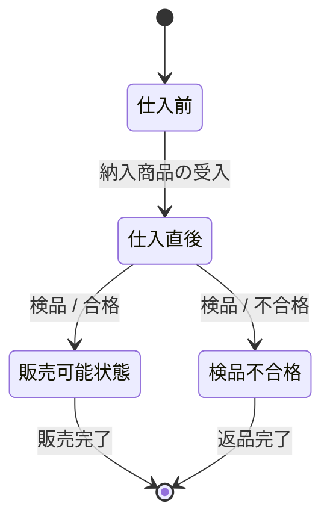

# 概念状態遷移図（Conceptual State Transition Diagram: CSTD）ドキュメント作成ルール

本ドキュメントは、業務分析・要求定義のために **概念状態遷移図（Conceptual State Transition Diagram: CSTD）** を、統一形式で作成するためのルールです。

この章の成果物は、次の2つをセットで扱います。

- **概念状態遷移図（Mermaid）**: 対象のライフサイクル（状態と遷移）を図で定義する
- **説明（Markdown）**: 状態/遷移の意味・前提・補足を文章で定義する

Mermaid 記法そのもののルールは [cstd-mermaid-rules.md](cstd-mermaid-rules.md) を参照してください。

---

## 1. 全体方針

- 目的は、業務上の対象（例: 商品、つけ記録、お金）の **ライフサイクル** と、状態変化の契機（業務イベント/条件）を、レビューしやすく合意できる形で残すことです。
- 図は「正確さ（過剰な詳細）」よりも「解釈が割れないこと（合意）」を優先します。
- 実装詳細（例: 物理テーブル名・物理カラム名・SQL全文、実装クラス/関数名、APIエンドポイント、UI操作手順の逐語列挙、実装条件式そのもの）は記載しません。
- 1ファイルは、**1つの対象**（1エンティティ/1概念）にフォーカスします。
  - 例: 「商品の状態遷移（AS-IS）」「お金の状態遷移（AS-IS）」

## 2. 用語定義

| 用語        | 定義                                                       |
| ----------- | ---------------------------------------------------------- |
| 対象        | 状態を持つ業務上の概念（例: 商品、つけ記録、お金）         |
| 状態        | 対象の業務上の状態（例: 仕入前、販売可能状態、後払い扱い） |
| 遷移        | 状態が別状態へ変化すること                                 |
| イベント    | 状態遷移の契機となる出来事/操作（例: 検品、会計処理完了）  |
| 条件        | 遷移の成立条件（例: 合格/不合格）                          |
| AS-IS/TO-BE | 現状業務/将来業務                                          |

## 3. ファイル命名・ID規則

- ファイル名: `cstd-<番号>-<短い日本語名>.md`
  - 例: `cstd-010-商品の概念状態遷移図-AS-IS.md`
  - 例: `cstd-020-お金の概念状態遷移図-AS-IS.md`
- Frontmatter:
  - `id`: 小文字ハイフン形式（例: `cstd-product-as-is`）
  - `title`: 「商品の概念状態遷移図 (AS-IS)」のように対象とスコープが分かる表現

## 4. 推奨 Frontmatter 項目

Frontmatter の共通ルールは [meta-rules.md](meta-rules.md) に従います。

| 項目       | 説明                                        | 必須 |
| ---------- | ------------------------------------------- | ---- |
| id         | ドキュメントID（小文字ハイフン）            | ○    |
| type       | `domain` 固定                               | ○    |
| title      | ドキュメント名                              | ○    |
| status     | `draft`/`ready`/`deprecated`                | ○    |
| owners     | 担当者                                      | 任意 |
| tags       | タグ                                        | 任意 |
| depends_on | 前提となる定義（ステータス定義/用語集など） | 任意 |
| implements | 満たすべきビジネスルール（br-...）          | 任意 |
| tests      | この仕様を検証する業務受入条件（bac-...）等 | 任意 |
| supersedes | 置き換え関係（古仕様→新仕様）               | 任意 |

### 4.1 `depends_on` の考え方（例）

- 状態名の根拠となる「ステータス定義」（例: `stl-...`）
- 対象の概念定義（用語集 `tm-...`、業務データ辞書 `bdd-...` など）
- 関連する業務フロー仕様（CDFD / BPS など）

## 5. 本文構成（標準テンプレ）

各 CSTD ファイルは、以下見出しを順番に並べます。

1. 概要
2. 概念状態遷移図（CSTD）
3. 状態の説明
4. 今後の検討メモ

## 6. 記述ガイド詳細

### 6.1 概要

- 「この図が何を表すか」「AS-IS/TO-BEの別」「状態名/イベント名の根拠（あれば）」を1〜3文で書きます。

### 6.2 概念状態遷移図（CSTD）

- Mermaid のコードブロックで図を記述します。
- Mermaid 記法ルールは [cstd-mermaid-rules.md](cstd-mermaid-rules.md) に従います。

### 6.3 状態の説明

- 図に登場する状態を、**業務用語で**説明します。
- 推奨スタイル:
  - `###` レベルの小見出しで状態名
  - 1〜3文で「意味」と「境界条件（どこまでをその状態に含めるか）」を説明
    - 例: 「いつその状態になるか」「何が満たされると次へ遷移可能か」「含まないケース」など

### 6.4 今後の検討メモ

- 未決事項や、追加で図を分ける必要がありそうな論点を列挙します。
- 例: 例外状態の扱い、別対象（つけ記録等）への切り出し、状態名の統一方針

## 7. 命名・記述スタイル

- 状態名は **日本語の名詞句**（例: `販売可能状態`, `購買受付中`）。
- 遷移ラベル（イベント/条件）は、業務で使う自然な用語（例: `検品 / 合格`）。
- 同義語を混在させない（例: 「販売可能」と「販売可能状態」を混在させない）。
- 記号や略語（`is_active`, `FLAG_01`, `ST_1` など）を状態名に使わない。

## 8. 分割ガイド

| シグナル                                | 分割検討                                         |
| --------------------------------------- | ------------------------------------------------ |
| 対象が2つ以上混在している               | 対象ごとにファイル分割                           |
| 状態数が多く可読性が落ちる（目安: >15） | AS-IS/TO-BE、通常/例外、サブライフサイクルで分割 |
| 例外パターンが多い                      | 「例外」対象を別CSTDにするか、別節で補足         |

## 9. Mermaid 記法（参照）

- Mermaid の詳細ルール: [cstd-mermaid-rules.md](cstd-mermaid-rules.md)
- 生成AI向けの短い指示テンプレ: [cstd-mermaid-instruction.md](../instructions/cstd-mermaid-instruction.md)

## 10. 禁止事項

次の記述は、概念レベルの状態遷移図としては避けます。

| 項目                                         | 理由                               |
| -------------------------------------------- | ---------------------------------- |
| 画面遷移（UIページ間の移動）を状態として描く | UI変更に弱く、概念の合意にならない |
| 実装条件式そのもの（`if`, `&&`, `null` 等）  | 実装依存でレビュー不能になりやすい |
| 物理テーブル名・カラム名・SQL全文            | 概念レベル逸脱（DB設計に記述）     |
| 実装クラス/関数名、APIエンドポイント         | 実装依存で変更に弱い               |
| 同じ意味の状態に別名を付ける                 | 合意が崩れやすい                   |

## 11. よくある誤りと対策

- 状態名が実装のenum/フラグっぽい → 業務用語（名詞句）に言い換える。
- 遷移のラベルが空 → イベント名または条件を必ず書く（「何で変わるか」を合意する）。
- 対象が混ざる（商品＋お金など） → 対象ごとに分割する。
- AS-IS/TO-BEが混在 → スコープを分けて別ファイルにする。

## 12. サンプル（簡易）

````markdown
---
id: product-cstd-as-is
type: domain
title: 商品の概念状態遷移図 (AS-IS)
status: draft
depends_on: []
implements: []
tests: []
---

## 概要

この図は、現状業務における「商品」の概念的な状態遷移を表します。

## 概念状態遷移図（CSTD）



## 状態の説明

### 仕入前

まだ店舗に到着していない状態。店舗で物理的に受領した時点で「仕入直後」へ遷移する。

### 仕入直後

店舗に納入された直後で、検品対象となる状態。検品が完了し合否が確定した時点で次の状態へ遷移する。

## 今後の検討メモ

- 「廃棄」の扱いを別図に切り出すか検討。
````

## 13. 生成 AI への指示テンプレート

生成 AI に CSTD ドキュメントを作らせるときは、以下のような指示を与えます（このテンプレート内に禁止事項を含め、参照前提にしません）。

> - 以下のルールに従って、**概念状態遷移図（CSTD）** のドキュメントを 1 ファイル作成してください。出力は **Markdown** とします。
> - 対象は 1 つの概念（例: 商品 / つけ記録 / お金）に限定してください。
> - 本文構成は、次の見出し（日本語）をこの順序で必ず出力してください：
>   1. 概要
>   2. 概念状態遷移図（CSTD）
>   3. 状態の説明
>   4. 今後の検討メモ
> - 「概念状態遷移図（CSTD）」は以下のルールに従って作成してください：
>   - Mermaid の `stateDiagram-v2` 構文を使って、概念状態遷移図（Conceptual State Transition Diagram, CSTD）を作成してください。
>   - 図は **概念レベルの状態遷移**を表し、画面遷移や実装レベルの条件式は記述しないでください。
>   - 1つの図では、1つの対象（例：商品、在庫記録、つけ記録など）の状態遷移にフォーカスしてください。
>   - 状態名は、日本語の自然な名詞句で表現してください（例：`販売中`、`売り切れ`、`廃棄済み`）。
>   - 遷移は `状態A --> 状態B : イベント / 条件` の形式で記述し、**イベント名または条件を必ず書いてください**。
>   - 条件がある場合は、`イベント / 条件` のようにスラッシュ区切りで記述し、実装コードではなく業務上の条件に言い換えてください（例：`検品完了 / 良品`）。
>   - 初期状態・終了状態がある場合は、`[*] --> 状態`、`状態 --> [*]` で記述してください。
>   - 必要に応じて `state 状態名 { ... }` を使い、複合状態（サブ状態）を表現しても構いませんが、図が複雑になりすぎないようにしてください。
>   - 状態名・イベント名には、業務で使う自然な用語を使い、フラグ名や略語（`is_active`, `FLAG_01` など）は使わないでください。
>   - 結果は Mermaid のコードブロック（`mermaid ...`）で出力してください。
>   - 図全体は読みやすく、状態と遷移の意味が一目で分かるようにしてください。
> - 「状態の説明」は、図に登場する各状態について `### 状態名` の小見出しを作り、**1〜3文で意味と境界条件**を説明してください。
> - 禁止: 画面遷移の記述、物理テーブル名・物理カラム名・SQL全文、実装クラス/関数名、APIエンドポイント、UI操作手順の逐語列挙、実装条件式（`if`, `&&` 等）そのもの
