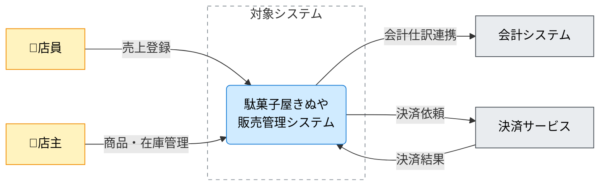

# C4コンテキスト図 ドキュメント作成ルール

C4 Contextual Diagram (CXD) Documentation Rules

本ドキュメントは、アーキテクチャ設計のために **C4コンテキスト図と、その図を説明する文章**を、統一した粒度・表現で作成するためのルールです。

この章の成果物は、次の2つをセットで扱います。

- **C4コンテキスト図（Mermaid）**: 対象システムと「境界外」の人・外部システムとの関係を俯瞰で合意する
- **説明（Markdown）**: 図の要素（人/対象/外部/境界/関係）の意味を文章で合意する

Mermaid 記法そのもののルールは [cxd-mermaid-rules.md](cxd-mermaid-rules.md) を参照してください。
生成AI向けの短い指示テンプレは [cxd-mermaid-instruction.md](../instructions/cxd-mermaid-instruction.md) を参照してください。

## 1. 全体方針

- CXDは「対象システムが、誰に/何と関わるか」を合意するための図である。
- 図に入れるのは **システム境界の外側との関係**までとし、内部構造（コンテナ/コンポーネント）や実装詳細は含めない。
- 1つの図には **対象システムを1つ**だけ置く（複数対象がある場合は図を分ける）。
- 図は「正確さ（過剰な詳細）」よりも「解釈が割れないこと（合意）」を優先する。

## 2. ファイル命名・ID規則

- ファイル名: `cxd-<番号>-<短い日本語名>.md`
  - 例: `cxd-010-駄菓子屋きぬや販売管理システム-コンテキスト.md`
- Frontmatter:
  - `id`: 小文字ハイフン形式（例: `cxd-candy-shop-sales-context`）
  - `title`: 「〇〇のC4コンテキスト図」のように対象が分かる表現

## 3. 推奨 Frontmatter 項目

Frontmatter の共通ルールは [meta-document-metadata-rules.md](meta-document-metadata-rules.md) に従います。

| 項目       | 説明                                           | 必須 |
| ---------- | ---------------------------------------------- | ---- |
| id         | ドキュメントID（小文字ハイフン）               | ○    |
| type       | `architecture` 固定                            | ○    |
| title      | ドキュメント名                                 | ○    |
| status     | `draft`/`ready`/`deprecated`                   | ○    |
| part_of    | 上位ドキュメントID（分割している場合）         | 任意 |
| based_on   | 根拠となる定義（用語集、外部IF、上位方針など） | 任意 |
| supersedes | 置き換え関係（古い図→新しい図）                | 任意 |

### 3.1. `based_on` の考え方（例）

- 用語集（`gl-...`）や業務データ辞書（`bdd-...`）
- 外部システムIFの仕様（IF章のドキュメント）
- 参照する上位の方針（ADR、非機能要件など）

## 4. CXDで合意すること（スコープ）

### 4.1. 合意したいこと

- 対象システムの名前と、責務の一言（何をするシステムか）
- 利用者（Person）と、その利用目的（何のために使うか）
- 外部システム（External Software System）と、連携の意図（何をやり取りするか）
- 関係（Relationship）の向きと意味（誰が主に呼び出す/依存するか）
- 対象システムの「境界」の考え方（何を含み、何を含まないか）

### 4.2. 合意しないこと（この図で扱わない）

- 対象システムの内部の分解（コンテナ/コンポーネント、内部プロセス、内部データストア）
- APIエンドポイント、HTTPメソッド、リクエスト/レスポンスJSONなどのIF詳細
- 物理テーブル名・物理カラム名・SQL全文
- 実装クラス/関数名、ライブラリ名、具体的な技術選定の列挙

## 5. CXDの要素定義（図と文章の両方で説明する）

この章では、図に描いた要素について **最低限の説明**を併記し、レビュー可能にします。

### 5.1. Person（人/ロール）

Personは、対象システムに対して目的をもって関わる主体（人/役割/組織）です。

- 書くこと（推奨）:
  - ロール名（例: 店員、店主、経理担当）
  - 対象システムに何をしに来るか（例: 売上登録を行う、在庫を確認する）
  - 重要な前提（ある場合のみ。例: 店舗内からのみ利用）
- 書かないこと:
  - 個人名、組織の詳細階層、UI操作手順の逐語列挙

### 5.2. Software System（対象システム）

この図の中心に置くシステムです。CXDでは **対象システムは1つ**に限定します。

- 書くこと（推奨）:
  - システム名（短く一意）
  - システムの責務（1文。例: 店舗の販売・仕入・在庫・簡易会計を一元管理する）
  - 「境界」に含める範囲の補足（ある場合のみ）
- 書かないこと:
  - 内部モジュール/サブシステムの列挙、画面一覧、DBスキーマ

### 5.3. External Software System（外部システム）

対象システムの外側にあり、対象システムが連携する相手（既存の別システム、SaaS、決済、会計など）です。

- 書くこと（推奨）:
  - 外部システム名（一般名でよい）
  - 連携の目的（例: 決済を依頼する、仕訳を送る、マスタを参照する）
  - 連携の方向性（誰が主に呼び出す/依存するか）
- 書かないこと:
  - API仕様の詳細、データ項目一覧（それらはIF仕様へ）

### 5.4. System Boundary（システム境界）

境界は「対象システムが責任を持つ範囲」を表します。境界の内外が曖昧だと、責任分界（運用・障害・変更）が曖昧になります。

- 書くこと（推奨）:
  - 境界に含めるもの（例: 店舗内の販売管理）
  - 境界に含めないもの（例: 決済そのもの、会計システムの処理）
- 注意:
  - 境界内に「対象システムのノード1つだけ」を置く運用を基本とし、内部構造は別図（コンテナ図など）へ委譲します。

### 5.5. Relationship（関係）

関係は「やり取りの意味」を合意するための線です。CXDでは **すべての関係にラベル**を付けます。

- 書くこと（必須）:
  - 方向（誰が主に利用/依存/送信するか）
  - ラベル（短い日本語。名詞句または短い動詞句）
- 書くこと（推奨）:
  - やり取りの意図（例: 売上登録、決済依頼、仕訳連携）
  - 重要な前提（ある場合のみ。例: 非同期、日次バッチ）
- 書かないこと:
  - HTTP詳細、データ項目列挙、SQL、実装条件式

## 6. 本文構成（標準テンプレ）

各 CXD 成果物は、以下見出しを順番に並べます。

1. 概要
2. C4コンテキスト図（Mermaid）
3. 要素の説明
4. 補足

## 7. 記述ガイド詳細

### 7.1. 概要

- 「この図が何を表すか」「対象システム」「前提」を1〜3文で書きます。

### 7.2. C4コンテキスト図（Mermaid）

- Mermaid のコードブロックで図を記述します。
- Mermaid 記法ルールは [cxd-mermaid-rules.md](cxd-mermaid-rules.md) に従います。
- 図には、少なくとも以下を含めます。
  - Person（人/ロール）
  - 対象システム（Software System）
  - 外部システム（External Software System）
  - 関係（Relationship。全矢印にラベル）

### 7.3. 要素の説明

- 図に登場する要素を、レビューしやすい粒度で説明します。
- 推奨スタイル:
  - `###` レベルの小見出しで要素名（人/対象/外部/境界/関係）
  - 1〜3文で意味・前提・境界条件（含む/含まない）を説明

### 7.4. 補足

- 未確定な外部連携、境界が揺れている論点、図を分ける必要がありそうな論点を列挙します。

## 8. 命名・記述スタイル

- 用語はこの図の中で揺らさない（同じ相手を別名で呼ばない）。
- ラベルは短くし、長い場合は改行（`<br>`）で読みやすくする（詳細はIF仕様へ）。
- Personは「役割」を優先し、個人名ではなくロール名にする。

## 9. 禁止事項

次の記述は、CXDの粒度を超えるため避けます。

| 項目                                        | 理由                              |
| ------------------------------------------- | --------------------------------- |
| 物理テーブル名・物理カラム名・SQL全文       | 図の粒度を超える（DB設計に記述）  |
| APIエンドポイント/HTTP/JSON等の詳細         | IF仕様に記述する                  |
| 実装クラス/関数名、技術スタック列挙         | 変更に弱い・合意の対象がずれる    |
| 対象システム内部の詳細プロセス/データストア | コンテナ図/コンポーネント図で表す |
| 矢印ラベルなしの関係                        | 何の関係か合意できない            |

## 10. レビュー観点（チェックリスト）

- 対象システムは1つに絞れているか
- PersonとExternal Software Systemが含まれているか（無い場合は理由が書かれているか）
- すべての関係にラベルがあり、意味が解釈一致するか
- 境界の内外が説明され、責任分界が曖昧でないか
- 図が「内部設計」や「IF詳細」に踏み込んでいないか

## 11. サンプル（簡易）

### 11.1. メタ情報（Frontmatter）

```yaml
---
id: cxd-candy-shop-sales-context
type: architecture
title: 駄菓子屋きぬや販売管理システムのC4コンテキスト図
status: draft
part_of: []
based_on: []
---
```

### 11.2. 概要

この図は「駄菓子屋きぬや販売管理システム」が、利用者と外部システムとどのように関わるかを俯瞰します。

### 11.3. C4コンテキスト図（Mermaid）



### 11.4. 要素の説明

#### 11.4.1. Person（人/ロール）

店員・店主が、販売登録や在庫・商品管理のために対象システムを利用します。

#### 11.4.2. 対象システム（Software System）

店舗の販売・仕入・在庫に関する情報を一元管理し、会計・決済などの外部連携を行います。

#### 11.4.3. 外部システム（External Software System）

会計システムへは仕訳相当情報を連携し、決済サービスへは決済を依頼して結果を受信します（詳細はIF仕様に記載）。

#### 11.4.4. 境界（System Boundary）

境界には販売管理システム本体を含みます。決済処理や会計処理そのものは境界の外側です。

### 11.5. 補足

- 会計連携の頻度（リアルタイム/日次）を確定する。

## 12. 生成AIへの指示テンプレート

生成AIにCXD成果物（図＋説明）を作らせるときは、以下のような指示を与えます（このテンプレート内に禁止事項を含め、参照前提にしません）。

> - 以下のルールに従って、**C4コンテキスト図（CXD）のドキュメント**を 1 ファイル作成してください。出力は **Markdown** とします。
> - 対象システム（Software System）は **1つ**だけにしてください（複数対象がある場合は分割する前提で、今回は1つに絞る）。
> - 先頭に YAML Frontmatter を付けてください（項目は以下を必須とする）：
>   - `id`: 小文字ハイフン（例: `cxd-candy-shop-sales-context`）
>   - `type`: `architecture`
>   - `title`: 図の対象が分かる日本語タイトル
>   - `status`: `draft`
>   - `part_of`: `[]`
>   - `based_on`: `[]`
>   - `implements`: `[]`
>   - `tests`: `[]`
> - 本文構成は、次の見出し（日本語）をこの順序で必ず出力してください：
>   1. 概要
>   2. C4コンテキスト図（Mermaid）
>   3. 要素の説明
>   4. 補足
> - 「C4コンテキスト図（Mermaid）」は以下のルールに従って作成してください：
>   - Mermaid の `flowchart` 構文で、C4コンテキスト図（システムコンテキスト）を作成してください。
>   - 対象システムは `subgraph 境界["対象システム"] ... end` で囲い、境界内には原則として対象システムのノード1つだけを置いてください。
>   - Person（人/ロール）と External Software System（外部システム）を必ず含めてください（該当がない場合は理由を明記）。
>   - 関係は `-->` で表現し、**すべての矢印にラベル**（短い日本語）を付けてください。
>   - 色分け（必須）:
>     - Personノードに `person`、対象システムに `system`、外部システムに `external` を付けてください。
>     - 境界（subgraph）は破線枠にしてください。
>     - 以下の定義をそのまま図に含めてください（値は変更しない）：
>       - `classDef person fill:#fff3bf,stroke:#f08c00,color:#000;`
>       - `classDef system fill:#d0ebff,stroke:#1c7ed6,color:#000;`
>       - `classDef external fill:#e9ecef,stroke:#495057,color:#000;`
>       - `style 境界 fill:#ffffff,fill-opacity:0,stroke:#868e96,stroke-width:1px,stroke-dasharray: 5 5;`
>   - 出力は Mermaid のコードブロック形式（\```mermaid で開始し、 \``` で終了）で提示してください。
> - 「要素の説明」は、図に登場する要素（人/対象システム/外部システム/境界/関係）を `###` 小見出しで列挙し、各要素を **1〜3文**で説明してください。
> - 禁止: 物理テーブル名・カラム名・SQL全文、APIエンドポイントやHTTP詳細、実装クラス/関数名、対象システム内部の詳細プロセス/データストア、UI操作手順の逐語列挙

このテンプレートをコピーして、生成 AI のプロンプトに貼り付けて利用してください。なお、[cxd-instruction.md](../instructions/cxd-instruction.md)として別ファイルに保存しています。

## 13. 参照

- Mermaid 記法（CXD）: [cxd-mermaid-rules.md](../rules/cxd-mermaid-rules.md)
- 生成AI向けテンプレ（CXD）: [cxd-mermaid-instruction.md](../instructions/cxd-mermaid-instruction.md)
