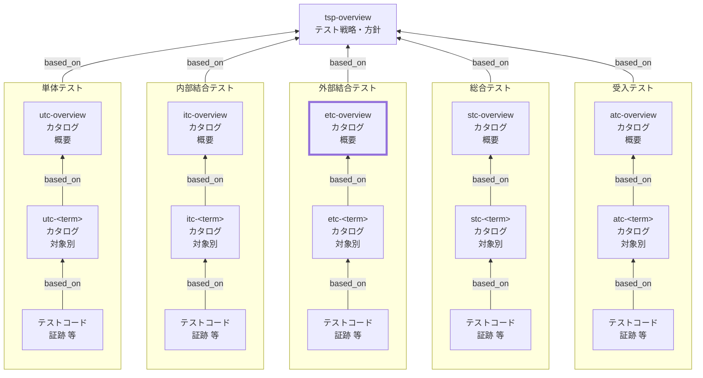

External Integration Test Catalog (ETC) Overview Documentation Rules

本ドキュメントは、外部結合テストカタログ（ETC）の全体概要 `etc-overview` を統一形式で記述するためのルールです。
TSPに基づき、外部結合テストに共通するルールや方針を定義します。

個別 外部結合テストカタログ（`etc-<term>`）の記述ルールは `etc-rules.md` を参照してください。

## 1. 全体方針

`etc-overview` は、外部結合テストカタログ（ETC）を **運用可能な最小情報**で統一し、
対象別カタログ（`etc-<term>`）の品質と一貫性を担保するための **共通ルール（SSOT）** とする。

- `etc-overview` は **「考え方・共通方針・共通定義」** を記述する（個別ケースは持たない）
- 個別の観点・条件・ケースは **`etc-<term>` に集約**し、詳細は **テストコード／CI証跡** に寄せる
- 記述は **レビュー可能**であることを優先し、長文化を避ける（方針は箇条書き中心）
- 「例外」や「対象外」を明示し、外部結合テストの責任境界（何をやらないか）を固定する
- `tsp-overview` の方針を根拠として、外部結合テストに共通する **分割基準・観点/条件の立て方・外部依存境界・合格基準・証跡** を定義する
- 外部結合テストの目的は「**システム境界を跨ぐ結合（外部サービス/外部端末/外部環境）を含む振る舞い**を、実運用に近い前提で検証すること」である
  （ただし、再現性・コスト・安全性の観点で「実疎通」を必須化しない領域は明確に除外する）

## 2. 位置づけ（他ドキュメントとの関係）

`etc-overview` と他ドキュメントの関係を示します。



## 3. ファイル命名・ID規則

- 本ルールの対象ドキュメントの `id` は `etc-overview` 固定。対象別は `etc-<term>`（詳細は `etc-rules.md`）。
- ファイル名は `etc-010-外部結合テストカタログ-概要.md` 等、プロジェクト内で一意になるように命名します。
- `<term>` は用語集(GL)の論理名キー（英小文字kebab-case）を用いる（表示名は title に日本語で記載してよい）。

## 4. 推奨 Frontmatter 項目

### 4.1. 設定内容

Frontmatter は共通スキーマに従います（参照: [docs/shared/schemas/spec-frontmatter.schema.yaml](../../../shared/schemas/spec-frontmatter.schema.yaml) / [meta-document-metadata-rules.md](meta-document-metadata-rules.md)）。

| 項目       | 説明                                               | 必須 |
| ---------- | -------------------------------------------------- | ---- |
| id         | `etc-overview`（固定）                             | ○    |
| type       | `test` 固定                                        | ○    |
| title      | 外部結合テストカタログ: 概要（`<システム名>`）     | ○    |
| status     | `draft` / `ready` / `deprecated`                   | ○    |
| based_on   | 根拠となる仕様ID（ID配列。未指定時は `[]` を許容） | 任意 |
| supersedes | 置き換え関係（ID配列。未指定時は `[]` を許容）     | 任意 |

### 4.2. 推奨ルール

- `based_on` には最低限 `tsp-overview` を含めます。
- BAC/NFR/BR 等は、`etc-overview` の方針判断（外部依存境界・共通合格基準・環境前提）に **直接利用したものだけ**を `based_on` に列挙します。
- `based_on` / `supersedes` は ID 配列（未指定は `[]` 可）。

## 5. 本文構成（標準テンプレ）

`etc-overview` は以下の見出し構成を **順序固定** で配置します。

| 番号 | 見出し                                          | 必須 |
| ---- | ----------------------------------------------- | ---- |
| 1    | 本ドキュメントの目的と適用対象                  | ○    |
| 2    | テスト対象の括り方と分割基準                    | ○    |
| 3    | 対象外・除外理由（共通）                        | ○    |
| 4    | 観点の立て方（共通）                            | ○    |
| 5    | 条件の立て方（共通）                            | ○    |
| 6    | 観点/条件の採用基準と対象別への分配方針（共通） | ○    |
| 7    | 外部結合テスト共通の境界/依存/環境の扱い        | ○    |
| 8    | ケース表の共通カラム                            | ○    |
| 9    | メモ / 将来課題                                 | 任意 |

注意：次章の記述ガイドのMarkdown見出しはルール文章内の参照用であり、
生成する `etc-overview` 本文の見出しは各章で指定された **番号付き** の形式
（例: `## 6.`, `### 6.1.` / `#### 6.1.1.` / `#### 6.1.2.`）に置き換えてください。

## 6. 記述ガイド

### 6.1. 本ドキュメントの目的と適用対象

生成する `etc-overview` 本文の見出しは **## 1. 本ドキュメントの目的と適用対象**

本節では、`etc-overview` が **何のために存在し、何に適用されるか** を明確にします。

- 目的：`etc-<term>` を同一基準で作成し、品質・粒度・責任範囲を揃える
- 適用対象：外部結合テスト（ET）に関するカタログ群（`etc-overview` / `etc-<term>`）
- 非適用：総合/受入（ST/AT）のルールはそれぞれの `stc-overview` / `atc-overview` で扱う
- 成果物の位置づけ：
  - `etc-overview`：外部結合テスト共通方針（SSOT）
  - `etc-<term>`：対象別の観点・条件・ケース表（SSOT）
  - テストコード／CI：実装と実行証跡（Evidence）

- SSOTの一次情報は `etc-overview` / `etc-<term>` とし、テストコード／CIは **実装と実行結果の証跡** として扱う
- 本書が扱う粒度：**判断基準・共通ルールまで**（個別ケースの列挙は禁止）

### 6.2. テスト対象の括り方と分割基準

生成する `etc-overview` 本文の見出しは **## 2. テスト対象の括り方と分割基準**

本節では、`etc-<term>` の `<term>` をどう切るか（対象単位の設計）を定義します。

- `<term>` は「**外部境界を跨ぐ結合のまとまり**」を単位とする
  例：外部決済連携、外部IdP認証、外部通知（メール/SMS）、外部ファイル連携（S3等）、端末機能連携 など
- 分割基準（推奨順）：
  1. **境界/外部I/F**：外部システムや外部環境の境界が同一
  2. **失敗モード**：タイムアウト/リトライ/認証失敗/レート制限などの性質が同一
  3. **合格基準**：SLO/復旧/再送などの期待が同一
  4. **運用責任**：監視・運用手順・担当が概ね一致する

- 過分割の禁止：`etc-<term>` が「1〜2ケースしかない」単位は原則統合する
- 肥大化の抑制（分割の目安）：
  - 観点が過剰（例：15以上）／表の行数が過剰（例：50以上）になったら分割候補
  - 外部I/Fが異なる・環境前提が異なる（sandbox/prod相当など）が混在する場合は分割候補

- “外部”の定義（推奨）：**チーム境界の外**（外部事業者）に加え、**別運用ドメイン**（別環境/別責任）も外部として扱う

### 6.3. 対象外・除外理由（共通）

生成する `etc-overview` 本文の見出しは **## 3. 対象外・除外理由（共通）**

本節では、外部結合テスト（ET）で **やらないこと** と、その **理由**、および **例外条件** を明確にします。

#### 6.3.1. 記述ルール

- 形式は **「対象外（何をやらないか）」「除外理由（なぜやらないか）」「代替」「例外（ETで扱う条件）」** を基本とする
- 「対象外」は **テストレベルの責務分界**（ET/ST/AT/NFR）に紐づけて書く
- 「例外」は乱用しない。例外を認める場合は **判断基準**（いつ/どの条件で）を明記する
- 個別対象（`etc-<term>`）固有の対象外は、`etc-<term>` 側に書く。本節は **ET共通** に限定する

#### 6.3.2. 推奨フォーマット（表）

| 対象外（やらないこと） | 除外理由 | 代替レベル/代替手段 | 例外（ETで扱う条件） |
| ---------------------- | -------- | ------------------- | -------------------- |

#### 6.3.3. 典型例（記載候補）

- 長時間耐久・大規模負荷（スループット/長時間稼働/Soak）
- 本番実アカウント/本番実データに依存する検証（安全性・個人情報）
- 端末群・多ブラウザの網羅（互換性はST/ATや別計画へ）
- 外部サービスの品質そのもの（外部障害の責任切り分け）

### 6.4. 観点の立て方（共通）

生成する `etc-overview` 本文の見出しは **## 4. 観点の立て方（共通）**

観点（Perspective）は「外部境界を跨いだときに何を保証するか」の切り口であり、対象別カタログの章立てとして用います。

- 観点の型（最低限この順で検討）：
  - 外部I/F契約の遵守（リクエスト/レスポンス形式、署名、ヘッダ、ステータス等）
  - 認証/認可（トークン更新、失効、権限、スコープ）
  - 失敗モード（タイムアウト、レート制限、リトライ、部分失敗、冪等性）
  - データ整合性（送受信の欠損、重複、順序、再送、最終整合）
  - 監視/運用性（ログ、トレースID、アラート条件、リカバリ手順）
  - 非機能（ETで扱う範囲のみ：タイムアウト上限、リトライ回数、バックオフ等）

- 命名規則：**「名詞＋品質/振る舞い」**（例：`外部認証の失効処理` / `再送と冪等性`）
- 粒度規則：観点は「条件を複数持てる」程度にまとめる（細分化し過ぎない）
- 重複禁止：同一対象内で同義の観点名を乱立させない（統合・改名する）

### 6.5. 条件の立て方（共通）

生成する `etc-overview` 本文の見出しは **## 5. 条件の立て方（共通）**

条件（Condition）は、観点を確認するための前提状態・入力状態・環境条件のバリエーションです。
ETでは「外部のふるまい」や「環境差」が条件になりやすいため、以下の分解で作成します。

- 入力（Input）：代表値／境界値／異常値（空、最大、形式不正、署名不正 等）
- 状態（State）：事前データ、トークン状態（有効/失効）、再送前提、冪等キー有無、外部側の状態（テスト用sandboxの事前条件）
- 環境（Env）：外部I/Fのモード（成功/4xx/5xx/タイムアウト/レート制限）、ネットワーク制限、証明書、リージョン、設定値

組合せルール（増やし過ぎ防止）：

- まず代表（正常系）を作る
- 次に境界（タイムアウト境界、リトライ境界、期限境界）を追加する
- 最後に重大例外（課金・二重処理・取り消し不能など）を追加する
- 原則として直積（全組合せ）は作らない。必要な場合は理由と管理方法（データセット参照等）を明記する

### 6.6. 観点/条件の採用基準と対象別への分配方針（共通）

生成する `etc-overview` 本文の見出しは **## 6. 観点/条件の採用基準と対象別への分配方針（共通）**

本節では、観点/条件を「採用する判断」と「`etc-<term>` へ割り当てる判断」を共通ルールとして定義します。

#### 6.6.1. 採用基準（共通）

- 観点は「1観点=1合否命題」で採用する（複数命題の混在を禁止）
- 条件は「1条件=1差分（入力/状態/環境）」で採用する
- 追加時は、次のいずれかに該当する根拠を明示する
  - 失敗時の業務影響が大きい（失注/誤課金/通知漏れ/監査不備など）
  - 境界/例外/失敗モードの欠落が不具合につながりやすい
  - 上位仕様（BAC/NFR/BR等）に明示的な要求がある
- 「重要そうだから」など根拠不明の採用はしない

#### 6.6.2. 対象別への分配方針（共通）

- 観点/条件は、責務を持つ `etc-<term>` に **主担当1つ** を割り当てる（重複割当は例外扱い）
- 複数 `etc-<term>` に跨る場合は、主担当 + 従担当（参照）で表現し、重複記載を避ける
- 分配判断は「境界/外部I/F」「失敗モード」「運用責任」の順で決める
- 分配結果は `etc-<term>` 側のケース表とトレース列で追跡可能にする

推奨フォーマット（例）:

| 観点/条件 | 採用理由 | 主担当 `etc-<term>` | 従担当（任意） | 備考 |
| --------- | -------- | ------------------- | -------------- | ---- |

### 6.7. 外部結合テスト共通の境界/依存/環境の扱い

生成する `etc-overview` 本文の見出しは **## 7. 外部結合テスト共通の境界/依存/環境の扱い**

外部結合テストでは「外部依存がある前提」で、再現性と安全性を両立する必要があります。
本節で共通方針（どこまで実、どこから疑似）を定めます。

- 外部サービス接続：
  - 原則：**sandbox / test environment** を使用し、実運用相当の契約を検証する
  - 例外：sandboxが存在しない、または不安定で再現性が崩れる場合は **スタブ/モックサーバ** を併用（どの観点をどちらで担保するかを明記）

- 認証情報/秘密情報：
  - 原則：CIの安全なsecret管理に置き、ログ出力禁止。テスト用アカウントを使用する

- タイムアウト/リトライ：
  - 原則：規定値を明文化し、テストでは「境界（上限/回数）」を観測可能にする

- 冪等性/再送：
  - 原則：冪等キー、重複送信、部分失敗からの再実行を **標準観点** として扱う

- 環境分離：
  - 原則：テストデータはnamespaceやprefixで分離し、並列実行で衝突しない設計にする

- 証跡：
  - 原則：外部リクエストID、トレースID、ログ相関キーを残し、CIから参照可能にする

### 6.8. ケース表の共通カラム

生成する `etc-overview` 本文の見出しは **## 8. ケース表の共通カラム**

`etc-<term>` の末端（条件・ケース表）は、検索性・比較性・自動化移行の容易さを確保するため、
全termで同一カラム順を採用します。

必須カラム：

- `case_id`（ケースID）：対象別に一意なIDで変更しない
  - 形式：`<level>-<term>-<perspective_key>-<nnn>`（nnnは3桁推奨）
  - `level`：`et`

- `条件`：入力/状態/環境の要点（`入力:` `状態:` `環境:` の形を推奨）
- `手順（最小）`：抽象化した最小手順（クリック列挙禁止）
- `期待値`：判定可能な合格条件（観測点を含める）

推奨カラム（運用必須）：

- `観測点（アサーション）`：レスポンス、外部ID、DB状態、イベント、ログ相関等
- `境界/依存`：sandbox/スタブ、タイムアウト設定、リトライ設定等
- `トレース`：req/spec/ac/issue 等のID
- `優先度`：P0/P1/P2
- `自動化`：manual/automated/mixed
- `証跡`：テストコード/CI run/外部リクエストID/ログ検索キー等

### 6.9. メモ / 将来課題

生成する `etc-overview` 本文の見出しは **## 9. メモ / 将来課題**

本節は、現時点で決めきれない事項や将来の改善点を記録します。
ただし、運用ルールとして必須な内容は本節に置かず、本文（1〜8章）へ反映します。

- 将来検討（例）：
  - 外部I/Fの擬似化方針の標準化（sandbox不安定時のfallback）
  - テストデータの廃棄/クリーンアップ手順
  - 監視（ログ/トレース）へのリンク形式統一
  - 外部依存を含むテストの実行時間上限と分割基準

## 7. 禁止事項

| 項目                                                                   | 理由                                                                         |
| ---------------------------------------------------------------------- | ---------------------------------------------------------------------------- |
| `etc-overview` に個別ケース（条件・手順・期待値）を大量に列挙する      | `etc-overview` は共通方針のSSOTであり、個別は `etc-<term>` に集約するため    |
| 外部サービス実疎通を無条件に必須化し、再現性・コスト・安全性を無視する | CI不安定・費用増・情報漏洩リスクになり、運用不能になるため（例外基準が必要） |
| 秘密情報（token/secret）を本文や証跡に平文で残す                       | セキュリティ事故につながるため                                               |
| 手順にUI操作のクリック列挙を書く（末端表でも過剰な操作手順を書く）     | ETの焦点が外部境界なのに、E2E/UIの責務と混ざり保守性が低下するため           |
| 期待値を「エラーにならないこと」など曖昧に書く                         | 判定不能で合否が揺れ、証跡として機能しないため                               |
| `case_id` を後から変更する（参照があるのに変更する）                   | トレース・証跡リンクが壊れ、履歴追跡が不能になるため                         |
| 対象外・除外理由（共通）と矛盾するケースを `etc-<term>` に記載する     | 責任境界が崩れるため（例外は根拠と条件を明記）                               |

## 8. サンプル（最小）

注：以下はルール文書内の例示です。生成する `etc-overview` では `## 1...` から始まります。

```yaml
---
id: etc-overview
type: test
title: 外部結合テストカタログ: 概要
status: draft
based_on: [tsp-overview]
supersedes: []
---
```

### 8.1. 本ドキュメントの目的と適用対象

本ドキュメントは、外部結合テストカタログ（ETC）の全体概要 `etc-overview` を統一形式で記述するためのルールである。
`etc-overview` は外部結合テストに共通する「対象単位の切り方」「観点/条件の立て方」「外部依存境界」「合格基準」「証跡方針」を定義し、
対象別カタログ `etc-<term>` の作成と運用の基盤とする。

### 8.2. テスト対象の括り方と分割基準

`etc-<term>` の `<term>` は外部境界を跨ぐ結合（外部サービス/外部環境）のまとまりとする。
分割は外部I/F境界・失敗モード・合格基準・運用責任を基準とし、過分割と肥大化の双方を避ける。
外部I/Fや環境前提が混在する場合は分割候補とする。

### 8.3. 対象外・除外理由（共通）

外部結合テスト（ET）では、外部依存を含む振る舞いを確認する一方で、以下は原則として対象外とする。

| 対象外（やらないこと）                      | 除外理由                                   | 代替レベル/代替手段       | 例外（ETで扱う条件）         |
| ------------------------------------------- | ------------------------------------------ | ------------------------- | ---------------------------- |
| 長時間耐久・大規模負荷（Soak/高負荷）       | 測定条件設計が別物で、実行コストが高い     | NFR/性能試験計画          | なし                         |
| 本番実アカウント/本番実データに依存する検証 | 安全性・個人情報・運用影響リスクが高い     | 受入/本番リハ（別計画）   | 監査済みの限定リハのみ       |
| 多ブラウザ/多端末の網羅                     | 組合せ爆発でETの目的（外部境界）から逸れる | ST/ATまたは互換性試験計画 | 重大不具合の再現ケースに限定 |
| 外部サービス品質そのもの（外部側のSLA保証） | 責任境界外で、原因切り分けが困難           | 監視/運用、ベンダ連携     | なし                         |

### 8.4. 観点の立て方（共通）

観点は「外部I/F契約」「認証/認可」「失敗モード」「冪等性/再送」「データ整合性」「運用性」を基軸に立てる。
観点名は「名詞＋品質/振る舞い」で統一し、条件を複数持てる程度の粒度にまとめる。

### 8.5. 条件の立て方（共通）

条件は入力・状態・環境に分解し、代表→境界→重大例外の順で追加する。
直積は原則作らず、必要時のみ理由と管理方法（データセット参照等）を明記する。

### 8.6. 観点/条件の採用基準と対象別への分配方針（共通）

観点/条件は、業務影響・境界/失敗モードの重要性・上位仕様根拠を基準に採用する。
分配は境界/外部I/F・失敗モード・運用責任を基準に主担当 `etc-<term>` を1つ定め、重複は例外として扱う。
分配結果は `etc-<term>` のケース表とトレース列で追跡可能にする。

### 8.7. 外部結合テスト共通の境界/依存/環境の扱い

外部結合テストでは、原則sandbox等のテスト環境で外部契約を検証しつつ、
再現性が崩れる場合はスタブ/モックを併用する（担保範囲の分担を明記する）。
秘密情報は安全に管理し、ログ出力禁止とする。冪等性/再送/タイムアウト境界は標準観点とする。

### 8.8. ケース表の共通カラム

対象別カタログ `etc-<term>` の末端表は、全termで共通のカラム順を採用する。
必須：case_id / 条件 / 手順（最小） / 期待値
推奨：観測点（アサーション）/ 境界・依存 / トレース / 優先度 / 自動化 / 証跡

### 8.9. メモ / 将来課題

将来検討事項（例）：sandbox不安定時の標準fallback、テストデータ廃棄、ログ/トレースリンク統一、ETの実行時間上限と分割基準等を記録する。
運用ルールとして必須になった時点で本文へ昇格させる。

## 9. 生成 AI への指示テンプレート

生成 AI に `etc-index` を作らせるときの指示テンプレートは `etc-index-instruction.md` を参照してください。
