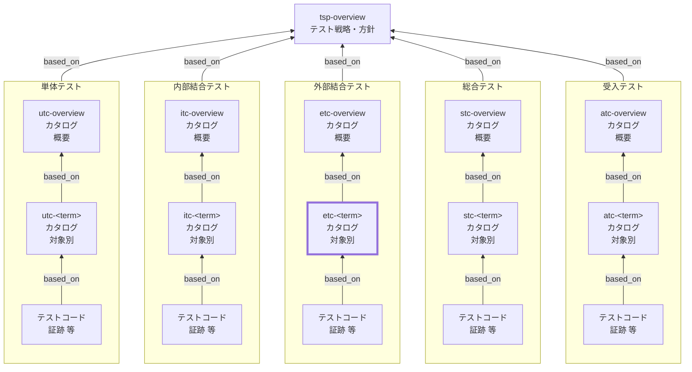

External Integration Test Catalog (ETC) Documentation Rules

本ドキュメントは、外部結合テストカタログ（ETC）の対象別 `etc-<term>` を統一形式で記述するためのルールです。
`etc-overview` を前提に、SSOTの本体として、対象ごとの **外部結合の責務・境界・外部依存/環境、観点 x 条件=ケース、トレース、証跡** を明文化します。

## 1. 全体方針

個別 ETC（`etc-<term>`）は、外部結合テストにおける SSOT の本体として、対象ごとの結合責務と境界を明確化し、
観点×条件＝ケース（末端表）を最小情報で整理して、テストコード／CI証跡へ確実に接続できる形で記述する。

- `etc-<term>` は **対象固有の情報のみ** を記述し、共通ルールは `etc-overview` を参照する（重複記述しない）
- 外部結合テストの目的は「**外部境界を跨いだ結合の振る舞い**を、実運用に近い前提で検証すること」である
- ケースは「表の1行＝1テスト」とし、手順と期待値は **判定可能**な粒度で簡潔に書く
- 直積（全組合せ）を原則避け、代表→境界→重大例外の順で増やす（必要時は理由・範囲を明記）
- 外部依存（sandbox/スタブ/モック）・テストデータ・秘密情報の扱いは、再現性と安全性を優先して固定する
- すべての観点・ケースは、根拠仕様（`based_on` / `トレース`）と、証跡（テストコード／CI／外部リクエストID／ログ相関キー等）に接続されていること

## 2. 位置づけ（他ドキュメントとの関係）

個別 ETC（`etc-<term>`）と他ドキュメントの関係を示します。



## 3. ファイル命名・ID規則

- `id` は `etc-<term>`（kebab-case。例: `etc-payment-gateway`）。
- ファイル名は `etc-010-外部結合テストカタログ-<term>.md` 等（例: `etc-010-外部結合テストカタログ-決済ゲートウェイ.md`）。
- `<term>` は用語集(GL)の論理名キー（英小文字kebab-case）を用いる（表示名は title / ファイル名で日本語を使用してよい）。

## 4. 推奨 Frontmatter 項目

### 4.1. 設定内容

Frontmatter は共通スキーマに従います（あわせてドキュメントのメタ情報の記述ルールも参照）。

- 参照スキーマ: [docs/shared/schemas/spec-frontmatter.schema.yaml](../../../shared/schemas/spec-frontmatter.schema.yaml)
- メタ情報ルール: [meta-document-metadata-rules.md](meta-document-metadata-rules.md)

| 項目       | 説明                                                                                   | 必須 |
| ---------- | -------------------------------------------------------------------------------------- | ---- |
| id         | ETC ID（個別: `etc-<term>`）                                                           | ○    |
| type       | `test` 固定                                                                            | ○    |
| title      | 外部結合テストカタログ: <対象名>                                                       | ○    |
| status     | `draft` / `ready` / `deprecated`                                                       | ○    |
| based_on   | 根拠仕様（最低限: `tsp-overview`, `etc-overview`。対象固有の根拠は本文トレースに集約） | ○    |
| part_of    | 集約ドキュメントへの所属（ID配列）                                                     | 任意 |
| supersedes | 置き換え関係                                                                           | 任意 |

### 4.2. 推奨ルール

- `based_on` には **本対象の外部結合テスト観点の根拠となる仕様** を列挙します。
- `based_on` は原則 `[tsp-overview, etc-overview]` を最低限とし、対象固有の根拠（`br-*` / `bac-*` / `spec-*` / `nfr-*` 等）は本文「トレース」に集約します。
- 機械処理上の都合で `based_on` にも列挙する場合は、本文トレースと矛盾しないこと。
- 記述内容が多くなる場合は、ドキュメントを分割し、`part_of` で集約ドキュメントに所属させます。
- `part_of` / `based_on` / `supersedes` は ID 配列（未指定は `[]` 可）。

## 5. 本文構成（標準テンプレ）

個別 ETC（`etc-<term>`）は以下の見出し構成を **順序固定** で配置します。

| 番号 | 見出し                             | 必須 |
| ---- | ---------------------------------- | ---- |
| 1    | 概要（`<term>`）                   | ○    |
| 2    | 責務                               | ○    |
| 3    | 対象外                             | ○    |
| 4    | 境界/依存/環境                     | ○    |
| 5    | トレース                           | ○    |
| 6    | テスト観点とケース                 | ○    |
| 7    | 実行運用メモ（データ/後始末/制約） | 任意 |

注意：次章の記述ガイドのMarkdown見出しはルール文章内の参照用であり、
生成する `etc-<term>` 本文の見出しは各章で指定された **番号付き** の形式
（例: `## 6.`, `### 6.1.` / `#### 6.1.1.` / `#### 6.1.2.`）に置き換えてください。

## 6. 記述ガイド

### 6.1. 概要（`<term>`）

生成する `etc-<term>` 本文の見出しは **## 1. 概要（&lt;term&gt;）**

本節では、対象（`<term>`）が何であり、どの外部境界を跨ぐ結合を本カタログで扱うかを簡潔に示します。

- `<term>` の説明（1〜3行）：外部境界・連携対象・主たるユースケースが分かるように書く
- 期待する利用者：レビューア／実装者／テスト実装者／運用者が前提を把握できる内容にする
- 対象の粒度：`etc-overview` の分割基準に従い、過分割／肥大化を避ける
- 関連I/F（任意）：主要エンドポイント、イベント、キュー、Webhook、SDK関数名などを列挙してよい
- 長い背景説明は書かない（根拠はトレースで示す）

### 6.2. 責務

生成する `etc-<term>` 本文の見出しは **## 2. 責務**

本節では、「この外部結合が何を保証すべきか（ETで確認する責務）」を列挙します。

- 箇条書きで 3〜7 個程度を目安に、**動詞で始まる**形で記述する
  - 例：外部I/F契約に従って送受信する／署名を検証する／再送時に冪等性を満たす／失敗時に再試行する／相関IDを出力する

- ETの責務は「結合の振る舞い」であり、内部単体のロジック検証はUT/ITへ寄せる（責務≠観点）
- 重大失敗モード（タイムアウト、レート制限、部分失敗、二重処理など）を含める
- 可能なら観測可能な成果（外部レスポンス、外部ID、内部状態、イベント、ログ相関）とセットで書く
- 責務に含まれないものは「対象外」へ移す

### 6.3. 対象外

生成する `etc-<term>` 本文の見出しは **## 3. 対象外**

本節では、「この対象カタログ（`etc-<term>`）ではやらないこと」を明示します。
`etc-overview` の「対象外・除外理由（共通）」と矛盾しないことが前提です。

- 対象外は「なぜ除外するか（理由）」とセットで書く
- 可能なら「代替するレベル」（IT/ST/AT/NFR 等）も併記する
- 対象固有の対象外（例：別の外部I/F、別termの責務）を明確にする
- 例外としてETで扱う場合は、条件・根拠・安全性・再現方法（sandbox/スタブ等）を明記する

推奨フォーマット（簡易）：

- 対象外：xxx（理由：yyy、代替：zzz）

### 6.4. 境界/依存/環境

生成する `etc-<term>` 本文の見出しは **## 4. 境界/依存/環境**

本節では、外部結合テストにおける「境界（どこまでが対象か）」「依存（外部要因）」「環境前提」を明確にします。

- 境界：対象の入口／出口（API、Webhook、Queue、Batch、SDK、外部コール）を明記する
- 外部依存はカテゴリごとに列挙し、「扱い（sandbox/実/スタブ/モック）」と「観測点」を決める
  - 外部API：sandbox/スタブ（成功/4xx/5xx/タイムアウト/レート制限）
  - 認証：テスト用アカウント、トークン更新/失効の扱い
  - ネットワーク：タイムアウト値、リトライ、DNS/TLS、プロキシ等
  - データ：テストデータのnamespace、クリーンアップ方針（削除/期限/再利用）
  - 時刻：時刻依存のあるI/F（署名期限、リクエスト有効期限）と固定/調整方法

- 秘密情報：ログ出力禁止、CI secret管理、マスキング方針を明記する
- 例外（実疎通が不可/不安定等）がある場合は、理由と影響（再現性・費用・安全性）を明記する

### 6.5. トレース

生成する `etc-<term>` 本文の見出しは **## 5. トレース**

本節では、`etc-<term>` の根拠となる上位成果物との対応関係（トレーサビリティ）を示します。
本カタログにおけるトレースの一次情報（SSOT）は **`## 5. トレース`** とし、観点・ケース表では **trace_key（`TR-xx`）参照** に統一します。

#### 6.5.1. 記述ルール（trace_key）

- 各トレース項目に **trace_key（`TR-xx`）** を付与する（例：`TR-01`…）
- `trace_key` は **本ドキュメント内で一意**で、原則変更しない（削除しても欠番は詰めない）
- 観点・ケース表の `トレース` 列には **仕様IDを直書きせず** `TR-xx` を列挙する
- 新しい根拠が必要になった場合は、**先に本節の表へ追加**し、付与された `trace_key` をケース表で参照する

#### 6.5.2. トレース表（標準フォーマット）

| trace_key | 仕様ID  | 要点    | 備考 |
| --------- | ------- | ------- | ---- |
| TR-01     | br-...  | （1行） | 任意 |
| TR-02     | bac-... | （1行） | 任意 |

- `要点` は「ケース作成の判断に使ったポイント」を **1行**で書く（冗長な仕様説明はしない）

### 6.6. テスト観点とケース

生成する `etc-<term>` 本文の見出しは **## 6. テスト観点とケース**

本節は `etc-<term>` の中心です。観点（見出し）→ ケース表（末端表）の順で構成します。

#### 6.6.1. 観点:<観点>

生成する `etc-<term>` 本文の見出しは **### 6.1. 観点:<観点>**

- 観点は `etc-overview` の「観点の立て方（共通）」に従って命名する
- 観点の粒度は「条件が複数ぶら下がる」程度にまとめる（細かすぎる観点の乱立を避ける）
- 観点名（見出し）は改善のため変更してよいが、`perspective_key` は原則変更しない

##### 6.6.1.1. 意図

生成する `etc-<term>` 本文の見出しは **#### 6.1.1. 意図**

- 観点ごとに「意図（この観点で保証すること）」を 1〜2 行で書く

##### 6.6.1.2. 条件・ケース表

生成する `etc-<term>` 本文の見出しは **#### 6.1.2. 条件・ケース表**

- ケース表の 1 行は「1テスト」を表す（条件×期待値が一意）
- 必須カラムは `etc-overview` の定義に従う
- `case_id` は以下を推奨し、変更しない
  - 形式：`<level>-<term>-<perspective_key>-<nnn>`
  - `level`：`et`
  - `perspective_key`：kebab-case のキー文字列（英小文字＋数字＋ハイフン）で、原則変更しない
  - `nnn`：3桁、10刻み（010,020,030…）を推奨

- 条件は「入力/状態/環境」で表現する（`入力:` `状態:` `環境:` を推奨）
- 手順は最小化し、クリック列挙を禁止する（API呼び出し／ジョブ起動／Webhook送信等の抽象手順で書く）
- 期待値は判定可能に書く（外部レスポンス、外部ID、内部状態、イベント、ログ相関など観測点を含める）
- 証跡はテストコードとCI実行結果へ接続できる形で書く（加えて外部リクエストIDやログ相関キー等を推奨）

推奨：観点ごとのケース数は「代表→境界→重大例外」の順で増やし、直積（全組合せ）を原則避ける

### 6.7. 実行運用メモ（任意）

生成する `etc-<term>` 本文の見出しは **## 7. 実行運用メモ（データ/後始末/制約）**

- テストデータの作り方／namespace／削除手順
- 失敗時のリトライ手順・外部側の後始末（取消、返金、無効化等）
- 実行制約（並列不可、回数制限、実行時間帯、レート制限）
- 外部サービスのメンテ時間や制限がある場合の注意

## 7. 禁止事項

| 禁止事項                                                                              | 理由                                                          |
| ------------------------------------------------------------------------------------- | ------------------------------------------------------------- |
| `etc-overview` の共通方針を `etc-<term>` 側で勝手に上書きする（境界/依存/対象外など） | ET全体の一貫性が崩れ、レビュー・保守が困難になるため          |
| 外部疎通を無条件に「実」必須にする（再現性・安全性・費用の判断なし）                  | CI不安定化・費用増・情報漏洩リスクで運用不能になるため        |
| 秘密情報（token/secret）を本文・証跡・ログに平文で残す                                | セキュリティ事故につながるため                                |
| ケース表にUIクリック手順を大量に列挙する                                              | ETの焦点が外部境界なのにE2E責務と混ざり、保守性が低下するため |
| 期待値を曖昧に書く（例：「エラーにならないこと」「正常に動くこと」）                  | 合否判定ができず証跡にならないため                            |
| `case_id` を変更する／再利用する                                                      | トレース・証跡リンクが破壊され、履歴追跡が不能になるため      |
| 直積（全組合せ）のケースを無条件に作る                                                | ケース爆発で運用不能になるため（必要時は理由・範囲を明記）    |
| トレースや証跡を持たないケースを恒久的に残す                                          | SSOTとして成立しないため（例外は暫定として明記）              |

## 8. サンプル（最小）

注：以下はルール文書内の例示です。生成する `etc-<term>` では `## 1...` から始まります。

```yaml
---
id: etc-payment-gateway
type: test
title: 外部結合テストカタログ: 決済ゲートウェイ（payment-gateway）
status: draft
part_of: []
based_on: [tsp-overview, etc-overview]
supersedes: []
---
```

### 8.1. 概要（payment-gateway）

決済ゲートウェイとの連携（与信、確定、取消、Webhook受信）を扱う。

### 8.2. 責務

- 外部I/F契約に従ってリクエストを送信し、レスポンスを解釈する
- Webhookを検証し、内部状態へ反映する
- タイムアウト/リトライ時に冪等性を満たす
- 失敗時に相関IDを含むログ/エラー情報を残す

### 8.3. 対象外

- 大規模負荷試験（理由：測定条件設計が別物、代替：NFR）
- 多ブラウザ網羅（理由：目的外、代替：ST/AT）

### 8.4. 境界/依存/環境

- 境界：`POST /payments/authorize` / `POST /payments/capture` / `POST /payments/cancel` / `POST /webhooks/payment`
- 外部ゲートウェイ：sandbox（成功/4xx/5xx/timeout/ratelimitを再現）
- 認証：テスト用APIキー（CI secret管理、ログ出力禁止）
- データ：`test-run-<runId>-*` プレフィックスで作成、終了時に取消/削除
- 時刻：署名期限を含むため、許容窓（±N分）を明記

### 8.5. トレース

| trace_key | 仕様ID      | 要点                | 備考 |
| --------- | ----------- | ------------------- | ---- |
| TR-01     | spec-pay-01 | 与信→確定の状態遷移 |      |
| TR-02     | nfr-pay-03  | リトライ上限と待機  |      |

### 8.6. テスト観点とケース

#### 8.6.1. 観点：再送と冪等性

##### 8.6.1.1. 意図

外部の一時失敗やタイムアウト時でも、二重課金を防ぎ最終的に正しい状態へ収束させる。

##### 8.6.1.2. 条件・ケース表

| case_id                            | 条件                                   | 手順（最小）                            | 期待値                     | 観測点（アサーション）              | 境界/依存        | トレース | 優先度 | 自動化    | 証跡                                                    |
| ---------------------------------- | -------------------------------------- | --------------------------------------- | -------------------------- | ----------------------------------- | ---------------- | -------- | ------ | --------- | ------------------------------------------------------- |
| et-payment-gateway-idempotency-010 | 環境: 外部timeout → 同一冪等キーで再送 | authorize → timeout再現 → 同一keyで再送 | 二重課金なしで最終的に成功 | 外部取引ID一意、内部状態=authorized | sandbox(timeout) | TR-02    | P0     | automated | tests/et/payment/idempotency.test.ts, CI#..., reqId=... |
| et-payment-gateway-idempotency-020 | 状態: Webhook重複受信                  | webhookを同一payloadで2回送信           | 状態が二重更新されない     | 更新回数=1、イベント重複なし        | sandbox/webhook  | TR-01    | P1     | automated | tests/et/payment/webhook.test.ts, CI#..., trace=...     |

## 9. 生成 AI への指示テンプレート

生成 AI に個別 ETC（`etc-<term>`）を作らせるときの指示テンプレートは `etc-instruction.md` を参照してください。
