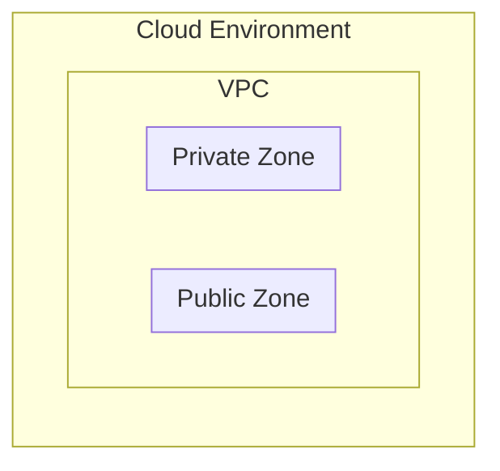
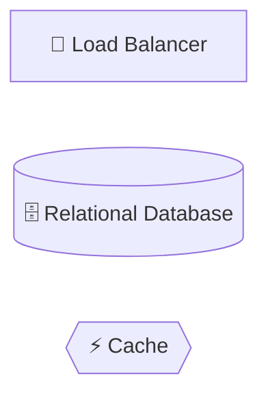
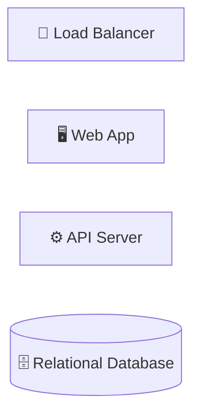
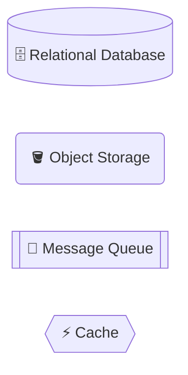
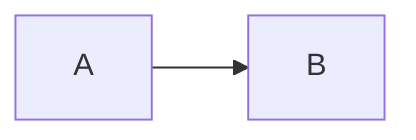
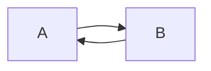
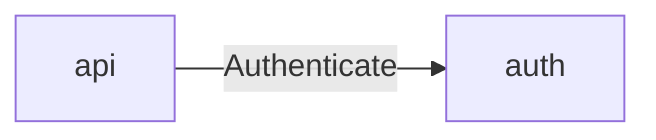
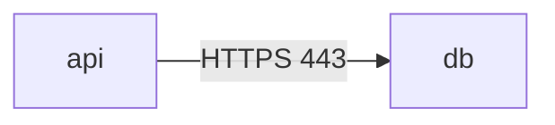
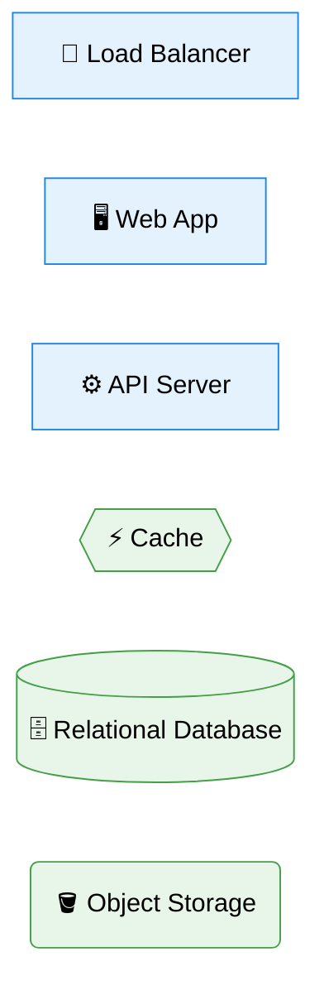
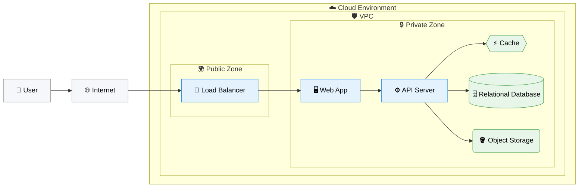

# Mermaidを用いたインフラ構成図 作成ルール

Infrastructure Flow Diagram (IFD) Documentation Rules using Mermaid

本ドキュメントは、アーキテクチャ検討・合意形成のために **インフラ構成図** を Mermaid の `flowchart` で記述するための標準ルールを定義します。

IFD は、インフラの **論理的な境界（環境 / ネットワーク / ゾーン）** と、主要コンポーネント間の **通信の流れ** を示すことを目的とします。

以下の内容は IFD の責務外とし、別ドキュメントで扱います。

- 物理構成（CIDR、IP、ポート、AZ）
- スケーリング、冗長化、台数
- セキュリティ設定（FW / SG / IAM）
- 技術選定・製品名の詳細

---

## 0. 設計思想（最重要）

- Mermaid は図ではなく **「構造化テキスト」** として扱う。
- 生成 AI は特に以下を **意味として解釈** する：
  - **ノード名**（役割）
  - **境界（subgraph）**（実行環境 / ネットワーク / ゾーン）
  - **矢印の方向**（入口 → 処理 → 永続化）
- 見栄えは **配置・命名・色の一貫性** によって担保する。

指針：**「装飾より構造」**

---

## 1. 図タイプ・方向の固定（必須）

IFD は以下の形式に固定します。

````markdown
```mermaid
flowchart LR
```
````

### 理由

- `flowchart LR` に固定することで **通信方向 = 左 → 右** が一貫し、生成AIが推論しやすくなる。

### 禁止

- `TB` / `RL` / `BT`
- 図中での方向混在

---

## 2. 境界（subgraph）ルール（最大3階層）

境界は **最大3階層** までとし、意味を固定します。

| レベル | 意味         | 例                      |
| ------ | ------------ | ----------------------- |
| Lv1    | 実行環境     | Cloud / On-Prem / SaaS  |
| Lv2    | ネットワーク | VPC / Project / Segment |
| Lv3    | 論理ゾーン   | Public / Private        |

### 例



### 禁止

- Lv4 以上の subgraph
- Subnet CIDR、AZ 名、IP、ポート番号などの物理情報
- 業務概念（例：Order Management）を境界名に使うこと

---

## 3. ノード命名規約（最重要）

### 3.1 表示名は「役割名」で統一する

- 表示名は **役割（Role）** を表す
- 製品名 / サービス名 / 略語は使用しない
- 英語・単数形を基本とする

#### OK

- `Load Balancer`
- `Web App`
- `API Server`
- `Relational Database`
- `Object Storage`
- `Cache`
- `Message Queue`

#### NG

- `ALB`
- `EC2`
- `Cloud Run`
- `RDS`
- `Redis` / `Kafka`（※技術選定は別ドキュメント）

### 3.2 絵文字アイコン（任意）

絵文字は **人間の視認性向上** には有効ですが、表示差や幅崩れが起きる環境もあるため、次のルールで運用します。

- 絵文字は **任意**（なくても成立する）
- 絵文字は **表示名（Label）のみに付ける**（IDには付けない）
- **1ノード1個まで**、表示名の **先頭に付ける**
- 絵文字だけに頼らず、必ず役割名テキストも併記する

OK:



NG:

```text
flowchart LR
🧭lb["Load Balancer"]
```

---

## 4. ノードIDと表示名を分離する（必須）

Mermaid のノードは **ID（参照用）と表示名（意味）を分離** します。



### 狙い

- ノード参照が安定する
- 生成AIがノード同士の関係を誤解しにくくなる

---

## 5. 記法（形＝意味を固定）

ノード形状を **意味として固定** します（役割名だけでなく形でも読み取れるようにする）。

| 種類           | 意味（役割）                  | 記法             | 表示名の例               |
| -------------- | ----------------------------- | ---------------- | ------------------------ |
| 🗄️ Database    | 永続DB                        | `db[("...")]`    | `🗄️ Relational Database` |
| 🪣 Storage     | オブジェクト/ファイル保管     | `storage("...")` | `🪣 Object Storage`      |
| 📨 Queue/Topic | 非同期連携（キュー/トピック） | `queue[["..."]]` | `📨 Message Queue`       |
| ⚡ Cache       | 参照高速化（任意）            | `cache{{"..."}}` | `⚡ Cache`               |

### 例



補足:

- Cache と Storage を分けるかは、図で合意したい論点（境界/経路/責務）がある場合のみ分ければ十分です。
- Cache を描かない場合も、このルールに反しません。

---

## 6. 通信矢印のルール（意味重視）

### 6.1 原則は片方向



### 双方向通信



### 6.2 矢印ラベルのルール

- ラベルは **通信の意味** を表す場合のみ使用する
- プロトコル名・ポート番号は記載しない

#### OK



#### NG



---

## 7. 見栄えを整える最小限スタイル（任意）

### 原則

- 色は **境界単位** または **役割の大分類** で付ける
- ノード単位でバラバラな色付けはしない
- `classDef` のみ使用可、`style` は原則使用しない

### 例



---

## 8. 完成例（推奨テンプレート）



### この図で合意できること

- ネットワーク境界（Public / Private）
- 主要コンポーネントの役割分担
- 主要な通信フロー
- 永続化先の種別（🗄️/🪣）と非同期の有無（📨）

---

## 9. 禁止事項

- 物理構成の詳細（CIDR、IP、ポート、AZ、台数、Auto Scaling 等）
- 技術選定の詳細（特定クラウドサービス名、製品名）
- 意味のないラベル（HTTPS / TCP / 443 等）
- 方向の混在
- 矢印の過剰な交差（読みづらくなった場合は境界整理または図を分割する）

---

## 10. 生成AI向け指示テンプレート

生成AIに IFD を作成させる場合は、以下の指示を使用します。

> - Mermaid `flowchart` で IFD を作成してください。先頭は必ず `flowchart LR`。
> - subgraph は最大3階層（Lv1: 実行環境 / Lv2: ネットワーク / Lv3: 論理ゾーン）。
> - まず境界（subgraph）を定義し、その中にノードを配置してください。
> - ノードは必ず `id["Role Name"]` 形式で、表示名は役割名のみとしてください。
> - （任意）絵文字は表示名の先頭に **1個まで** 付けてよいが、IDには付けないでください。絵文字だけに頼らず、必ず役割名テキストも併記してください。
> - （任意）絵文字を付ける場合、次の推奨セットから選んで統一してください（例：`lb["🧭 Load Balancer"]`）：
>   - 境界（subgraph）: `☁️ Cloud Environment` / `🛡️ VPC` / `🌍 Public Zone` / `🔒 Private Zone`
>   - 外部: `👤 User` / `🌐 Internet`
>   - Compute: `🧭 Load Balancer` / `🖥️ Web App` / `⚙️ API Server`
>   - Data: `⚡ Cache` / `🗄️ Relational Database` / `🪣 Object Storage` / `📨 Message Queue`
> - （任意）色を付ける場合は、**境界単位** または **役割の大分類（boundary / compute / data）** 単位で付けてください。
> - 色指定は `classDef` のみ使用し、`style` は使用しないでください。ノード単位でバラバラな色付けはしないでください。
> - （任意）色付けする場合、以下の `classDef` を図の先頭付近にそのまま記述してください：
>   - `classDef boundary fill:#f5f7fa,stroke:#999,color:#000`
>   - `classDef compute fill:#e3f2fd,stroke:#1e88e5,color:#000`
>   - `classDef data fill:#e8f5e9,stroke:#43a047,color:#000`
> - 製品名・略語（ALB / EC2 / RDS / Cloud Run / Redis / Kafka 等）は使用しないでください。
> - 🗄️ Database は `db[("...")]`、🪣 Storage は `storage("...")`、📨 Queue/Topic は `queue[["..."]]` を使用してください。
> - ⚡ Cache は必要な場合のみノードとして追加してください。
> - 矢印は原則片方向、双方向は2本で表現してください。
> - HTTPS / 443 / CIDR などの物理情報は記載しないでください。
> - 出力は ` ```mermaid ... ``` ` のみとしてください。

このルールとテンプレートをコピーして、生成 AI のプロンプトに貼り付けて利用してください。
