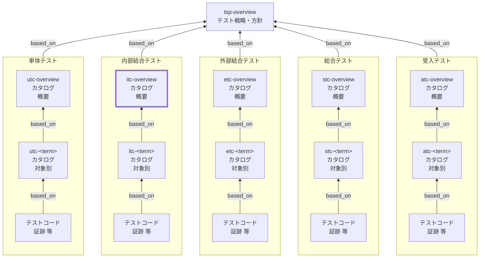

Internal Integration Test Catalog (ITC) Overview Documentation Rules

本ドキュメントは、内部結合テストカタログ（ITC）の全体概要 `itc-overview` を統一形式で記述するためのルールです。
TSPに基づき、内部結合テストに共通するルールや方針を定義します。

個別内部結合テストカタログ（`itc-<term>`）の記述ルールは `itc-rules.md` を参照してください。

## 1. 全体方針

`itc-overview` は、内部結合テストカタログ（ITC）を **運用可能な最小情報**で統一し、
対象別カタログ（`itc-<term>`）の品質と一貫性を担保するための **共通ルール（SSOT）** とする。

- `itc-overview` は **「考え方・共通方針・共通定義」** を記述する（個別ケースは持たない）
- 個別の観点・条件・ケースは **`itc-<term>` に集約**し、詳細は **テストコード／CI証跡** に寄せる
- 記述は **レビュー可能**であることを優先し、長文化を避ける（方針は箇条書き中心）
- 「例外」や「対象外」を明示し、内部結合テストの責任境界（何をやらないか）を固定する
- `tsp-overview` の方針を根拠として、内部結合テストに共通する **分割基準・観点/条件の立て方・依存境界・合格基準・証跡** を定義する
- IT（内部結合）は **「複数コンポーネントの結合」** を扱い、UTでMockしていた依存の一部を **実装/実インフラに近づけて検証**する（ただし外部要因で不安定になるものは制御する）

## 2. 位置づけ（他ドキュメントとの関係）

`itc-overview` と他ドキュメントの関係を示します。



## 3. ファイル命名・ID規則

- 本ルールの対象ドキュメントの `id` は `itc-overview` 固定。対象別は `itc-<term>`（詳細は `itc-rules.md`）。
- ファイル名は `itc-010-内部結合テストカタログ-概要.md` 等、プロジェクト内で一意になるように命名します。
- `<term>` は用語集の論理名キー（英小文字kebab-case）を用いる（表示名は title に日本語で記載してよい）。

## 4. 推奨 Frontmatter 項目

### 4.1. 設定内容

Frontmatter は共通スキーマに従います（参照: [docs/shared/schemas/spec-frontmatter.schema.yaml](../../../shared/schemas/spec-frontmatter.schema.yaml) / [meta-document-metadata-rules.md](meta-document-metadata-rules.md)）。

| 項目       | 説明                                               | 必須 |
| ---------- | -------------------------------------------------- | ---- |
| id         | `itc-overview`（固定）                             | ○    |
| type       | `test` 固定                                        | ○    |
| title      | 内部結合テストカタログ: 概要（`<システム名>`）     | ○    |
| status     | `draft` / `ready` / `deprecated`                   | ○    |
| based_on   | 根拠となる仕様ID（ID配列。未指定時は `[]` を許容） | 任意 |
| supersedes | 置き換え関係（ID配列。未指定時は `[]` を許容）     | 任意 |

### 4.2. 推奨ルール

- `based_on` には最低限 `tsp-overview` を含めます。
- BAC/NFR/BR 等は、`itc-overview` の方針判断（境界・分配・共通合格基準・環境方針）に **直接利用したものだけ** を `based_on` に列挙します。
- `based_on` / `supersedes` は ID 配列（未指定は `[]` 可）。

## 5. 本文構成（標準テンプレ）

`itc-overview` は以下の見出し構成を **順序固定**で配置します。

| 番号 | 見出し                                          | 必須 |
| ---- | ----------------------------------------------- | ---- |
| 1    | 本ドキュメントの目的と適用対象                  | ○    |
| 2    | テスト対象の括り方と分割基準                    | ○    |
| 3    | 対象外・除外理由（共通）                        | ○    |
| 4    | 観点の立て方（共通）                            | ○    |
| 5    | 条件の立て方（共通）                            | ○    |
| 6    | 観点/条件の採用基準と対象別への分配方針（共通） | ○    |
| 7    | 内部結合テスト共通の境界/依存の扱い             | ○    |
| 8    | テスト環境・データの共通方針                    | ○    |
| 9    | ケース表の共通カラム                            | ○    |
| 10   | メモ / 将来課題                                 | 任意 |

注意：次章の記述ガイドのMarkdown見出しはルール文章内の参照用であり、
生成する `itc-overview` 本文の見出しは各章で指定された **番号付き** の形式
（例: `## 6.`, `### 6.1.` / `#### 6.1.1.` / `#### 6.1.2.`）に置き換えてください。

## 6. 記述ガイド

### 6.1. 本ドキュメントの目的と適用対象

生成する `itc-overview` 本文の見出しは **## 1. 本ドキュメントの目的と適用対象**

本節では、`itc-overview` が **何のために存在し、何に適用されるか** を明確にします。

- 目的：`itc-<term>` を同一基準で作成し、品質・粒度・責任範囲を揃える
- 適用対象：内部結合テスト（IT）に関するカタログ群（`itc-overview` / `itc-<term>`）
- 非適用：UT/ET/ST/AT のルールはそれぞれの `*c-overview` で扱う
- 成果物の位置づけ：
  - `itc-overview`：共通方針（SSOT）
  - `itc-<term>`：対象別の観点・条件・ケース表（SSOT）
  - テストコード／CI：実装と実行証跡（SSOT）

- SSOTの一次情報は `itc-overview` / `itc-<term>` とし、テストコード／CIは **実装と実行結果の証跡（Evidence）** として扱う。
- 本書が扱う粒度：**判断基準・共通ルールまで**（個別ケースの列挙は禁止）
- ITで保証する範囲（例）：
  - コンポーネント間の結合（I/F、変換、永続化、トランザクション境界）
  - UTでMockしていた依存の「実装妥当性」の一部（例：Repository実装、SQL、マイグレーション、シリアライズ）

### 6.2. テスト対象の括り方と分割基準

生成する `itc-overview` 本文の見出しは **## 2. テスト対象の括り方と分割基準**

本節では、`itc-<term>` の `<term>` をどう切るか（対象単位の設計）を定義します。

- `<term>` は「結合のまとまり」（例：ユースケース×主要I/F、サブシステム境界、アプリ層＋DB層の縦スライス）とする
- 分割基準（推奨順）：
  1. **結合境界**：どのコンポーネント（層/モジュール/サービス）間を結合するかが説明できる
  2. **データ境界**：同じDBスキーマ/同じ集約/同じトランザクション境界に収まる
  3. **I/F境界**：API契約、メッセージ形式、永続化I/Fが同質
  4. **変更影響**：同時に変更されやすい結合が同じ単位に収まる
  5. **担当境界**：所有者（チーム/モジュール）が概ね一致する

- 過分割の禁止：`itc-<term>` が「1〜2ケースしかない」単位は原則統合する
- 肥大化の抑制（分割の目安）：
  - 観点が過剰（例：15以上）／表の行数が過剰（例：50以上）になったら分割候補
  - 依存境界や環境要件（DB種別、メッセージ基盤など）が混在する場合は分割候補

### 6.3. 対象外・除外理由（共通）

生成する `itc-overview` 本文の見出しは **## 3. 対象外・除外理由（共通）**

本節では、内部結合テスト（IT）で **やらないこと** と、その **理由**、および **例外条件** を明確にします。

#### 6.3.1. 記述ルール

- 形式は **「対象外」「除外理由」「代替レベル/代替手段」「例外」** の4点セットを基本とする
- 「対象外」は **テストレベルの責務分界**（IT/ET/E2E/NFR）に紐づけて書く
- 「例外」を認める場合は **判断基準**（いつ/どの条件で）と **環境制御**（再現性担保）を明記する
- 個別対象（`itc-<term>`）固有の対象外は、`itc-<term>` 側に書く。本節は **IT共通** に限定する

#### 6.3.2. 推奨フォーマット（表）

| 対象外（やらないこと） | 除外理由 | 代替レベル/代替手段 | 例外（ITで扱う条件） |
| ---------------------- | -------- | ------------------- | -------------------- |

#### 6.3.3. 典型例（記載候補）

- 外部サービスとの実疎通（外部IdP、外部決済、外部SaaS 等）
- ブラウザ差分・端末差分のUI互換（表示崩れ、入力方式差）
- 大規模負荷・耐久・SLO検証（p95、スループット、長時間稼働）
- 本番相当のネットワーク障害・リージョン障害（DR含む）
- 人手オペレーションを伴う総合シナリオ（業務横断の受入）

### 6.4. 観点の立て方（共通）

生成する `itc-overview` 本文の見出しは **## 4. 観点の立て方（共通）**

観点（Perspective）は「結合したときに何を保証するか」の切り口であり、対象別カタログの章立て（見出し）として用います。

- 観点の型（最低限この順で検討）：
  - 結合インタフェースの契約（要求/応答、例外、エラーコード、イベント発行）
  - データ永続化の整合性（保存/取得、制約、マイグレーション、参照整合）
  - トランザクション境界（コミット/ロールバック、部分失敗、冪等）
  - 依存障害時の挙動（DB障害、キュー詰まり、タイムアウト等：※外部は基本除外）
  - 状態遷移の整合性（複数コンポーネントに跨る状態変化）
  - セキュリティ境界（認可伝播、テナント境界、監査ログ等：ITで担保する範囲）

- 命名規則：**「名詞＋品質/振る舞い」**（例：`永続化の整合性` / `トランザクション境界` / `I/F契約の互換性`）
- 粒度規則：
  - 観点は「条件を複数持てる」程度にまとめる
  - 観点が抽象的で条件が作れない場合は観点を再定義する

- 重複禁止：同一対象内で同義の観点名を乱立させない

### 6.5. 条件の立て方（共通）

生成する `itc-overview` 本文の見出しは **## 5. 条件の立て方（共通）**

条件（Condition）は、観点を確認するための前提状態・入力状態・環境条件のバリエーションです。
条件は「入力」「状態」「環境」に分解して作成します（ITでは **環境/データ条件** の比重が上がります）。

- 入力（Input）：代表値／境界値／異常値（形式不正、桁あふれ 等）
- 状態（State）：事前データ、権限、ステータス、関連レコード有無、ロック/競合状態
- 環境（Env）：DB設定、トランザクション分離レベル、時刻、リトライ設定、メッセージ基盤設定 等

組合せルール（増やし過ぎ防止）：

- まず代表ケース（正常系）を作る
- 次に境界（上限/下限/空/ゼロ、制約違反）を追加する
- 最後に重大例外（整合性破壊、二重計上、データ欠損につながるもの）を追加する
- 原則として直積は作らない。必要な場合は理由と管理方法（データセット参照等）を明記する

### 6.6. 観点/条件の採用基準と対象別への分配方針（共通）

生成する `itc-overview` 本文の見出しは **## 6. 観点/条件の採用基準と対象別への分配方針（共通）**

本節では、観点/条件を「採用する判断」と「`itc-<term>` へ割り当てる判断」を共通ルールとして定義します。

#### 6.6.1. 採用基準（共通）

- 観点は「1観点=1合否命題」で採用する（複数命題の混在を禁止）
- 条件は「1条件=1差分（入力/状態/環境）」で採用する
- 追加時は、次のいずれかに該当する根拠を明示する
  - 失敗時の業務影響が大きい（誤更新/欠損/二重計上など）
  - 境界/例外/状態遷移の欠落が不具合につながりやすい
  - 上位仕様（BAC/NFR/BR等）に明示的な要求がある
- 「重要そうだから」など根拠不明の採用はしない

#### 6.6.2. 対象別への分配方針（共通）

- 観点/条件は、責務を持つ `itc-<term>` に **主担当1つ** を割り当てる（重複割当は例外扱い）
- 複数 `itc-<term>` に跨る場合は、主担当 + 従担当（参照）で表現し、重複記載を避ける
- 分配判断は「結合境界」「データ境界」「変更影響」の順で決める
- 分配結果は `itc-<term>` 側のケース表とトレース列で追跡可能にする

推奨フォーマット（例）:

| 観点/条件 | 採用理由 | 主担当 `itc-<term>` | 従担当（任意） | 備考 |
| --------- | -------- | ------------------- | -------------- | ---- |

### 6.7. 内部結合テスト共通の境界/依存の扱い

生成する `itc-overview` 本文の見出しは **## 7. 内部結合テスト共通の境界/依存の扱い**

内部結合テストでは、UTでMockしていた境界の一部を **実装に近づけて** 検証します。
ただし、再現性・安定性が落ちる外部要因は制御し、結果が揺れないことを優先します。

- DB：
  - 原則：**実DB（または実DB相当）** を用いる（コンテナDB等で再現性を担保）
  - 例外：DB以外の結合に集中したい場合のみ、Fake/Stubを許可（理由を明記）

- マイグレーション/スキーマ：
  - 原則：マイグレーション適用を前提に実行し、主要制約（NOT NULL/UNIQUE/FK等）を観測可能にする

- 外部API/外部サービス：
  - 原則：実疎通しない（Stub/Mockサーバで制御）。外部はETで担保する

- 時刻：
  - 原則：固定クロック、またはテスト実行時刻を基準に再現可能にする（TZ含む）

- 非同期/メッセージング：
  - 原則：制御可能な実装（インメモリブローカ、テスト用ブローカ、同期化）で決定性を担保

- 例外方針（Mock/Stub/Fakeの使い分け）：
  - Fake：状態を持つ簡易実装（インメモリキュー等）
  - Stub：応答固定で分岐を作る（外部I/F）
  - Mock：相互作用（回数/引数/順序）を検証する場合に使用

### 6.8. テスト環境・データの共通方針

生成する `itc-overview` 本文の見出しは **## 8. テスト環境・データの共通方針**

ITは環境差で結果が揺れやすいため、環境・データの扱いを共通化します。

- 環境の原則：
  - CIで再現可能（コンテナ、固定バージョン、固定設定）
  - 依存サービス（DB/Queue/Cache等）は **起動方法と設定を標準化**（compose/helm等）

- データの原則：
  - テストは独立（データ初期化、トランザクションロールバック、名前空間分離）
  - データセットは最小化し、必要なら参照方式（fixture seed）を採用する

- 並列実行の原則：
  - スキーマ/DBを分離、またはテストごとに namespace を分離し、相互干渉を避ける

- ログ/観測：
  - 失敗時の診断に必要なログ（SQL/リクエストID等）を取得可能にする（秘匿情報はマスク）

### 6.9. ケース表の共通カラム

生成する `itc-overview` 本文の見出しは **## 9. ケース表の共通カラム**

`itc-<term>` の末端（条件・ケース表）は、検索性・比較性・自動化移行の容易さを確保するため、
全termで同一カラム順を採用します。

必須カラム：

- `case_id`（ケースID）：対象別に一意なIDで変更しない
  - `case_id` は `<level>-<term>-<perspective_key>-<nnn>`（nnnは3桁推奨）を推奨
    - 例: `it-order-persistence-integrity-010`
    - `perspective_key` は kebab-case のキー文字列（英小文字＋数字＋ハイフン）で、原則変更しない
    - `nnn` を 10刻みで付番（010, 020, 030…）

- `条件`：入力/状態/環境の要点（`入力:` `状態:` `環境:` の形を推奨）

- `手順（最小）`：抽象化した最小手順（クリック列挙禁止）

- `期待値`：判定可能な合格条件（観測点を含める）

推奨カラム（運用必須）：

- `観測点（アサーション）`
- `境界/依存`（DB種別、ブローカ、Stub等の扱い）
- `トレース`
- `優先度`：P0/P1/P2
- `自動化`：manual/automated/mixed
- `証跡`：テストコード/CI/レポート等の参照先

注意：

- 表の1行＝1テスト（条件×期待値が一意）
- 手順・期待値を冗長に書かず、詳細はテストコードへ寄せる

### 6.10. メモ / 将来課題

生成する `itc-overview` 本文の見出しは **## 10. メモ / 将来課題**

- 将来検討（例）：
  - テストデータ管理（fixture生成、匿名化、seed戦略）
  - 環境起動時間の短縮（コンテナ最適化、キャッシュ）
  - flaky対策（リトライ方針、タイムアウト基準）
  - 証跡リンク形式の統一（CI URL、ログ保存場所）
  - カタログlint（case_id重複、必須列欠落など）

## 7. 禁止事項

| 項目                                                               | 理由                                                                                   |
| ------------------------------------------------------------------ | -------------------------------------------------------------------------------------- |
| `itc-overview` に個別ケース（条件・手順・期待値）を大量に列挙する  | `itc-overview` は共通方針のSSOTであり、個別は `itc-<term>` に集約するため              |
| 環境前提（DB/Queue等）を対象ごとに無根拠に変更する                 | IT全体で再現性が崩れ、CIが不安定・レビュー困難になるため（例外は根拠とともに明記）     |
| 外部サービス疎通をITの必須範囲に含める                             | 外部要因で結果が揺れ、再現性が低く、責務はETへ分離すべきため                           |
| 手順にUI操作のクリック列挙を書く（末端表でも過剰な操作手順を書く） | 保守性が低く、変更に弱く、テストの意図が見えなくなるため                               |
| 期待値を「成功すること」など曖昧に書く                             | 判定不能で合否が揺れ、証跡として機能しないため                                         |
| `case_id` を後から変更する（参照があるのに変更する）               | トレース・証跡リンクが壊れ、履歴追跡が不能になるため                                   |
| `itc-overview` の対象外方針と矛盾するIT範囲を無説明で拡張する      | レベル間の責務分界が崩れるため（ITで必要なら、対象/根拠/再現性対策を明記して定義する） |

## 8. サンプル（最小）

注：以下はルール文書内の例示です。生成する `itc-overview` では `## 1...` から始まります。

```yaml
---
id: itc-overview
type: test
title: 内部結合テストカタログ: 概要
status: draft
based_on: [tsp-overview]
supersedes: []
---
```

### 8.1. 本ドキュメントの目的と適用対象

本ドキュメントは、内部結合テストカタログ（ITC）の全体概要 `itc-overview` を統一形式で記述するためのルールである。
`itc-overview` は内部結合テストに共通する「対象単位の切り方」「観点/条件の立て方」「依存境界」「環境・データ方針」「合格基準」「証跡方針」を定義し、
対象別カタログ `itc-<term>` の作成と運用の基盤とする。

### 8.2. テスト対象の括り方と分割基準

`itc-<term>` の `<term>` は結合のまとまり（例：ユースケース×主要I/F、アプリ層＋DB層の縦スライス）とする。
分割は結合境界・データ境界・I/F境界・変更影響・担当境界を基準とし、過分割と肥大化の双方を避ける。

### 8.3. 対象外・除外理由（共通）

内部結合テスト（IT）では、内部結合の妥当性を再現性高く検証するため、以下は原則として対象外とする。

| 対象外（やらないこと）                     | 除外理由                             | 代替レベル/代替手段  | 例外（ITで扱う条件）               |
| ------------------------------------------ | ------------------------------------ | -------------------- | ---------------------------------- |
| 外部サービスとの実疎通（実通信・実認証）   | 外部要因で結果が揺れ、再現性が低い   | ET（etcカタログ）    | 外部を完全にスタブ化できる場合のみ |
| ブラウザ/端末差分のUI互換（表示崩れ等）    | 実行環境差が本質でITでは担保しにくい | E2E（e2eカタログ）   | なし                               |
| 性能・負荷・耐久（p95、スループット等）    | 測定設計が別物で、条件統制が必要     | NFR（nfrカタログ）   | なし                               |
| 本番相当の障害試験（リージョン障害、DR等） | 環境再現コストが高く、目的が別       | ST/運用リハ、Chaos等 | なし                               |

例外を適用する場合は、`itc-<term>` 側に「例外の根拠」と「再現性担保策（スタブ、固定設定等）」を明記する。

### 8.4. 観点の立て方（共通）

観点は結合で崩れやすいポイント（I/F契約、永続化整合、トランザクション境界、依存障害時の挙動等）を基軸に立てる。
観点名は「名詞＋品質/振る舞い」で統一し、条件を複数持てる程度の粒度にまとめる。

### 8.5. 条件の立て方（共通）

条件は入力・状態・環境に分解し、代表→境界→重大例外の順で追加する。
直積は原則作らず、必要時のみ理由と管理方法（データセット参照等）を明記する。

### 8.6. 観点/条件の採用基準と対象別への分配方針（共通）

観点/条件は、業務影響・境界/例外/状態遷移の重要性・上位仕様根拠を基準に採用する。
分配は結合境界・データ境界・変更影響を基準に主担当 `itc-<term>` を1つ定め、重複は例外として扱う。
分配結果は `itc-<term>` のケース表とトレース列で追跡可能にする。

### 8.7. 内部結合テスト共通の境界/依存の扱い

内部結合テストでは、UTでMockしていた境界の一部を実装に近づけて検証する。
DBは原則として実DB相当（コンテナDB等）を用い、外部サービスはStub/Mockで制御する。
非同期やメッセージングは決定性を担保できる構成で実行する。

### 8.8. テスト環境・データの共通方針

CIで再現可能な環境（固定バージョン、固定設定）で実行する。
テストデータは独立・最小化し、並列実行時の干渉を避けるため名前空間分離や初期化を行う。

### 8.9. ケース表の共通カラム

対象別カタログ `itc-<term>` の末端表は全termで共通のカラム順を採用する。
必須：case_id / 条件 / 手順（最小） / 期待値
推奨：観測点（アサーション）/ 境界・依存 / トレース / 優先度 / 自動化 / 証跡

### 8.10. メモ / 将来課題

将来検討事項（例）：fixture戦略、環境起動時間短縮、flaky対策、証跡リンク形式統一、カタログlint 等を記録する。
運用必須になった時点で本文へ昇格させる。

## 9. 生成 AI への指示テンプレート

生成 AI に `itc-overview` を作らせるときの指示テンプレートは [itc-overview-instruction.md](../instructions/itc-overview-instruction.md) を参照してください。
