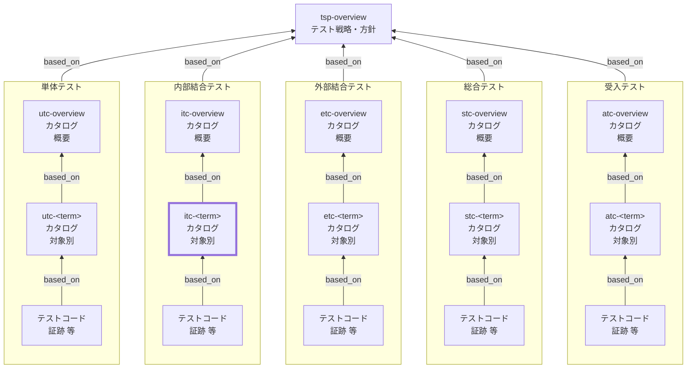

Internal Integration Test Catalog (ITC) Documentation Rules

本ドキュメントは、内部結合テストカタログ（ITC）の対象別 `itc-<term>` を統一形式で記述するためのルールです。
`itc-overview` を前提に、SSOTの本体として、対象ごとの **内部結合テストの責務・境界・依存、観点 x 条件=ケース、トレース、証跡** を明文化します。

## 1. 全体方針

個別 ITC（`itc-<term>`）は、内部結合テストにおける SSOT の本体として、対象ごとの責務と結合境界を明確化し、
観点×条件＝ケース（末端表）を最小情報で整理して、テストコード／CI証跡へ確実に接続できる形で記述する。

- `itc-<term>` は **対象固有の情報のみ**を記述し、共通ルールは `itc-overview` を参照する（重複記述しない）
- 内部結合テストの目的は「**複数コンポーネントの結合としての振る舞い**を決定的に検証すること」であり、外部要因（外部サービス実疎通／実ユーザUI）は原則排除する（例外は根拠を明記）
- ITでは、UTでMockしていた境界の一部（例：Repository実装、SQL/制約、トランザクション）を **実装に近い形で検証**する（ただし再現性が崩れる要因は制御する）
- ケースは「表の1行＝1テスト」とし、手順と期待値は **判定可能**な粒度で簡潔に書く
- 詳細な操作列挙やデータ大量列挙は避け、必要な詳細はテストコード側へ寄せる（証跡で参照可能にする）
- すべての観点・ケースは、根拠仕様（`based_on` / `トレース`）と、証跡（テストコード／CI）に接続されていること

## 2. 位置づけ（他ドキュメントとの関係）

個別 ITC（`itc-<term>`）と他ドキュメントの関係を示します。



## 3. ファイル命名・ID規則

- `id` は `itc-<term>`（kebab-case。例: `itc-order`）。
- ファイル名は `itc-010-内部結合テストカタログ-<term>.md` 等（例: `itc-010-内部結合テストカタログ-受注.md`）。
- `<term>` は 用語集(GL) の 論理名キー（英小文字kebab-case）を用いる（表示名は title / ファイル名で日本語を使用してよい）。

## 4. 推奨 Frontmatter 項目

### 4.1. 設定内容

Frontmatter は共通スキーマに従います（あわせてドキュメントのメタ情報の記述ルールも参照）。

- 参照スキーマ: [docs/shared/schemas/spec-frontmatter.schema.yaml](../../../shared/schemas/spec-frontmatter.schema.yaml)
- メタ情報ルール: [meta-document-metadata-rules.md](meta-document-metadata-rules.md)

| 項目       | 説明                                                                                   | 必須 |
| ---------- | -------------------------------------------------------------------------------------- | ---- |
| id         | ITC ID（個別: `itc-<term>`）                                                           | ○    |
| type       | `test` 固定                                                                            | ○    |
| title      | 内部結合テストカタログ: <対象名>                                                       | ○    |
| status     | `draft` / `ready` / `deprecated`                                                       | ○    |
| based_on   | 根拠仕様（最低限: `tsp-overview`, `itc-overview`。対象固有の根拠は本文トレースに集約） | ○    |
| part_of    | 集約ドキュメントへの所属（ID配列）                                                     | 任意 |
| supersedes | 置き換え関係                                                                           | 任意 |

### 4.2. 推奨ルール

- `based_on` には **本対象の内部結合テスト観点の根拠となる仕様** を列挙します。
- `based_on` は原則 `[tsp-overview, itc-overview]` を最低限とし、
  対象固有の根拠（`br-*` / `bac-*` / `spec-*` / `nfr-*` 等）は本文「トレース」に集約する。
  機械処理上の都合で `based_on` にも列挙する場合は、本文トレースと矛盾しないこと。
- 記述内容が多くなる場合は、ドキュメントを分割し、`part_of` で集約ドキュメントに所属させます。
- `part_of` / `based_on` / `supersedes` は ID 配列（未指定は `[]` 可）。

## 5. 本文構成（標準テンプレ）

個別 ITC（`itc-<term>`）は以下の見出し構成を **順序固定** で配置します。

| 番号 | 見出し                 | 必須 |
| ---- | ---------------------- | ---- |
| 1    | 概要（`<term>`）       | ○    |
| 2    | 責務（結合として保証） | ○    |
| 3    | 対象外                 | ○    |
| 4    | 結合境界/依存/環境前提 | ○    |
| 5    | トレース               | ○    |
| 6    | テスト観点とケース     | ○    |

注意：次章の記述ガイドのMarkdown見出しはルール文章内の参照用であり、
生成する `utc-<term>` 本文の見出しは各章で指定された **番号付き** の形式
（例: `## 6.`, `### 6.1.` / `#### 6.1.1.` / `#### 6.1.2.`）に置き換えてください。

## 6. 記述ガイド

### 6.1. 概要（`<term>`）

生成する `itc-<term>` 本文の見出しは **## 1. 概要（&lt;term&gt;）**

本節では、対象（`<term>`）が何であり、どの結合単位を本カタログで扱うかを簡潔に示します。

- `<term>` の説明（1〜3行）：結合のまとまり（ユースケース×主要I/F、サブシステム境界 等）を人が理解できる形で記述する
- 期待する利用者：レビューア／実装者／テスト実装者が、対象の前提（構成・依存）を把握できる内容にする
- 対象の粒度：`itc-overview` の分割基準に従い、過分割／肥大化を避ける
- 結合対象（最低限）：結合する主要コンポーネント（例：App層、DB層、Queue、Cache 等）を列挙してよい
- 詳細な仕様の説明や長い背景は書かない（根拠はトレースで示す）

### 6.2. 責務（結合として保証）

生成する `itc-<term>` 本文の見出しは **## 2. 責務（結合として保証）**

本節では、「この結合対象が何を保証すべきか（内部結合テストで確認する責務）」を列挙します。

- 箇条書きで 3〜7 個程度を目安に、**動詞で始まる**形で記述する
  - 例：API入力を永続化モデルへ正しく変換する／制約違反時に規定エラーへ変換する／同一要求の冪等性を保証する

- 責務は「テスト観点」の上位概念であり、観点は責務を分解した切り口である（責務≠観点）
- 例外・異常系の責務も含める（制約違反、重複、整合性破壊、部分失敗、競合 等）
- 可能なら観測可能な成果（DB状態、レスポンス、イベント、ログ、トランザクション結果）とセットで書く
- 責務に含まれないものは「対象外」へ移す（曖昧さを残さない）

### 6.3. 対象外

生成する `itc-<term>` 本文の見出しは **## 3. 対象外**

本節では、「この対象カタログ（`itc-<term>`）ではやらないこと」を明示します。
`itc-overview` の「対象外・除外理由（共通）」と矛盾しないことが前提です。

- 対象外は「なぜ除外するか（理由）」と「代替レベル/代替手段」とセットで書く
- 対象固有の対象外（例：別サブシステムの責務、別termの責務）を明確にする
- 例外としてITで扱う場合は、条件・根拠・再現性担保（スタブ、固定設定等）を明記する

推奨フォーマット（簡易）：

- 対象外：xxx（理由：yyy、代替：zzz）

### 6.4. 結合境界/依存/環境前提

生成する `itc-<term>` 本文の見出しは **## 4. 結合境界/依存/環境前提**

本節では、内部結合テストにおける「結合境界（どこまでが対象か）」「依存（外部要因）」「環境前提（再現性条件）」を明確にします。
ITは環境差で揺れやすいため、ここを固定することが重要です。

- 結合境界：入口／出口（API、ユースケースI/F、メッセージI/F等）を明記する
- 結合対象：結合するコンポーネント（例：Service＋Repository＋DB、Producer＋Broker＋Consumer 等）を列挙する
- 依存はカテゴリごとに列挙し、「扱い（実/スタブ/モック/固定化）」を決める
  - DB：原則 実DB相当（コンテナDB等）。スキーマ/制約を観測可能にする
  - 外部API：原則 Stub/Mockサーバ（成功/失敗/タイムアウトを再現）
  - 時刻：固定クロック or 再現可能な基準時刻（TZ含む）
  - 乱数/UUID：固定化（シード/注入）
  - メッセージング：テスト用ブローカ or 同等の決定性構成（同期化/待機条件も明記）
  - ファイル/ストレージ：テスト用領域、Fake、I/F差替（再現性条件を明記）

- 環境前提（推奨）：DB初期化方法、seed、並列実行の分離（namespace等）、タイムアウト基準、ログ取得方針
- 「観測点（アサーション）」で何を検証するか（レスポンス/DB状態/イベント/相互作用）もここで整理してよい

### 6.5. トレース

生成する `itc-<term>` 本文の見出しは **## 5. トレース**

本節では、`itc-<term>` の根拠となる上位成果物との対応関係（トレーサビリティ）を示します。
本カタログにおけるトレースの一次情報（SSOT）は **`## 5. トレース`** とし、観点・ケース表では **trace_key（`TR-xx`）参照**に統一します。

#### 6.5.1. 記述ルール（trace_key）

- 各トレース項目に **trace_key（`TR-xx`）** を付与する（2桁、01始まり推奨）
- `trace_key` は **本ドキュメント内で一意**で、原則変更しない
- 観点・ケース表の `トレース` 列には **仕様IDを直書きせず**、`TR-xx` を列挙する
- 新しい根拠が必要になった場合は、**先に本節の表へ行追加**し、付与された `trace_key` をケース表で参照する
- 追加順採番。並び替えても trace_key は維持する。また、削除しても欠番は詰めない

#### 6.5.2. トレース表（標準フォーマット）

| trace_key | 仕様ID  | 要点    | 備考 |
| --------- | ------- | ------- | ---- |
| TR-01     | br-...  | （1行） | 任意 |
| TR-02     | bac-... | （1行） | 任意 |

- `要点` は「ケース作成の判断に使ったポイント」を **1行**で書く（冗長な仕様説明はしない）

### 6.6. テスト観点とケース

生成する `itc-<term>` 本文の見出しは **## 6. テスト観点とケース**

本節は `itc-<term>` の中心です。観点（見出し）→ ケース表（末端表）の順で構成します。

#### 6.6.1. 観点:<観点>

生成する `itc-<term>` 本文の見出しは **### 6.1. 観点:<観点>**

- 観点は `itc-overview` の「観点の立て方（共通）」に従って命名する
- 観点の粒度は「条件が複数ぶら下がる」程度にまとめる（細かすぎる観点の乱立を避ける）
- 観点名（見出し）は改善のため変更してよいが、`perspective_key` は原則変更しない（変更が必要なら `supersedes` 等で追跡する）

##### 6.6.1.1. 意図

生成する `itc-<term>` 本文の見出しは **#### 6.1.1. 意図**

- 観点ごとに「意図（この観点で保証すること）」を 1〜2 行で書く

##### 6.6.1.2. 条件・ケース表

生成する `itc-<term>` 本文の見出しは **#### 6.1.2. 条件・ケース表**

- ケース表の 1 行は「1テスト」を表す（条件×期待値が一意）
- 必須カラムは `itc-overview` の定義に従う
- `case_id` は以下を推奨し、変更しない
  - 形式：`<level>-<term>-<perspective_key>-<nnn>`
  - `level`：`it`
  - `perspective_key`：kebab-case のキー文字列（英小文字＋数字＋ハイフン）で、原則変更しない
  - `nnn`：3桁、10刻み（010,020,030…）を推奨

- 条件は「入力/状態/環境」で表現する（`入力:` `状態:` `環境:` を推奨）
- 手順は最小化し、クリック列挙を禁止する（API呼び出し／ユースケース起動／ジョブ実行等の抽象手順で書く）
- 期待値は判定可能に書く（レスポンス、DB状態、イベント、ログ、トランザクション結果等の観測点を含める）
- 証跡はテストコードとCI実行結果へ接続できる形で書く（例：パス、CI run ID 等）

推奨：観点ごとのケース数は「代表→境界→重大例外」の順で増やし、直積（全組合せ）を原則避ける

## 7. 禁止事項

| 禁止事項                                                                                        | 理由                                                          |
| ----------------------------------------------------------------------------------------------- | ------------------------------------------------------------- |
| `itc-overview` の共通方針を `itc-<term>` 側で勝手に上書きする（環境前提・依存の扱い・対象外等） | IT全体の一貫性が崩れ、CI不安定・レビュー/保守が困難になるため |
| ケース表にUIクリック手順を大量に列挙する                                                        | ITの責務逸脱になりやすく、意図が読めず変更に弱くなるため      |
| 外部サービス実疎通を必須ケースとして恒久化する                                                  | 外部要因で結果が揺れ、再現性が低く、ETへ分離すべき責務のため  |
| 期待値を曖昧に書く（例：「エラーにならないこと」「正常に動くこと」）                            | 合否判定ができず証跡にならないため                            |
| `case_id` を変更する／再利用する                                                                | トレース・証跡リンクが破壊され、履歴追跡が不能になるため      |
| `perspective_key` を観点名の修正に合わせて頻繁に変える                                          | ID体系が不安定になり参照が壊れるため                          |
| 直積（全組合せ）のケースを無条件に作る                                                          | ケース爆発で運用不能になるため（必要時は理由・範囲を明記）    |
| トレースや証跡を持たないケースを恒久的に残す                                                    | SSOTとして成立しないため（例外は暫定として明記）              |

## 8. サンプル（最小）

注：以下はルール文書内の例示です。生成する `itc-<term>` では `## 1...` から始まります。

```yaml
---
id: itc-order
type: test
title: 内部結合テストカタログ: 受注（order）
status: draft
part_of: []
based_on: [tsp-overview, itc-overview]
supersedes: []
---
```

### 8.1. 概要（order）

受注API（入力）から永続化（DB）までの結合、および重複/制約違反/ロールバックを扱う。

### 8.2. 責務（結合として保証）

- API入力を永続化モデルへ正しく変換し保存する
- 制約違反時に規定のエラーへ変換し、DB状態を汚さない
- 部分失敗時にトランザクションをロールバックする

### 8.3. 対象外

- 外部決済サービス実疎通（理由：外部要因、代替：ET）
- ブラウザ操作のE2E（理由：責務外、代替：E2E）

### 8.4. 結合境界/依存/環境前提

- 結合境界：`POST /orders`
- 結合対象：OrderController → OrderService → OrderRepository → DB
- DB：PostgreSQL（コンテナ）、マイグレーション適用済み
- 外部在庫API：Stub（成功/失敗/タイムアウト）
- 時刻：固定クロック注入
- 初期化：テストごとにDBクリーン（トランザクション or truncate）

### 8.5. トレース

| trace_key | 仕様ID        | 要点                 | 備考 |
| --------- | ------------- | -------------------- | ---- |
| TR-01     | bac-order-01  | 受注登録の入力制約   |      |
| TR-02     | spec-order-05 | 重複時のエラーコード |      |
| TR-03     | br-order-02   | トランザクション境界 |      |

### 8.6. テスト観点とケース

#### 8.6.1. 観点：永続化の整合性

##### 8.6.1.1. 意図

入力→保存→取得で、データが欠損/改変されず、制約と整合性が担保されることを検証する。

##### 8.6.1.2. 条件・ケース表

| case_id                            | 条件                             | 手順（最小） | 期待値                   | 観測点（アサーション）     | 境界/依存       | トレース | 優先度 | 自動化    | 証跡                                    |
| ---------------------------------- | -------------------------------- | ------------ | ------------------------ | -------------------------- | --------------- | -------- | ------ | --------- | --------------------------------------- |
| it-order-persistence-integrity-010 | 入力: 正常 / 状態: DB空          | POST /orders | 201 + DBに1件作成        | レスポンス/DB行/主要カラム | DB=実(コンテナ) | TR-01    | P0     | automated | tests/it/orders/create.test.ts, CI#123  |
| it-order-persistence-integrity-020 | 入力: 制約違反 / 状態: DB空      | POST /orders | 400 + DBに作成されない   | レスポンス/DB行0           | DB=実(制約観測) | TR-01    | P0     | automated | tests/it/orders/create.test.ts, CI#124  |
| it-order-persistence-integrity-030 | 入力: 重複 / 状態: 既存orderあり | POST /orders | 409 + DB状態が変化しない | エラーコード/DB差分なし    | DB=実           | TR-02    | P1     | automated | tests/it/orders/duplicate.test.ts, CI#9 |

## 9. 生成 AI への指示テンプレート

生成 AI に個別 ITC（`itc-<term>`）を作らせるときの指示テンプレートは `itc-instruction.md` を参照してください。
