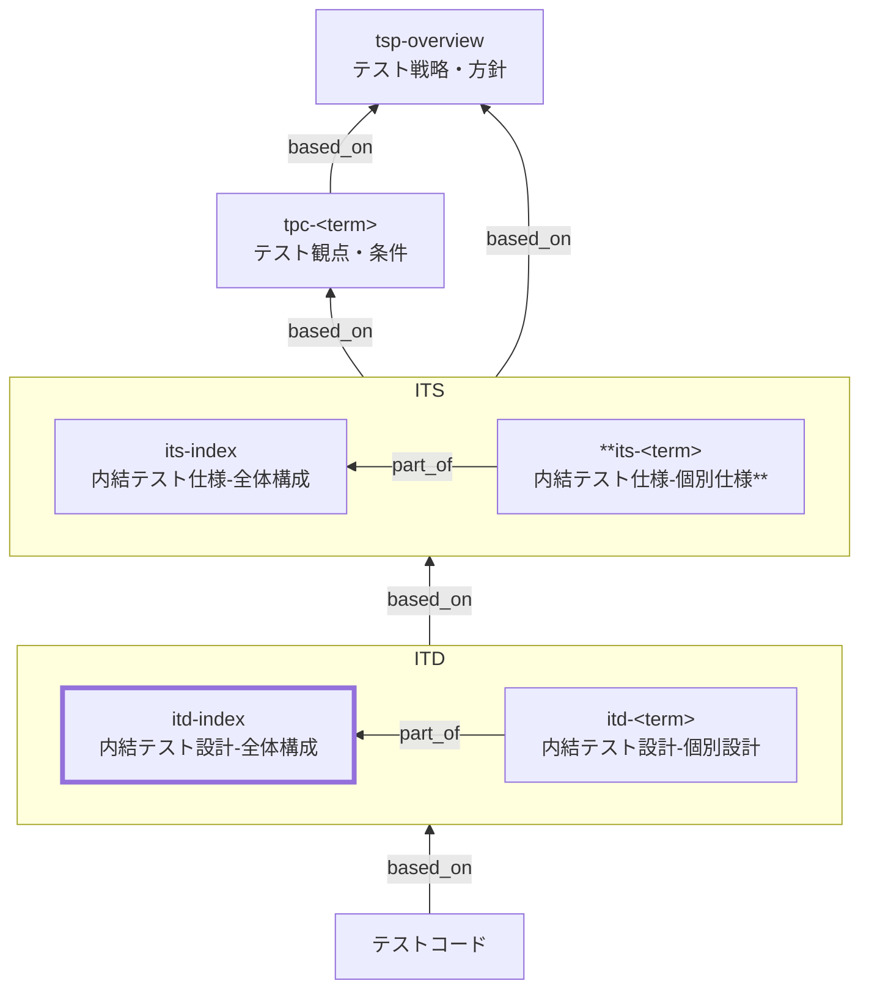

# 内部結合テスト設計 全体構成 作成ルール

Internal Integration Test Design Index (ITD Index) Documentation Rules

本ドキュメントは、内部結合テスト設計のうち **全体構成（`itd-index`）** を統一形式で記述するための標準ルールです。
`itd-index` は、内部結合テスト仕様（ITS）で定義された保証範囲（観点・代表条件）を、テスト実装へ落とし込むための **共通設計方針（テスト単位/ケース分解/データ/実行/判定）** と、個別設計（`itd-<term>`）への **入口（ナビゲーション）** を提供します。

個別設計（`itd-<term>`）の記述ルールは [itd-rules.md](itd-rules.md) で定義します。

---

## 1. 目的

`itd-index` に以下を明文化し、設計〜実装〜レビューの迷いと抜け漏れを減らします。

- ITS（`its-index` / `its-<term>`）を、内部結合テスト実装へ分解する共通方針
- ケース設計の粒度・代表集合の作り方（総当たり回避の基準）
- テストデータ/スタブ/モックの共通方針（内部結合の境界の固定）
- 実行方法・結果確認（エビデンス/観測点）の共通方針
- 個別設計（`itd-<term>`）へのナビゲーション（一覧・リンク）

## 2. 基本原則

- `itd-index` は **共通方針・共通基準・ナビゲーション**を扱い、個別のケース網羅や具体値は扱いません。
- `itd-index` は **テストコードそのものではありません**（ただし、コードへ落とせる具体性は必要）。
- トレースは Frontmatter の `based_on` を基本とし、上位成果物（ITS/TPC/BAC/NFR 等）への追跡可能性を担保します。
- 曖昧表現（例:「十分に」「適切に」）は禁止し、判定可能な言葉（対象/境界/基準/エビデンス）で書きます。
- 未定義プロパティの追加は禁止です（`additionalProperties: false`）。

## 3. 位置づけ（最重要）

ITD は「仕様」と「実装」の**中間成果物**です。



| 観点   | ITS / ITS-D    | ITD / ITD-D                      |
| ------ | -------------- | -------------------------------- |
| 役割   | 何を保証するか | **どうやって確認するか**         |
| 粒度   | 意味・観点     | **テスト構成・切り方**           |
| ケース | 代表条件のみ   | **ケース構造の設計**（値は最小） |
| 実装   | 言及しない     | 参照先を明示（全文貼付はしない） |

## 4. ファイル命名・ID規則

- 本ドキュメント（全体構成）の `id` は `itd-index` 固定とします。
- 個別設計は `itd-<term>` とします（詳細は [itd-rules.md](itd-rules.md)）。
- ファイル名はプロジェクト内で一意になるように命名します。
  - 例: `itd-020-内部結合テスト設計-全体構成.md`
  - 例: `itd-030-内部結合テスト設計-在庫.md`

## 5. 推奨 Frontmatter 項目

Frontmatter は共通スキーマに従います（あわせてメタ情報ルールも参照）。

- 参照スキーマ: [docs/shared/schemas/spec-frontmatter.schema.yaml](../../../shared/schemas/spec-frontmatter.schema.yaml)
- メタ情報ルール: [meta-document-metadata-rules.md](meta-document-metadata-rules.md)

| 項目       | 説明                                               | 必須 |
| ---------- | -------------------------------------------------- | ---- |
| id         | `itd-index`（固定）                                | ○    |
| type       | `test` 固定                                        | ○    |
| title      | 内部結合テスト設計: 全体構成                       | ○    |
| status     | `draft` / `ready` / `deprecated`                   | ○    |
| part_of    | `[]`（`itd-index` 自身は親なので通常は空配列）     | 任意 |
| based_on   | 根拠となる仕様ID（ID配列。未指定時は `[]` を許容） | 任意 |
| supersedes | 置き換え関係（ID配列。未指定時は `[]` を許容）     | 任意 |

推奨:

- `based_on` には最低限、関連する `its-index` と主要な `its-<term>` を含めます。
  - ここで求めるのは **網羅的な列挙ではなく、追跡の起点となる一次参照**です。
  - `itd-index` の方針判断（ケース分解ポリシー、境界、データ/スタブ方針、実行/判定）に **直接利用したものだけ**を列挙します。
  - 大量になる場合は、上位側（TPC 等）のトレース表に集約し、`itd-index` は起点の提示に留めます。
- `part_of` / `based_on` / `supersedes` は ID の配列で記載し、未指定の場合も `[]` として明示してよいです。

## 6. 本文構成（標準テンプレ）

`itd-index` は以下の見出し構成を **必ず守ります**（順序固定）。

1. 概要
2. 対象範囲
3. テスト単位の設計
4. ケース分解ポリシー（観点 × 条件 → 期待結果）
5. テストデータ設計方針
6. 実行・自動化方針
7. 結果確認・判定方法
8. 個別設計一覧（統合表）
9. 対象外 / 除外理由
10. メモ / 将来課題

## 7. 記述ガイド

### 7.1 概要

- この ITD が **どの内部結合テストを設計するか**を明記します。
- ITS（`its-index` / `its-<term>`）との対応関係を文章で書きます。

例:

> 本設計は、内部結合テスト仕様（`its-index`）および在庫連携に関する個別仕様（`its-inventory`）に基づき、内部結合テストのケース分解ポリシーと実行方針を定義する。

### 7.2 対象範囲

推奨（表）:

| 項目         | 内容例                            |
| ------------ | --------------------------------- |
| 対象連携     | 注文API ↔ 在庫ドメイン（内部）   |
| 対象仕様     | `its-inventory`                   |
| テストレベル | 内部結合テスト                    |
| 実行環境     | 結合試験環境 / ステージング（例） |

### 7.3 テスト単位の設計（必須）

**どの単位でテストを分けるか**を定義します。

例:

| テスト単位 | 責務（例）                  |
| ---------- | --------------------------- |
| API 単位   | API 呼出結果の確認          |
| 連携単位   | API → Domain の状態遷移     |
| 例外単位   | 入力不正/依存失敗などの確認 |

ポイント:

- モジュール名・クラス名は書かない
- 論理的な責務単位（連携境界/観測点）で分ける

### 7.4 ケース分解ポリシー（観点 × 条件 → 期待結果）（最重要）

`itd-index` の中核です。最低限、次を含めます。

- 観点（保証）をどう分類し、どの粒度でケースへ落とすか
- 条件（状態）をどう表現し、どこまでを設計に書くか（具体値の扱い）
- 代表集合の考え方（総当たり回避の基準・例外の取り扱い）

補足（推奨）:

- ケース表現は「**観点（保証）× 条件（状態）→ 期待結果**」で統一します。
- 「×」は網羅的な直積（全組合せ）の意味ではありません。代表条件を選び、採用理由（境界値、同値分割、状態遷移分岐、例外種別など）が追えるようにします。
- 条件（状態）には、入力データの差分・状態遷移の前提・依存の成否（スタブ応答）などを含めてよいです。

推奨の表（例）:

| 観点分類  | 代表ケースの作り方（例）                     | 具体値の扱い                                          |
| --------- | -------------------------------------------- | ----------------------------------------------------- |
| 正常      | 代表1 + 境界1                                | 数値は原則「境界値」として扱い、値は個別設計/コードへ |
| 状態      | 遷移分岐（前状態→操作→後状態）で代表を取る   | 状態名は書く、物理キー/SQLは書かない                  |
| 例外      | 入力不正/状態不正/依存失敗（スタブ）に分ける | 例外種別の期待結果（分類/メッセージ/戻り値）を明示    |
| 監査/ログ | 成否/重要イベントの有無で代表を取る          | ログ全文ではなく観測点（項目/出力要否）を記載         |

### 7.5 テストデータ設計方針

- データの作り方・粒度のみを記述します。
- 固定値や件数は原則書きません（必要最小限の“意味のある”代表値のみ）。

例:

| 観点             | 方針（例）                    |
| ---------------- | ----------------------------- |
| マスタ           | 業務代表パターンを用意        |
| トランザクション | 各ケースごとに独立生成/初期化 |
| 外部依存         | スタブを使用（契約形は固定）  |

### 7.6 実行・自動化方針

- **どこまで自動化するか**
- **どのツールを使うか（名称のみ）**

例:

| 項目     | 方針（例）      |
| -------- | --------------- |
| 実行方法 | CI 上で自動実行 |
| ツール   | JUnit           |
| 実行頻度 | 毎コミット      |

### 7.7 結果確認・判定方法

| 観点 | 判定方法（例）           |
| ---- | ------------------------ |
| 機能 | Assertion の全成功       |
| 状態 | 状態遷移が仕様通り       |
| ログ | 必須ログが出力される     |
| 監査 | 監査証跡が残る（観測点） |

### 7.8 個別設計一覧（統合表）（必須）

運用上の更新漏れを防ぐために、**ITS と ITD（個別）を対応づけてリンクで辿れる対応表を 1 表に統合**し、ここを単一ソース（Single Source of Truth）とします。

推奨の表（例）:

| ITS（根拠）                                | 個別設計（ITD）                            | コメント                    |
| ------------------------------------------ | ------------------------------------------ | --------------------------- |
| [its-inventory](./itd-index-rules.md)      | [itd-inventory](./itd-index-rules.md)      | 在庫連携の代表ケース設計    |
| [its-order-db](./itd-index-rules.md)       | [itd-order-db](./itd-index-rules.md)       | 永続化（論理I/F）を含む設計 |
| [its-internal-event](./itd-index-rules.md) | [itd-internal-event](./itd-index-rules.md) | 内部イベント通知の設計      |

※ 本ルール文書ではデッドリンク防止のため、例のリンクを本ファイル（自己参照）にしています。
※ 実運用では、ITS 側は対応する `its-<term>`、ITD 側は対応する `itd-<term>` の実ファイルへリンクしてください（実ファイル名・配置はプロジェクトに合わせます）。

### 7.9 対象外 / 除外理由

例:

- 性能検証 → 非機能テスト
- 外部IF → 外部結合テスト

### 7.10 メモ / 将来課題

- 将来の結合拡張
- テスト高速化/安定化の検討

## 8. 禁止事項

| 項目                                          | 理由                                          |
| --------------------------------------------- | --------------------------------------------- |
| SQL/JSON の貼付（全文）                       | 実装依存・可読性低下                          |
| テストコード全文の貼り付け                    | ドキュメントの役割外                          |
| 値の総当たり・ケース値の網羅                  | 保守不能、意図が伝わらない                    |
| クラス・関数名の列挙                          | 設計の抽象度を下げる                          |
| 未定義のメタ情報プロパティ追加（例: `tests`） | スキーマ違反（`additionalProperties: false`） |

## 9. サンプル（最小）

### 9.1 メタ情報（Frontmatter）

```yaml
---
id: itd-index
type: test
title: 内部結合テスト設計: 全体構成
status: draft
part_of: []
based_on:
  - its-index
  - its-inventory
  - tsp-overview
supersedes: []
---
```

### 9.2 概要

本ドキュメント（`itd-index`）は、内部結合テスト仕様（ITS）で定義した保証範囲を、内部結合テスト実装へ落とし込むための共通設計方針（テスト単位/ケース分解/データ/実行/判定）と、個別設計（`itd-<term>`）へのナビゲーションを定義する。

このサンプルは「最小」ですが、運用で迷いが出やすい項目（対象範囲/単位/ケース分解/データ/実行/判定/統合表/除外/メモ）を一通り含めています。

### 9.3 対象範囲

| 項目         | 内容例                                         |
| ------------ | ---------------------------------------------- |
| 対象仕様     | `its-inventory`                                |
| 対象境界     | API（注文）↔ 在庫ドメイン（内部）             |
| 対象外境界   | 外部配送システム、外部決済（外部結合テストへ） |
| テストレベル | 内部結合テスト                                 |
| 実行環境     | 結合試験環境（DBあり）                         |

### 9.4 テスト単位の設計

設計上の「単位」は **観測点（どこで判定するか）** と **境界（どこまでを同時に動かすか）** で定義する。

| テスト単位      | 含めるもの（例）                     | 含めないもの（例） | 主な観測点（例）                       |
| --------------- | ------------------------------------ | ------------------ | -------------------------------------- |
| API→Domain 単位 | API 層 + 在庫ドメイン + DB（必要時） | 外部配送/外部決済  | HTTP 応答、状態遷移、永続化結果        |
| 依存失敗単位    | API 層 + 在庫ドメイン + スタブ       | 実外部サービス     | スタブ呼出し、エラー分類、リトライ有無 |

補足:

- スタブ/モックの契約（入力・出力・エラー種別）は ITS の前提に合わせて固定する。
- 実装クラス名の列挙はしない（個別設計/コード側で追えるようにリンクを使う）。

### 9.5 ケース分解ポリシー（観点 × 条件 → 期待結果）

- ケースは「観点（保証）× 条件（状態）→ 期待結果」で表現する。
- 「×」は直積（全組合せ）ではなく、代表条件を選び採用理由が説明できることを優先する。
- 具体値は必要最小限とし、値の網羅は個別設計/コードへ委譲する。

推奨の表（例）:

| 観点（保証）             | 条件（状態）                                                            | 期待結果（判定）                                             | 採用理由（抜粋）         |
| ------------------------ | ----------------------------------------------------------------------- | ------------------------------------------------------------ | ------------------------ |
| 正常: 在庫引当が成功する | 前提: 在庫=十分 / 入力: 正常注文 / 依存: スタブ成功                     | 応答が成功、在庫が減算、引当履歴が作成される                 | 正常系の代表             |
| 境界: ちょうど在庫0      | 前提: 在庫=注文数 / 入力: 正常注文 / 依存: スタブ成功                   | 応答が成功、在庫=0、以降の注文で欠品判定が可能な状態になる   | 境界値（状態遷移の分岐） |
| 例外: 欠品               | 前提: 在庫<注文数 / 入力: 正常注文 / 依存: スタブ成功                   | 応答が失敗（業務エラー）、在庫は変化しない、適切な理由が返る | 代表的な業務例外         |
| 例外: 依存失敗           | 前提: 在庫=十分 / 入力: 正常注文 / 依存: スタブがタイムアウト/失敗      | 応答が失敗（依存エラー）、リトライ方針に従う、監視ログが出る | 外部依存起因の代表       |
| 監査/ログ: 重要イベント  | 前提: 重要操作（引当/取消） / 入力: 正常注文 or 取消 / 依存: スタブ成功 | 監査項目が残る（観測点で確認）、必須ログが出力される         | 監査要件の代表           |

### 9.6 テストデータ設計方針

| 観点             | 方針（例）                                                     |
| ---------------- | -------------------------------------------------------------- |
| データ生成       | 各ケースごとに独立生成（衝突回避の採番ルールのみ規定）         |
| マスタ/設定      | 最小セットを固定（ケース依存の差分は個別設計で定義）           |
| 前提状態（状態） | 前状態→操作→後状態が追えるよう、状態名と初期化手順を文章で記す |
| 外部依存         | スタブ応答は代表パターンのみ（成功/業務エラー/依存エラー）     |

### 9.7 実行・自動化方針

| 項目       | 方針（例）                                                             |
| ---------- | ---------------------------------------------------------------------- |
| 実行場所   | CI で自動実行（ローカルでも同等に実行可能にする）                      |
| 実行順序   | DB 初期化 → スタブ起動 → テスト実行 → 収集/レポート                    |
| 並列実行   | 原則可（DB/スタブの分離が難しい場合はケース単位でシリアルに切替）      |
| 失敗時対応 | 失敗ケースの入力/出力/状態差分（最小）をログに残し、再現手順を明記する |

### 9.8 結果確認・判定方法

| 観点       | 判定方法（例）                                             | エビデンス（例）                            |
| ---------- | ---------------------------------------------------------- | ------------------------------------------- |
| HTTP 応答  | ステータス/エラー分類/メッセージが仕様どおり               | レスポンス（要点のみ）                      |
| 状態       | 期待する状態遷移（前→後）が満たされる                      | 主要テーブル/集約のスナップショット（要点） |
| 依存呼出し | スタブが期待どおりに呼ばれる（回数/主要パラメータ）        | スタブの受信ログ（要点）                    |
| ログ/監査  | 必須ログ・監査項目が出力される（全文ではなく観測点で確認） | 観測点チェックリスト                        |

### 9.9 個別設計一覧（統合表）

| ITS（根拠）                                | 個別設計（ITD）                            | コメント                    |
| ------------------------------------------ | ------------------------------------------ | --------------------------- |
| [its-inventory](./itd-index-rules.md)      | [itd-inventory](./itd-index-rules.md)      | 在庫連携の代表ケース設計    |
| [its-order-db](./itd-index-rules.md)       | [itd-order-db](./itd-index-rules.md)       | 永続化（論理I/F）を含む設計 |
| [its-internal-event](./itd-index-rules.md) | [itd-internal-event](./itd-index-rules.md) | 内部イベント通知の設計      |

※ 本サンプルではデッドリンク防止のため、例のリンクを本ファイル（自己参照）にしています。実運用では実ファイルへリンクしてください。

### 9.10 対象外 / 除外理由

- 性能/負荷 → 非機能テスト（NFR）で扱う
- 外部IF → 外部結合テスト（EIT/ETD）で扱う
- 画面E2E → システムテスト/受け入れテストで扱う

### 9.11 メモ / 将来課題

- 契約変更（依存I/F）時の回帰観点の追加
- フレーク抑制（時間依存の排除、リトライ方針の整理）

## 10. 生成 AI への指示テンプレート

> - 以下のルールに従って **内部結合テスト設計（ITD / ITD-D）** を 1 ファイル作成してください。出力は Markdown。
> - 入力は ITS（`its-index` と必要に応じて主要な `its-<term>`）とします。
> - `itd-index` は共通方針・共通基準・ナビゲーションのみ（個別の大量ケースや具体値は書かない）。
> - `itd-<term>`（個別設計）を作る場合も、値の詳細・SQL全文・テストコード全文は書かない（必要なら「境界値」「代表値」レベルで方針のみ）。
> - YAML Frontmatter の未定義項目は追加しない。
