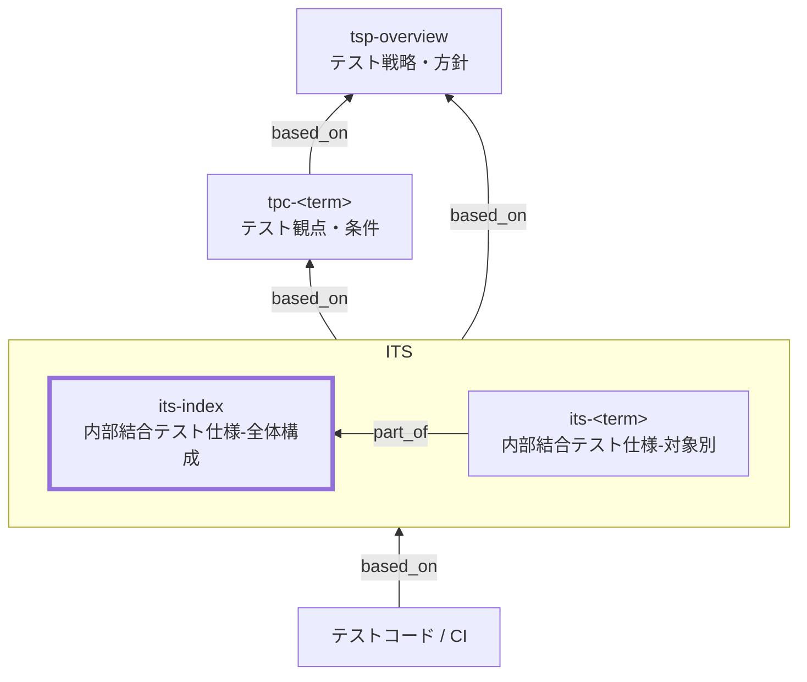

Internal Integration Test Specification Index (ITS Index) Documentation Rules

本ドキュメントは、内部結合テスト仕様（ITS）の **全体構成（`its-index`）** を
統一形式で記述するための標準ルールです。

`its-index` は、TPC で整理された観点・条件を
**内部結合（自組織管理範囲内の連携）という責務に解釈・分配**し、
対象別仕様（`its-<term>`）へ導く **唯一のナビゲーション起点** となります。

ITS はテストコードでも、手順書でもありません。
**内部結合で「何をどこまで保証するか（What）」を定義する仕様文書**です。

## 1. 全体方針

- `its-index` は、内部結合テストレベルにおける
  **責務・境界・分配方針・共通合格基準・エビデンス方針** を定義する。
- TPC の観点・条件を、`its-<term>` に **重複なく分配**するための入口とする。
- ケースの網羅（TP×TC→期待）は **原則テストコードで表現**する。
- 文書では **代表ケースのみを最小限で許容**する（詳細は 6.5）。
- ITS は「仕様」であり、「設計」や「実装詳細」を独立文書として分離しない。
- トレースの一次情報（SSOT）は TPC とし、ITS は Frontmatter の `based_on` を追跡起点とする。
- 曖昧表現（「十分に」「適切に」など）は禁止し、判定可能な表現で記述する。

## 2. 位置づけ（他ドキュメントとの関係）



## 3. ファイル命名・ID規則

- 本ドキュメントの `id` は `its-index` 固定。
- 対象別仕様は `its-<term>`（例: `its-order-api`, `its-inventory-db`）。
- ファイル名はプロジェクト内で一意となるように命名する。
  - 例: `its-010-内部結合テスト仕様-全体構成.md`
  - 例: `its-020-内部結合テスト仕様-order-api.md`

## 4. 推奨 Frontmatter 項目

Frontmatter は共通スキーマに従う。

| 項目       | 説明                               | 必須 |
| ---------- | ---------------------------------- | ---- |
| id         | `its-index`（固定）                | ○    |
| type       | `test` 固定                        | ○    |
| title      | 内部結合テスト仕様: 全体構成       | ○    |
| status     | `draft` / `ready` / `deprecated`   | ○    |
| part_of    | `[]`                               | 任意 |
| based_on   | 根拠仕様ID（例: `tsp-*`, `tpc-*`） | 任意 |
| supersedes | 置き換え関係                       | 任意 |

### 4.1. 推奨ルール

- `based_on` には最低限、関連する `tpc-*` を含める。
- BAC/NFR/BR 等は **方針判断に直接使ったもののみ**列挙する。
- トレースの網羅表は TPC に集約する。

## 5. 本文構成（標準テンプレ）

`its-index` は以下の構成を **順序固定**で記載する。

| No  | 見出し                         | 必須 |
| --- | ------------------------------ | ---- |
| 1   | 概要                           | ○    |
| 2   | 対象単位の定義                 | ○    |
| 3   | 内部結合テストの対象範囲と境界 | ○    |
| 4   | 分配方針（TPC → `its-<term>`） | ○    |
| 5   | ケース分解・記述方針（重要）   | ○    |
| 6   | 対象単位一覧（統合表）         | ○    |
| 7   | 合格基準とエビデンス（共通）   | ○    |
| 8   | 対象外・除外理由               | ○    |
| 9   | メモ / 将来課題                | 任意 |

## 6. 記述ガイド

### 6.1. 概要

- 内部結合テストで **どの連携を、何のために保証するか** を簡潔に記載する。
- TPC を `its-<term>` に分配する入口であることを明示する。

### 6.2. 対象単位の定義（必須）

- `its-<term>` は **内部連携の責務単位**で定義する。
- 分割・統合は以下で判断する：
  - I/F 境界
  - 観測点（どこで合否を判定するか）
  - 責務の独立性

実装構造（クラス名、物理テーブル名等）には依存しない。

### 6.3. 内部結合テストの対象範囲と境界（必須）

| 観点     | 方針例                                        |
| -------- | --------------------------------------------- |
| 対象範囲 | API↔Domain、Domain↔DB（論理）、内部イベント |
| 外部I/F  | 原則スタブ／隔離                              |
| 内部I/F  | 原則実接続                                    |
| 観測点   | レスポンス、DB状態、イベント、ログ            |

### 6.4. 分配方針（TPC → `its-<term>`）（必須）

- 各 TPC の観点・条件は **必ず1つ以上の `its-<term>` に割り当てる**。
- 同一観点・条件を **複数の `its-<term>` で重複して担保しない**。
- 例外・境界条件は「判断責務を持つ連携単位」に割り当てる。

### 6.5. ケース分解・記述方針（重要）

#### 6.5.1. 原則

- **TP×TC→期待結果の網羅はテストコードで表現する**
  - parameterized / table-driven / property-based 等を利用する

- ITS 文書では **ケース網羅表を作らない**

#### 6.5.2. 文書で許可する内容（代表ケース）

ITS 文書で記載してよいのは、以下を満たす **代表ケースのみ**。

- 参照TPC（観点ID/条件IDの範囲）
- 観測点（合否を判断する箇所）
- 期待結果の要点（分類レベル）
- エビデンス参照先（CI成果物、ログ等）

#### 6.5.3. 例外（記述を許容する条件）

以下の場合に限り、**最小限の手順・観測点チェックリスト**を追加してよい。

- 非同期・順序依存などでフレークが発生しやすい
- 環境・データ準備が重い
- 監査・外部委託等で人が読む説明が必要
- テストコードが別リポジトリ／別組織管理

### 6.6. 対象単位一覧（統合表）（必須）

| `its-<term>`       | 対象の要約（連携境界）        | 担当TPC（例） | 観測点（要約） |
| ------------------ | ----------------------------- | ------------- | -------------- |
| `its-order-api`    | Order API ↔ Inventory Domain | `tpc-sale-*`  | HTTP/DB/ログ   |
| `its-order-db`     | Order API ↔ Data Store       | `tpc-order-*` | DB状態         |
| `its-internal-evt` | Domain ↔ Internal Event      | `tpc-event-*` | イベント/ログ  |

### 6.7. 合格基準とエビデンス（共通）

| 項目       | 合格基準（例）     | エビデンス        |
| ---------- | ------------------ | ----------------- |
| 実行結果   | 失敗 0 件          | CI テストレポート |
| 重大不具合 | Blocker/Critical 0 | 不具合管理票      |

### 6.8. 対象外・除外理由

- 外部サービス実接続 → 外部結合テスト
- 性能・負荷 → 非機能テスト
- 画面E2E → 総合/受入テスト

### 6.9. メモ / 将来課題

- 内部連携構造変更時の再分配方針
- フレーク抑制策の継続改善

## 7. 禁止事項

| 禁止事項                     | 理由                   |
| ---------------------------- | ---------------------- |
| TP×TC の網羅表の記載         | SSOT重複／保守不能     |
| テスト手順・具体値の逐語列挙 | テストコードと二重管理 |
| SQL/物理構造の貼付           | 実装依存               |
| 未定義メタ情報の追加         | スキーマ違反           |

## 8. サンプル（最小）

### 8.1. メタ情報（Frontmatter）

```yaml
---
id: its-index
type: test
title: 内部結合テスト仕様: 全体構成
status: draft
part_of: []
based_on:
  - tsp-overview
  - tpc-order-process
supersedes: []
---
```

### 8.2. 概要

本ドキュメント（`its-index`）は、内部結合（システム内部の連携）で担保する **責務・境界・共通合格基準** を定義し、TPC の観点・条件を対象単位（`its-<term>`）へ **分配する入口（ナビゲーション）** とする。

### 8.3. 対象単位の定義

- `its-<term>` は「内部結合で担保する連携境界のまとまり」を単位とする。
- 分割/統合は「連携点（I/F境界）・観測点・責務」で判断する。
- 実装都合（クラス名、物理テーブル/物理カラム名）に依存して粒度を決めない。

### 8.4. 内部結合テストの対象範囲と境界（スタブ/実接続方針）

| 項目     | 内容例                                                      |
| -------- | ----------------------------------------------------------- |
| 対象範囲 | UI↔API、API↔Domain、API↔DB（論理）、内部イベント         |
| 連携点   | REST、メッセージ、内部イベント、内部テーブル（論理）        |
| 外部I/F  | 原則スタブ（隔離）。外部の実接続・疎通は ETS へ分離         |
| 内部I/F  | 原則実接続（ただし不安定な依存は段階的に置換/隔離してよい） |
| 観測点   | レスポンス、イベント発行、DB状態（論理）、ログ              |

### 8.5. 分配方針（TPC → `its-<term>`）

- `its-<term>` ごとに担当する TPC（または観点ID/条件IDの範囲）を示す。
- 参照は **TPC の ID と範囲**で行い、TPC の観点・条件表は再掲しない。
- 分配は重複を避け、各 TPC（または範囲）は最低 1 つ以上の `its-<term>` に割り当てる。

### 8.6. ケース分解・記述方針（重要）

- TP×TC→期待結果の網羅（組み合わせ展開）は **原則テストコードで表現**する。
- `its-index` には **ケース網羅表を作らない**。
- 文書で記載してよいのは、次の情報を満たす **代表ケースの最小限**のみ。
  - 代表ケースID（例: `ITS-RC-01`）
  - 参照TPC（観点ID/条件IDの範囲のみ）
  - 観測点（合否を判断する箇所）
  - 期待結果の要点（分類レベル）
  - エビデンス参照先（CI成果物、ログ等）

代表ケース（例）:

| 代表ケースID | 参照TPC（範囲の例）                                              | 観測点（例）                         | 期待結果の要点（例）                 | エビデンス（例）                       |
| ------------ | ---------------------------------------------------------------- | ------------------------------------ | ------------------------------------ | -------------------------------------- |
| ITS-RC-01    | `tpc-order-process`（観点ID: `IT-01..IT-02`、条件ID: `ITC-01`）  | APIレスポンス / イベント / ログ      | 正常系の連携が成立し、状態が整合する | CI テストレポート + 実行ログ（成果物） |
| ITS-RC-02    | `tpc-order-process`（観点ID: `IT-03`、条件ID: `ITC-02..ITC-03`） | APIレスポンス / DB状態（論理）/ ログ | 例外系で状態が汚れず、扱いが仕様通り | CI テストレポート + 検証ログ（成果物） |

### 8.7. 対象単位一覧（統合表）

| `its-<term>`                             | 対象の要約（連携境界）          | 担当するTPC（例） | 連携点/観測点（任意）        | コメント                        |
| ---------------------------------------- | ------------------------------- | ----------------- | ---------------------------- | ------------------------------- |
| [its-order-api](./its-index-rules.md)    | Order API ↔ Inventory Domain   | `tpc-sale-*`      | REST / レスポンス・ログ      | 実運用: `./its-order-api.md`    |
| [its-order-db](./its-index-rules.md)     | Order API ↔ Data Store（論理） | `tpc-order-*`     | 永続化（論理）/ DB状態・ログ | 実運用: `./its-order-db.md`     |
| [its-internal-evt](./its-index-rules.md) | Domain ↔ Internal Event        | `tpc-event-*`     | メッセージ / イベント・ログ  | 実運用: `./its-internal-evt.md` |

※ 本サンプルではデッドリンク防止のため、例のリンクを本ファイル（自己参照）にしています。実運用では各 `its-<term>` の個別仕様ファイルへリンクしてください。

### 8.8. 合格基準とエビデンス（共通）

| 項目       | 合格基準（例）           | エビデンス（例）                    |
| ---------- | ------------------------ | ----------------------------------- |
| 実行結果   | 失敗 0 件                | CI テストレポート（junit 等）       |
| 重大不具合 | Blocker/Critical 0 件    | 不具合管理票（課題トラッカー）      |
| 重要観点   | P0/P1 の観点が全て実施済 | 実行ログ/テストレポート（CI成果物） |

### 8.9. 対象外・除外理由

- 外部サービスとの実接続・疎通: ETS で担保する。
- 性能・負荷・スループットのピーク検証: 非機能テストで担保する。
- 画面操作のE2E（クリック手順を伴う検証）: ST/AT で担保する。

### 8.10. メモ / 将来課題

- 未確定のIF（API変更予定など）
- 分配方針（対象単位の切り方）が変わる場合の影響範囲（TPC割当の見直し）

## 9. 生成AIへの指示テンプレート

生成AIに `its-index` を作成させる場合は[its-index-instruction.md](../instructions/its-index-instruction.md) を参照すること。
