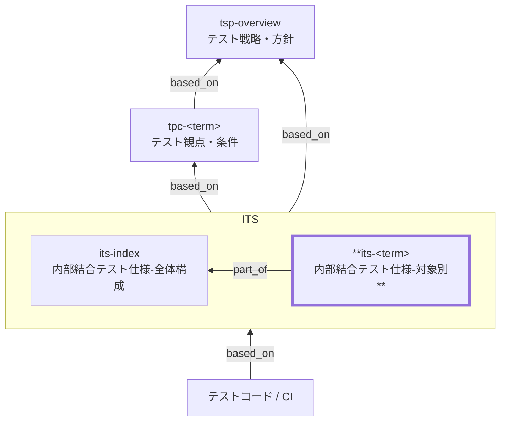

Internal Integration Test Specification (ITS) Documentation Rules

本ドキュメントは、**内部結合テスト仕様（`its-<term>`）** を統一形式で記述するための標準ルールです。

`its-<term>` は、`its-index` で定義された分配方針に基づき、**特定の内部連携単位について「何をどこまで保証するか（What）」**を明文化する **対象別テスト仕様** です。

ITS はテストコードでも、手順書でもありません。**内部結合というテストレベルにおける保証責務を、レビュー可能な形で定義する仕様文書**です。

## 1. 全体方針

- `its-<term>` は **1ドキュメント = 1内部連携単位** を原則とする。
- 関心は「部品の中」ではなく、**「部品と部品の間（連携）」** に置く。
- 保証内容は **TPC に定義された観点・条件** を前提とし、`its-index` で分配された範囲のみを扱う。
- **TP×TC→期待結果の網羅は原則テストコードで表現**する。
- 文書では **代表ケースのみを最小限で記述**する。
- 実装手順・具体値・ケース全列挙は記載しない。
- トレースの一次情報（SSOT）は TPC とし、`its-<term>` は Frontmatter の `based_on` を追跡の起点とする。

## 2. 位置づけ（他ドキュメントとの関係）



| 観点   | `its-index`                  | `its-<term>`                 |
| ------ | ---------------------------- | ---------------------------- |
| 役割   | レベル共通の責務・境界・分配 | **特定連携で何を保証するか** |
| 粒度   | 横断・方針                   | **連携単位の保証内容**       |
| ケース | 扱わない                     | **代表ケースのみ**           |
| 実装   | 言及しない                   | 言及しない                   |

## 3. ファイル命名・ID規則

### 3.1. 3.1 ID・ファイル名

- `id` は `its-<term>`（kebab-case）
  - 例: `its-order-api`, `its-inventory-db`

- ファイル名はプロジェクト内で一意とする。
  - 例: `its-020-内部結合テスト仕様-order-api.md`

`<term>` は **用語集（Glossary）で定義された論理名**を使用する。

## 4. 推奨 Frontmatter 項目

Frontmatter は共通スキーマに従う。

| 項目       | 説明                             | 必須 |
| ---------- | -------------------------------- | ---- |
| id         | `its-<term>`                     | ○    |
| type       | `test` 固定                      | ○    |
| title      | 内部結合テスト仕様: `<対象名>`   | ○    |
| status     | `draft` / `ready` / `deprecated` | ○    |
| part_of    | `its-index` を含む配列           | ○    |
| based_on   | 根拠仕様（`tpc-*` 必須）         | ○    |
| supersedes | 置き換え関係                     | 任意 |

### 4.1. 4.1 記述ルール

- `part_of` には **必ず `its-index` を含める**
- `based_on` には **必ず該当する `tpc-*` を含める**
- BAC / BR / NFR 等は **本仕様で直接判断に使ったもののみ**記載する

## 5. 本文構成（標準テンプレ）

`its-<term>` は以下の構成を **順序固定**で記載する。

| No  | 見出し                   | 必須 |
| --- | ------------------------ | ---- |
| 1   | 概要                     | ○    |
| 2   | 対象連携の概要           | ○    |
| 3   | 内部結合の対象範囲と境界 | ○    |
| 4   | 保証する観点             | ○    |
| 5   | 代表ケース（最小）       | ○    |
| 6   | 合格基準とエビデンス     | ○    |
| 7   | 対象外・除外理由         | ○    |
| 8   | メモ / 将来課題          | 任意 |

## 6. 記述ガイド

### 6.1. 6.1 概要

- 本仕様が対象とする **内部連携単位** を 1〜2 文で記載する。
- 「何を保証する仕様か」が分かれば十分。

例:

> 本ドキュメントは、注文APIと在庫ドメイン間の内部連携について、
> 業務的に保証すべき観点を定義する。

### 6.2. 6.2 対象連携の概要（必須）

| 項目       | 内容例                                         |
| ---------- | ---------------------------------------------- |
| 連携元     | 注文API                                        |
| 連携先     | 在庫ドメイン                                   |
| 連携方式   | 内部API呼出                                    |
| タイミング | 注文確定時                                     |
| 関連仕様   | `tpc-sale-checkout`, `br-inventory-allocation` |

※ 物理名・実装名は禁止。論理名のみ使用する。

### 6.3. 6.3 内部結合の対象範囲と境界（必須）

| 観点         | 方針例                             |
| ------------ | ---------------------------------- |
| 対象に含める | API↔Domain、Domain↔DB（論理）    |
| 境界で切る   | 外部決済、外部在庫、時刻           |
| 依存の扱い   | 外部はスタブ、内部は原則実接続     |
| 観測点       | レスポンス、DB状態、イベント、ログ |

### 6.4. 6.4 保証する観点（必須）

TPC の観点を **そのまま再定義しない**。
本連携で **何を担保するか** を明確にする。

| 参照TPC | 観点ID | 観点分類 | 観点名   | 保証内容                         | 追加根拠（任意） |
| ------- | ------ | -------- | -------- | -------------------------------- | ---------------- |
| tpc-xxx | TP-01  | 正常     | 引当成功 | 正常時に在庫が正しく引当される   | br-xxx-xxx       |
| tpc-xxx | TP-02  | 例外     | 在庫不足 | 不足時は確定せず状態が変化しない | bac-xxx-xxx      |
| tpc-xxx | TP-03  | 状態     | 状態整合 | 注文と在庫の状態が矛盾しない     | cstd-xxx-xxx     |

- 観点の定義・トレースは TPC を正とします（重複記載しません）
- 根拠は TPC以外 の追加根拠がある場合のみ記載する（未指定可）

### 6.5. 6.5 代表ケース（最小）（必須）

- **ケース網羅は禁止**
- TP×TC→期待の展開は **テストコードに委譲**

文書では **代表ケースのみ**を記載する。

| 観点ID | 参照TPC | 代表条件（要点） | 期待結果（要点） | 観測点  | エビデンス |
| ------ | ------- | ---------------- | ---------------- | ------- | ---------- |
| TP-01  | tpc-xxx | 正常注文         | 引当成功         | DB/ログ | CIレポート |
| TP-02  | tpc-xxx | 在庫不足         | 失敗・状態不変   | 応答/DB | CIレポート |

### 6.6. 6.6 合格基準とエビデンス（必須）

- 共通基準は `its-index` に従う。
- 本連携に特有のもののみ記載する。

| 項目   | 合格基準（例）     | エビデンス   |
| ------ | ------------------ | ------------ |
| 観点   | 全観点が検証済     | CIレポート   |
| 不具合 | Blocker/Critical 0 | チケット一覧 |

### 6.7. 6.7 対象外・除外理由（必須）

- 外部サービス実接続 → 外部結合テスト
- 性能・負荷 → 非機能テスト
- 画面E2E → 総合 / 受入テスト

### 6.8. 6.8 メモ / 将来課題

- IF変更予定
- 内部イベント増加時の分割検討

## 7. 禁止事項

| 禁止事項           | 理由             |
| ------------------ | ---------------- |
| TP×TC 網羅表       | SSOT重複         |
| テスト手順・具体値 | コードと二重管理 |
| SQL / クラス名     | 実装依存         |
| 曖昧表現           | 合否判定不能     |

## 8. サンプル（最小）

```yaml
---
id: its-inventory-allocation
type: test
title: 内部結合テスト仕様: 在庫引当連携
status: draft
part_of: [its-index]
based_on:
  - tpc-sale-checkout
  - tpc-inventory
  - br-inventory-allocation
supersedes: []
---
```

### 8.1. 概要

本ドキュメントは、**注文APIと在庫ドメイン間の内部連携**について、
注文確定時に行われる在庫引当処理が**業務ルールおよび状態整合の観点で正しく成立すること**を保証する。

### 8.2. 対象連携の概要

| 項目       | 内容                                |
| ---------- | ----------------------------------- |
| 連携元     | 注文API                             |
| 連携先     | 在庫ドメイン                        |
| 連携方式   | 内部API呼出                         |
| タイミング | 注文確定時                          |
| 関連仕様   | `tpc-sale-checkout`, 在庫引当ルール |

※ 実装クラス名・物理テーブル名は記載しない。

### 8.3. 内部結合の対象範囲と境界

| 観点         | 方針                                        |
| ------------ | ------------------------------------------- |
| 対象に含める | 注文API ↔ 在庫ドメインの引当判定・状態更新 |
| 境界で切る   | 外部倉庫連携、在庫同期バッチ、時刻依存処理  |
| 依存の扱い   | 外部I/Fはスタブ、内部ドメインは実接続       |
| 観測点       | API応答、在庫状態、注文状態、業務ログ       |

### 8.4. 保証する観点

本内部連携で **内部結合として担保する観点**を以下に示す。
観点の定義自体は TPC を正とし、ここでは **本連携での保証責務**のみを明示する。

| 参照TPC       | 観点ID | 分類 | 観点名   | 保証内容                                                     | 根拠                    |
| ------------- | ------ | ---- | -------- | ------------------------------------------------------------ | ----------------------- |
| tpc-sale-\*   | TP-01  | 正常 | 引当成功 | 正常な注文確定時に在庫が引当され、注文・在庫の状態が整合する | br-inventory-allocation |
| tpc-sale-\*   | TP-02  | 例外 | 在庫不足 | 在庫不足時は引当されず、注文・在庫の状態が不整合にならない   | br-inventory-allocation |
| tpc-inventory | TP-03  | 状態 | 状態整合 | 引当成功／失敗いずれの場合も、注文状態と在庫状態が矛盾しない | 業務状態遷移定義        |
| tpc-sale-\*   | TP-04  | 監査 | ログ出力 | 引当結果（成功／失敗）が業務ログとして観測可能である         | nfr-audit               |

### 8.5. 代表ケース（最小）

> TP×TC の網羅は **テストコードで表現**する。
> 本仕様では、**内部結合の成立可否を確認する代表ケースのみ**を示す。

| 観点ID | 参照TPC       | 代表条件（要点）   | 期待結果（要点）                       | 観測点            | エビデンス |
| ------ | ------------- | ------------------ | -------------------------------------- | ----------------- | ---------- |
| TP-01  | tpc-sale-\*   | 正常注文・在庫十分 | 引当成功、注文・在庫の状態が更新される | API応答／DB／ログ | CIレポート |
| TP-02  | tpc-sale-\*   | 正常注文・在庫不足 | 引当失敗、状態が変化しない             | API応答／DB／ログ | CIレポート |
| TP-03  | tpc-inventory | 引当失敗後の再確認 | 注文・在庫の状態に矛盾がない           | DB／ログ          | CIレポート |

※ 数量・境界値・組合せ展開は記載しない。

### 8.6. 合格基準とエビデンス

共通の合格基準は `its-index` に従う。
本連携に固有の確認観点のみを以下に示す。

| 項目       | 合格基準（例）                       | エビデンス       |
| ---------- | ------------------------------------ | ---------------- |
| 観点検証   | 本仕様に定義した全観点が検証済       | CIテストレポート |
| 状態整合   | 注文・在庫の状態に不整合が存在しない | DB状態／ログ     |
| 重大不具合 | Blocker / Critical が 0 件           | 不具合管理票     |

### 8.7. 対象外・除外理由

- 外部倉庫システムとの実接続：外部結合テストで担保する
- 在庫引当処理の性能限界：非機能テストで担保する
- 画面操作を含むE2Eシナリオ：総合テストで担保する

### 8.8. メモ / 将来課題

- 予約在庫・取り置き概念が追加された場合は、本連携の責務再定義を行う
- 内部イベント通知が追加された場合、対象単位の分割を検討する

## 9. 生成AI向け指示テンプレート

生成AIに `its-<term>` を作成させる場合は[its-instruction.md](../instructions/its-instruction.md) を参照すること。
