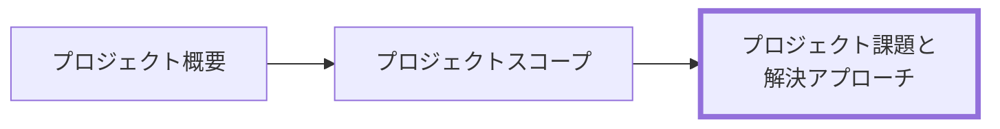

# プロジェクト課題と解決アプローチ 作成ルール

Project Issues and Approach Documentation Rules

本ドキュメントは、**プロジェクト課題と解決アプローチ（Project Issues and Approach）** を統一形式で記述するためのルールです。
関係者が「何が課題で、どれを、どう解く方針か（なぜその方針か）」を短時間で合意できる粒度に整えます。

## 1. 全体方針

- 本ルールの対象は **プロジェクト課題と解決アプローチ**（課題の整理と、採用アプローチの合意）です。
- 目的は「意思決定の前提を揃える」ことです。詳細な設計・実装・テスト設計は、本書の対象外とします。
- 曖昧表現（例:「適切に」「可能な限り」「十分に」）は避け、合意できる表現にします。
- “事実/観察” と “推測/仮説” を混ぜないでください（混ざる場合はラベルで区別）。
- 解決策は最低 2 案を候補として挙げ、採用理由を明記します（単一案の押し付けは禁止）。

## 2. 位置づけと用語定義

### 2.1. 位置づけ（他ドキュメントとの関係）

プロジェクト課題と解決アプローチと他ドキュメントの関係を示します。



### 2.2. 用語定義（本ルール内）

| 用語                     | 定義                                                                              |
| ------------------------ | --------------------------------------------------------------------------------- |
| **課題**                 | 困っている現象（観察できる問題）。解決策の先取り（例:「自動発注がない」）にしない |
| **影響**                 | 課題が放置された場合に起きる損失/リスク（業務・顧客・コスト・期日など）           |
| **原因**                 | 課題の発生要因（事実と仮説を区別する）                                            |
| **解決策候補**           | 課題を解決するための案（複数案）                                                  |
| **判断軸**               | 採否判断に使う観点（効果/コスト/期間/リスク/現場適合など）                        |
| **採用アプローチ**       | 採用する案と、その実行方針（なぜそれを選ぶかを含む）                              |
| **トレードオフ**         | 採用の代償として失うもの/我慢するもの                                             |
| **リスク**               | 失敗/遅延/品質低下などの可能性と、その軽減策                                      |
| **次の検討事項（ToDo）** | 未確定事項、追加調査、意思決定が必要な事項                                        |

## 3. ファイル命名・ID規則

### 3.1. 配置（推奨）

- `docs/ja/project-docs/prj-0001/` のように、プロジェクト単位のフォルダ配下に配置します。
- 配下の章フォルダは、原則として次を用います（構成は [docs-structure-guide.md](../guidelines/docs-structure-guide.md) に従う）。
  - `030-プロジェクト課題と解決アプローチ/`
- 章フォルダには、該当ドキュメント以外に、課題と方針の根拠となる関連資料（図表、参考資料など）を置いてもよい。

### 3.2. ドキュメントID（推奨）

メタ情報（Frontmatter）を付ける場合、ID は一意である必要があります。

- 推奨: `prj-<projectNo>-issues-and-approach`
  - 例: `prj-0001-issues-and-approach`

### 3.3. ファイル名（推奨）

ファイル名は日本語で可読性を優先し、ID は Frontmatter で担保します。

- 例:
  - `030-プロジェクト課題と解決アプローチ-<プロジェクト名>.md`

## 4. 推奨 Frontmatter 項目

### 4.1. 設定内容

- プロジェクト課題と解決アプローチでも、機械可読性が必要な場合は YAML Frontmatter を付与します。
- 参照スキーマ: [docs/shared/schemas/spec-frontmatter.schema.yaml](../../../shared/schemas/spec-frontmatter.schema.yaml)
- メタ情報ルール: [meta-document-metadata-rules.md](meta-document-metadata-rules.md)

| 項目       | 説明                                               | 必須 |
| ---------- | -------------------------------------------------- | ---- |
| id         | `prj-<projectNo>-issues-and-approach`              | ○    |
| type       | `project` 固定                                     | ○    |
| title      | プロジェクト課題と解決アプローチ: <プロジェクト名> | ○    |
| status     | `draft` / `ready` / `deprecated`                   | ○    |
| based_on   | 既存の経営方針・制度資料・過去 ADR                 | 任意 |
| supersedes | 置き換え関係                                       | 任意 |

### 4.2. 推奨ルール

- `based_on` は、根拠として直接参照するものがある場合のみ列挙します（なければ `[]`）。

### 4.3. 推奨例

```yaml
---
id: prj-0001-issues-and-approach
type: project
title: プロジェクト課題と解決アプローチ: <プロジェクト名>
status: draft
based_on: []
supersedes: []
---
```

## 5. 本文構成（標準テンプレ）

プロジェクト課題と解決アプローチは以下の見出し構成を **順序固定** で配置します。

### 5.1. プロジェクト課題と解決アプローチ（Project Issues and Approach）

| 番号 | 見出し               | 必須 | 内容（要点）                                 |
| ---- | -------------------- | ---- | -------------------------------------------- |
| 1    | 課題一覧             | ○    | 課題、影響、優先度（最小でも課題の列挙）     |
| 2    | 原因（仮説でも可）   | ○    | 課題の原因（事実と仮説を分ける）             |
| 3    | 解決策候補           | ○    | 候補案（複数案が望ましい）                   |
| 4    | 採用アプローチと理由 | ○    | 採用案、採用理由、採用しない案と理由         |
| 5    | トレードオフ/リスク  | 任意 | 代償、リスク、前提が崩れた場合の対応         |
| 6    | 次の検討事項（ToDo） | 任意 | 未確定事項、追加調査、意思決定が必要な事項等 |

## 6. 記述ガイド

### 6.1. 共通

- 見出し配下は「箇条書き＋必要最小限の表」を基本とします。
- “事実/観察” と “推測/仮説” を混ぜないでください（混ざる場合はラベルで区別）。
- 読み手が「次に何を決めればよいか」が分かるように、未確定は未確定として明示します。

### 6.2. 課題一覧

- 課題は「困っている現象」を書き、解決策の先取り（例:「自動発注がない」）にしないでください。
- 各課題には、最低限「影響」と「優先度」を添えます。
- 推奨: 課題IDを振って、議論や ADR 参照に使えるようにします。

推奨（課題表）:

| 課題ID | 課題 | 影響 | 優先度 | 備考 |
| ------ | ---- | ---- | ------ | ---- |
| P-01   |      |      | High   |      |

### 6.3. 原因（仮説でも可）

- 原因は分解して書きます（例: 情報不足、判断基準の不在、手順のばらつき、システム制約）。
- 事実として確認できているものと、推測/仮説を混ぜないでください。

### 6.4. 解決策候補

- 最低 2 案を候補として挙げます。
- 案ごとに「概要」と「期待できる効果」を 1〜3 行で書きます。

### 6.5. 採用アプローチと理由

- 採用案を明記し、採用理由を判断軸で説明します。
- 採用しない案がある場合は、採用しない理由も 1 行で添えます。
- 推奨: 判断軸（効果/コスト/期間/リスク/現場適合）のうち、今回重視する順序を示します。

### 6.6. トレードオフ/リスク（任意）

- トレードオフは「何を捨てる/先送りする/我慢するか」を明示します。
- リスクは「起きうること」と「軽減策」をセットで書きます。

### 6.7. 次の検討事項（ToDo）（任意）

- 次の意思決定に必要な情報（追加調査、確認事項、承認事項）を列挙します。

## 7. 禁止事項

| 項目                                                  | 理由                                       |
| ----------------------------------------------------- | ------------------------------------------ |
| 設計詳細（DB設計、API設計、画面詳細等）               | プロダクト仕様/設計ドキュメントへ委譲      |
| “だいたい/適切に” 等の曖昧表現                        | 合意・検証ができない                       |
| 課題を解決策の欠落として書く（例:「自動発注がない」） | 問題の同定ができず、手段が固定化する       |
| 候補を 1 案しか出さない                               | 判断とトレードオフが不透明になる           |
| 理由のない採用（判断軸が書かれていない）              | 後から説明できず、意思決定がやり直しになる |

## 8. サンプル（最小）

```yaml
---
id: prj-0001-issues-and-approach
type: project
title: プロジェクト課題と解決アプローチ: 駄菓子屋きぬや 店頭販売システムの構築
status: draft
based_on: []
supersedes: []
---
```

### 8.1. 課題一覧

| 課題ID | 課題                                       | 影響                               | 優先度 | 備考               |
| ------ | ------------------------------------------ | ---------------------------------- | ------ | ------------------ |
| P-01   | 人気商品の欠品が増えている                 | 機会損失が発生し、来店動機が下がる | High   | 対象商品は後で合意 |
| P-02   | 仕入れ数量の判断が勘頼りで在庫ムラが大きい | 過剰在庫/廃棄、資金繰り悪化        | High   | 棚卸頻度も影響     |
| P-03   | 「つけ（ツケ）」の残高が曖昧               | もめごと・回収漏れ・確認コスト     | Medium | 現金と混在         |
| P-04   | 店主に判断が集中し、引き継ぎが難しい       | 営業継続リスク、属人化             | Medium | 店番交代時に顕在化 |

### 8.2. 原因（仮説でも可）

- P-01/P-02: 仕入れ判断に必要な情報（売れ行き、現在庫、入荷リードタイム）が見える化されていない（事実）
- P-01/P-02: 判断基準が暗黙知で、棚卸・発注のタイミングが人によって揺れる（仮説）
- P-03: 「つけ」を記録する場所が統一されておらず、後で追えない（事実）
- P-04: 店主だけが在庫と顧客状況を把握しており、代替運用が定義されていない（事実）

### 8.3. 解決策候補

- 案A: 店頭で使える最小の販売登録＋在庫/つけの記録を作り、毎日の記録を習慣化する
- 案B: まずは棚卸と発注のルール（手順書）を整備し、紙/表計算で運用を安定させる
- 案C: 外部のPOS/在庫サービスを導入し、標準機能で運用を置き換える

### 8.4. 採用アプローチと理由

- 採用: 案A（最小の記録システムを先に稼働させ、運用定着を優先する）
- 判断軸（優先順）: 現場適合（継続できる） > 期間（早く回す） > コスト > リスク
- 採用理由:
  - 日々の記録が続かないと、棚卸/発注の改善も継続できないため
  - 外部サービスは運用が複雑になる可能性があり、初期はシンプルさを優先するため
- 採用しない案と理由:
  - 案B: 記録の継続が属人化しやすく、改善が形骸化しやすい
  - 案C: 導入/学習コストと運用の複雑さが初期目的に対して過大

### 8.5. トレードオフ/リスク（任意）

- トレードオフ: 初期リリースでは高度な分析や外部連携は扱わない（運用定着後に検討）
- リスク: 入力が増えて店頭負荷が上がり、記録が続かない可能性
  - 軽減策: 入力項目を最小化し、店員の操作フローを先に検証する

### 8.6. 次の検討事項（ToDo）（任意）

- 対象商品の定義（人気商品とは何か）
- 棚卸の頻度と責任者
- 「つけ」を許容する運用ルール（上限、回収タイミング）

## 9. 生成 AI への指示テンプレート

生成 AI にプロジェクト課題と解決アプローチを作らせるときの指示テンプレートは [prj-issues-and-approach-instruction.md](../instructions/prj-issues-and-approach-instruction.md) を参照してください。
