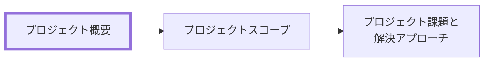

# プロジェクト概要 作成ルール

Project Overview Documentation Rules

本ドキュメントは、**プロジェクト概要（Project Overview）** を統一形式で記述するためのルールです。
関係者が「なぜやるのか」を短時間で合意できる粒度に整えます。

## 1. 全体方針

- 本ルールの対象は **プロジェクト概要**（背景と目的、狙いの共有）です。
- 目的は「意思決定の前提を揃える」ことです。詳細な設計・実装・テスト設計は、本書の対象外とします。
- 曖昧表現（例:「適切に」「可能な限り」「十分に」）は避け、合意できる表現にします。
- 数値目標（KPI 等）を置ける場合は置きます。ただし、根拠や測定方法が不明な“雰囲気目標”は禁止です（不明なら「未確定」と明記）。

## 2. 位置づけと用語定義

### 2.1. 位置づけ（他ドキュメントとの関係）

プロジェクト概要と他ドキュメントの関係を示します。



### 2.2. 用語定義（本ルール内）

| 用語           | 定義                                                          |
| -------------- | ------------------------------------------------------------- |
| **背景**       | 現状と問題の文脈（事実・観察・状況）                          |
| **目的**       | 達成したい状態（プロジェクト成功の定義の一部）                |
| **必要性**     | なぜ今やる必要があるか（放置リスク、期限、外部要因）          |
| **期待効果**   | 目的達成により得られる効果（定量/定性）                       |
| **前提条件**   | 変えないもの/依存するもの（組織・運用・予算・技術・制度など） |
| **スコープ外** | 意図的にやらないもの（理由も添える）                          |

## 3. ファイル命名・ID規則

### 3.1. 配置（推奨）

- `docs/ja/project-docs/prj-0001/` のように、プロジェクト単位のフォルダ配下に配置します。
- 配下の章フォルダは、原則として次を用います（構成は [docs-structure-guide.md](../guidelines/docs-structure-guide.md) に従う）。
  - `010-プロジェクト概要/`
- 章フォルダには、該当ドキュメント以外に、プロジェクトの背景や目的に関わる関連資料（図表、参考資料など）を置いてもよい。

### 3.2. ドキュメントID（推奨）

メタ情報（Frontmatter）を付ける場合、ID は一意である必要があります。

- 推奨: `prj-<projectNo>-overview`
  - 例: `prj-0001-overview`

### 3.3. ファイル名（推奨）

ファイル名は日本語で可読性を優先し、ID は Frontmatter で担保します。

- 例:
  - `010-プロジェクト概要-<プロジェクト名>.md`

## 4. 推奨 Frontmatter 項目

### 4.1. 設定内容

Frontmatter は共通スキーマに従います（あわせてドキュメントのメタ情報の記述ルールも参照）。

- 参照スキーマ: [docs/shared/schemas/spec-frontmatter.schema.yaml](../../../shared/schemas/spec-frontmatter.schema.yaml)
- メタ情報ルール: [meta-document-metadata-rules.md](meta-document-metadata-rules.md)

| 項目       | 説明                               | 必須 |
| ---------- | ---------------------------------- | ---- |
| id         | `prj-<projectNo>-overview`         | ○    |
| type       | `project` 固定                     | ○    |
| title      | プロジェクト概要: <プロジェクト名> | ○    |
| status     | `draft` / `ready` / `deprecated`   | ○    |
| based_on   | 既存の経営方針・制度資料・過去 ADR | 任意 |
| supersedes | 置き換え関係                       | 任意 |

### 4.2. 推奨ルール

- `based_on` は、既存の経営方針・制度資料・過去 ADR など、根拠として直接参照するものがある場合のみ列挙します。

## 5. 本文構成（標準テンプレ）

プロジェクト概要は以下の見出し構成を **順序固定** で配置します。

### 5.1. プロジェクト概要（Project Overview）

| 番号 | 見出し     | 必須 | 内容（要点）                             |
| ---- | ---------- | ---- | ---------------------------------------- |
| 1    | 背景       | ○    | 現状、困りごと、発生している問題         |
| 2    | 目的       | ○    | 達成したい状態（成功の定義）             |
| 3    | 必要性     | ○    | 今やる理由、放置リスク、期限/外部要因    |
| 4    | 期待効果   | ○    | 期待する効果（可能なら定量指標）         |
| 5    | 前提条件   | ○    | 依存条件、制約、変えないこと             |
| 6    | 関係者メモ | 任意 | 合意が必要な点、意思決定者、注意事項など |

## 6. 記述ガイド

### 6.1. 共通

- 見出し配下は「箇条書き＋必要最小限の表」を基本とします。
- “事実/観察” と “推測/仮説” を混ぜないでください（混ざる場合はラベルで区別）。
- 読み手が「次に何を決めればよいか」が分かるように、未確定は未確定として明示します。

### 6.2. 背景

- 何が起きているか（現状）と、何が困りごとか（問題）を分けて書きます。
- 推奨: 事実は具体例（頻度・件数・影響）を添える。

### 6.3. 目的

- 「〜を改善する」だけではなく、改善後の状態（利用者・現場の状態）を書きます。
- 推奨: 目的を 1〜3 行に絞る（増やす場合は優先度を付ける）。

### 6.4. 必要性

- 期限、制度/契約、競合、障害、属人化など「今やる理由」を明確にします。

### 6.5. 期待効果

- 可能なら、以下のような最小の計測定義を置きます（不明なら空欄ではなく「未確定」）。

| 指標 | 現状 | 目標 | 測定方法 | 備考 |
| ---- | ---- | ---- | -------- | ---- |
|      |      |      |          |      |

### 6.6. 前提条件

- 変えない前提（例: 運用体制は当面変えない）と、依存前提（例: 他部門の協力が必要）を区別します。

## 7. 禁止事項

| 項目                           | 理由                                  |
| ------------------------------ | ------------------------------------- |
| 設計詳細（DB設計、API設計等）  | プロダクト仕様/設計ドキュメントへ委譲 |
| “だいたい/適切に” 等の曖昧表現 | 合意・検証ができない                  |
| 根拠のない数値目標             | 誤った期待形成・炎上の原因になる      |

## 8. サンプル（最小）

```yaml
---
id: prj-0001-overview
type: project
title: プロジェクト概要: 駄菓子屋きぬや 店頭販売システムの構築
status: draft
based_on: []
supersedes: []
---
```

### 8.1. 背景

- 地域の子どもたちに長年親しまれている「駄菓子屋きぬや」では、販売記録や在庫管理をノートと記憶に頼っている。
- 店主（算野きぬ）の高齢化により物忘れが増え、次の問題が顕在化している。
  - 人気商品（うまい棒、ラムネ等）の欠品が増えてきた
  - 仕入れのタイミングや数量が勘頼りで、在庫のムラが大きい
  - 常連の子どもや近所の大人の「つけ（ツケ）」の管理が曖昧で、記録漏れや確認コストが発生している

### 8.2. 目的

- 駄菓子の販売・在庫・顧客（常連）の情報を、シンプルな仕組みで一元管理できる状態にする。
- おばあちゃん一人でも無理なく操作できる画面と操作フローを提供し、日々の記録が継続できる状態にする。
- 欠品と過剰在庫を減らし、小さなお店の利益と継続性を高める。

### 8.3. 必要性

- このまま記憶と紙運用を続けると、欠品や在庫過多による損失が増え、店舗継続リスクが高まる。
- 店主以外が店番をした際に状況が分からず、販売・在庫・つけの判断が属人化している。
- 新しい運用を定着させるには、繁忙期前に最小機能で稼働させ、日々の記録を先に習慣化する必要がある。

### 8.4. 期待効果

- 欠品と在庫ムラの低減により、機会損失（売り逃し）と廃棄・滞留を減らす。
- 「つけ」の残高が可視化され、確認の手間とトラブルを減らす。

可能なら、効果は次のように測定可能な形で定義する。

| 指標                    | 現状   | 目標            | 測定方法                         | 備考                          |
| ----------------------- | ------ | --------------- | -------------------------------- | ----------------------------- |
| 人気商品の欠品回数      | 未確定 | 月間 50% 削減   | 欠品発生を日次で記録し、月次集計 | 対象商品の定義は別途合意      |
| 売れ残り/廃棄によるムダ | 未確定 | 年間 20% 削減   | 廃棄・値引き・滞留を記録し集計   | 初期は廃棄のみでも可          |
| 「つけ」残高の確認時間  | 未確定 | 確認が 1 分以内 | 画面上で顧客検索→残高表示        | 体感/観察でもよいが根拠を残す |

### 8.5. 前提条件

- 対象は単一店舗（きぬや）の店頭販売と、店頭在庫・常連顧客の管理に限定する。
- 初期リリースでは、EC 連携・複数店舗管理・本格会計連携などは対象外とする。
- 操作端末は店内のタブレット 1 台を想定し、オフライン時の運用は未確定（未確定の場合は別途意思決定する）。

## 9. 生成 AI への指示テンプレート

生成 AI にプロジェクト概要を作らせるときの指示テンプレートは [prj-overview-instruction.md](../instructions/prj-overview-instruction.md) を参照してください。
