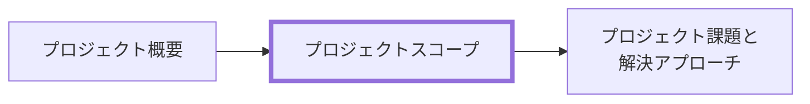

# プロジェクトスコープ 作成ルール

Project Scope Documentation Rules

本ドキュメントは、**プロジェクトスコープ（Project Scope）** を統一形式で記述するためのルールです。
関係者が「何をやる/やらないのか（対象範囲/対象外）」を短時間で合意できる粒度に整えます。

## 1. 全体方針

- 本ルールの対象は **プロジェクトスコープ**（対象範囲/対象外の合意）です。
- 目的は「意思決定の前提を揃える」ことです。詳細な設計・実装・テスト設計は、本書の対象外とします。
- 曖昧表現（例:「適切に」「可能な限り」「十分に」）は避け、合意できる表現にします。
- スコープは “やること” だけでなく “やらないこと” を明示します（スコープ外の未記載は禁止）。
- スコープは設計の詳細ではなく、**境界条件の合意**です（例: 単一店舗か、外部連携は含むか、初期リリースの範囲など）。

## 2. 位置づけと用語定義

### 2.1. 位置づけ（他ドキュメントとの関係）

プロジェクトスコープと他ドキュメントの関係を示します。



### 2.2. 用語定義（本ルール内）

| 用語             | 定義                                                                    |
| ---------------- | ----------------------------------------------------------------------- |
| **スコープ内**   | 今回やること（対象範囲）。英語表記では In と呼ぶことがある              |
| **対象業務**     | 対象とする業務/プロセス（誰が・何を・どこまで、の粒度）                 |
| **対象システム** | 対象とするシステム/機能/利用者（どの機能までを今回の成果物に含めるか）  |
| **対象期間**     | 今回のスコープを適用する期間（例: 初期リリース〜運用開始）              |
| **スコープ外**   | 意図的にやらないこと（理由も添える）。英語表記では Out と呼ぶことがある |
| **境界**         | スコープに含める/含めないの判断線（迷ったときの判断基準）               |

## 3. ファイル命名・ID規則

### 3.1. 配置（推奨）

- `docs/ja/project-docs/prj-0001/` のように、プロジェクト単位のフォルダ配下に配置します。
- 配下の章フォルダは、原則として次を用います（構成は [docs-structure-guide.md](../guidelines/docs-structure-guide.md) に従う）。
  - `020-プロジェクトスコープ/`
- 章フォルダには、該当ドキュメント以外に、プロジェクトスコープに関わる関連資料（図表、参考資料など）を置いてもよい。

### 3.2. ドキュメントID（推奨）

メタ情報（Frontmatter）を付ける場合、ID は一意である必要があります。

- 推奨: `prj-<projectNo>-scope`
  - 例: `prj-0001-scope`

### 3.3. ファイル名（推奨）

ファイル名は日本語で可読性を優先し、ID は Frontmatter で担保します。

- 例:
  - `020-プロジェクトスコープ-<プロジェクト名>.md`

## 4. 推奨 Frontmatter 項目

### 4.1. 設定内容

- プロジェクトスコープでも、機械可読性が必要な場合は YAML Frontmatter を付与します。
- 参照スキーマ: [docs/shared/schemas/spec-frontmatter.schema.yaml](../../../shared/schemas/spec-frontmatter.schema.yaml)
- メタ情報ルール: [meta-document-metadata-rules.md](meta-document-metadata-rules.md)

| 項目       | 説明                                   | 必須 |
| ---------- | -------------------------------------- | ---- |
| id         | `prj-<projectNo>-scope`                | ○    |
| type       | `project` 固定                         | ○    |
| title      | プロジェクトスコープ: <プロジェクト名> | ○    |
| status     | `draft` / `ready` / `deprecated`       | ○    |
| based_on   | 既存の経営方針・制度資料・過去 ADR     | 任意 |
| supersedes | 置き換え関係                           | 任意 |

### 4.2. 推奨ルール

- `based_on` は、根拠として直接参照するものがある場合のみ列挙します（なければ `[]`）。

### 4.3. 推奨例

```yaml
---
id: prj-0001-scope
type: project
title: プロジェクトスコープ: <プロジェクト名>
status: draft
based_on: []
supersedes: []
---
```

## 5. 本文構成（標準テンプレ）

プロジェクトスコープは以下の見出し構成を **順序固定** で配置します。

### 5.1. プロジェクトスコープ（Project Scope）

| 番号 | 見出し           | 必須 | 内容（要点）                                 |
| ---- | ---------------- | ---- | -------------------------------------------- |
| 1    | 対象業務         | ○    | 対象となる業務/プロセス                      |
| 2    | 対象システム     | ○    | 対象となるシステム/機能/利用者               |
| 3    | 対象期間         | ○    | 対象となる期間（例: 初期リリース〜運用開始） |
| 4    | スコープ外       | ○    | 明示的にやらないこと（理由も記載）           |
| 5    | 境界の判断基準   | 任意 | 迷ったときの判断原則（SSOT）                 |
| 6    | スコープ変更方針 | 任意 | 変更手続き、承認者、影響評価の観点           |

※ SSOT: Single Source of Truth（唯一の判断基準）

## 6. 記述ガイド

### 6.1. 共通

- 見出し配下は「箇条書き＋必要最小限の表」を基本とします。
- “事実/観察” と “推測/仮説” を混ぜないでください（混ざる場合はラベルで区別）。
- 読み手が「次に何を決めればよいか」が分かるように、未確定は未確定として明示します。

### 6.2. 対象業務

- “業務” は機能名ではなく、現場で行う作業・判断の単位で書きます。
- 推奨: 対象者（例: 店員/店主/本部）も添えます。

### 6.3. 対象システム

- 対象機能は粒度を揃えます（例: 「販売登録」「在庫管理」「顧客管理」のような大項目）。
- UI/画面遷移やAPI一覧などの詳細は、本ドキュメントでは書きません。

### 6.4. 対象期間

- “いつからいつまで” が決まっていない場合は、イベント基準で書いてよい（例: 初期リリース〜運用定着まで）。
- 未確定なら未確定と明記し、決めるための条件（意思決定ポイント）を添えます。

### 6.5. スコープ外

- スコープ外は “やらない宣言” です。曖昧にしないでください。
- 推奨: スコープ外にした理由（コスト/効果/責務境界/他プロジェクトで担保等）を 1 行で添えます。

推奨（スコープ外（Out）一覧）:

- <対象（Out）>: <理由>（任意: いつ/どこで扱うか）
  - 例: EC サイトやネット注文: 店頭販売の改善を優先する（運用定着後に次フェーズで検討）

項目が多い・比較や棚卸が必要な場合のみ、表形式にしてもよい:

| 対象（Out） | 理由 | 補足（いつ/どこで扱うか） |
| ----------- | ---- | ------------------------- |

### 6.6. 境界の判断基準（任意）

迷ったときに参照できる SSOT（判断原則）を 1〜3 行で書きます。

例:

> 初期リリースでは「店頭の記録が継続できる」ことを優先し、分析機能や外部連携は後続フェーズで扱う。

### 6.7. スコープ変更方針（任意）

- 変更の入口（誰が提案できるか）
- 影響評価の観点（工数/費用/期日/運用/リスク）
- 承認者

推奨（変更提案の最小テンプレ）:

- 変更内容: 何をスコープ内に追加/削除するか
- トレードオフ: その代わりに何をスコープ外にするか（スコープ外は 6.5 の Out 一覧も更新）
- 影響評価: 工数/費用/期日/運用/リスク
- 承認者: 誰が最終判断するか
- 記録: 判断理由を ADR または課題一覧に残す（可能ならリンクを付ける）

## 7. 禁止事項

| 項目                           | 理由                                  |
| ------------------------------ | ------------------------------------- |
| 設計詳細（DB設計、API設計等）  | プロダクト仕様/設計ドキュメントへ委譲 |
| “だいたい/適切に” 等の曖昧表現 | 合意・検証ができない                  |
| スコープ外の未記載             | 境界が曖昧になり手戻りの原因になる    |
| 機能一覧の粒度がバラバラ       | 認識が揃わず、見積・優先度が崩れる    |

## 8. サンプル（最小）

```yaml
---
id: prj-0001-scope
type: project
title: プロジェクトスコープ: 駄菓子屋きぬや 店頭販売システムの構築
status: draft
based_on: []
supersedes: []
---
```

### 8.1. 対象業務

- 駄菓子の店頭販売（現金／つけ）
- 店頭在庫の管理（棚卸、入荷、廃棄）
- 常連顧客の簡易的な顧客管理（名前、ニックネーム、つけ残高）

### 8.2. 対象システム

- 販売登録（商品選択、支払い方法選択）
- 在庫管理（入荷登録、棚卸、在庫一覧）
- 顧客管理（顧客登録、つけ管理）
- 簡易レポート（日次売上一覧、在庫低下アラート）

### 8.3. 対象期間

- 初期リリース（最小機能の稼働）から運用定着まで（具体日付は未確定）

### 8.4. スコープ外

- 複数店舗管理: 単一店舗の運用定着を優先する（運用定着後に次フェーズで検討）
- EC サイトやネット注文: 店頭販売の改善を優先する（運用定着後に次フェーズで検討）
- 複雑なポイント・クーポン制度: 初期は手順の単純化を優先する（必要性が明確になった段階で再検討）
- 本格的な会計システムとの連携: 初期は責務を分離し、手作業の運用で代替する（運用定着後に要否判断）

### 8.5. 境界の判断基準（任意）

> 初期リリースで優先するのは「店頭での販売と在庫の記録が止まらないこと」。
> そのため、店員が日々使わない高度な分析や外部連携はスコープ外とし、運用定着後に改めて要否判断する。

### 8.6. スコープ変更方針（任意）

- 変更提案: 店主・店員・開発チームが提案できる
- 承認: 店主（プロダクトオーナー）＋開発リーダーの合意
- 影響評価: 期日（初期リリース）、運用負荷（店頭の手順増加）、コスト、リスク（データ移行/再教育）
- 変更の扱い:
  - 初期リリース前に入れる場合は、必ず「何をやらないか（Out）」を同時に更新してトレードオフを明示する
  - 初期リリース後は、次フェーズのスコープとして扱い、ADR または課題一覧で判断理由を残す

## 9. 生成 AI への指示テンプレート

生成 AI にプロジェクトスコープを作らせるときの指示テンプレートは [prj-scope-instruction.md](../instructions/prj-scope-instruction.md) を参照してください。
