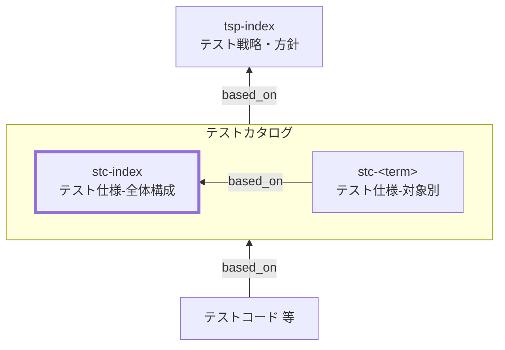

System Test Catalog (STC) Index Documentation Rules

本ドキュメントは、総合テストカタログ（STC）の全体概要 `stc-index` を統一形式で記述するためのルールです。
TSPに基づき、総合テストに共通するルールや方針（対象分割・観点/条件・環境/証跡）を定義します。

個別総合テストカタログ（`stc-<term>`）の記述ルールは [stc-rules.md](stc-rules.md) を参照してください。

## 1. 全体方針

`stc-index` は、総合テストカタログ（STC）を **運用可能な最小情報** で統一し、
対象別カタログ（`stc-<term>`）の品質と一貫性を担保するための **共通ルール（SSOT）** とする。

- `stc-index` は **「考え方・共通方針・共通定義」** を記述する（個別ケースは持たない）
- 個別の観点・条件・ケースは **`stc-<term>` に集約**し、詳細は **テストコード／CI／テストレポート等の証跡** に寄せる
- 記述は **レビュー可能**であることを優先し、長文化を避ける（方針は箇条書き中心）
- 「例外」や「対象外」を明示し、総合テストの責任境界（何をやらないか）を固定する
- `tsp-index` の方針を根拠として、総合テストに共通する **分割基準・観点/条件の立て方・環境/外部依存の扱い・合格基準・証跡** を定義する

## 2. 位置づけ（他ドキュメントとの関係）

`stc-index` と他ドキュメントの関係を示します。



## 3. ファイル命名・ID規則

- 本ルールの対象ドキュメントの `id` は `stc-index` 固定。対象別は `stc-<term>`（詳細は [stc-rules.md](stc-rules.md)）。
- ファイル名は `stc-010-総合テストカタログ-概要.md` 等、プロジェクト内で一意になるように命名します。
- `<term>` は用語集の論理名キー（英小文字kebab-case）を用いる（表示名は title に日本語で記載してよい）。

## 4. 推奨 Frontmatter 項目

### 4.1. 設定内容

Frontmatter は共通スキーマに従います（参照: [docs/shared/schemas/spec-frontmatter.schema.yaml](../../../shared/schemas/spec-frontmatter.schema.yaml) / [meta-document-metadata-rules.md](meta-document-metadata-rules.md)）。

| 項目       | 説明                                               | 必須 |
| ---------- | -------------------------------------------------- | ---- |
| id         | `stc-index`（固定）                                | ○    |
| type       | `test` 固定                                        | ○    |
| title      | 総合テストカタログ: 概要（`<システム名>`）         | ○    |
| status     | `draft` / `ready` / `deprecated`                   | ○    |
| based_on   | 根拠となる仕様ID（ID配列。未指定時は `[]` を許容） | 任意 |
| supersedes | 置き換え関係（ID配列。未指定時は `[]` を許容）     | 任意 |

### 4.2. 推奨ルール

- `based_on` には最低限 `tsp-index` を含めます。
- BAC/NFR/BR 等は、`stc-index` の方針判断（対象分割・環境前提・共通合格基準）に **直接利用したものだけ** を `based_on` に列挙します。
- `based_on` / `supersedes` は ID 配列（未指定は `[]` 可）。

## 5. 本文構成（標準テンプレ）

`stc-index` は以下の見出し構成を **順序固定** で配置します。

| 番号 | 見出し                                          | 必須 |
| ---- | ----------------------------------------------- | ---- |
| 1    | 本ドキュメントの目的と適用対象                  | ○    |
| 2    | テスト対象の括り方と分割基準                    | ○    |
| 3    | 対象外・除外理由（共通）                        | ○    |
| 4    | 観点の立て方（共通）                            | ○    |
| 5    | 条件の立て方（共通）                            | ○    |
| 6    | 観点/条件の採用基準と対象別への分配方針（共通） | ○    |
| 7    | 総合テスト共通の境界/環境の扱い                 | ○    |
| 8    | ケース表の共通カラム                            | ○    |
| 9    | メモ / 将来課題                                 | 任意 |

注意：次章の記述ガイドのMarkdown見出しはルール文章内の参照用であり、
生成する `stc-index` 本文の見出しは各章で指定された **番号付き** の形式に置き換えてください。

## 6. 記述ガイド

### 6.1. 本ドキュメントの目的と適用対象

生成する `stc-index` 本文の見出しは **## 1. 本ドキュメントの目的と適用対象**

- 目的：`stc-<term>` を同一基準で作成し、品質・粒度・責任範囲を揃える
- 適用対象：総合テスト（ST）に関するカタログ群（`stc-index` / `stc-<term>`）
- 非適用：UT/IT/ET/ATの個別ルールはそれぞれの `*c-index` / `*c-<term>` で扱う
- 成果物の位置づけ：
  - `stc-index`：総合テスト共通方針（SSOT）
  - `stc-<term>`：対象別の観点・条件・ケース表（SSOT）
  - テストコード／CI／レポート：実装と実行証跡（Evidence）

- 本書が扱う粒度：**判断基準・共通ルールまで**（個別ケースの大量列挙は禁止）

### 6.2. テスト対象の括り方と分割基準

生成する `stc-index` 本文の見出しは **## 2. テスト対象の括り方と分割基準**

本節では、`stc-<term>` の `<term>` をどう切るか（対象単位の設計）を定義します。

- `<term>` は「ユーザ価値/業務シナリオのまとまり」（例：主要業務フロー、代表ユースケース、エンドツーエンド経路）とする
- 分割基準（推奨順）：
  1. **業務/価値境界**：1シナリオとして説明できる（開始条件→完了条件）
  2. **境界横断**：複数コンポーネント/サブシステムを跨ぐ経路が同質
  3. **データ境界**：同じデータライフサイクル（作成→更新→確定等）を扱う
  4. **運用境界**：運用手順・監視観測点・権限が概ね一致する

- 過分割の禁止：`stc-<term>` が「1〜2ケースしかない」単位は原則統合する
- 肥大化の抑制（分割の目安）：
  - 観点が過剰（例：15以上）／表の行数が過剰（例：60以上）になったら分割候補
  - 前提データや権限が大きく異なる経路が混在する場合は分割候補

### 6.3. 対象外・除外理由（共通）

生成する `stc-index` 本文の見出しは **## 3. 対象外・除外理由（共通）**

総合テストで **やらないこと** と、その **理由**、および **例外条件** を明確にします。

#### 6.3.1. 記述ルール

- 形式は **「対象外」「除外理由」「代替レベル/代替手段」「例外」** のセットを基本とする
- 「代替レベル/代替手段」は、UT/IT/ET/AT/NFR 等 **どこで担保するか** を必ず記載する
- 例外を認める場合は **判断基準**（いつ/どの条件で）を明記する

#### 6.3.2. 推奨フォーマット（表）

| 対象外（やらないこと） | 除外理由 | 代替レベル/代替手段 | 例外（STで扱う条件） |
| ---------------------- | -------- | ------------------- | -------------------- |

#### 6.3.3. 典型例（記載候補）

- 厳密な性能・負荷・耐久（p95、スループット、長時間運転）
- 侵入テスト/本格的なセキュリティ診断
- 全ブラウザ/全端末の網羅互換（広範なマトリクス）
- 外部事業者の全障害パターン網羅（必要ならETに寄せる）

### 6.4. 観点の立て方（共通）

生成する `stc-index` 本文の見出しは **## 4. 観点の立て方（共通）**

総合テストの観点は「ユーザ/業務視点で、システム全体として何を保証するか」の切り口です。

- 観点の型（最低限この順で検討）：
  - 業務フローの成立（開始条件→完了条件、主要分岐）
  - 例外/リカバリ（入力不正、権限、競合、外部失敗、再実行）
  - データ整合性（複数コンポーネント間の整合、冪等、二重処理防止）
  - 監視/運用観測（ログ相関、監視アラート条件、監査証跡）
  - 代表的な非機能（STで扱う範囲のみ：タイムアウト、回復、限定的な性能目安）

- 命名規則：**「名詞＋品質/振る舞い」**（例：`業務フロー成立` / `例外時リカバリ` / `データ整合性`）
- 粒度規則：
  - 観点は「条件が複数ぶら下がる」程度にまとめる
  - 抽象的すぎて条件が作れない観点は再定義する

- 重複禁止：同義の観点名を乱立させない（統合・改名）

### 6.5. 条件の立て方（共通）

生成する `stc-index` 本文の見出しは **## 5. 条件の立て方（共通）**

条件は「入力」「状態（データ/権限）」「環境（設定/外部）」「経路（分岐）」に分解して作成します。

- 入力（Input）：代表値／境界値／異常値
- 状態（State）：事前データ、権限/ロール、ステータス、ライフサイクル段階
- 環境（Env）：設定値、feature flag、外部I/Fのsandbox/スタブ状態、ネットワーク条件
- 経路（Path）：主要分岐（成功/失敗/再試行/取消 等）

組合せルール（増やし過ぎ防止）：

- まず代表シナリオ（正常系）を作る
- 次に重要分岐（業務的に重要/頻出/損失大）を追加する
- 最後に重大例外（データ破壊/二重処理/権限逸脱につながるもの）を追加する
- 原則として全組合せ（直積）は作らない（必要時は理由と管理方法を明記）

### 6.6. 観点/条件の採用基準と対象別への分配方針（共通）

生成する `stc-index` 本文の見出しは **## 6. 観点/条件の採用基準と対象別への分配方針（共通）**

本節では、観点/条件を「採用する判断」と「`stc-<term>` へ割り当てる判断」を共通ルールとして定義します。

#### 6.6.1. 採用基準（共通）

- 観点は「1観点=1合否命題」で採用する（複数命題の混在を禁止）
- 条件は「1条件=1差分（入力/状態/環境/経路）」で採用する
- 追加時は、次のいずれかに該当する根拠を明示する
  - 失敗時の業務影響が大きい（誤処理/業務停止/監査不備など）
  - 境界/例外/状態遷移の欠落が不具合につながりやすい
  - 上位仕様（BAC/NFR/BR等）に明示的な要求がある
- 「重要そうだから」など根拠不明の採用はしない

#### 6.6.2. 対象別への分配方針（共通）

- 観点/条件は、責務を持つ `stc-<term>` に **主担当1つ** を割り当てる（重複割当は例外扱い）
- 複数 `stc-<term>` に跨る場合は、主担当 + 従担当（参照）で表現し、重複記載を避ける
- 分配判断は「業務/価値境界」「境界横断」「運用境界」の順で決める
- 分配結果は `stc-<term>` 側のケース表とトレース列で追跡可能にする

推奨フォーマット（例）:

| 観点/条件 | 採用理由 | 主担当 `stc-<term>` | 従担当（任意） | 備考 |
| --------- | -------- | ------------------- | -------------- | ---- |

### 6.7. 総合テスト共通の境界/環境の扱い

生成する `stc-index` 本文の見出しは **## 7. 総合テスト共通の境界/環境の扱い**

総合テストでは「実運用に近い経路」を確認しつつ、運用可能性（再現性・安全性・費用）を優先して境界と環境前提を固定します。

- 環境：
  - 原則：ST専用の検証環境（staging相当）を想定し、バージョン/設定の固定ルールを明記する
  - テストデータ：namespace・初期化・後始末（削除/期限/再利用）を共通方針として定める

- 外部依存：
  - 原則：ETで担保すべき「外部事業者の詳細」はSTで無理に網羅しない
  - STでは、代表的な成功/失敗（例：外部が一時不可）を **sandbox/スタブ/疑似応答** で再現する方針を定める

- UI/操作：
  - STではユーザ操作を扱ってよいが、手順は **高位の行動記述** に留め、クリック列挙を避ける（詳細はテストコードへ）

- 観測点（Evidence）：
  - 期待値は「画面/レスポンス」だけでなく、**DB状態・イベント・ログ相関ID・監査ログ** 等の観測点を含める
  - 証跡の標準：CI run、レポート、スクリーンショット/動画、ログ相関キー、外部リクエストID 等の形式を定める

- 合格基準（共通）：
  - P0シナリオは必須成功、P1はリリース条件に応じ、P2は計画的消化など、共通の判定基準を明記する

### 6.8. ケース表の共通カラム

生成する `stc-index` 本文の見出しは **## 8. ケース表の共通カラム**

`stc-<term>` の末端（条件・ケース表）は、検索性・比較性・自動化移行の容易さを確保するため、
全termで同一カラム順を採用します。

必須カラム：

- `case_id`（ケースID）：対象別に一意なIDで変更しない
  - 形式：`<level>-<term>-<perspective_key>-<nnn>`（`level` は `st`）
  - 例：`st-order-place-flow-success-010`
  - `perspective_key` は kebab-case のキー文字列（英小文字＋数字＋ハイフン）で、原則変更しない
  - `nnn` は 10刻み（010,020,030…）推奨

- `条件`：`入力:` `状態:` `環境:` `経路:` の要点（必要なものだけ記載）
- `手順（最小）`：高位の最小手順（クリック列挙禁止）
- `期待値`：判定可能な合格条件（観測点を含める）

推奨カラム（運用必須）：

- `観測点（アサーション）`：画面/レスポンス/状態/イベント/ログ相関など
- `環境/依存`：sandbox/スタブ、設定、データnamespace 等
- `トレース`：req/spec/ac/issue 等のID
- `優先度`：P0/P1/P2
- `自動化`：manual/automated/mixed
- `証跡`：CI/レポート/スクショ/動画/ログ相関キー 等の参照先

注意：

- 表の1行＝1テスト（条件×期待値が一意）
- 詳細はテストコードへ寄せ、カタログは「レビュー可能な最小情報」を維持する

### 6.9. メモ / 将来課題

生成する `stc-index` 本文の見出しは **## 9. メモ / 将来課題**

- 将来検討（例）：
  - 実行時間短縮（スモーク/回帰の分離）
  - 証跡リンク形式の統一（レポート保存場所、ログ検索クエリ）
  - テストデータ自動生成/後始末の標準化
  - カタログlint（case_id重複、必須列欠落など）

## 7. 禁止事項

| 項目                                                           | 理由                                                                   |
| -------------------------------------------------------------- | ---------------------------------------------------------------------- |
| `stc-index` に個別ケース（条件・手順・期待値）を大量に列挙する | `stc-index` は共通方針のSSOTであり、個別は `stc-<term>` に集約するため |
| 環境前提（データ/設定/外部依存）を対象ごとに無根拠に変更する   | 再現性が崩れ、CI/運用が不安定になるため                                |
| 手順にUI操作のクリック列挙を書く                               | 保守性が低く、変更に弱く、意図が見えなくなるため                       |
| 期待値を曖昧に書く（例：「正常に動くこと」）                   | 判定不能で合否が揺れ、証跡として機能しないため                         |
| `case_id` を後から変更する（参照があるのに変更する）           | トレース・証跡リンクが壊れ、履歴追跡が不能になるため                   |

## 8. サンプル（最小）

注：以下はルール文書内の例示です。生成する `stc-index` では `## 1...` から始まります。

```yaml
---
id: stc-index
type: test
title: 総合テストカタログ: 概要
status: draft
based_on: [tsp-index]
supersedes: []
---
```

### 8.1. 本ドキュメントの目的と適用対象

`stc-index` は、総合テストに共通する「対象単位の切り方」「観点/条件の立て方」「環境/外部依存」「合格基準」「証跡方針」を定義し、
対象別カタログ `stc-<term>` の作成と運用の基盤とする。

### 8.2. テスト対象の括り方と分割基準

`stc-<term>` の `<term>` は主要業務フロー/ユーザシナリオのまとまりとし、
業務境界・境界横断の同質性・データライフサイクル・運用境界を基準に分割する。

## 9. 生成 AI への指示テンプレート

生成 AI に `stc-index` を作らせるときの指示テンプレートは [`stc-index-instruction.md`](../instructions/stc-index-instruction.md) を参照してください。
