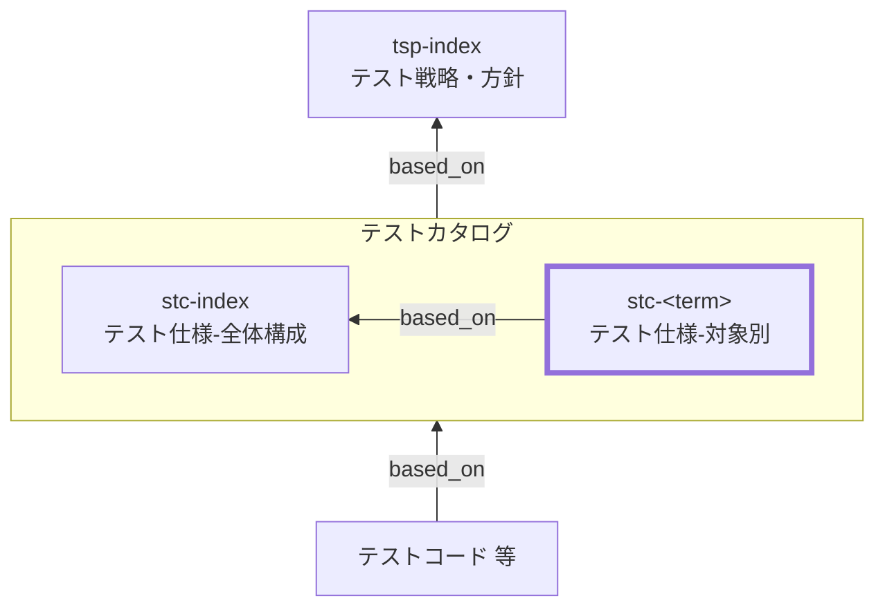

System Test Catalog (STC) Documentation Rules

本ドキュメントは、総合テストカタログ（STC）の対象別 `stc-<term>` を統一形式で記述するためのルールです。
`stc-index` を前提に、SSOTの本体として、対象ごとの **総合テストの目的・責務・境界・環境前提、観点 x 条件=ケース、トレース、証跡** を明文化します。

## 1. 全体方針

個別 STC（`stc-<term>`）は、総合テストにおける SSOT の本体として、対象ごとの狙いと境界を明確化し、
観点×条件＝ケース（末端表）を最小情報で整理して、テスト実装／CI／テストレポート証跡へ確実に接続できる形で記述する。

- `stc-<term>` は **対象固有の情報のみ** を記述し、共通ルールは `stc-index` を参照する（重複記述しない）
- 総合テストの目的は「**実運用に近い経路で、システム全体として業務が成立すること**」の確認である
- ケースは「表の1行＝1テスト（1シナリオ）」とし、手順と期待値は **判定可能** な粒度で簡潔に書く
- クリック列挙や画面要素の細部説明は避け、手順は **高位の行動** と **観測点** に寄せる（詳細はテストコードへ）
- すべての観点・ケースは、根拠仕様（`based_on` / `トレース`）と、証跡（CI/レポート/ログ相関等）に接続されていること
- 環境・テストデータ・外部依存（sandbox/スタブ等）は **再現性** を優先し、対象ごとに無根拠に変更しない（例外は根拠を明記）

## 2. 位置づけ（他ドキュメントとの関係）

個別 STC（`stc-<term>`）と他ドキュメントの関係を示します。



## 3. ファイル命名・ID規則

- `id` は `stc-<term>`（kebab-case。例: `stc-order-place`）。
- ファイル名は `stc-010-総合テストカタログ-<term>.md` 等（例: `stc-010-総合テストカタログ-注文確定.md`）。
- `<term>` は用語集(GL) の論理名キー（英小文字kebab-case）を用いる（表示名は title / ファイル名で日本語を使用してよい）。

## 4. 推奨 Frontmatter 項目

### 4.1. 設定内容

Frontmatter は共通スキーマに従います（あわせてドキュメントのメタ情報の記述ルールも参照）。

- 参照スキーマ: [docs/shared/schemas/spec-frontmatter.schema.yaml](../../../shared/schemas/spec-frontmatter.schema.yaml)
- メタ情報ルール: [meta-document-metadata-rules.md](meta-document-metadata-rules.md)

| 項目       | 説明                                                                             | 必須 |
| ---------- | -------------------------------------------------------------------------------- | ---- |
| id         | STC ID（個別: `stc-<term>`）                                                     | ○    |
| type       | `test` 固定                                                                      | ○    |
| title      | 総合テストカタログ: <対象名>                                                     | ○    |
| status     | `draft` / `ready` / `deprecated`                                                 | ○    |
| based_on   | 根拠仕様（最低限: `tsp-index`, `stc-index`。対象固有の根拠は本文トレースに集約） | ○    |
| part_of    | 集約ドキュメントへの所属（ID配列）                                               | 任意 |
| supersedes | 置き換え関係（ID配列）                                                           | 任意 |

### 4.2. 推奨ルール

- `based_on` は原則 `[tsp-index, stc-index]` を最低限とする。
- 対象固有の根拠（`br-*` / `bac-*` / `spec-*` / `nfr-*` / `ac-*` / `issue-*` 等）は本文「トレース」に集約する。
  機械処理上の都合で `based_on` にも列挙する場合は、本文トレースと矛盾しないこと。
- 記述内容が多くなる場合は、対象を分割し、`part_of` で集約ドキュメントに所属させる。
- `part_of` / `based_on` / `supersedes` は ID 配列（未指定は `[]` 可）。

## 5. 本文構成（標準テンプレ）

個別 STC（`stc-<term>`）は以下の見出し構成を **順序固定** で配置します。

| 番号 | 見出し             | 必須 |
| ---- | ------------------ | ---- |
| 1    | 概要（`<term>`）   | ○    |
| 2    | 目的               | ○    |
| 3    | 対象外             | ○    |
| 4    | 境界/環境/依存     | ○    |
| 5    | トレース           | ○    |
| 6    | テスト観点とケース | ○    |

注意：次章の記述ガイドのMarkdown見出しはルール文章内の参照用であり、
生成する `stc-<term>` 本文の見出しは各章で指定された **番号付き** の形式に置き換えてください。

## 6. 記述ガイド

### 6.1. 概要（`<term>`）

生成する `stc-<term>` 本文の見出しは **## 1. 概要（&lt;term&gt;）**

本節では、対象（`<term>`）が何であり、どの業務シナリオ/経路を本カタログで扱うかを簡潔に示します。

- `<term>` の説明（1〜3行）：業務/ユーザ価値のまとまりとして記述する（開始条件→完了条件が想像できる形）
- 期待する利用者：レビューア／実装者／テスト実装者が前提を把握できる内容にする
- 対象の粒度：`stc-index` の分割基準に従い、過分割／肥大化を避ける
- 関連コンポーネントや主要I/F（任意）：主要画面、API、バッチ、イベント等を列挙してよい
- 詳細な仕様説明や長い背景は書かない（根拠はトレースで示す）

### 6.2. 目的

生成する `stc-<term>` 本文の見出しは **## 2. 目的**

本節では、「この総合テスト対象で何を保証したいか」を明確にします（責務というより **狙い**）。

- 箇条書きで 3〜7 個程度を目安に、**動詞で始まる** 形で記述する
  - 例：主要業務フローが完了できる／主要分岐で破綻しない／再実行で二重処理しない／監査証跡が残る

- 目的は観点の上位概念であり、観点は目的を分解した切り口（目的≠観点）
- 可能なら観測可能な成果（画面表示、API応答、DB状態、イベント、ログ相関ID等）とセットで書く
- 目的に含まれないものは「対象外」へ移す（曖昧さを残さない）

### 6.3. 対象外

生成する `stc-<term>` 本文の見出しは **## 3. 対象外**

本節では、「この対象カタログ（`stc-<term>`）ではやらないこと」を明示します。
`stc-index` の「対象外・除外理由（共通）」と矛盾しないことが前提です。

- 対象外は「なぜ除外するか（理由）」とセットで書く
- 可能なら「代替するレベル」（UT/IT/ET/AT/NFR 等）も併記する
- 対象固有の対象外（例：別業務フロー、別サブシステムの責務）を明確にする
- 例外としてSTで扱う場合は、条件・根拠・環境前提（sandbox/スタブ/データ準備）を明記する

推奨フォーマット（簡易）：

- 対象外：xxx（理由：yyy、代替：zzz）

### 6.4. 境界/環境/依存

生成する `stc-<term>` 本文の見出しは **## 4. 境界/環境/依存**

本節では、総合テストにおける「境界（どこからどこまでが対象か）」と
「環境前提」「外部依存（sandbox/スタブ/疑似等）」を明確にします。

- 境界：開始トリガ/入口（画面/API/バッチ等）と、完了条件/出口（完了状態、発行イベント等）を明記する
- 環境：ST環境名、主要設定、テストデータの準備・後始末（namespace/初期化/削除）を列挙する
- 外部依存：依存先ごとに「扱い」を決める
  - 外部サービス：sandbox/スタブ/疑似応答（成功/代表失敗/一時不可など）
  - メール/SMS/Push：ダミー配送・検証用受信箱・ログ確認の方針
  - 決済/配送など：本番課金/実配送は原則しない（例外は条件を明記）

- 観測点（Evidence）：何を見て合否判定するかを明記する
  - 画面/レスポンス、DB状態、イベント、監査ログ、相関ID、外部リクエストID 等

- 例外：環境や依存の扱いを変える場合は、理由と影響（再現性・コスト・安全性）を明記する

### 6.5. トレース

生成する `stc-<term>` 本文の見出しは **## 5. トレース**

本節では、`stc-<term>` の根拠となる上位成果物との対応関係を示します。
本カタログにおけるトレースの一次情報（SSOT）は **`## 5. トレース`** とし、
観点・ケース表では **trace_key（`TR-xx`）参照** に統一します。

#### 6.5.1. 記述ルール（trace_key）

- 各トレース項目に **trace_key（`TR-xx`）** を付与する（例：`TR-01`, `TR-02` …）
- `trace_key` は **本ドキュメント内で一意**で、原則変更しない
- 観点・ケース表の `トレース` 列には **仕様IDを直書きせず**、`TR-xx` を列挙する
- ケース表に新しい根拠が必要になった場合は、**先に本節の表へ行追加**し、付与された `trace_key` をケース表で参照する
- `TR-xx` の採番は追加順。削除しても欠番は詰めない。

#### 6.5.2. トレース表（標準フォーマット）

| trace_key | 仕様ID  | 要点    | 備考 |
| --------- | ------- | ------- | ---- |
| TR-01     | br-...  | （1行） | 任意 |
| TR-02     | bac-... | （1行） | 任意 |

- `要点` は「ケース作成の判断に使ったポイント」を **1行**で書く（冗長な仕様説明はしない）

### 6.6. テスト観点とケース

生成する `stc-<term>` 本文の見出しは **## 6. テスト観点とケース**

本節は `stc-<term>` の中心です。観点（見出し）→ ケース表（末端表）の順で構成します。

#### 6.6.1. 観点:<観点>

生成する `stc-<term>` 本文の見出しは **### 6.1. 観点:<観点>**

- 観点は `stc-index` の「観点の立て方（共通）」に従って命名する
- 観点の粒度は「条件が複数ぶら下がる」程度にまとめる（乱立を避ける）
- 観点名（見出し）は改善のため変更してよいが、`perspective_key` は原則変更しない（変更が必要なら `supersedes` 等で追跡する）

##### 6.6.1.1. 意図

生成する `stc-<term>` 本文の見出しは **#### 6.1.1. 意図**

- 観点ごとに「意図（この観点で保証すること）」を 1〜2 行で書く

##### 6.6.1.2. 条件・ケース表

生成する `stc-<term>` 本文の見出しは **#### 6.1.2. 条件・ケース表**

- ケース表の 1 行は「1テスト（1シナリオ）」を表す（条件×期待値が一意）
- 必須カラムは `stc-index` の定義に従う
- `case_id` は以下を推奨し、変更しない
  - 形式：`<level>-<term>-<perspective_key>-<nnn>`（`level` は `st`）
  - `perspective_key`：kebab-case（英小文字＋数字＋ハイフン）。原則変更しない
  - `nnn`：3桁、10刻み（010,020,030…）推奨

- 条件は `入力:` `状態:` `環境:` `経路:` の要点で表現する（必要な要素のみ記載）
- 手順は **高位の最小手順** に留め、クリック列挙は禁止（詳細はテストコードへ）
- 期待値は判定可能に書く（画面/レスポンスに加え、DB状態、イベント、監査ログ、相関IDなどの観測点を含める）
- 証跡は CI/レポート/ログ相関/スクショ等へ接続できる形で書く（例：パス、CI run ID、レポートURLキー等）

推奨：観点ごとのケース数は「代表→重要分岐→重大例外」の順で増やし、直積（全組合せ）を原則避ける

## 7. 禁止事項

| 禁止事項                                                                       | 理由                                                       |
| ------------------------------------------------------------------------------ | ---------------------------------------------------------- |
| `stc-index` の共通方針を `stc-<term>` 側で勝手に上書きする（環境/依存/対象外） | 再現性が崩れ、レビュー・運用が困難になるため               |
| ケース表にUIクリック手順や画面要素の細部を大量に列挙する                       | 変更に弱く、意図が読めず、保守不能になるため               |
| 期待値を曖昧に書く（例：「正常に動くこと」「問題がないこと」）                 | 合否判定ができず証跡にならないため                         |
| `case_id` を変更する／再利用する                                               | トレース・証跡リンクが破壊され、履歴追跡が不能になるため   |
| `perspective_key` を観点名の修正に合わせて頻繁に変える                         | ID体系が不安定になり参照が壊れるため                       |
| 直積（全組合せ）のケースを無条件に作る                                         | ケース爆発で運用不能になるため（必要時は理由・範囲を明記） |
| トレースや証跡を持たないケースを恒久的に残す                                   | SSOTとして成立しないため（暫定は期限/理由を明記）          |

## 8. サンプル（最小）

注：以下はルール文書内の例示です。生成する `stc-<term>` では `## 1...` から始まります。

```yaml
---
id: stc-order-place
type: test
title: 総合テストカタログ: 注文確定（order-place）
status: draft
part_of: []
based_on: [tsp-index, stc-index]
supersedes: []
---
```

### 8.1. 概要（order-place）

ユーザがカートから注文を確定し、決済（sandbox）を経て注文が確定状態になり、監査/通知の証跡が残る経路を扱う。

### 8.2. 目的

- 注文確定フローが完了条件（注文=確定）まで到達できることを保証する
- 決済失敗時に注文が不整合にならず、適切にエラーハンドリングされることを保証する
- 監査ログ/相関IDにより追跡可能であることを保証する

### 8.3. 対象外

- 本番決済の実課金（理由：安全性、代替：ET/事業者検証）
- 全ブラウザ網羅の表示互換（理由：範囲過大、代替：別途互換試験）

### 8.4. 境界/環境/依存

- 境界：開始=カート確定操作、完了=注文が確定状態＋通知イベント発行
- 環境：staging、テストデータnamespace=st-xxx（毎回初期化）
- 外部決済：sandbox（成功/残高不足の代表失敗のみ）
- 観測点：画面結果、注文DB状態、イベント、監査ログ（correlation_id）

### 8.5. トレース

| trace_key | 仕様ID      | 要点               | 備考 |
| --------- | ----------- | ------------------ | ---- |
| TR-01     | br-order-01 | 注文確定の完了条件 |      |
| TR-02     | bac-pay-02  | 決済失敗時の扱い   |      |

### 8.6. テスト観点とケース

#### 8.6.1. 観点：業務フロー成立

##### 8.6.1.1. 意図

代表条件で注文確定が完了し、状態・監査証跡が揃うことを確認する。

##### 8.6.1.2. 条件・ケース表

| case_id                         | 条件                                    | 手順（最小）       | 期待値                                  | 観測点（アサーション）                 | 環境/依存            | トレース | 優先度 | 自動化    | 証跡                         |
| ------------------------------- | --------------------------------------- | ------------------ | --------------------------------------- | -------------------------------------- | -------------------- | -------- | ------ | --------- | ---------------------------- |
| st-order-place-flow-success-010 | 状態: 在庫あり / 環境: 決済=sandbox成功 | 注文確定を実行する | 注文=確定になり通知イベントが発行される | DB状態/イベント/監査ログcorrelation_id | staging, pay=sandbox | TR-01    | P0     | automated | e2e/order/place.spec.ts, CI# |

## 9. 生成 AI への指示テンプレート

生成 AI に個別 STC（`stc-<term>`）を作らせるときの指示テンプレートは `stc-instruction.md` を参照してください。
