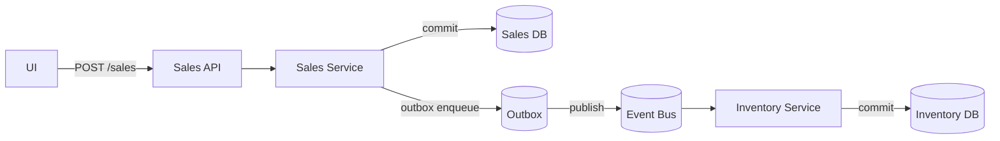
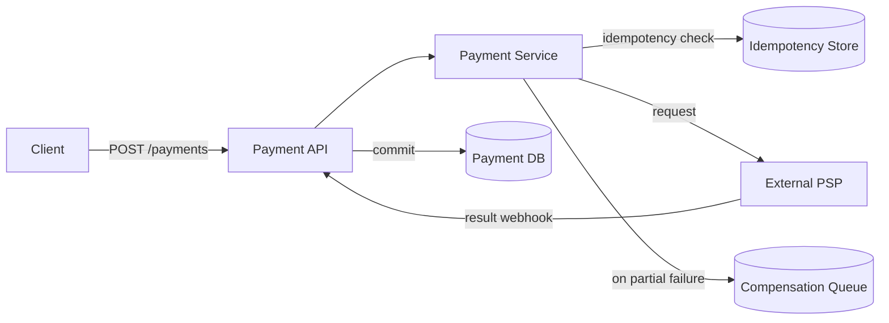
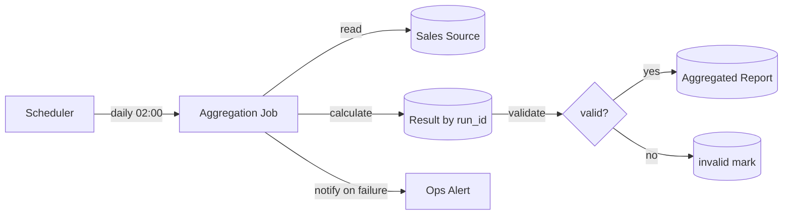

System Design Flows (SDF) Documentation Rules

本ドキュメントは、システム設計情報を **コード（定義ファイル）へ寄せる運用（Code as Spec）** を前提に、
「読まないと事故る」重要フローだけを最小限で記述する **System Design Flows（SDF）** の記述ルールを定義する。

SDF は詳細設計書ではない。**実装・テスト・運用の共通理解が必要な“難所”** に限定して可視化する。

## 1. 全体方針

SDF は、以下を目的とする。

- **誤解や事故が起きやすい処理**（冪等・非同期・補償・整合性・外部障害など）を最小限で共有する
- 実装が拡張されても崩れにくい **境界・永続化点・失敗時挙動** をSSOTとして残す
- テスト（ITS/ETS/STS）および運用（OPD/OPR）へ **観点と導線** を提供する

基本方針:

- 重要フローは **最大5件** を原則とし、追加時は統合・削減で総数を維持する
- 詳細手順の逐語化は行わず、境界・永続化点・整合性・冪等・失敗時・観測性を明示する
- API/イベント/DB/ジョブ/設定の詳細はコード・定義ファイルをSSOTとし、SDFは導線を担う

## 2. 位置づけと用語定義

### 2.1. 位置づけ

- `sdf-index`：システム設計上の重要フローを集約する文書（本体）
- `sdi-index`：SSOTへのリンク集（SDFから必ず参照する）
- `its-*` / `ets-*` / `sts-*`：SDFで示した観点を検証するテスト仕様
- `opd-*` / `opr-*`：失敗時運用・監視・手順の実行ルール
- `adr-*`：設計判断の背景・採否理由

### 2.2. 用語定義

| 用語       | 定義                                                         |
| ---------- | ------------------------------------------------------------ |
| 重要フロー | 実装・運用事故に直結しやすく、共通理解が必須な処理フロー     |
| 永続化点   | commit / outbox / enqueue など、状態確定や配送起点となる地点 |
| 補償       | 一部成功後の不整合を是正するための戻し・取り消し・代替処理   |

## 3. ファイル命名・ID規則

- ルールドキュメントIDは `sdf-rules` を用いる。
- 生成対象ドキュメントIDは `sdf-index` を推奨する。
- フローIDは `sdf-001` 形式の連番とし、1フロー=1IDとする。
- フロータイトルは業務結果が分かる表現を使う（例: `sdf-001: 売上確定→在庫更新→発注候補生成`）。

## 4. 推奨 Frontmatter 項目

### 4.1. 設定内容

Frontmatter は共通スキーマに従います（参照: [docs/shared/schemas/spec-frontmatter.schema.yaml](../../../shared/schemas/spec-frontmatter.schema.yaml) / [meta-document-metadata-rules.md](meta-document-metadata-rules.md)）。

| 項目       | 説明                                            | 必須 |
| ---------- | ----------------------------------------------- | ---- |
| id         | SDF ID（推奨: `sdf-index`）                     | ○    |
| type       | `architecture` など共通スキーマで許容される種別 | ○    |
| title      | システム設計: 重要フロー                        | ○    |
| status     | `draft` / `ready` / `deprecated`                | ○    |
| based_on   | 根拠となる仕様ID（ID配列。未指定は `[]` 可）    | 任意 |
| supersedes | 置き換え関係（ID配列。未指定は `[]` 可）        | 任意 |

### 4.2. 推奨ルール

- `based_on` には対象フローの判断に直接利用した成果物のみを列挙する。
- `based_on` / `supersedes` は ID 配列（未指定は `[]` 可）。

## 5. 本文構成（標準テンプレ）

`sdf-index` は以下の見出し構成を **順序固定** で配置する。

| 番号 | 見出し                                      | 必須 |
| ---- | ------------------------------------------- | ---- |
| 1    | 概要（対象・運用方針）                      | ○    |
| 2    | 重要フロー一覧（最大5件）                   | ○    |
| 3    | フロー詳細（IDごと）                        | ○    |
| 4    | 観測性と運用連携                            | ○    |
| 5    | 関連ドキュメント導線（SDI/テスト/運用/ADR） | ○    |

`3. フロー詳細` は、フローIDごとに以下の構成で記述する。

- ヘッダ：ID、フロー名、目的、トリガー、範囲（含む/含まない）
- フロー概要：図（推奨Mermaid）または箇条書き、登場要素、永続化点
- 整合性・冪等・再実行：整合性モデル、冪等キー、重複時挙動、再実行方針
- 失敗時：失敗分類、リトライ方針、補償/ロールバック、影響・通知
- 観測性：trace_id引き回し、必須ログ項目、監査ログ要件
- 参照：SDI、外部I/F、NFR、OPD/OPR、ADR、ITS/ETS/STS

補足:

- フロー数が5件を超える場合は、分割前に統合・重複排除を検討する。

## 6. 記述ガイド

### 6.1. 概要（対象・運用方針）

生成する本文の見出しは **## 1. 概要（対象・運用方針）**

- SDFの適用対象と「最大5件運用」の方針を1〜3段落で明記する。
- SDFが詳細実装書ではなく、事故予防のための重要フロー文書であることを明記する。
- SSOTはコード/定義ファイル側であること（SDFは導線）を明記する。

### 6.2. 重要フロー一覧（最大5件）

生成する本文の見出しは **## 2. 重要フロー一覧（最大5件）**

- フローID、フロー名、事故論点、優先度、備考を表形式で記載する。
- 一覧は最大5件までとし、6件目以降は統合・削減の検討結果を反映してから追加する。
- 事故論点は「冪等」「非同期整合性」「補償」「外部I/F障害」「再実行性」などで明示する。

重要フロー選定の判断基準（いずれか該当）:

- 冪等が必須（重複実行の現実的リスクがある）
- 非同期（順序・再実行・重複が絡む）
- 補償が必要（分散トランザクション、取り消し、戻し）
- 整合性が難しい（最終的整合性、二重書き込み、在庫/金額/残高）
- 外部I/F障害が業務影響に直結（タイムアウト、リトライ、部分失敗）
- 監査対象（改ざん/追跡が必要）
- 性能/可用性のボトルネック候補（ピーク処理、バッチ遅延）

### 6.3. フロー詳細（IDごと）

生成する本文の見出しは **## 3. フロー詳細（IDごと）**

各フローは以下を順に記載する。

- ヘッダ：ID、フロー名、目的、トリガー、範囲（含む/含まない）
- フロー概要：図（推奨Mermaid）または箇条書き、登場要素、永続化点
  - 図は原則として **C4ダイアグラムのコンポーネント図レベル相当**（コンテナ内の主要コンポーネント間連携）で記述する
- 整合性・冪等・再実行：整合性モデル、冪等キー、重複時挙動、再実行方針
- 失敗時：失敗分類、リトライ方針、補償/ロールバック、影響・通知
- 観測性：trace_id引き回し、必須ログ項目、監査ログ要件
- 参照：SDI、外部I/F、NFR、OPD/OPR、ADR、ITS/ETS/STS

図の記法（推奨）:

- Flowchart：境界と流れ（同期/非同期）を表現
- SequenceDiagram：時系列と呼び出し順（必要時のみ）
- 概要図の粒度は **C4コンポーネント図レベル相当** とし、実装クラス/メソッド詳細には踏み込まない



図に必ず入れる情報:

- 境界（システム内/外、サービス境界）
- 永続化点（commit/outbox/enqueue）
- 非同期点（queue/event）
- 主要識別子（冪等キー、entity_id）

### 6.4. 観測性と運用連携

生成する本文の見出しは **## 4. 観測性と運用連携**

- 各フローで trace_id 伝搬範囲を明記する。
- 必須ログ項目（`flow_id`, `request_id`, `entity_id`, `result` 等）を最低限定義する。
- 監視条件（アラート閾値）、手動介入条件、OPR手順への導線を明記する。
- 業務影響の大きい失敗は OPD の停止判断基準に接続する。

### 6.5. 関連ドキュメント導線

生成する本文の見出しは **## 5. 関連ドキュメント導線**

- 各フローごとに SDI（一次情報）、テスト仕様（ITS/ETS/STS）、運用（OPD/OPR）、ADR を明記する。
- 参照先は「ID」または「リポジトリ相対パス」で一意に辿れる形にする。
- 分冊が無い場合でも `（本書のみ）` または `（なし）` を明記し、空欄にしない。

## 7. 禁止事項

| 禁止事項                                    | 理由                                     |
| ------------------------------------------- | ---------------------------------------- |
| 正常系を逐語で長文記述する                  | 重要論点が埋もれて参照性が落ちるため     |
| 図を巨大化させ複数論点を混在させる          | 1フロー1論点の原則が崩れるため           |
| 実装クラス名/メソッド名/DBカラムを列挙する  | コードSSOTと二重管理になるため           |
| 冪等/整合性/失敗時の記述を省略する          | SDFの主目的を満たせないため              |
| SDI・運用・テスト・ADRへの導線を置かない    | 実行・検証・運用へ接続できないため       |
| 重要フローを6件以上に増やす（無整理の追加） | 文書が肥大化し、合意形成が困難になるため |

## 8. サンプル

注：以下はルール文書内の例示です。生成する `sdf-index` では `## 1...` から始まります。

```yaml
---
id: sdf-index
type: architecture
title: システム設計: 重要フロー
status: draft
based_on: []
supersedes: []
---
```

### 8.1. 概要（対象・運用方針）

本書は、事故影響の大きい重要フローを最大5件まで整理し、
設計・テスト・運用が同じ前提で判断できる状態を作る。

### 8.2. 重要フロー一覧（最大5件）

| フローID | フロー名                       | 事故論点                               | 優先度 | 備考       |
| -------- | ------------------------------ | -------------------------------------- | ------ | ---------- |
| sdf-001  | 売上確定→在庫更新→発注候補生成 | 非同期整合性 / 冪等                    | 高     | outbox採用 |
| sdf-002  | 外部決済作成                   | タイムアウト / リトライ / 二重課金防止 | 高     | 補償あり   |
| sdf-003  | バッチ再実行（売上集計）       | 再実行性 / run_id / 重複排除           | 中     | 日次ジョブ |

### 8.3. フロー詳細（IDごと）

#### 8.3.1. sdf-001: 売上確定→在庫更新→発注候補生成（非同期）

- **目的**：売上確定を起点に在庫を更新し、在庫不足時に発注候補を生成する
- **トリガー**：`POST /sales`（内部API）
- **範囲**：売上確定、在庫更新イベント発行、発注候補生成（外部仕入先送信は別フロー）

##### 8.3.1.1. フロー概要


##### 8.3.1.2. 整合性・冪等・再実行

- 整合性：売上確定は同期で確定、在庫更新はイベントで最終的整合性
- 冪等キー：`sale_id`
- 重複時：同一 `sale_id` は二重計上しない（既処理判定）
- 再実行：イベントはリプレイ可能、`event_id` で重複排除

##### 8.3.1.3. 失敗時

- イベント発行失敗：outbox再送（指数バックオフ、最大5回）
- 在庫更新失敗：メッセージをDLQへ退避し、Ops通知後に手動リプレイ

##### 8.3.1.4. 観測性

- trace_id を API→イベント→在庫更新まで継承
- 必須ログ：`flow_id`, `sale_id`, `event_id`, `result`, `retry_count`
- 監査：売上確定は who/when/amount/before/after を記録

##### 8.3.1.5. 参照

- SDI：`api/openapi.yaml`、`api/asyncapi.yaml`、`db/migrations/*`
- テスト：ITS（内部結合）、STS（E2E）
- 運用：OPD（監視/アラート）、OPR（DLQ対応）
- ADR：outbox採用理由

#### 8.3.2. sdf-002: 外部決済作成（タイムアウト/リトライ/二重課金防止）

- **目的**：決済要求の成功率を担保しつつ、二重課金を防止する
- **トリガー**：`POST /payments`
- **範囲**：決済要求送信、結果確定、失敗時補償（返金）

##### 8.3.2.1. フロー概要



##### 8.3.2.2. 整合性・冪等・再実行

- 整合性：外部確定前は `pending`、確定通知で `confirmed` へ遷移
- 冪等キー：`payment_request_id`
- 重複時：同一キーは既存決済結果を返却し、新規作成しない
- 再実行：タイムアウト時のみ最大3回リトライ（指数バックオフ）

##### 8.3.2.3. 失敗時

- 3回失敗で `manual_review` へ遷移
- 部分失敗（外部成功/内部失敗）は補償キューへ投入し、返金または再同期

##### 8.3.2.4. 観測性

- 必須ログ：`flow_id`, `payment_request_id`, `provider_tx_id`, `result`, `error_code`
- アラート条件：外部失敗率 > 5% / 5分

##### 8.3.2.5. 参照

- SDI：外部I/F仕様、決済API仕様
- テスト：ETS（外部I/F障害系）、STS（決済E2E）
- 運用：OPR（障害一次対応）、OPD（停止判断基準）
- ADR：補償方式（返金優先）

#### 8.3.3. sdf-003: 売上集計バッチ再実行（run_id単位）

- **目的**：集計失敗時に重複計上なく安全に再実行する
- **トリガー**：日次スケジュール（`02:00 JST`）
- **範囲**：集計ジョブ実行、結果反映、失敗時再実行

##### 8.3.3.1. フロー概要



##### 8.3.3.2. 整合性・冪等・再実行

- 整合性：`run_id` 単位で結果を分離し、最新成功runのみ採用
- 冪等キー：`aggregation_date + run_id`
- 再実行上限：自動1回、以降はOps承認で手動再実行

##### 8.3.3.3. 失敗時

- 失敗時は部分結果を `invalid` マークし採用対象から除外
- 2回連続失敗でP2アラートを発報し、OPRへエスカレーション

##### 8.3.3.4. 観測性

- 必須ログ：`flow_id`, `job_name`, `run_id`, `input_count`, `output_count`, `result`

##### 8.3.3.5. 参照

- SDI：ジョブ定義、DB migration
- テスト：ITS（再実行性）、STS（月次締め影響）
- 運用：OPR（バッチ再実行手順）、OPD（SLA）

### 8.4. 観測性と運用連携

| 項目     | ルール                                                       | 監視/運用連携                          |
| -------- | ------------------------------------------------------------ | -------------------------------------- |
| trace_id | API入口で採番し、イベント・ジョブまで必ず伝搬                | 監査調査時は trace_id を起点に横断追跡 |
| 必須ログ | `flow_id`, `request_id`, `entity_id`, `result`, `error_code` | 欠落時は開発品質アラート               |
| 失敗通知 | P1/P2相当は即時通知、P3は定時集約可                          | OPR の一次対応手順へ接続               |
| 手動介入 | DLQ滞留、再実行上限超過、補償失敗時に介入                    | OPD の停止判断基準に従う               |

### 8.5. 関連ドキュメント導線

| 種別     | ドキュメントID/参照先                                                   | 目的                   | 備考 |
| -------- | ----------------------------------------------------------------------- | ---------------------- | ---- |
| SSOT     | sdi-index / `api/openapi.yaml` / `api/asyncapi.yaml` / `db/migrations/` | 一次情報参照           | 必須 |
| テスト   | its-index / ets-index / sts-index                                       | 観点検証               | 必須 |
| 運用     | opd-index / opr-index                                                   | 監視・障害対応・再実行 | 必須 |
| 判断記録 | adr-index                                                               | 例外・設計判断の追跡   | 必須 |

## 9. 生成 AI への指示テンプレート

生成 AI に `sdf-index` を作成させるときの指示テンプレートは `sdf-instruction.md` を参照してください。
