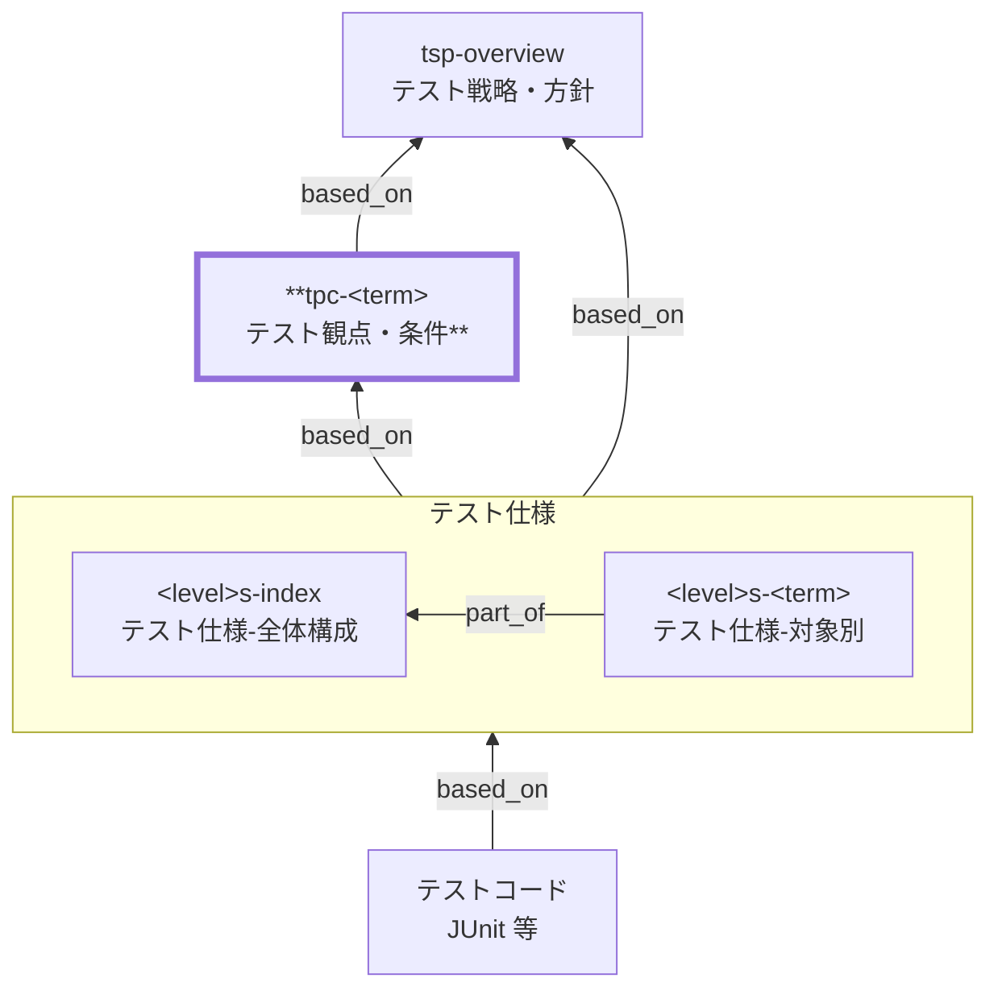

Test Perspectives and Conditions (TPC) Documentation Rules

本ドキュメントは、テスト設計のために **テスト観点・テスト条件を統一形式で記述する標準ルール**です。
TPC は「**何を確認すべきか（観点）**」と「**どのような状態・条件で確認するか（条件）**」を整理し、
テスト仕様・テスト設計・テスト実装への **分解の起点**となることを目的とします。

TPC は **テスト戦略・方針（TSP）を具体化する中間成果物**であり、
個別のテストケースやテストコードを直接列挙するものではありません。

## 1. 全体方針

- TPC は **「何をテストすべきか」を網羅的・構造的に整理するドキュメント**です
  （機能・業務・例外・外部I/F・非機能・セキュリティ・データ等の観点を明示）。

- TPC は **TSP の下位、各テストレベルのテスト仕様（`<level>s-index` / `<level>s-<term>`）の上位**に位置づけられます。
  - 各観点／条件には、**適用テストレベル（UT/IT/ET/ST/AT など）を付与します**（必須）。
  - 各テストレベルで「どこまで保証するか / 何をやらないか」の**責任分界**は TSP で明文化します（TPCの適用レベルは、責任分界の代替ではありません）。
  - TPC は、その前提に基づき **下位成果物（`<level>s-*`、テストコード／CI成果物）へ分解される確認対象のSSOT**です。

- TSP と TPC の役割分担:
  - **TSP**: どういう考え方で、どのレベルで品質を担保するか
  - **TPC**: その考え方に基づき、何を確認対象とするか

- TPC は **テストケースを直接書きません**
  （具体値・詳細手順・ケース網羅は、原則としてテストコード／CI成果物へ委ねます。必要な代表ケースのみ、`<level>s-<term>` に記載します）。

- 観点・条件は **トレース可能**でなければなりません
  （要件・仕様・受入条件・非機能要件との対応付けが必須）。

- 曖昧な表現は禁止します
  （「正常系を確認する」「例外も考慮する」等は禁止。**何を、どの状態で、何を確認するか**を明示）。

- 原則として **1ファイル = 1つの観点整理単位**とします。
  肥大化する場合は分割し、`part_of` で集約ドキュメントへの所属を明示します。

## 2. 位置づけと用語定義

### 2.1. 位置づけ（他ドキュメントとの関係）

TSP・TPC・下位ドキュメント（テスト仕様、テストコード／CI成果物）の関係を示します。



`<level>`はテストレベル（ut:単体、it:内部結合、et:外部結合、st:総合、at:受入）

### 2.2. 用語定義

| 用語       | 定義                                                            |
| ---------- | --------------------------------------------------------------- |
| テスト観点 | 確認すべき品質・振る舞いの切り口（機能、業務、例外、非機能 等） |
| テスト条件 | 観点を確認するために必要な前提状態・入力状態・環境条件          |
| トレース   | 要件・仕様・受入条件などとの対応関係                            |
| 下位成果物 | テスト仕様、テスト実装（コード）、CI成果物                      |

## 3. ファイル命名・ID規則

ID 命名ルールは [meta-id-and-file-naming-rules.md](meta-id-and-file-naming-rules.md) に従います。

- `id`: 小文字ハイフン形式で `tpc-<term>`
  例: `tpc-order-process`, `tpc-sale-checkout`
- ファイル名: `tpc-<番号>-<短い日本語名>.md`
  例: `tpc-0010-受注処理.md`

## 4. 推奨 Frontmatter 項目

### 4.1. 設定内容

Frontmatter は共通スキーマに従います。

| 項目       | 説明                                                       | 必須 |
| ---------- | ---------------------------------------------------------- | ---- |
| id         | TPC ID（`tpc-...`）                                        | ○    |
| type       | `test` 固定                                                | ○    |
| title      | ドキュメント名                                             | ○    |
| status     | `draft` / `ready` / `deprecated`                           | ○    |
| part_of    | 集約ドキュメントへの所属（ID配列。未指定時は `[]` を許容） | 任意 |
| based_on   | 観点の根拠となる仕様（ID配列。未指定時は `[]` を許容）     | 任意 |
| supersedes | 置き換え関係（ID配列。未指定時は `[]` を許容）             | 任意 |

### 4.2. 推奨ルール

- `based_on` には **観点の根拠となる仕様**（`tsp-overview`, `bac-*`, `nfr-*`, `sac-*` 等）を記載します。
- 配列項目は、未指定の場合も `[]` を明示してよいものとします（機械処理の安定化）。

## 5. 本文構成（標準テンプレート）

TPC ファイルは、以下の見出しを **必ずこの順で**記載します。

1. 概要
2. テスト観点
3. テスト条件
4. トレース
5. メモ / 留意事項

## 6. 記述ガイド詳細

### 6.1. 概要

- 1〜3文で **対象範囲と目的**を記載します。
- 「どの業務・機能・品質を対象とする観点整理か」を明確にします。

### 6.2. テスト観点（必須）

テスト観点は **一覧表** で整理します。

#### 6.2.1. 観点分類（標準セット）

観点分類は、以下を標準とします。

- 機能
- 業務
- 例外
- 外部I/F
- 非機能
- セキュリティ
- データ

※ 新たな分類を追加する場合は原則避け、必要な場合は備考に根拠を記載します。

#### 6.2.2. 観点表（例）

| 観点ID | 観点分類 | 観点名     | 確認したいこと                       | 適用レベル | 備考 |
| ------ | -------- | ---------- | ------------------------------------ | ---------- | ---- |
| TP-01  | 機能     | 正常処理   | 正しい入力で正しい結果が得られること | UT/IT      |      |
| TP-02  | 業務     | 業務ルール | ビジネスルールが守られていること     | ST/AT      |      |
| TP-03  | 例外     | 入力不正   | 不正入力時に適切なエラーとなること   | UT/IT      |      |
| TP-04  | 非機能   | 性能       | 規定時間内に処理が完了すること       | ET/ST      | NFR  |

### 6.3. テスト条件（必須）

テスト条件は、観点ごとに **どのような状態・条件で確認するか**を定義します。

| 観点ID | 条件ID | 条件内容       | 前提状態 / 入力状態  | 期待される振る舞い | 適用レベル |
| ------ | ------ | -------------- | -------------------- | ------------------ | ---------- |
| TP-01  | TC-01  | 正常な受注入力 | 有効な商品・在庫あり | 受注が確定する     | UT/IT      |

記述ルール

- 条件は **状態・前提レベル**に留めます。
- 実データ値、詳細手順、期待結果の網羅は **テストコード／CI成果物** に委ねます（必要なら `<level>s-<term>` に代表ケースとして残す）。
- 条件ID はファイル内で一意とし、`TC-XX` 形式を推奨します。

### 6.4. トレース（必須）

観点は必ず **上位仕様とトレース**します。

#### 6.4.1. 観点トレース（必須）

| 観点ID | 関連仕様ID |
| ------ | ---------- |
| TP-01  | bac-xxx    |
| TP-04  | nfr-yyy    |

#### 6.4.2. 条件トレース（任意）

非機能・障害系など、条件単位での根拠が重要な場合は、条件トレースを追加してもよいです。

| 条件ID | 関連仕様ID      |
| ------ | --------------- |
| TC-08  | nfr-performance |

### 6.5. メモ / 留意事項

- 未確定条件
- 環境依存事項
- 将来追加予定の観点
- 分解時の指針（参考情報）
  - 主にどのテストレベルで検証される想定か
  - どのレベルでは非目的とするか（TSPの責任分界に従う）
  - 外部I/Fの場合、導通 / 契約 / データ内容 / 業務一貫性のどこを対象とするか

## 7. 禁止事項

| 項目                         | 理由                                                                        |
| ---------------------------- | --------------------------------------------------------------------------- |
| テストコードの記載           | 実装に委ねるべき                                                            |
| SQL / クラス名 / メソッド名  | 実装依存で変更に弱い                                                        |
| クリック操作の逐語列挙       | UI変更に弱く、本質が埋もれる                                                |
| ケース番号・手順の大量列挙   | テストコード／CI成果物（必要なら`<level>s-<term>`の代表ケース）で表現すべき |
| 「適切」「十分」等の曖昧表現 | 合否判定不能                                                                |

## 8. サンプル（最小）

### 8.1. メタ情報

```yaml
---
id: tpc-sale-checkout
type: test
title: テスト観点・条件: 店頭販売（レジ会計・在庫連動）
status: draft
part_of: []
based_on: [tsp-overview, bac-sale-checkout, bac-inventory-replenishment, nfr-performance, nfr-security]
supersedes: []
---
```

### 8.2. 概要

駄菓子屋販売管理システムの「店頭販売（レジ会計）」と「在庫連動」に対するテスト観点とテスト条件を対象とする。TSP の方針に基づき、受入条件（BAC）と非機能要件（NFR）にトレース可能な形で観点・条件を定義する。

### 8.3. テスト観点

| 観点ID | 観点分類     | 観点名                        | 確認したいこと                                                     | 適用レベル | 備考    |
| ------ | ------------ | ----------------------------- | ------------------------------------------------------------------ | ---------- | ------- |
| TP-01  | 機能         | 会計計算の正確性              | 商品/数量/税/割引の組み合わせでも合計が正しく算出されること        | UT/IT      |         |
| TP-02  | 業務         | 会計確定と在庫減算の整合      | 会計確定と在庫更新が矛盾しないこと（片方だけ成功しない）           | IT/ST      |         |
| TP-03  | 例外         | 在庫不足時の扱い              | 在庫不足を検知し、業務として取り得る選択肢で処理できること         | UT/IT      |         |
| TP-04  | 例外         | 取消/返品時の整合性           | 取消/返品が、売上・在庫・帳票/ログの整合を崩さないこと             | IT/ST      |         |
| TP-05  | 外部I/F      | 外部決済（正常/エラー）の扱い | 決済の成功/失敗/タイムアウトで、二重請求や取りこぼしが起きないこと | ET/ST      |         |
| TP-06  | 非機能       | 冪等性/重複送信耐性           | 同一操作の再送があっても結果が一貫し、重複処理が発生しないこと     | UT/IT/ET   |         |
| TP-07  | セキュリティ | 権限・操作制御                | 権限に応じて会計/取消/返品が制御され、監査可能な記録が残ること     | ST/AT      | NFR     |
| TP-08  | 非機能       | 性能（ピーク時の会計処理）    | NFR で定義した閾値内で会計処理が完了すること                       | ET/ST      | NFR     |
| TP-09  | 非機能       | 可用性（障害時の復旧/再実行） | 障害復旧後に整合性を回復でき、未確定取引の扱いが定義されていること | ST/AT      | SAC/NFR |
| TP-10  | データ       | 帳票/出力内容の整合           | 帳票（CSV/PDF 等）に出力される内容が取引データと一致すること       | ST/AT      |         |

### 8.4. テスト条件

| 観点ID | 条件ID | 条件内容               | 前提状態 / 入力状態                                        | 期待される振る舞い                                               | 適用レベル |
| ------ | ------ | ---------------------- | ---------------------------------------------------------- | ---------------------------------------------------------------- | ---------- |
| TP-01  | TC-01  | 通常会計               | 有効な商品・数量で会計                                     | 合計がルール通りに算出され、会計が確定できる                     | UT/IT      |
| TP-01  | TC-02  | 割引・税の組み合わせ   | 割引が適用される条件の取引                                 | 割引・税の適用順序が業務ルールに一致する                         | UT/IT      |
| TP-02  | TC-03  | 会計確定と在庫更新     | 在庫が十分にある商品を会計確定                             | 会計確定と在庫減算が整合し、整合性が確認できる記録が残る         | IT/ST      |
| TP-02  | TC-04  | 在庫更新失敗時の扱い   | 会計確定直後に在庫更新が失敗する状況（例: 一時的な障害）   | 取引状態が中間で止まらず、再実行/補正の方針に従って回復できる    | IT/ST      |
| TP-03  | TC-05  | 在庫不足検知           | 在庫数 < 購入数量                                          | 会計確定できず、業務に必要なエラー情報が提示される               | UT/IT      |
| TP-04  | TC-06  | 取消（確定前）         | 決済未確定の取引を取消                                     | 在庫・売上に影響を残さず取消できる                               | IT/ST      |
| TP-04  | TC-07  | 返品（確定後）         | 確定済み取引の返品を登録                                   | 売上訂正と在庫戻しが整合し、帳票/ログに反映される                | IT/ST      |
| TP-05  | TC-08  | 外部決済成功           | 外部決済が成功応答を返す                                   | 会計が確定し、結果が確実に記録される                             | ET/ST      |
| TP-05  | TC-09  | 外部決済失敗           | 外部決済が失敗応答を返す                                   | 会計が確定せず、在庫更新や帳票出力が行われない                   | ET/ST      |
| TP-05  | TC-10  | 外部決済タイムアウト   | 外部決済がタイムアウト/不達になる                          | 二重請求防止の方針に従って状態が管理され、再試行可否が判定できる | ET/ST      |
| TP-06  | TC-11  | 再送（同一リクエスト） | 同一取引の確定要求が重複して送信される                     | 重複処理されず、結果が一貫する                                   | UT/IT/ET   |
| TP-07  | TC-12  | 権限制御（取消/返品）  | 取消/返品の権限がないユーザーが操作                        | 操作が拒否され、監査可能な記録が残る                             | ST/AT      |
| TP-08  | TC-13  | ピーク時会計性能       | ピーク想定の負荷条件（同時実行/データ量）は NFR 定義に従う | 会計処理が NFR の閾値内で完了する                                | ST         |
| TP-10  | TC-14  | 帳票出力の整合         | 確定済み取引が存在し帳票出力を実施                         | 帳票内容が取引データと一致し、欠落/重複がない                    | ST/AT      |

### 8.5. トレース

| 観点ID | 関連仕様ID                                     |
| ------ | ---------------------------------------------- |
| TP-01  | bac-sale-checkout                              |
| TP-02  | bac-sale-checkout, bac-inventory-replenishment |
| TP-03  | bac-sale-checkout                              |
| TP-04  | bac-sale-checkout                              |
| TP-05  | bac-sale-checkout, nfr-security                |
| TP-06  | nfr-security                                   |
| TP-07  | nfr-security                                   |
| TP-08  | nfr-performance                                |
| TP-09  | sac-disaster-recovery                          |

### 8.6. メモ / 留意事項

- 外部決済はサンドボックス（またはスタブ）で再現できるエラー種別を優先し、実事業者固有の品質は対象外とする。
- 割引・税のルールが変更されやすい場合、観点（TP-01）とトレース（BAC/BR）を先に固め、具体値・境界値はテストコード（例: parameterized tests）側で差分管理する。

## 9. 生成 AI への指示テンプレート

生成 AI に TPC を作らせるときの指示テンプレートは [tpc-instruction.md](../instructions/tpc-instruction.md) を参照してください。
