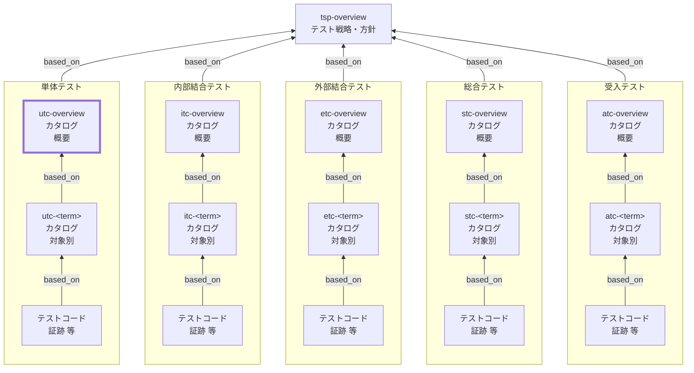

Unit Test Catalog (UTC) Overview Documentation Rules

本ドキュメントは、単体テストカタログ（UTC）の全体概要 `utc-overview` を統一形式で記述するためのルールです。
TSPに基づき、単体テストに共通するルールや方針を定義します。

個別単体テストカタログ（`utc-<term>`）の記述ルールは [utc-rules.md](utc-rules.md) を参照してください。

## 1. 全体方針

`utc-overview` は、単体テストカタログ（UTC）を **運用可能な最小情報**で統一し、
対象別カタログ（`utc-<term>`）の品質と一貫性を担保するための **共通ルール（SSOT）** とする。

- `utc-overview` は **「考え方・共通方針・共通定義」** を記述する（個別ケースは持たない）
- 個別の観点・条件・ケースは **`utc-<term>` に集約**し、詳細は **テストコード／CI証跡** に寄せる
- 記述は **レビュー可能**であることを優先し、長文化を避ける（方針は箇条書き中心）
- 「例外」や「対象外」を明示し、単体テストの責任境界（何をやらないか）を固定する
- `tsp-overview` の方針を根拠として、単体テストに共通する **分割基準・観点/条件の立て方・依存境界・合格基準・証跡** を定義する

## 2. 位置づけ（他ドキュメントとの関係）

`utc-overview` と他ドキュメントの関係を示します。



## 3. ファイル命名・ID規則

- 本ルールの対象ドキュメントの`id` は `utc-overview` 固定。対象別は `utc-<term>`（詳細は [utc-rules.md](utc-rules.md)）。
- ファイル名は `utc-010-単体テストカタログ-概要.md` 等、プロジェクト内で一意になるように命名します。
- `<term>` は用語集の論理名キー（英小文字kebab-case） を用いる（表示名は title に日本語で記載してよい）。

## 4. 推奨 Frontmatter 項目

### 4.1. 設定内容

Frontmatter は共通スキーマに従います（参照: [docs/shared/schemas/spec-frontmatter.schema.yaml](../../../shared/schemas/spec-frontmatter.schema.yaml) / [meta-document-metadata-rules.md](meta-document-metadata-rules.md)）。

| 項目       | 説明                                               | 必須 |
| ---------- | -------------------------------------------------- | ---- |
| id         | `utc-overview`（固定）                             | ○    |
| type       | `test` 固定                                        | ○    |
| title      | 単体テストカタログ: 概要（`<システム名>`）         | ○    |
| status     | `draft` / `ready` / `deprecated`                   | ○    |
| based_on   | 根拠となる仕様ID（ID配列。未指定時は `[]` を許容） | 任意 |
| supersedes | 置き換え関係（ID配列。未指定時は `[]` を許容）     | 任意 |

### 4.2. 推奨ルール

- `based_on` には最低限`tsp-overview`を含めます。
- BAC/NFR/BR 等は、`utc-overview` の方針判断（境界・分配・共通合格基準）に **直接利用したものだけ**を`based_on`に列挙します。
- `based_on` / `supersedes` は ID 配列（未指定は `[]` 可）。

## 5. 本文構成（標準テンプレ）

`utc-overview` は以下の見出し構成を **順序固定**で配置します。

| 番号 | 見出し                          | 必須 |
| ---- | ------------------------------- | ---- |
| 1    | 本ドキュメントの目的と適用対象  | ○    |
| 2    | テスト対象の括り方と分割基準    | ○    |
| 3    | 対象外・除外理由（共通）        | ○    |
| 4    | 観点の立て方（共通）            | ○    |
| 5    | 条件の立て方（共通）            | ○    |
| 6    | 単体テスト共通の境界/依存の扱い | ○    |
| 7    | ケース表の共通カラム            | ○    |
| 8    | メモ / 将来課題                 | 任意 |

## 6. 記述ガイド

### 6.1. 本ドキュメントの目的と適用対象

本節では、`utc-overview` が **何のために存在し、何に適用されるか** を明確にします。

- 目的：`utc-<term>` を同一基準で作成し、品質・粒度・責任範囲を揃える
- 適用対象：単体テスト（UT）に関するカタログ群（`utc-overview` / `utc-<term>`）
- 非適用：内部結合以降（IT/ET/ST/AT）のルールはそれぞれの `*c-overview` で扱う
- 成果物の位置づけ：
  - `utc-overview`：共通方針（SSOT）
  - `utc-<term>`：対象別の観点・条件・ケース表（SSOT）
  - テストコード／CI：実装と実行証跡（SSOT）
- SSOTの一次情報は `utc-overview` / `utc-<term>` とし、テストコード／CIは **実装と実行結果の証跡（Evidence）** として扱う。
- 本書が扱う粒度：**判断基準・共通ルールまで**（個別ケースの列挙は禁止）

### 6.2. テスト対象の括り方と分割基準

本節では、`utc-<term>` の `<term>` をどう切るか（対象単位の設計）を定義します。

- `<term>` は「責務のまとまり」（例：ドメインサービス／ユースケース／主要関数群）とする
- 分割基準（推奨順）：
  1. **責務境界**：何をする単位かが説明できる
  2. **変更影響**：同時に変更されやすいものが同じ単位に収まる
  3. **依存境界**：外部I/F・DB・時刻などの依存の扱いが同質
  4. **担当境界**：所有者（チーム/モジュール）が概ね一致する
- 過分割の禁止：`utc-<term>` が「1〜2ケースしかない」単位は原則統合する
- 肥大化の抑制（分割の目安）：
  - 観点が過剰（例：15以上）／表の行数が過剰（例：50以上）になったら分割候補
  - 依存境界が混在（同じterm内で Mock方針が割れる）する場合は分割候補
- 画面テストの注意：UTの `<term>` は **UI部品よりもロジック中心**で切る（画面はE2E側で扱う）

### 6.3. 対象外・除外理由（共通）

本節では、単体テスト（UT）で **やらないこと** と、その **理由**、および **例外条件** を明確にします。
「UTでやるべきこと」を書くよりも、「UTでやらないこと」を固定する方が、責任境界がぶれにくくなります。

#### 6.3.1. 記述ルール

- 形式は **「対象外（何をやらないか）」「除外理由（なぜやらないか）」「例外（UTで扱う条件）」** の3点セットを基本とする
- 「対象外」は **テストレベルの責務分界**（UT/IT/E2E）に紐づけて書く
- 「例外」は乱用しない。例外を認める場合は **判断基準**（いつ/どの条件で）を明記する
- 個別対象（`utc-<term>`）固有の対象外は、`utc-<term>` 側に書く。本節は **UT共通** に限定する

#### 6.3.2. 推奨フォーマット（表）

| 対象外（やらないこと） | 除外理由 | 代替レベル/代替手段 | 例外（UTで扱う条件） |
| ---------------------- | -------- | ------------------- | -------------------- |

- 「代替レベル/代替手段」は、IT/E2E/NFRなど **どこで担保するか** を必ず記載する
- 例外がない場合は `なし` とする

#### 6.3.3. 典型例（記載候補）

- UI操作のエンドツーエンド検証（画面遷移やDOM操作の再現）
- 実DBへの接続・実I/O（スキーマやSQLの妥当性そのもの）
- 外部サービス疎通（ネットワーク・認証を含む実通信）
- 並行性・性能・負荷（スループット、p95等）
- ブラウザ互換・端末差分（表示崩れ、入力方式差）

### 6.4. 観点の立て方（共通）

観点（Perspective）は「何を保証するか」の切り口であり、対象別カタログの章立て（見出し）として用います。

- 観点の型（最低限この順で検討）：
  - 機能/業務ルールの正しさ（正常系）
  - 例外/エラー処理（不正入力、権限、存在しない、期限切れ、競合）
  - 状態遷移（前→後：作成→確定→取消 等）
  - 契約/インタフェース（戻り値、例外、エラーコード、イベント発行 等）
  - 非機能（UTで扱う範囲のみ：計算量、入力上限、決定性 など）
- 命名規則：**「名詞＋品質/振る舞い」**（例：`入力検証` / `認可エラー処理` / `状態遷移の整合性`）
- 粒度規則：
  - 観点は「条件を複数持てる」程度にまとめる（細分化し過ぎない）
  - 観点が抽象的で条件が作れない場合は観点を再定義する
- 重複禁止：
  - 同一対象内で、同義の観点名を乱立させない（統合・改名する）

### 6.5. 条件の立て方（共通）

条件（Condition）は、観点を確認するための前提状態・入力状態・環境条件のバリエーションです。
条件は「入力」「状態」「環境」に分解して作成します。

- 入力（Input）：代表値／境界値／異常値（空、最大、形式不正、桁あふれ 等）
- 状態（State）：事前データ、権限、ステータス、ライフサイクル段階（有効/無効、未確定/確定 等）
- 環境（Env）：時刻、タイムゾーン、外部I/F失敗、ネットワーク、設定値（feature flag 等）

組合せルール（増やし過ぎ防止）：

- まず代表ケース（正常系）を作る
- 次に境界値（上限/下限/空/ゼロなど）を追加する
- 最後に重大例外（セキュリティ/整合性/データ破壊につながるもの）を追加する
- 原則として全組合せ（直積）は作らない。必要な場合は理由を明記し、データセット参照等で管理する

### 6.6. 単体テスト共通の境界/依存の扱い

単体テストでは、対象の責務を明確にし、依存は原則として制御可能にします。
依存の扱いは `utc-<term>` 間でぶれないよう、本節で共通方針を定めます。

- DB：
  - 原則：実DBに依存しない（In-memory / Fake / Repository mock 等）
  - 例外：スキーマ/SQLそのものが責務の場合のみ、別レベル（IT）へ寄せる
- 外部API/外部サービス：
  - 原則：Mock/Stubで制御（成功・失敗・タイムアウトを再現可能に）
- 時刻：
  - 原則：固定クロック（Clock注入等）。現在時刻直参照は禁止
- 乱数/UUID：
  - 原則：固定シード、または生成器を注入
- ファイル/ストレージ：
  - 原則：Fake（テンポラリ/メモリ）またはインタフェース差替
- 非同期/並行性：
  - 原則：決定性が担保できる形（同期化、制御可能なスケジューラ等）
- 例外方針（Mock/Stub/Fakeの使い分け）：
  - Fake：簡易実装で状態を持つ（インメモリDB等）
  - Stub：戻り値固定で分岐を作る
  - Mock：呼び出し回数・引数など「相互作用」を検証する場合に使用

### 6.7. ケース表の共通カラム

`utc-<term>` の末端（条件・ケース表）は、検索性・比較性・自動化移行の容易さを確保するため、
全termで同一カラム順を採用します。

必須カラム：

- `case_id`（ケースID）：対象別に一意なIDで変更しない
  - `case_id` は `<level>-<term>-<perspective_key>-<nnn>`（nnnは3桁推奨）を推奨
    - 例: `ut-auth-input-validation-010`
    - `perspective_key` は kebab-case のキー文字列（英小文字＋数字＋ハイフン）で、原則変更しない
    - `nnn` を 10刻みで付番（010, 020, 030…）

- `条件`：入力/状態/環境の要点（`入力:` `状態:` `環境:` の形を推奨）
- `手順（最小）`：抽象化した最小手順（クリック列挙禁止）
- `期待値`：判定可能な合格条件（観測点を含める）

推奨カラム（運用必須）：

- `観測点（アサーション）`：戻り値/例外/状態/呼び出し相互作用など
- `境界/依存`：Mock/Stub/Fake、固定クロック等
- `トレース`：req/spec/ac/issue 等のID
- `優先度`：P0/P1/P2（省力時の判断軸）
- `自動化`：manual/automated/mixed
- `証跡`：テストコード/CI/レポート等の参照先

注意：

- 表の1行＝1テスト（条件×期待値が一意）
- 手順・期待値を冗長に書かず、詳細はテストコードへ寄せる

### 6.8. メモ / 将来課題

本節は、現時点で決めきれない事項や将来の改善点を記録します。
ただし、運用ルールとして必須な内容は本節に置かず、本文（1〜6章）へ反映します。

- 将来検討（例）：
  - 組合せ削減の方法（ペアワイズ導入）
  - 証跡リンク形式の統一（CI URL、レポート保存場所）
  - 自動化率の目標と移行基準
  - カタログのlint（case_id重複、必須列欠落など）

## 7. 禁止事項

| 項目                                                                | 理由                                                                                   |
| ------------------------------------------------------------------- | -------------------------------------------------------------------------------------- |
| `utc-overview` に個別ケース（条件・手順・期待値）を大量に列挙する   | `utc-overview` は共通方針のSSOTであり、個別は `utc-<term>` に集約するため              |
| 依存の扱い（Mock/Stub/Fake、時刻等）を対象ごとに無根拠に変更する    | UT全体で一貫性が崩れ、テストが不安定・レビュー困難になるため（例外は根拠とともに明記） |
| 手順にUI操作のクリック列挙を書く（末端表でも過剰な操作手順を書く）  | 保守性が低く、変更に弱く、テストの意図が見えなくなるため                               |
| 期待値を「エラーにならないこと」など曖昧に書く                      | 判定不能で合否が揺れ、証跡として機能しないため                                         |
| `case_id` を後から変更する（参照があるのに変更する）                | トレース・証跡リンクが壊れ、履歴追跡が不能になるため                                   |
| 対象外・除外理由（共通） と矛盾するケースを `utc-<term>` に記載する | 責任境界が崩れるため（例外は根拠と条件を明記）                                         |

## 8. サンプル（最小）

```yaml
---
id: utc-overview
type: test
title: 単体テスト仕様: 概要
status: draft
based_on: [tsp-overview]
supersedes: []
---
```

`## 1. 本ドキュメントの目的と適用対象`

本ドキュメントは、単体テストカタログ（UTC）の全体概要 `utc-overview` を統一形式で記述するためのルールである。
`utc-overview` は単体テストに共通する「対象単位の切り方」「観点/条件の立て方」「依存境界」「合格基準」「証跡方針」を定義し、
対象別カタログ `utc-<term>` の作成と運用の基盤とする。

`## 2. テスト対象の括り方と分割基準`

`utc-<term>` の `<term>` は責務のまとまり（例：サービス/ユースケース/主要関数群）とする。
分割は責務境界・変更影響・依存境界・担当境界を基準とし、過分割と肥大化の双方を避ける。
観点が過剰、または依存境界が混在する場合は分割候補とする。

`## 3. 対象外・除外理由（共通）`

単体テスト（UT）では、対象の責務を「小さく・決定的に」検証するため、以下は原則として対象外とする。

| 対象外（やらないこと）                                | 除外理由                                       | 代替レベル/代替手段      | 例外（UTで扱う条件）                                            |
| ----------------------------------------------------- | ---------------------------------------------- | ------------------------ | --------------------------------------------------------------- |
| UIの操作手順や画面遷移の検証（クリック列挙、DOM検証） | UTの責務（ロジック検証）を逸脱し、保守性が低い | E2E（e2eカタログ）       | UIロジックが純関数化され、DOMに依存しない場合のみ               |
| 実DB接続・実I/Oによる検証（スキーマ/SQLの正当性）     | 環境依存・不安定になりやすい                   | IT（itcカタログ）        | SQLそのものがプロダクト責務で、Fakeでは妥当性が評価できない場合 |
| 外部サービス疎通（実通信、実認証、ネットワーク障害）  | 外部要因で結果が揺れ、再現性が低い             | IT/ET（itc/etcカタログ） | 外部SDKのアダプタ層の「入力→出力変換」など純粋な変換責務のみ    |
| 性能・負荷・耐久（p95、スループット、長時間稼働）     | UTのスコープ外で測定条件の設計が別物           | NFR（nfrカタログ）       | なし                                                            |
| ブラウザ/端末差分（表示崩れ、入力方式差）             | 実行環境差が本質でUTでは再現困難               | E2E（e2eカタログ）       | なし                                                            |

例外を適用する場合は、`utc-<term>` 側に「例外の根拠（なぜUTで必要か）」と「依存の制御方法」を明記する。

`## 4. 観点の立て方（共通）`

観点は「何を保証するか」の切り口であり、機能の正しさ・例外処理・状態遷移・契約/インタフェースを基軸に立てる。
観点名は「名詞＋品質/振る舞い」で統一し、条件を複数持てる程度の粒度にまとめる。

`## 5. 条件の立て方（共通）`

条件は入力・状態・環境に分解し、代表→境界→重大例外の順で追加する。
全組合せ（直積）は原則作らず、必要時のみ理由と管理方法（データセット参照等）を明記する。

`## 6. 単体テスト共通の境界/依存の扱い`

単体テストでは依存を制御可能にし、テストの決定性を担保する。
DBは原則Fake/Mock等で実DB依存を避け、外部APIはMock/Stubで成功・失敗・タイムアウトを再現可能にする。
時刻・乱数・UUIDは注入または固定化し、直参照を禁止する。

`## 7. ケース表の共通カラム`

対象別カタログ `utc-<term>` の末端表は、全termで共通のカラム順を採用する。
必須：case_id / 条件 / 手順（最小） / 期待値
推奨：観測点（アサーション）/ 境界・依存 / トレース / 優先度 / 自動化 / 証跡

`## 8. メモ / 将来課題`

将来検討事項（例）：組合せ削減の手法（ペアワイズ）、証跡リンク形式の統一、カタログlint（case_id重複検出）等を記録する。
運用ルールとして必須になった時点で本文へ昇格させる。

## 9. 生成 AI への指示テンプレート

生成 AI に `utc-overview` を作らせるときの指示テンプレートは [utc-overview-instruction.md](../instructions/utc-overview-instruction.md) を参照してください。
