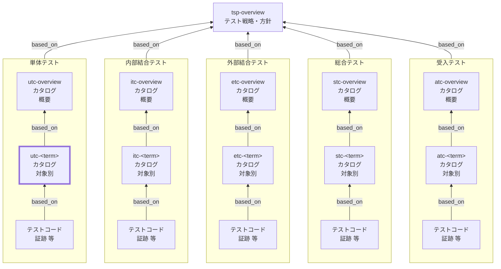

Unit Test Catalog (UTC) Documentation Rules

本ドキュメントは、単体テストカタログ（UTC）の対象別 `utc-<term>` を統一形式で記述するためのルールです。
`utc-overview` を前提に、SSOTの本体として、対象ごとの **単体テストの責務・境界・依存、観点 x 条件=ケース、トレース、証跡** を明文化します。

## 1. 全体方針

個別 UTC（`utc-<term>`）は、単体テストにおける SSOT の本体として、対象ごとの責務と境界を明確化し、
観点×条件＝ケース（末端表）を最小情報で整理して、テストコード／CI証跡へ確実に接続できる形で記述する。

- `utc-<term>` は **対象固有の情報のみ**を記述し、共通ルールは `utc-overview` を参照する（重複記述しない）
- 単体テストの目的は「対象の責務を決定的に検証すること」であり、外部要因（実DB／実通信／実UI）は原則排除する（例外は根拠を明記）
- ケースは「表の1行＝1テスト」とし、手順と期待値は **判定可能**な粒度で簡潔に書く
- 詳細な操作列挙やデータ大量列挙は避け、必要な詳細はテストコード側へ寄せる（証跡で参照可能にする）
- すべての観点・ケースは、根拠仕様（`based_on` / `トレース`）と、証跡（テストコード／CI）に接続されていること

## 2. 位置づけ（他ドキュメントとの関係）

個別 UTC（`utc-<term>`）と他ドキュメントの関係を示します。



## 3. ファイル命名・ID規則

- `id` は `utc-<term>`（kebab-case。例: `utc-inventory`）。
- ファイル名は `utc-010-単体テストカタログ-<term>.md` 等（例: `utc-010-単体テストカタログ-在庫.md`）。
- `<term>` は 用語集(GL) の 論理名キー（英小文字kebab-case） を用いる（表示名は title / ファイル名で日本語を使用してよい）。

## 4. 推奨 Frontmatter 項目

### 4.1. 設定内容

Frontmatter は共通スキーマに従います（あわせてドキュメントのメタ情報の記述ルールも参照）。

- 参照スキーマ: [docs/shared/schemas/spec-frontmatter.schema.yaml](../../../shared/schemas/spec-frontmatter.schema.yaml)
- メタ情報ルール: [meta-document-metadata-rules.md](meta-document-metadata-rules.md)

| 項目       | 説明                                                                                   | 必須 |
| ---------- | -------------------------------------------------------------------------------------- | ---- |
| id         | UTC ID（個別: `utc-<term>`）                                                           | ○    |
| type       | `test` 固定                                                                            | ○    |
| title      | 単体テストカタログ: <対象名>                                                           | ○    |
| status     | `draft` / `ready` / `deprecated`                                                       | ○    |
| based_on   | 根拠仕様（最低限: `tsp-overview`, `utc-overview`。対象固有の根拠は本文トレースに集約） | ○    |
| part_of    | 集約ドキュメントへの所属（ID配列）                                                     | 任意 |
| supersedes | 置き換え関係                                                                           | 任意 |

### 4.2. 推奨ルール

- `based_on` には **本対象の単体テスト観点の根拠となる仕様** を列挙します。
- `based_on` は原則 `[tsp-overview, utc-overview]` を最低限とし、
  対象固有の根拠（`br-*` / `bac-*` / `spec-*` / `nfr-*` 等）は本文「トレース」に集約する。
  機械処理上の都合で `based_on` にも列挙する場合は、本文トレースと矛盾しないこと。
- 記述内容が多くなる場合は、ドキュメントを分割し、`part_of` で集約ドキュメントに所属させます。
- `part_of` / `based_on` / `supersedes` は ID 配列（未指定は `[]` 可）。

## 5. 本文構成（標準テンプレ）

個別 UTC（`utc-<term>`）は以下の見出し構成を **順序固定** で配置します。

| 番号 | 見出し             | 必須 |
| ---- | ------------------ | ---- |
| 1    | 概要（`<term>`）   | ○    |
| 2    | 責務               | ○    |
| 3    | 対象外             | ○    |
| 4    | 境界/依存          | ○    |
| 5    | トレース           | ○    |
| 6    | テスト観点とケース | ○    |

注意：次章の記述ガイドのMarkdown見出しはルール文章内の参照用であり、
生成する `utc-<term>` 本文の見出しは各章で指定された **番号付き** の形式
（例: `## 6.`, `### 6.1.` / `#### 6.1.1.` / `#### 6.1.2.`）に置き換えてください。

## 6. 記述ガイド

### 6.1. 概要（`<term>`）

生成する `utc-<term>` 本文の見出しは **## 1. 概要（&lt;term&gt;）**

本節では、対象（`<term>`）が何であり、どの単位を本カタログで扱うかを簡潔に示します。

- `<term>` の説明（1〜3行）：責務のまとまりを人が理解できる形で記述する
- 期待する利用者：レビューア／実装者／テスト実装者が、対象の前提を把握できる内容にする
- 対象の粒度：`utc-overview` の分割基準に従い、過分割／肥大化を避ける
- 関連コンポーネントや主要API（任意）：対象の入口（関数名、クラス名、モジュール名等）を列挙してよい
- 詳細な仕様の説明や長い背景は書かない（根拠はトレースで示す）

### 6.2. 責務

生成する `utc-<term>` 本文の見出しは **## 2. 責務**

本節では、「この対象が何を保証すべきか（単体テストで確認する責務）」を列挙します。

- 箇条書きで 3〜7 個程度を目安に、**動詞で始まる**形で記述する
  - 例：入力を検証する／業務ルールを適用する／状態遷移を行う／エラーコードを返す
- 責務は「テスト観点」の上位概念であり、観点は責務を分解した切り口である（責務≠観点）
- 例外・異常系の責務も含める（不正入力時の振る舞い、権限、期限切れ、競合 等）
- 可能なら観測可能な成果（戻り値、例外、状態更新、依存呼び出し）とセットで書く
- 責務に含まれないものは「対象外」へ移す（曖昧さを残さない）

### 6.3. 対象外

生成する `utc-<term>` 本文の見出しは **## 3. 対象外**

本節では、「この対象カタログ（`utc-<term>`）ではやらないこと」を明示します。
`utc-overview` の「対象外・除外理由（共通）」と矛盾しないことが前提です。

- 対象外は「なぜ除外するか（理由）」とセットで書く
- 可能なら「代替するレベル」（IT/ET/E2E/NFR 等）も併記する
- 対象固有の対象外（例：別モジュールの責務、別termの責務）を明確にする
- 例外としてUTで扱う場合は、条件・根拠・依存の制御方法（Mock等）を明記する

推奨フォーマット（簡易）：

- 対象外：xxx（理由：yyy、代替：zzz）

### 6.4. 境界/依存

生成する `utc-<term>` 本文の見出しは **## 4. 境界/依存**

本節では、単体テストにおける「境界（どこまでが対象か）」と「依存（外部要因）」を明確にします。
テストが不安定になる要因はここで固定し、`utc-overview` の共通方針に従って扱います。

- 境界：対象の入口／出口（公開API、関数、クラス、モジュール）を明記する
- 依存はカテゴリごとに列挙し、「扱い（Mock/Stub/Fake/固定化）」を決める
  - DB：Fake/Repository mock 等
  - 外部API：Mock/Stub（成功/失敗/タイムアウトを再現）
  - 時刻：固定クロック（注入）
  - 乱数/UUID：固定シード／生成器注入
  - ファイル/ストレージ：Fake（テンポラリ/メモリ）／I/F差替
  - 非同期：同期化／制御可能なスケジューラ
- 依存の扱いを変更する例外がある場合は、理由と影響（再現性・速度・保守性）を明記する
- 「観測点（アサーション）」で何を検証するか（戻り値/例外/状態/相互作用）もここで整理してよい

### 6.5. トレース

生成する `utc-<term>` 本文の見出しは **## 5. トレース**

本節では、`utc-<term>` の根拠となる上位成果物との対応関係（トレーサビリティ）を示します。
本カタログにおけるトレースの一次情報（SSOT）は **`## 5. トレース`** とし、観点・ケース表では **trace_key（`TR-xx`）参照**に統一します。

#### 6.5.1. 記述ルール（trace_key）

- 各トレース項目に **trace_key（`TR-xx`）** を付与する
  - 例：`TR-01`, `TR-02` …（2桁、01始まり推奨）

- `trace_key` は **本ドキュメント内で一意**で、原則変更しない
  - 仕様IDの改名・統合・分割が起きた場合でも、可能な限り `trace_key` は維持し、対応先（仕様ID）を更新する

- 観点・ケース表の `トレース` 列には **仕様IDを直書きせず**、`TR-xx` を列挙する
  - 例：`TR-02` / `TR-01,TR-03`

- ケース表に新しい根拠が必要になった場合は、**先に本節の表へ行追加**し、付与された `trace_key` をケース表で参照する

- `TR-xx`の採番は追加順。並び替えても trace_key は維持する。また、削除しても欠番は詰めない。

#### 6.5.2. トレース表（標準フォーマット）

| trace_key | 仕様ID  | 要点    | 備考 |
| --------- | ------- | ------- | ---- |
| TR-01     | br-...  | （1行） | 任意 |
| TR-02     | bac-... | （1行） | 任意 |

- `要点` は「ケース作成の判断に使ったポイント」を **1行**で書く（冗長な仕様説明はしない）

### 6.6. テスト観点とケース

生成する `utc-<term>` 本文の見出しは **## 6. テスト観点とケース**

本節は `utc-<term>` の中心です。観点（見出し）→ ケース表（末端表）の順で構成します。

#### 6.6.1. 観点:<観点>

生成する `utc-<term>` 本文の見出しは **### 6.1. 観点:&lt;観点&gt;**

- 観点は `utc-overview` の「観点の立て方（共通）」に従って命名する
- 観点の粒度は「条件が複数ぶら下がる」程度にまとめる（細かすぎる観点の乱立を避ける）
- 観点名（見出し）は改善のため変更してよいが、`perspective_key` は原則変更しない（変更が必要なら `supersedes` 等で追跡する）。

##### 6.6.1.1. 意図

生成する `utc-<term>` 本文の見出しは **#### 6.1.1. 意図**

- 観点ごとに「意図（この観点で保証すること）」を 1〜2 行で書く

##### 6.6.1.2. 条件・ケース表

生成する `utc-<term>` 本文の見出しは **#### 6.1.2. 条件・ケース表**

- ケース表の 1 行は「1テスト」を表す（条件×期待値が一意）
- 必須カラムは `utc-overview` の定義に従う
- `case_id` は以下を推奨し、変更しない
  - 形式：`<level>-<term>-<perspective_key>-<nnn>`
  - `perspective_key`：kebab-case のキー文字列（英小文字＋数字＋ハイフン）で、原則変更しない
  - `nnn`：3桁、10刻み（010,020,030…）を推奨
- 条件は「入力/状態/環境」で表現する（`入力:` `状態:` `環境:` を推奨）
- 手順は最小化し、クリック列挙を禁止する（API呼び出し／関数呼び出し等の抽象手順で書く）
- 期待値は判定可能に書く（戻り値、例外、状態、依存呼び出し等の観測点を含める）
- 証跡はテストコードとCI実行結果へ接続できる形で書く（例：パス、CI run ID 等）

推奨：観点ごとのケース数は「代表→境界→重大例外」の順で増やし、直積（全組合せ）を原則避ける

## 7. 禁止事項

| 禁止事項                                                                                | 理由                                                       |
| --------------------------------------------------------------------------------------- | ---------------------------------------------------------- |
| `utc-overview` の共通方針を `utc-<term>` 側で勝手に上書きする（依存の扱い・対象外など） | UT全体の一貫性が崩れ、レビュー・保守が困難になるため       |
| ケース表にUIクリック手順を大量に列挙する                                                | 意図が読めず変更に弱くなるため（UTの責務逸脱）             |
| 期待値を曖昧に書く（例：「エラーにならないこと」「正常に動くこと」）                    | 合否判定ができず証跡にならないため                         |
| `case_id` を変更する／再利用する                                                        | トレース・証跡リンクが破壊され、履歴追跡が不能になるため   |
| `perspective_key` を観点名の修正に合わせて頻繁に変える                                  | ID体系が不安定になり参照が壊れるため                       |
| 直積（全組合せ）のケースを無条件に作る                                                  | ケース爆発で運用不能になるため（必要時は理由・範囲を明記） |
| トレースや証跡を持たないケースを恒久的に残す                                            | SSOTとして成立しないため（例外は暫定として明記）           |

## 8. サンプル（最小）

注：以下はルール文書内の例示です。生成する `utc-<term>` では `## 1...` から始まります。

```yaml
---
id: utc-auth
type: test
title: 単体テストカタログ: 認証（auth）
status: draft
part_of: []
based_on: [tsp-overview, utc-overview]
supersedes: []
---
```

### 8.1. 概要（auth）

認証に関するロジック（トークン検証、認可判定、エラーコード整形）を扱う。

### 8.2. 責務

- トークンの形式・期限を検証する
- 権限に応じて許可/拒否を判定する
- 失敗時に規定のエラーコードを返す

### 8.3. 対象外

- UI画面遷移の検証（理由：UTの責務外、代替：E2E）
- 実DB接続による検証（理由：環境依存、代替：IT）

### 8.4. 境界/依存

- 境界：`verifyToken(token)` / `authorize(user, action)`
- DB：Fake（インメモリ）
- 外部IdP：Stub（成功/失敗/タイムアウト）
- 時刻：固定クロック注入

### 8.5. トレース

| trace_key | 仕様ID      | 要点                     | 備考 |
| --------- | ----------- | ------------------------ | ---- |
| TR-01     | br-auth-01  | トークン検証ルール       |      |
| TR-02     | bac-auth-02 | 期限切れ時のエラーコード |      |

### 8.6. テスト観点とケース

#### 8.6.1. 観点：入力検証

##### 8.6.1.1. 意図

形式不正や期限切れを確実に検出し、規定のエラーコードを返す。

##### 8.6.1.2. 条件・ケース表

| case_id                      | 条件                | 手順（最小）       | 期待値         | 観測点（アサーション） | 境界/依存 | トレース     | 優先度 | 自動化    | 証跡                                   |
| ---------------------------- | ------------------- | ------------------ | -------------- | ---------------------- | --------- | ------------ | ------ | --------- | -------------------------------------- |
| ut-auth-input-validation-010 | 入力: 期限切れtoken | verifyToken(token) | AUTH-001で失敗 | 例外型+code            | 時刻=固定 | TR-02        | P0     | automated | tests/auth/verifyToken.test.ts, CI#123 |
| ut-auth-input-validation-020 | 入力: 形式不正token | verifyToken(token) | AUTH-002で失敗 | 例外型+code            | IdP=Stub  | TR-01, TR-02 | P1     | automated | tests/auth/verifyToken.test.ts, CI#124 |

## 9. 生成 AI への指示テンプレート

生成 AI に個別 UTC（`utc-<term>`）を作らせるときの指示テンプレートは [utc-instruction.md](../instructions/utc-instruction.md) を参照してください。
