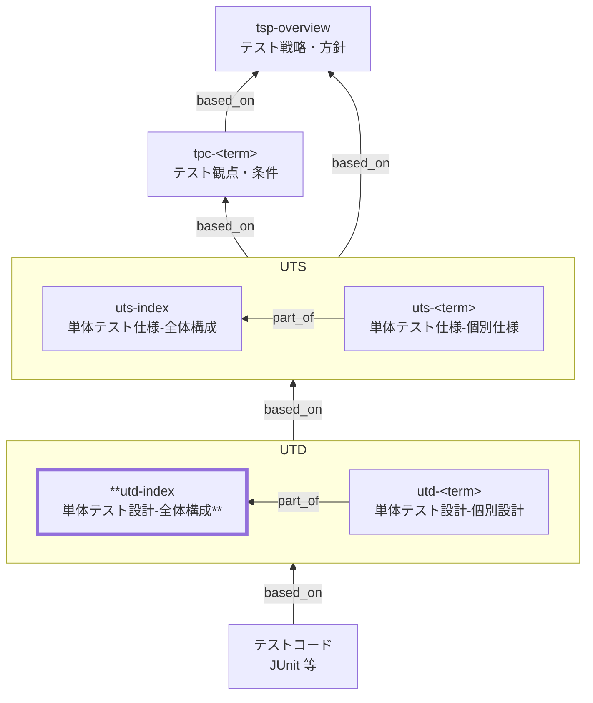

# 単体テスト設計 全体構成 作成ルール

Unit Test Design Index (UTD Index) Documentation Rules

本ドキュメントは、単体テスト設計のうち **全体構成 （`utd-index`）** を統一形式で記述するための標準ルールです。
`utd-index` は、単体テスト仕様（UTS）で定義された保証範囲を、テストコードへ落とし込むための **共通設計方針（ケース分解・命名・実行・エビデンス）** と、個別単体テスト設計（`utd-<term>`）への **入口（ナビゲーション）** を提供します。

個別単体テスト設計（`utd-<term>`）の記述ルールは [utd-rules.md](utd-rules.md) で定義します。

## 1. 全体方針

- `utd-index` は UTS で定義された保証範囲をテスト実装へ落とすための **共通設計方針**と、`utd-<term>` への **入口（ナビゲーション）** を定義します。
- `utd-index` は **方針・基準・共通ルール**までを扱い、個別のケース一覧・具体値は扱いません（個別は `utd-<term>` へ委譲）。
- トレースは Frontmatter の `based_on` を起点にし、上位成果物へ追跡可能にします。
- 曖昧表現は禁止し、判定可能な表現（対象/境界/基準/エビデンス）で書きます。
- スキーマ未定義のメタ情報プロパティ追加は禁止です（`additionalProperties: false`）。

## 2. 位置づけ（他ドキュメントとの関係）

`utd-index`と他ドキュメントの関係を以下に示します。



## 3. ファイル命名・ID規則

- 本ドキュメント（全体構成）の `id` は `utd-index` 固定とします。
- 個別設計は `utd-<term>` とします（詳細は [utd-rules.md](utd-rules.md)）。
- ケースIDは個別設計（`utd-<term>`）で `UTC-<観点番号>-<条件番号>`（例: `UTC-01-01`）を推奨します（詳細は [utd-rules.md](utd-rules.md)）。
- ファイル名は `utd-020-単体テスト設計-全体構成.md` 等、プロジェクト内で一意になるように命名します。

## 4. 推奨 Frontmatter 項目

Frontmatter は共通スキーマに従います（あわせてメタ情報ルールも参照）。

- 参照スキーマ: [docs/shared/schemas/spec-frontmatter.schema.yaml](../../../shared/schemas/spec-frontmatter.schema.yaml)
- メタ情報ルール: [meta-document-metadata-rules.md](meta-document-metadata-rules.md)

| 項目       | 説明                                               | 必須 |
| ---------- | -------------------------------------------------- | ---- |
| id         | `utd-index`（固定）                                | ○    |
| type       | `test` 固定                                        | ○    |
| title      | 単体テスト設計: 全体構成                           | ○    |
| status     | `draft` / `ready` / `deprecated`                   | ○    |
| part_of    | `[]`（`utd-index` 自身は親なので通常は空配列）     | 任意 |
| based_on   | 根拠となる仕様ID（ID配列。未指定時は `[]` を許容） | 任意 |
| supersedes | 置き換え関係（ID配列。未指定時は `[]` を許容）     | 任意 |

推奨:

- `based_on` には最低限 `uts-index` を含めます。
  - ここで求めるのは **網羅的な列挙ではなく、追跡の起点となる一次参照**です。
  - `utd-index` の方針判断（ケース分解ポリシー、境界、データ/モック方針、実行/エビデンス）に **直接利用したものだけ**を列挙します。
  - `uts-<term>` / `tpc-...` / BAC / NFR 等を大量に並べる必要がある場合は、上位側（TPC など）のトレース表に集約し、`utd-index` は起点の提示に留めます。
- なお、個別設計（`utd-<term>`）では、判断根拠の明確化のため `based_on` を必要十分に列挙します（最低限対応する `uts-<term>` を含め、必要に応じて `tpc-*` / `br-*` / `bac-*` / `nfr-*` 等も含めます）。
- `part_of` / `based_on` / `supersedes` は ID の配列で記載し、未指定の場合も `[]` として明示してよいです。

## 5. 本文構成（標準テンプレ）

`utd-index` は以下の見出し構成を **順序固定**で配置します。

| 番号 | 見出し                                         | 必須 |
| ---- | ---------------------------------------------- | ---- |
| 1    | 概要                                           | ○    |
| 2    | 設計対象の範囲と前提（単体の境界）             | ○    |
| 3    | ケース分解ポリシー（観点 × 条件 → 代表ケース） | ○    |
| 4    | テストデータ・モック/スタブの共通方針          | ○    |
| 5    | テストコード構成・命名・配置                   | ○    |
| 6    | 実行方法・結果参照（エビデンス）               | ○    |
| 7    | 個別設計一覧（対応表を参照）                   | ○    |
| 8    | 対象外 / 除外理由                              | ○    |
| 9    | メモ / 留意事項                                | 任意 |

## 6. 記述ガイド

### 6.1. 概要

- `utd-index` が **単体テスト設計で何を共通化し、何を個別設計へ委譲するか** を簡潔に述べます。
- UTS（`uts-index` / `uts-<term>`）で定義された保証範囲を、代表ケースの集合へ落とす「設計の入口」であることを明示します。

### 6.2. 設計対象の範囲と前提（単体の境界）（必須）

- 単体として担保する範囲と、結合以降に委譲する範囲を明確にします。
- 外部依存（DB、外部 API、時刻、乱数、ファイル、環境変数等）を **どう固定/差し替え** るかを共通前提として定義します。
- 「どの層をモックするか」ではなく、「単体で責任を持つ振る舞い」と「境界で切る依存」を軸に書きます。

推奨の書き方（例）:

| 区分       | 内容                                                   |
| ---------- | ------------------------------------------------------ |
| 単体の責務 | 入力検証、計算、状態遷移、例外の分類/メッセージ整形    |
| 境界で切る | DB I/O、外部決済、外部在庫I/F、帳票/ファイル出力、時刻 |
| 結合で担保 | 実接続、トランザクション整合性、同時実行、外部疎通     |

### 6.3. ケース分解ポリシー（観点 × 条件 → 代表ケース）（必須）

`utd-index` の中核です。最低限、次を含めます。

- 観点（保証）をどう分類し、どの粒度でケースへ落とすか
- 条件（状態）をどう表現し、どこまでを設計に書くか（具体値の扱い）
- 代表集合の考え方（総当たり回避の基準・例外の取り扱い）

推奨の表（例）:

| 観点分類 | 代表ケースの作り方（例）                     | 具体値の扱い                                          |
| -------- | -------------------------------------------- | ----------------------------------------------------- |
| 正常     | 代表1 + 境界1                                | 数値は原則「境界値」として扱い、値は個別設計/コードへ |
| 境界     | 最小/最大/0 などの代表                       | 値は必要最小限のみ明記                                |
| 例外     | 入力不正/状態不正/依存失敗（モック）に分ける | 例外種別の期待結果を明示                              |

補足（推奨）:

- ケース表現は「観点（保証）× 条件（状態）→ 期待結果」で統一します。
- 代表ケースの採用理由が追えるようにします（例: 境界値、同値分割、状態遷移の分岐、例外種別）。

### 6.4. テストデータ・モック/スタブの共通方針（必須）

- テストデータの作り方（固定値/ファクトリ/フィクスチャ）、命名、共有範囲（共通 vs 個別）を定義します。
- 時刻・乱数・UUID 等の非決定要因は、再現性のある方式で固定します。
- 依存差し替え（モック/スタブ/フェイク）の方針を「どこで差し替えるか」「何を検証対象にしないか」まで含めて書きます。

推奨の表（例）:

| 対象         | 方針（例）                            | 備考                        |
| ------------ | ------------------------------------- | --------------------------- |
| 時刻         | クロック注入で固定                    | CI で再現性が担保できること |
| 乱数/UUID    | シード固定 or 生成器注入              | 生成値の断言方法も定義      |
| 外部 API     | スタブ（契約形は固定）                | 疎通/実接続は結合で担保     |
| DB/Repo      | モック or インメモリ                  | どちらを採用するか明記      |
| テストデータ | ファクトリ関数 + 最小必須項目のみ指定 | 大量固定データは禁止        |

### 6.5. テストコード構成・命名・配置（必須）

- テストコードの配置単位（例: モジュール単位/機能単位/責務単位）と、`utd-<term>` との対応関係を明示します。
- 命名規則（テストスイート名、テストケース名、フィクスチャ名）を統一します。
- 1 テストケースの構造（例: Arrange-Act-Assert / Given-When-Then）を統一します。

推奨の書き方（例）:

| 項目         | 方針（例）                                              |
| ------------ | ------------------------------------------------------- |
| 配置         | `src/<term>/` に対して `test/<term>/` を対応させる      |
| テスト名     | 「条件 → 期待結果」が分かる日本語 or 英語で統一         |
| セットアップ | 共有は最小限、ケース固有は `beforeEach` に閉じ込める    |
| アサーション | 期待結果を 1 つの論理結果にまとめ、理由が読める形にする |

### 6.6. 実行方法・結果参照（エビデンス）（必須）

- ローカル実行と CI 実行の入口（コマンド/手順）を明記します（プロジェクトの実態に合わせて記載）。
- 何をエビデンスとして残すか（テストレポート、ログ、カバレッジ等）と、参照方法を明記します。

推奨の表（例）:

| 区分         | 内容（例）                                   |
| ------------ | -------------------------------------------- |
| ローカル実行 | `npm test` / `pnpm test` 等                  |
| CI 実行      | CI パイプラインで自動実行                    |
| レポート     | JUnit / HTML レポートを成果物として保存      |
| 参照         | 失敗ケースのログと対象 `utd-<term>` を紐付け |

### 6.7. 個別設計一覧（対応表を参照）（必須）

- 個別設計一覧は、UTS と UTD を対応づけてリンクで辿れるようにします。
- 一覧は **対応表を単一ソース** とし、同じ内容の箇条書き等を重複させません（更新漏れ防止）。

推奨の表（例）:

| UTS（根拠）                               | 個別設計（UTD）                           | コメント                           |
| ----------------------------------------- | ----------------------------------------- | ---------------------------------- |
| [uts-sale-checkout](./utd-index-rules.md) | [utd-sale-checkout](./utd-index-rules.md) | 会計計算・入力検証の代表ケース設計 |
| [uts-inventory](./utd-index-rules.md)     | [utd-inventory](./utd-index-rules.md)     | 在庫引当/減算/戻しの代表ケース設計 |

※ 本ルール文書ではデッドリンク防止のため、例のリンクを本ファイル（自己参照）にしています。
※ 実運用では、UTS 側は対応する `uts-<term>`（例: `./uts-<term>.md`）、UTD 側は対応する `utd-<term>`（例: `./utd-<term>.md`）へリンクしてください（実ファイル名・配置はプロジェクトに合わせます）。

### 6.8. 対象外 / 除外理由（必須）

- 単体テスト設計（UTD）として扱わない事項を列挙し、どこで担保するか（結合/総合/非機能/運用等）を明記します。

例:

- 実 DB/実外部API への疎通（結合テスト）
- 同時実行・性能（負荷/非機能テスト）

### 6.9. メモ / 留意事項

- 未確定の方針、将来見直しが必要な点、移行時の注意点などを記載します。
- 合否に影響する事項はここに置かず、本文（特に 6.2〜6.6）へ反映します。

### 6.10. `utd-index` に書かないこと

- 個別ロジックの大量ケース一覧（肥大化する場合は `utd-<term>` に分割）
- テストコード（クラス/メソッド/フレームワーク設定）の全文
- 具体値の総当たり（必要なら「境界値」「代表値」レベルで方針のみ）

## 7. 禁止事項

| 項目                                             | 理由                                          |
| ------------------------------------------------ | --------------------------------------------- |
| 未定義のメタ情報プロパティ追加（例: `tests` 等） | スキーマ違反（`additionalProperties: false`） |
| テストケースの大量列挙（ケース表が肥大化する）   | 個別設計（`utd-<term>`）へ分割すべき          |
| テストコード全文の貼り付け                       | ドキュメントの役割外                          |
| 値の総当たり列挙                                 | 保守不能、意図が伝わらない                    |

## 8. サンプル（最小）

### 8.1. メタ情報（Frontmatter）

```yaml
---
id: utd-index
type: test
title: 単体テスト設計: 全体構成（店頭販売＋在庫連動）
status: draft
part_of: []
based_on:
  - uts-index
  - tsp-overview
  - tpc-sale-checkout
  - bac-sale-checkout
  - nfr-security
supersedes: []
---
```

### 8.2. 概要

単体テスト仕様（UTS）で定義した保証範囲を、代表ケースの集合へ分解し、テストコードへ落とし込むための共通設計方針（命名・モック・実行・エビデンス）を定義する。

### 8.3. 設計対象の範囲と前提（単体の境界）

- 単体テスト設計では、**ビジネス判断・計算・状態遷移の正しさ**を主対象とする。
- 外部依存は単体の境界で切り、結合以降で疎通・整合性を担保する。

| 区分       | 内容                                                    |
| ---------- | ------------------------------------------------------- |
| 境界で切る | DB I/O、外部決済、帳票/ファイル出力、外部在庫連携、時刻 |
| 依存の扱い | リポジトリはモック、外部 API はスタブ、時刻は固定       |
| 結合で担保 | 実接続、トランザクション整合性、同時実行制御            |

### 8.4. ケース分解ポリシー（観点 × 条件 → 代表ケース）

- ケースは「観点（保証）× 条件（状態）→ 期待結果」で表現する。
- “総当たり”は避け、正常・境界・例外・状態の代表集合で設計する。
- 具体値は必要最小限とし、値の網羅は個別設計/コードへ委譲する。

| 観点分類 | 代表ケースの作り方（例）                     | 具体値の扱い                                       |
| -------- | -------------------------------------------- | -------------------------------------------------- |
| 正常     | 代表1 + 境界1                                | 境界値/代表値のみ、値の網羅は個別設計/コードへ委譲 |
| 境界     | 最小/最大/0 などの代表                       | 代表値に意味がある場合だけ具体値を記載             |
| 例外     | 入力不正/状態不正/依存失敗（モック）に分ける | 例外種別ごとの期待結果（型/メッセージ/分類）を明記 |

### 8.5. テストデータ・モック/スタブの共通方針

- テストデータはファクトリ関数で作り、ケースごとの差分だけを指定する。
- 時刻/乱数/UUID 等は注入可能にして固定し、再現性を担保する。

| 対象         | 方針（例）                                 | 備考                         |
| ------------ | ------------------------------------------ | ---------------------------- |
| 時刻         | クロック注入で固定                         | タイムゾーンも固定する       |
| 乱数/UUID    | 生成器注入 or シード固定                   | 断言方法も合わせて定義       |
| 外部 API     | スタブ（契約形は固定）                     | 疎通/実接続は結合で担保      |
| DB/Repo      | モック（戻り/例外を制御可能にする）        | トランザクションは結合で担保 |
| テストデータ | 最小必須項目のみ指定（大量固定データ禁止） | 可読性優先                   |

### 8.6. テストコード構成・命名・配置

- `utd-<term>` は、対応するテストコードの配置・命名・粒度を定義する。
- テスト名は「条件 → 期待結果」が読めるように統一する。

| 項目         | 方針（例）                                         |
| ------------ | -------------------------------------------------- |
| 配置         | `src/<term>/` に対して `test/<term>/` を対応させる |
| テスト名     | 日本語/英語どちらかに統一し、期待結果を含める      |
| 構造         | Arrange-Act-Assert を原則とする                    |
| セットアップ | 共有は最小限、ケース固有は `beforeEach` に閉じる   |

### 8.7. 実行方法・結果参照（エビデンス）

| 区分         | 内容（例）                              |
| ------------ | --------------------------------------- |
| ローカル実行 | `npm test`                              |
| CI 実行      | CI パイプラインで自動実行               |
| レポート     | JUnit / HTML レポートを成果物として保存 |
| 参照         | 失敗ログと該当 `utd-<term>` を紐付ける  |

### 8.8. 個別設計一覧（対応表）

| UTS（根拠）                               | 個別設計（UTD）                           | コメント                           |
| ----------------------------------------- | ----------------------------------------- | ---------------------------------- |
| [uts-sale-checkout](./utd-index-rules.md) | [utd-sale-checkout](./utd-index-rules.md) | 会計計算・入力検証の代表ケース設計 |
| [uts-inventory](./utd-index-rules.md)     | [utd-inventory](./utd-index-rules.md)     | 在庫引当/減算/戻しの代表ケース設計 |

※ 本サンプルではデッドリンク防止のため、例のリンクを本ファイル（自己参照）にしています。
※ 実運用では、UTS 側は対応する `uts-<term>`、UTD 側は対応する `utd-<term>` の実ファイルへリンクしてください。

### 8.9. 対象外 / 除外理由

- 実 DB/実外部API への疎通: 結合テストで担保する（単体では依存を差し替える）。
- トランザクション整合性・同時実行制御: 結合/非機能テストで担保する。

### 8.10. メモ / 留意事項

- ケース分解の粒度は、仕様変更（責務/境界の変更）に合わせて定期的に見直す。
- エビデンス形式（レポート出力/保存場所）が変わる場合は、本ドキュメントを更新する。

## 9. 生成 AI への指示テンプレート

生成 AI に `utd-index` を作らせるときの指示テンプレートは [utd-index-instruction.md](../instructions/utd-index-instruction.md) を参照してください。
