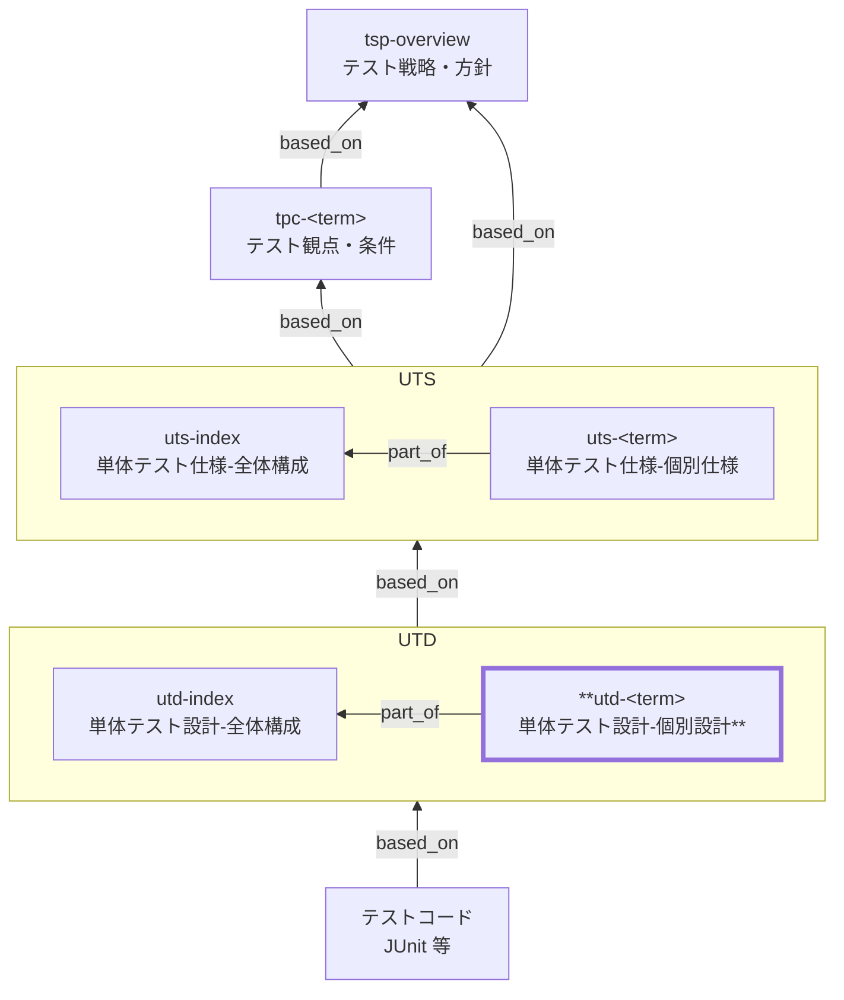

# 単体テスト設計 個別設計 作成ルール

Unit Test Design (UTD) Documentation Rules

本ドキュメントは、単体テスト設計（UTD）のうち、
**特定の対象（コンポーネント／ドメイン単位）に対する個別設計**を統一形式で記述するための標準ルールです。

個別単体テスト設計（`utd-<term>`）は、

- 個別単体テスト仕様（`uts-<term>`）
- テスト観点・条件（TPC）
- 単体テスト設計 全体構成（`utd-index`）

を前提として、**「観点 × 条件」をテストケースへ分解し、テストコードへ確実に落とし込める設計**を提供します。

## 1. 全体方針

- 個別設計（`utd-<term>`）は UTD の個別仕様であり、独立した方針文書ではありません（`utd-index` を前提）。
- 対象は **1ファイル = 1論理対象**（用語集（GL）の term）。
- **観点（保証）× 条件（状態）× 期待結果**でケースへ分解し、総当たりは避けます（ただし落としてはいけない観点は網羅）。
- テストコード全文は書かず、**コードの構成・命名・配置**は実装者が迷わない粒度で決めます。
- 実装詳細（SQL/物理名/内部構造）は書きません（公開 I/F は論理 I/F として記載可）。

## 2. 位置づけ（他ドキュメントとの関係）

`utd-<term>`と他ドキュメントの関係を以下に示します。



## 3. ファイル命名・ID規則

- `id` は `utd-<term>`（kebab-case。例: `utd-inventory`）。
- ファイル名は `utd-020-単体テスト設計-<term>.md` 等（例: `utd-020-単体テスト設計-在庫.md`）。

> `<term>` は **用語集（GL）に定義された論理名**を使用します。

## 4. 推奨 Frontmatter 項目

| 項目       | 説明                                                  | 必須 |
| ---------- | ----------------------------------------------------- | ---- |
| id         | UTD ID（`utd-...`）                                   | ○    |
| type       | `test` 固定                                           | ○    |
| title      | 単体テスト設計: <対象名>                              | ○    |
| status     | `draft` / `ready` / `deprecated`                      | ○    |
| part_of    | 集約ドキュメントへの所属（必ず `utd-index` を含む）   | ○    |
| based_on   | 根拠仕様（`uts-<term>`, `tpc-*`, `br-*`, `bac-*` 等） | ○    |
| supersedes | 置き換え関係                                          | 任意 |

推奨:

- `part_of` には最低限 **`utd-index`** を含めます。
- `based_on` には最低限 **対応する `uts-<term>`** を含めます。
- 観点根拠がある場合は `tpc-*`, `br-*`, `bac-*` を併記します。

## 5. 本文構成（標準テンプレ）

個別 UTD（`utd-<term>`）は以下の見出し構成を **順序固定**で配置します。

| 番号 | 見出し                                  | 必須 |
| ---- | --------------------------------------- | ---- |
| 1    | 概要                                    | ○    |
| 2    | 対象と責務（テスト対象の説明）          | ○    |
| 3    | 対象範囲とテスト境界                    | ○    |
| 4    | ケース設計方針（観点×条件の組合せ戦略） | ○    |
| 5    | テストケース一覧（設計の成果物）        | ○    |
| 6    | データ準備・モック設計                  | ○    |
| 7    | テストコード構成・命名・配置            | ○    |
| 8    | 実行方法・結果参照                      | ○    |
| 9    | メモ / 留意事項                         | 任意 |

## 6. 記述ガイド

### 6.1. 概要

- 「どの UTS（個別）を設計として具体化するか」を明示します。
- 1〜3文で、設計対象・範囲・特徴を書きます。

例:

> 本ドキュメントは、在庫コンポーネントの単体テスト設計を定義し、
> 在庫引当・不足判定・入力検証を観点×条件でケース化する。

### 6.2. 対象と責務（必須）

実装のクラス説明ではなく、**論理責務**を短く書きます。

| 項目       | 内容                         |
| ---------- | ---------------------------- |
| 対象名     | 在庫                         |
| 主な責務   | 在庫数量の管理、引当可否判定 |
| 関連仕様   | uts-inventory                |
| 関連ルール | br-inventory-allocation      |

### 6.3. 対象範囲とテスト境界（必須）

単体の境界条件を固定します（UTSと整合）。

| 区分               | 内容                                |
| ------------------ | ----------------------------------- |
| テスト対象（含む） | 計算、分岐、入力検証、状態判定      |
| テスト対象外       | DB永続化、外部API疎通               |
| 境界の切り方       | リポジトリはモック、外部APIはスタブ |
| 再現方針           | 外部例外はモックで再現              |

### 6.4. ケース設計方針（必須）

ここで「データ×機能」の考え方を **設計書として明文化**します。

#### 6.4.1. 分解の基本

- ケースは **観点（UTS） × 条件（TPC/UTS）** で分解する
- 条件は次の分類を最低限含む
  - 正常（代表）
  - 境界（最小/最大/0/空など）
  - 例外（入力不正、状態不正）
  - 状態（状態遷移、状態依存分岐）

#### 6.4.2. 組合せ戦略（推奨）

総当たりを避けるため、戦略を明記します。

| 観点分類 | 組合せ戦略の例                                                         |
| -------- | ---------------------------------------------------------------------- |
| 正常     | 代表ケース1 + 重要派生1                                                |
| 境界     | 各境界値を最低1ケース                                                  |
| 例外     | 例外カテゴリごとに1ケース（値のバリエーションは parameterized を許容） |
| 状態     | 状態×主要操作の組合せを押さえる（状態遷移図があればそこから抽出）      |

### 6.5. テストケース一覧（必須）

個別 UTD の成果物です。
ここで **ケースID体系と追跡**を確立します。

ケースIDは、観点ID・条件IDから追えるように、次の形式を推奨します。

- `UTC-<観点番号>-<条件番号>`（例: `UTC-01-01`）

推奨カラム:

| ケースID  | 観点ID | 条件ID | 入力（代表値/分類） | 期待結果 | 重点 | 備考 |
| --------- | ------ | ------ | ------------------- | -------- | ---- | ---- |
| UTC-01-01 | UT-01  | UC-01  | 正常・在庫十分      | 引当成功 | High |      |
| UTC-02-02 | UT-02  | UC-02  | 境界・在庫0         | 引当不可 | High |      |
| UTC-03-05 | UT-03  | UC-05  | 不正・注文数負      | エラー   | High |      |

記述のコツ:

- 値は「代表」だけ書き、詳細値は実装で parameterize してよい
- `観点ID/条件ID` を必ず付け、仕様からのトレースを確立する

### 6.6. データ準備・モック設計（必須）

| 依存       | モック方針 | 代表パターン          |
| ---------- | ---------- | --------------------- |
| リポジトリ | 戻り値制御 | 取得成功/対象なし     |
| 時刻       | 固定       | 正常/締め処理跨ぎ     |
| 外部API    | スタブ     | 正常応答/タイムアウト |

### 6.7. テストコード構成・命名・配置（必須）

| 項目             | ルール例                             |
| ---------------- | ------------------------------------ |
| テストクラス命名 | `<対象名>Test`                       |
| ケース命名       | `<条件>_<期待結果>`                  |
| 観点IDの付与     | 各テストにコメント or アノテーション |
| 配置             | `<module>/src/test/...`              |

> 実装言語の違いがあっても成立する粒度で書きます。

### 6.8. 実行方法・結果参照（必須）

| 項目     | 内容                            |
| -------- | ------------------------------- |
| 実行単位 | モジュール単位 / パッケージ単位 |
| 実行方法 | CI / ローカル                   |
| 結果参照 | JUnitレポート / CIログ          |

### 6.9. メモ / 留意事項

- 将来追加したい観点
- 実装変更に弱い箇所（境界の取り方の注意）

## 7. 禁止事項

| 項目                                   | 理由                             |
| -------------------------------------- | -------------------------------- |
| スキーマ未定義のメタ情報プロパティ追加 | スキーマ違反（ツール互換性低下） |
| テストコード全文                       | 実装に委ねる                     |
| 物理名、SQL全文                        | 実装依存                         |
| 値の総当たり表                         | 保守不能                         |
| 曖昧表現                               | 判定不能                         |

## 8. サンプル（最小）

```yaml
---
id: utd-inventory-allocation
type: test
title: 単体テスト設計: 在庫引当（店頭販売）
status: draft
part_of: [utd-index]
based_on:
  - uts-inventory
  - uts-inventory-allocation
  - tpc-sale-checkout
  - bac-sale-checkout
  - br-inventory-allocation
supersedes: []
---
```

### 8.1. 概要

本ドキュメントは UTS（`uts-inventory`, `uts-inventory-allocation`）を設計として具体化し、店頭販売の会計確定における在庫引当について、代表ケースの分解とテストコードへの落とし込み方針を定義する。

### 8.2. 対象と責務（テスト対象の説明）

| 項目     | 内容                                                            |
| -------- | --------------------------------------------------------------- |
| 対象名   | 在庫引当（店頭販売）                                            |
| 主な責務 | 引当可否判定、在庫減算（論理更新）、不足の検知                  |
| 対象外   | DB 永続化、同時実行制御、外部在庫連携（結合/非機能で担保）      |
| 根拠     | tpc-sale-checkout / bac-sale-checkout / br-inventory-allocation |

### 8.3. 対象範囲とテスト境界

| 区分         | 内容                                                              |
| ------------ | ----------------------------------------------------------------- |
| 対象に含める | 引当可否判定、減算計算、入力バリデーション（0/負数/不正商品など） |
| 境界で切る   | DB I/O、トランザクション、ロック/再試行、外部 API                 |
| 依存の扱い   | リポジトリはモック、時刻は固定、外部 API はスタブ（必要時）       |

### 8.4. ケース設計方針（観点×条件の組合せ戦略）

| 観点ID | 代表条件（例）    | 分解方針                                                  |
| ------ | ----------------- | --------------------------------------------------------- |
| UT-01  | UC-01（在庫十分） | 正常系は代表 1 ケース＋境界（在庫ぴったり等）を追加する   |
| UT-02  | UC-02（在庫不足） | 不足は「不足を検知し更新しない」ことを代表 1 ケースで担保 |
| UT-03  | UC-03（入力不正） | 種類で代表化（0/負数/不正商品）し、総当たりは避ける       |

### 8.5. テストケース一覧（設計の成果物）

| ケースID  | 観点ID | 条件ID | 入力の考え方                        | 期待結果                         | 備考 |
| --------- | ------ | ------ | ----------------------------------- | -------------------------------- | ---- |
| UTC-01-01 | UT-01  | UC-01  | 在庫が十分（販売数量より大）        | 引当成功、減算後在庫が整合する   |      |
| UTC-02-02 | UT-02  | UC-02  | 在庫が不足（販売数量より小）        | 引当不可、更新が行われない       |      |
| UTC-03-03 | UT-03  | UC-03  | 入力不正（数量 0/負数、商品不正等） | 拒否（エラー）、更新が行われない |      |

### 8.6. データ準備・モック設計

| 依存       | モック方針           | 代表パターン                   |
| ---------- | -------------------- | ------------------------------ |
| リポジトリ | 戻り値制御           | 在庫十分 / 在庫不足 / 商品なし |
| 時刻       | 固定                 | 通常時刻                       |
| 外部API    | スタブ（必要時のみ） | 正常応答 / タイムアウト        |

### 8.7. テストコード構成・命名・配置

| 項目             | ルール例                                        |
| ---------------- | ----------------------------------------------- |
| テストクラス命名 | `<対象名>Test`（例: `InventoryAllocationTest`） |
| ケース命名       | `<条件>_<期待結果>`                             |
| 観点IDの付与     | 各テストにコメント等で `UT-xx` を付与           |
| 配置             | `<module>/src/test/...`                         |

### 8.8. 実行方法・結果参照

| 項目     | 内容                        |
| -------- | --------------------------- |
| 実行方法 | CI またはローカルで自動実行 |
| 実行単位 | モジュール単位              |
| 結果参照 | JUnit レポート / CI ログ    |

### 8.9. メモ / 留意事項

- 具体値は最小限とし、境界値は「考え方」で表現する（詳細はテストコードで固定）。
- 同時実行時の整合性は本設計の対象外（結合/非機能で別途担保）。

## 9. 生成 AI への指示テンプレート

生成 AI に `utd-<term>` を作らせるときの指示テンプレートは [utd-instruction.md](../instructions/utd-instruction.md) を参照してください。
