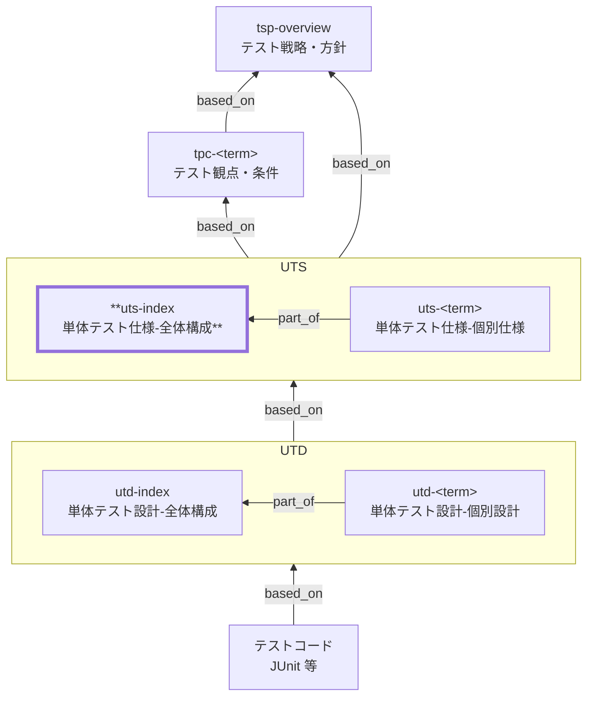

# 単体テスト仕様 全体構成 作成ルール

Unit Test Specification Index (UTS Index) Documentation Rules

本ドキュメントは、単体テスト仕様（UTS）の全体構成 `uts-index` を統一形式で記述するためのルールです。TPC の観点・条件を単体テストの責務として解釈し、個別仕様 `uts-<term>` へ分配する **入口（ナビゲーション）** を定義します。

個別単体テスト仕様（`uts-<term>`）の記述ルールは [uts-rules.md](uts-rules.md) を参照してください。

## 1. 全体方針

- `uts-index` は単体テストの責務（対象・境界・共通合格基準）と、TPC の観点・条件を `uts-<term>` に分配する方針（ナビゲーション）を定義します。
- `uts-index` は **方針・基準・分配**までを扱い、個別の詳細条件やテストケースは扱いません（個別は `uts-<term>` / UTD へ委譲）。
- 共通の合格基準・共通エビデンスは `uts-index` を単一ソース（SSOT）とし、`uts-<term>` では対象固有の差分のみを記載します。
- トレース表（観点 ID ↔ 上位仕様 ID）は原則 TPC に集約し、`uts-index` は Frontmatter の `based_on` を追跡の起点（一次参照）として扱います。
- 曖昧表現（例:「十分に」「適切に」）は禁止し、判定可能な表現（対象/境界/基準/エビデンス）で書きます。

## 2. 位置づけ（他ドキュメントとの関係）

`uts-index` と他ドキュメントの関係を示します。



## 3. ファイル命名・ID規則

- `id` は `uts-index` 固定。個別仕様は `uts-<term>`（詳細は [uts-rules.md](uts-rules.md)）。
- ファイル名は `uts-010-単体テスト仕様-全体構成.md` 等、プロジェクト内で一意になるように命名します。

## 4. 推奨 Frontmatter 項目

### 4.1. 設定内容

Frontmatter は共通スキーマに従います（参照: [docs/shared/schemas/spec-frontmatter.schema.yaml](../../../shared/schemas/spec-frontmatter.schema.yaml) / [meta-document-metadata-rules.md](meta-document-metadata-rules.md)）。

| 項目       | 説明                                               | 必須 |
| ---------- | -------------------------------------------------- | ---- |
| id         | `uts-index`（固定）                                | ○    |
| type       | `test` 固定                                        | ○    |
| title      | 単体テスト仕様: 全体構成                           | ○    |
| status     | `draft` / `ready` / `deprecated`                   | ○    |
| part_of    | `[]`（`uts-index` 自身は親なので通常は空配列）     | 任意 |
| based_on   | 根拠となる仕様ID（ID配列。未指定時は `[]` を許容） | 任意 |
| supersedes | 置き換え関係（ID配列。未指定時は `[]` を許容）     | 任意 |

### 4.2. 推奨ルール

- `based_on` には最低限、関連する `tpc-*` を含めます（追跡の起点となる一次参照。網羅は TPC のトレース表に集約）。
- BAC/NFR/BR 等は、`uts-index` の方針判断（境界・分配・共通合格基準）に **直接利用したものだけ**を列挙します（大量なら TPC に集約）。
- 個別仕様（`uts-<term>`）では判断根拠の明確化のため `based_on` を必要十分に列挙します（`tpc-*` は必須。必要に応じて `br-*` / `bac-*` / `nfr-*` 等）。
- 可能であれば上位方針（例: `tsp-overview`）も `based_on` に含めます。
- `part_of` / `based_on` / `supersedes` は ID 配列（未指定は `[]` 可）。

## 5. 本文構成（標準テンプレ）

`uts-index` は以下の見出し構成を **順序固定**で配置します。

| 番号 | 見出し                                          | 必須 |
| ---- | ----------------------------------------------- | ---- |
| 1    | 概要                                            | ○    |
| 2    | 対象単位の定義                                  | ○    |
| 3    | 単体テストの対象範囲と境界（モック/スタブ方針） | ○    |
| 4    | 分配方針（TPC → `uts-<term>`）                  | ○    |
| 5    | 対象単位一覧（統合表）                          | ○    |
| 6    | 合格基準とエビデンス（共通）                    | ○    |
| 7    | 個別仕様一覧（統合表を参照）                    | ○    |
| 8    | 対象外・除外理由                                | ○    |
| 9    | メモ / 将来課題                                 | 任意 |

## 6. 記述ガイド

### 6.1. 概要

- `uts-index` が **単体テストで何をどこまで保証するか（全体の責務・境界・合格基準）** を簡潔に述べます。
- 「TPC の観点・条件を `uts-<term>` に分配する入口である」ことを明示します。
- 前版（`supersedes`）からの変更点があれば、ここで要点のみ触れてよいです（詳細な変更履歴は別途管理してもよい）。

### 6.2. 対象単位の定義（必須）

- `uts-<term>` の **粒度・命名・対象の切り方** を定義します。
- **1ドキュメント = 1論理対象**の原則、分割/統合の判断基準（例: 状態と責務が同一か、境界が明確か）を明記します。
- 実装構造（クラス名、モジュール名、API 名）には依存しない表現にします。

対象単位（`uts-<term>`）の一覧・TPC 割当・個別仕様リンクは、**6.5 の「対象単位一覧（統合表）」** に集約します（SSOT。重複記載しません）。

### 6.3. 単体テストの対象範囲と境界（モック/スタブ方針）（必須）

- **単体で責任を持つ範囲** と、**結合以降へ委譲する範囲** を明確にします。
- 依存（DB、外部 API、時刻、乱数、ファイル等）をどう扱うか（モック/スタブ/固定化）を方針として記載します。

推奨の書き方（例）:

| 区分       | 内容                                              |
| ---------- | ------------------------------------------------- |
| 境界で切る | DB I/O、外部決済、帳票出力、外部在庫連携、時刻    |
| 依存の扱い | リポジトリはモック、時刻は固定、外部 API はスタブ |
| 結合で担保 | トランザクション整合性、実接続、同時実行制御      |

### 6.4. 分配方針（TPC → `uts-<term>`）（必須）

`uts-index` の中核です。最低限、次を満たします。

- `uts-<term>` ごとに **担当するTPC（またはTPCの観点範囲）** が追跡可能であること
- 分配の理由（責務/境界/関心の分離）が説明されていること
- 分配により **抜け/重複**が起きないための取り扱い（例: 例外系はどこで担保するか）を明示すること

> トレース表（観点ID ↔ 上位仕様ID）の網羅は原則 TPC に置き、`uts-index` では分配の方針・リンク関係が分かる粒度に留めます。

### 6.5. 対象単位一覧（統合表）（必須）

運用上の更新漏れを防ぐため、対象単位・TPC 割当・個別仕様リンクを **1 表に集約**し、ここを SSOT とします（`uts-index` 本文の見出し「5. 対象単位一覧（統合表）」）。

| `uts-<term>`                              | 対象の要約（責務）             | 担当するTPC（例）                                 | 境界（単体で切るもの） | コメント |
| ----------------------------------------- | ------------------------------ | ------------------------------------------------- | ---------------------- | -------- |
| [uts-sale-checkout](./uts-index-rules.md) | 会計確定の核（計算/検証/遷移） | `tpc-sale-checkout` の会計計算/取消/返品/権限制御 | DB/外部決済/時刻       |          |
| [uts-inventory](./uts-index-rules.md)     | 在庫引当/減算/戻しの核         | `tpc-sale-checkout` の在庫連動/在庫不足           | DB/外部在庫I/F         |          |

※ 本ルール文書ではデッドリンク防止のため、例のリンクを本ファイル（自己参照）にしています。
※ 実運用では、各 `uts-<term>` が指す個別仕様ファイル（例: `./uts-<term>.md`）へリンクします（実ファイル名・配置はプロジェクトに合わせます）。

### 6.6. 合格基準とエビデンス（共通）（必須）

- 単体テスト全体で共通に適用する **品質ゲート**を定義します（例: 失敗 0 件、重大不具合 0 件など）。
- 何をもって合格とし、何をエビデンスとするかを **判定可能な形**で示します。

例:

| 項目         | 合格基準（例）        | エビデンス          |
| ------------ | --------------------- | ------------------- |
| 実行結果     | 失敗 0 件             | CI のテストレポート |
| 未解決不具合 | Blocker/Critical 0 件 | 不具合管理票        |

### 6.7. 個別仕様一覧（必須）

- 個別仕様一覧は **6.5 の統合表（`uts-<term>` 列）** で管理します（重複禁止・命名ゆれ禁止）。

### 6.8. 対象外・除外理由（必須）

- 単体テストで担保しない事項を列挙し、**どのレベル（結合/総合/非機能等）で担保するか**を明記します。

例: DB 制約・トランザクション整合性（結合）、同時実行制御（負荷/非機能）、外部 API 実接続（結合）

### 6.9. メモ / 将来課題

- 未確定の方針、将来追加したい観点、分割/統合の見直し候補を記載します。
- 合否判定に影響する事項はここに置かず、本文（特に 6.4 / 6.6）へ反映します。

## 7. 禁止事項

| 項目                                         | 理由                                          |
| -------------------------------------------- | --------------------------------------------- |
| `uts-<term>` の本文と同じ内容の重複記載      | 更新漏れの温床                                |
| 個別ロジックの詳細条件（具体値・網羅ケース） | 下位（`uts-<term>` / UTD）へ委譲すべき        |
| テストケース（手順/期待結果の逐語列挙）      | 下位（UTD/テストコード）へ委譲すべき          |
| テストコード（クラス/メソッド/設定）         | 実装依存・単体テスト設計以降に委ねる          |
| 曖昧表現（「適切に」「十分に」等）           | 合否判定不能                                  |
| 未定義のメタ情報プロパティ追加               | スキーマ違反（`additionalProperties: false`） |

## 8. サンプル（最小）

### 8.1. メタ情報（Frontmatter）

```yaml
---
id: uts-index
type: test
title: 単体テスト仕様: 全体構成（駄菓子屋販売管理システム）
status: draft
part_of: []
based_on:
  - tpc-sale-checkout
  - bac-sale-checkout
  - bac-inventory-replenishment
supersedes: []
---
```

### 8.2. 概要

本ドキュメント（`uts-index`）は、単体テストで担保する **責務・境界・共通合格基準** を定義し、TPC の観点・条件を対象単位（`uts-<term>`）へ **分配する入口（ナビゲーション）** とする。

### 8.3. 対象単位の定義

- `uts-<term>` は **1ドキュメント = 1論理対象（責務のまとまり）**。
- 分割/統合は「責務・状態・境界（依存の切れ目）」で判断する。

対象単位の一覧・TPC 割当・個別仕様リンクは 8.6 に集約する。

### 8.4. 単体テストの対象範囲と境界（モック/スタブ方針）

- 単体テストでは **純粋なビジネス判断・計算・遷移の正しさ** を担保する。
- 外部依存は単体の境界で切り、結合以降で実接続・整合性を担保する。

| 区分       | 内容                                                    |
| ---------- | ------------------------------------------------------- |
| 境界で切る | DB I/O、外部決済、帳票/ファイル出力、外部在庫連携、時刻 |
| 依存の扱い | リポジトリはモック、外部 API はスタブ、時刻は固定       |
| 結合で担保 | 実接続、トランザクション整合性、同時実行制御            |

### 8.5. 分配方針（TPC → `uts-<term>`）

- `uts-<term>` ごとに担当する TPC（または観点範囲）と分配理由（責務/境界/関心分離）を示す。
- 例外系・境界条件は「その判断を行う責務を持つ `uts-<term>`」に割り当て、重複を避ける。

### 8.6. 対象単位一覧（統合表）

| `uts-<term>`                              | 対象の要約                               | 担当するTPC（例）                                 | 境界（単体で切るもの） | コメント                         |
| ----------------------------------------- | ---------------------------------------- | ------------------------------------------------- | ---------------------- | -------------------------------- |
| [uts-sale-checkout](./uts-index-rules.md) | 会計確定（計算・入力検証・状態遷移の核） | `tpc-sale-checkout` の会計計算/取消/返品/権限制御 | DB/外部決済/時刻       | 会計の核ロジックを単体で担保     |
| [uts-inventory](./uts-index-rules.md)     | 在庫引当/減算/戻しの核                   | `tpc-sale-checkout` の在庫連動/在庫不足           | DB/外部在庫I/F         | 在庫の計算・不足判定を単体で担保 |

※ 本サンプルではデッドリンク防止のため、例のリンクを本ファイル（自己参照）にしています。実運用では各 `uts-<term>` の個別仕様ファイルへリンクしてください。

### 8.7. 合格基準とエビデンス（共通）

| 項目         | 合格基準（例）        | エビデンス（例）          |
| ------------ | --------------------- | ------------------------- |
| 実行結果     | 単体テスト失敗 0 件   | CI のテストレポート       |
| 未解決不具合 | Blocker/Critical 0 件 | 不具合管理票/チケット一覧 |

### 8.8. 個別仕様一覧（`uts-<term>`）

個別仕様一覧は、8.6 の「対象単位一覧（統合表）」の `uts-<term>` 列（リンク）を参照する。

### 8.9. 対象外・除外理由

- DB 制約・トランザクション整合性: 結合テストで担保する（単体では DB をモックするため）。
- 外部 API の実接続・疎通: 結合テストで担保する。
- 同時実行制御・性能/負荷: 非機能テストで担保する。

### 8.10. メモ / 将来課題

- `uts-<term>` の粒度見直し（例: 在庫と会計の境界が変更された場合の再分配）。
- 共通合格基準に静的解析/カバレッジ等を追加するかの検討（追加する場合は数値基準を明記）。

## 9. 生成 AI への指示テンプレート

生成 AI に `uts-index` を作らせるときの指示テンプレートは [uts-instruction.md](../instructions/uts-instruction.md) を参照してください。
