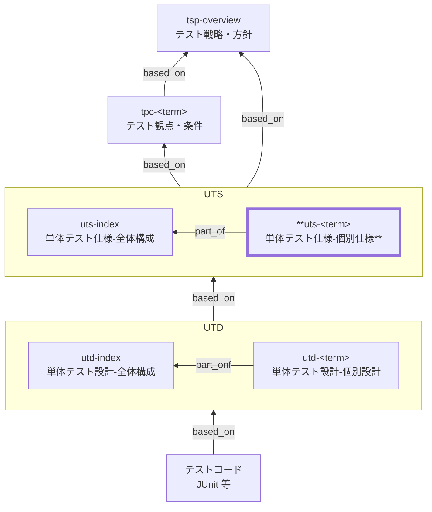

# 単体テスト仕様 個別仕様 作成ルール

Unit Test Specification (UTS) Documentation Rules

本ドキュメントは、単体テスト仕様の
**特定の対象（コンポーネント／ドメイン単位）に対する個別仕様** を統一形式で記述するための標準ルールです。

単体テスト仕様の個別仕様は、

- 単体テスト仕様 全体構成（`uts-index`）
- テスト観点・条件（TPC）

を前提として、**「この対象について、単体テストで何をどこまで保証するか」** を明確化します。

## 1. 全体方針

- 本ドキュメントが扱う個別仕様（`uts-<term>`）は、**単体テスト仕様（UTS）の個別化**であり、独立した方針文書ではありません。
  - 必ず `uts-index` を前提にします。

- 対象は **1ドキュメント = 1論理対象**を原則とします。
  - 例: 在庫、商品、注文、価格計算、割引判定 など

- 個別 UTS は **「保証範囲の明確化」まで**を担い、
  - テストケースの具体値
  - テストコードの構造
    は **単体テスト設計（UTD）以降**に委ねます。

- 観点・条件は **TPC からの派生であることが追跡可能**でなければなりません。
- 曖昧な表現は禁止します。
  - 「基本的な処理」「正常に動作すること」などは禁止
  - **どの条件で、どの振る舞いを保証するか**を明示します。

## 2. 位置づけ（他ドキュメントとの関係）

個別 UTS（`uts-<term>`）は以下の関係にあります。



## 3. ファイル命名・ID規則

### 3.1. ファイル名

ファイル名は`uts-010-単体テスト仕様-<term>.md` 等、プロジェクト内で一意になるように命名します。

例:

- `uts-010-単体テスト仕様-在庫.md`
- `uts-010-単体テスト仕様-注文.md`

> `<term>` は **用語集（GL）に定義された論理名**を使用します。

### 3.2. Frontmatter 規則

- `id`: `uts-<term>` 形式（小文字・ハイフン）
  - 例: `uts-inventory`

- `title`: `単体テスト仕様: <論理名>`

## 4. 推奨 Frontmatter 項目

Frontmatter は共通スキーマに従います（あわせてドキュメントのメタ情報の記述ルールも参照）。

- 参照スキーマ: [docs/shared/schemas/spec-frontmatter.schema.yaml](../../../shared/schemas/spec-frontmatter.schema.yaml)
- メタ情報ルール: [meta-document-metadata-rules.md](meta-document-metadata-rules.md)

| 項目       | 説明                                                   | 必須 |
| ---------- | ------------------------------------------------------ | ---- |
| id         | UTS ID（個別: `uts-<term>`）                           | ○    |
| type       | `test` 固定                                            | ○    |
| title      | 単体テスト仕様: <対象名>                               | ○    |
| status     | `draft` / `ready` / `deprecated`                       | ○    |
| part_of    | 集約ドキュメントへの所属（ID配列。`uts-index` を含む） | 必須 |
| based_on   | 根拠仕様（`tpc-*`, `br-*`, `bac-*`, `nfr-*` 等）       | 必須 |
| supersedes | 置き換え関係                                           | 任意 |

### 4.1. 推奨ルール

- `part_of` には **必ず** `uts-index` を含めます
- `based_on` には **必ず** 関連する `tpc-*` を含めます
- `part_of` / `based_on` / `supersedes` は **ID の配列**として記載します（未指定の場合も `[]` を明示してよい）。

- 業務ルール・受入条件に依存する場合は明示します。

## 5. 本文構成（標準テンプレ）

個別 UTS（`uts-<term>`）は以下の見出し構成を **必ず守ります**。

1. 概要
2. 対象の責務と役割
3. 単体テストの対象範囲と境界
4. 保証する観点（個別）
5. テスト条件（代表条件）
6. 合格基準とエビデンス
7. 対象外・除外理由
8. メモ / 将来課題

## 6. 記述ガイド詳細

### 6.1. 概要

- この対象について、**単体テストで何を保証するのか**を簡潔に記載します。
- 全体構成（`uts-index`）で定義された方針に対する例外・追加前提・特記事項があれば明示します。

例:

> 本ドキュメントは、在庫コンポーネントに対する単体テスト仕様を定義し、
> 在庫引当・減算・不足判定の正確性を保証する。

### 6.2. 対象の責務と役割（必須）

対象の責務を **業務・設計観点で簡潔に説明**します。

#### 6.2.1. 推奨の書き方

| 項目       | 内容                           |
| ---------- | ------------------------------ |
| 対象名     | 在庫                           |
| 主な責務   | 在庫数量の管理、引当可否の判定 |
| 関連ルール | 在庫引当ルール、欠品判定ルール |
| 上位モデル | 業務プロセス: 発注処理         |

> 実装構造（クラス名等）は書きません。

### 6.3. 単体テストの対象範囲と境界（必須）

#### 6.3.1. 推奨の書き方

| 区分         | 内容                               |
| ------------ | ---------------------------------- |
| 対象に含める | 在庫数量計算、引当判定、境界値判定 |
| 境界で切る   | DB 永続化、外部API連携             |
| 依存の扱い   | リポジトリはモック、時刻は固定     |

記述のポイント:

- 「どこまで単体で責任を持つか」を明示
- 結合テストとの責務分離を意識

### 6.4. 保証する観点（個別）（必須）

個別 UTS の中核です。
この対象で **必ず保証する観点**を整理します。

#### 6.4.1. 推奨カラム

| 観点ID  | 観点分類 | 観点名   | 保証内容                         | 根拠         |
| ------- | -------- | -------- | -------------------------------- | ------------ |
| UT-I-01 | 正常     | 引当可能 | 在庫が十分な場合、引当が成功する | tpc-xxx-xxx  |
| UT-I-02 | 境界     | 在庫0    | 在庫0では引当不可と判定される    | br-xxx-xxx   |
| UT-I-03 | 例外     | 不正数量 | 負数指定はエラーとなる           | bac-xxx-xxx  |
| UT-I-04 | 状態     | 状態遷移 | 状態に応じて分岐が正しい         | cstd-xxx-xxx |

---

### 6.5. テスト条件（代表条件）（必須）

UTD に落とすための **代表条件**を列挙します。

#### 6.5.1. 推奨カラム

| 観点ID  | 条件ID | 条件（状態レベル） | 期待される振る舞い |
| ------- | ------ | ------------------ | ------------------ |
| UT-I-01 | UC-01  | 在庫数 > 注文数    | 引当成功           |
| UT-I-02 | UC-02  | 在庫数 = 0         | 引当不可           |
| UT-I-03 | UC-05  | 注文数が負数       | エラー             |

> 数値・具体値は設計（UTD）へ委ねます。

### 6.6. 合格基準とエビデンス（必須）

#### 6.6.1. 推奨の書き方

| 項目         | 基準         | エビデンス  |
| ------------ | ------------ | ----------- |
| テスト結果   | 失敗0件      | CI レポート |
| 重要観点     | すべて検証済 | テスト結果  |
| 未解決不具合 | Critical 0   | 不具合一覧  |

### 6.7. 対象外・除外理由（必須）

例:

- DB トランザクション保証（結合テスト）
- 同時実行制御（性能・非機能テスト）

### 6.8. メモ / 将来課題

- 将来追加したい観点
- 未確定の業務ルール

## 7. 禁止事項

| 項目                   | 理由         |
| ---------------------- | ------------ |
| テストコードの記載     | 実装に委ねる |
| SQL / クラス名         | 実装依存     |
| テストケース番号の羅列 | 設計に委ねる |
| 曖昧表現               | 合否判定不能 |

## 8. サンプル（最小）

```yaml
---
id: uts-inventory-allocation
type: test
title: 単体テスト仕様: 在庫引当（店頭販売）
status: draft
part_of: [uts-index]
based_on:
  - tpc-sale-checkout
  - bac-sale-checkout
  - bac-inventory-replenishment
  - br-inventory-allocation
  - nfr-security
supersedes: []
---
```

### 8.1. 概要

店頭販売の会計確定時に行う「在庫引当」の単体テスト仕様を定義し、在庫不足や入力不正を含む判定・更新方針の正しさを保証する。

### 8.2. 対象の責務と役割

| 項目       | 内容                                             |
| ---------- | ------------------------------------------------ |
| 対象名     | 在庫引当（店頭販売）                             |
| 主な責務   | 引当可否判定、在庫減算（論理更新）、不足の検知   |
| 関連ルール | 在庫引当ルール、欠品判定、会計確定時の更新ルール |
| 上位モデル | 業務プロセス: 店頭販売（会計確定）               |

### 8.3. 単体テストの対象範囲と境界

| 区分         | 内容                                                                |
| ------------ | ------------------------------------------------------------------- |
| 対象に含める | 引当可否判定、在庫減算の計算、入力バリデーション（負数/不存在など） |
| 境界で切る   | DB 永続化、同時実行制御、外部在庫連携                               |
| 依存の扱い   | リポジトリはモック、時刻は固定、トランザクションは結合テストで担保  |

### 8.4. 保証する観点（個別）

| 観点ID  | 観点分類 | 観点名   | 保証内容                                                                 | 根拠                    |
| ------- | -------- | -------- | ------------------------------------------------------------------------ | ----------------------- |
| UT-I-01 | 正常     | 引当可能 | 在庫が十分な場合、対象数量が引当され、減算結果が業務ルールに一致する     | tpc-sale-checkout       |
| UT-I-02 | 異常     | 在庫不足 | 在庫不足を検知し、確定不可（またはエラー）として扱われ、更新が行われない | bac-sale-checkout       |
| UT-I-03 | 例外     | 入力不正 | 不正な数量/存在しない商品などは拒否され、更新が行われない                | br-inventory-allocation |

### 8.5. テスト条件（代表条件）

| 観点ID  | 条件ID | 条件（状態レベル）                   | 期待される振る舞い               |
| ------- | ------ | ------------------------------------ | -------------------------------- |
| UT-I-01 | UC-01  | 在庫数 > 販売数量                    | 引当成功、減算後在庫が整合する   |
| UT-I-02 | UC-02  | 在庫数 < 販売数量                    | 引当不可、更新が行われない       |
| UT-I-03 | UC-03  | 販売数量が 0 または負数 / 商品が不正 | 拒否（エラー）、更新が行われない |

### 8.6. 合格基準とエビデンス

| 項目         | 基準                   | エビデンス                 |
| ------------ | ---------------------- | -------------------------- |
| テスト結果   | 失敗 0 件              | CI のテスト結果            |
| 重要観点     | UT-I-01〜03 が検証済み | テストレポート（結果一覧） |
| 未解決不具合 | Critical 0 / High 0    | 不具合一覧（該当があれば） |

### 8.7. 対象外・除外理由

- 同時実行時の競合（ロック/再試行など）は結合テスト・負荷試験で担保する。
- DB の制約やトランザクション整合性は結合テストで担保する。

### 8.8. メモ / 将来課題

- 「引当不可」時のユーザー向けメッセージ方針は UI 仕様に合わせて更新する。
- 予約・取り置き等の在庫概念が入る場合は観点を追加する。

## 9. 生成AIへの指示テンプレート

生成 AI に個別 UTS（`uts-<term>`）を作らせるときの指示テンプレートは [uts-instruction.md](../instructions/uts-instruction.md) を参照してください。
