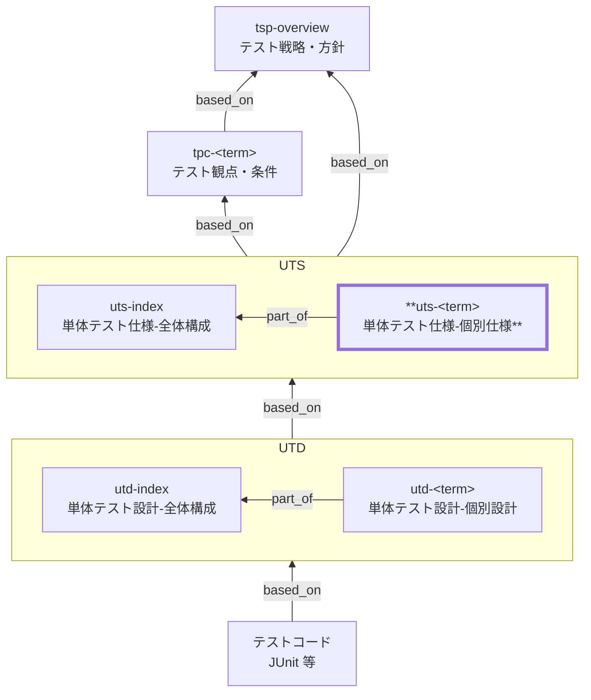

# 単体テスト仕様 個別仕様 作成ルール

Unit Test Specification (UTS) Documentation Rules

本ドキュメントは、単体テスト仕様（UTS）の個別仕様 `uts-<term>` を統一形式で記述するためのルールです。
`uts-index` とテスト観点・条件（TPC）を前提に、対象ごとの **単体テストで保証する範囲（責務・境界・観点・合格基準）** を明文化します。

## 1. 全体方針

- 本ドキュメント（`uts-<term>`）は UTS の個別仕様であり、独立した方針文書ではありません（`uts-index` を前提）。
- 対象は **1ドキュメント = 1論理対象**（例: 在庫、商品、注文、価格計算、割引判定）。
- **責務・境界・観点・合格基準**を明文化し、TPC 由来で追跡可能にします（曖昧表現は禁止）。
- テストケースの具体値・テストコード構造は UTD 以降に委ねます。

## 2. 位置づけ（他ドキュメントとの関係）

個別 UTS（`uts-<term>`）と他ドキュメントの関係を示します。



## 3. ファイル命名・ID規則

- `id` は `uts-<term>`（kebab-case。例: `uts-inventory`）。
- ファイル名は `uts-010-単体テスト仕様-<term>.md` 等（例: `uts-010-単体テスト仕様-在庫.md`）。

> `<term>` は **用語集（GL）に定義された論理名**を使用します。

## 4. 推奨 Frontmatter 項目

### 4.1. 設定内容

Frontmatter は共通スキーマに従います（あわせてドキュメントのメタ情報の記述ルールも参照）。

- 参照スキーマ: [docs/shared/schemas/spec-frontmatter.schema.yaml](../../../shared/schemas/spec-frontmatter.schema.yaml)
- メタ情報ルール: [meta-document-metadata-rules.md](meta-document-metadata-rules.md)

| 項目       | 説明                                                   | 必須 |
| ---------- | ------------------------------------------------------ | ---- |
| id         | UTS ID（個別: `uts-<term>`）                           | ○    |
| type       | `test` 固定                                            | ○    |
| title      | 単体テスト仕様: <対象名>                               | ○    |
| status     | `draft` / `ready` / `deprecated`                       | ○    |
| part_of    | 集約ドキュメントへの所属（ID配列。`uts-index` を含む） | ○    |
| based_on   | 根拠仕様（`tpc-*`, `br-*`, `bac-*`, `nfr-*` 等）       | ○    |
| supersedes | 置き換え関係                                           | 任意 |

### 4.2. 推奨ルール

- `part_of` には **必ず** `uts-index` を含めます。
- `based_on` には **必ず** 関連する `tpc-*` を含めます（追跡の起点）。
- `br-*` / `bac-*` / `nfr-*` 等は判断根拠として **直接利用したものだけ**を列挙します。
- `part_of` / `based_on` / `supersedes` は ID 配列（未指定は `[]` 可）。

## 5. 本文構成（標準テンプレ）

個別 UTS（`uts-<term>`）は以下の見出し構成を **順序固定**で配置します。

| 番号 | 見出し                                          | 必須 |
| ---- | ----------------------------------------------- | ---- |
| 1    | 概要                                            | ○    |
| 2    | 対象の責務と役割                                | ○    |
| 3    | 単体テストの対象範囲と境界（モック/スタブ方針） | ○    |
| 4    | 保証する観点（個別）                            | ○    |
| 5    | テスト条件（代表条件）                          | ○    |
| 6    | 合格基準とエビデンス                            | ○    |
| 7    | 対象外・除外理由                                | ○    |
| 8    | メモ / 将来課題                                 | 任意 |

## 6. 記述ガイド

### 6.1. 概要

- この対象について、**単体テストで何を保証するのか**を簡潔に記載します。
- 全体構成（`uts-index`）で定義された方針に対する例外・追加前提・特記事項があれば明示します。

例:

> 本ドキュメントは、在庫コンポーネントに対する単体テスト仕様を定義し、
> 在庫引当・減算・不足判定の正確性を保証する。

### 6.2. 対象の責務と役割（必須）

対象の責務を **業務・設計観点で簡潔に説明**します。

| 項目       | 内容                           |
| ---------- | ------------------------------ |
| 対象名     | 在庫                           |
| 主な責務   | 在庫数量の管理、引当可否の判定 |
| 関連ルール | 在庫引当ルール、欠品判定ルール |
| 上位モデル | 業務プロセス: 発注処理         |

> 実装構造（クラス名等）は書きません。

### 6.3. 単体テストの対象範囲と境界（モック/スタブ方針）（必須）

単体テストで **責任を持つ範囲** と、**結合以降へ委譲する範囲** を明確にします。

| 区分         | 内容                               |
| ------------ | ---------------------------------- |
| 対象に含める | 在庫数量計算、引当判定、境界値判定 |
| 境界で切る   | DB 永続化、外部 API 連携           |
| 依存の扱い   | リポジトリはモック、時刻は固定     |

### 6.4. 保証する観点（個別）（必須）

この対象で **必ず保証する観点**を整理します。

| 観点ID | 観点分類 | 観点名   | 保証内容                         | 根拠         |
| ------ | -------- | -------- | -------------------------------- | ------------ |
| UT-01  | 正常     | 引当可能 | 在庫が十分な場合、引当が成功する | tpc-xxx-xxx  |
| UT-02  | 境界     | 在庫0    | 在庫0では引当不可と判定される    | br-xxx-xxx   |
| UT-03  | 例外     | 不正数量 | 負数指定はエラーとなる           | bac-xxx-xxx  |
| UT-04  | 状態     | 状態遷移 | 状態に応じて分岐が正しい         | cstd-xxx-xxx |

### 6.5. テスト条件（代表条件）（必須）

UTD に落とすための **代表条件**を列挙します。

| 観点ID | 条件ID | 条件（状態レベル） | 期待される振る舞い |
| ------ | ------ | ------------------ | ------------------ |
| UT-01  | UC-01  | 在庫数 > 注文数    | 引当成功           |
| UT-02  | UC-02  | 在庫数 = 0         | 引当不可           |
| UT-03  | UC-05  | 注文数が負数       | エラー             |

> 数値・具体値は設計（UTD）へ委ねます。

### 6.6. 合格基準とエビデンス（必須）

- 共通の合格基準・共通エビデンスは `uts-index` に従います。
- `uts-<term>` では、この対象に特有の「追加基準」「追加エビデンス」「例外的な取り扱い」だけを書きます。

例（対象固有のみ）:

| 項目           | 基準（例）                          | エビデンス（例）                 |
| -------------- | ----------------------------------- | -------------------------------- |
| 重要観点       | 本対象の全観点（UT-xx）が検証済み   | テスト結果（観点IDの対応が追跡） |
| 追加エビデンス | 境界/例外で期待する分類が満たされる | 失敗時ログ（要点のみ）           |

### 6.7. 対象外・除外理由（必須）

例:

- DB トランザクション保証（結合テスト）
- 同時実行制御（性能・非機能テスト）

### 6.8. メモ / 将来課題

- 将来追加したい観点
- 未確定の業務ルール

## 7. 禁止事項

| 項目                                   | 理由                             |
| -------------------------------------- | -------------------------------- |
| テストコードの記載                     | 実装に委ねる                     |
| SQL / クラス名                         | 実装依存                         |
| テストケース番号の羅列                 | 設計に委ねる                     |
| 曖昧表現                               | 合否判定不能                     |
| スキーマ未定義のメタ情報プロパティ追加 | スキーマ違反（ツール互換性低下） |

## 8. サンプル（最小）

```yaml
---
id: uts-inventory-allocation
type: test
title: 単体テスト仕様: 在庫引当（店頭販売）
status: draft
part_of: [uts-index]
based_on:
  - tpc-sale-checkout
  - bac-sale-checkout
  - bac-inventory-replenishment
  - br-inventory-allocation
  - nfr-security
supersedes: []
---
```

### 8.1. 概要

店頭販売の会計確定時に行う「在庫引当」の単体テスト仕様を定義し、在庫不足や入力不正を含む判定・更新方針の正しさを保証する。

### 8.2. 対象の責務と役割

| 項目       | 内容                                             |
| ---------- | ------------------------------------------------ |
| 対象名     | 在庫引当（店頭販売）                             |
| 主な責務   | 引当可否判定、在庫減算（論理更新）、不足の検知   |
| 関連ルール | 在庫引当ルール、欠品判定、会計確定時の更新ルール |
| 上位モデル | 業務プロセス: 店頭販売（会計確定）               |

### 8.3. 単体テストの対象範囲と境界

| 区分         | 内容                                                                |
| ------------ | ------------------------------------------------------------------- |
| 対象に含める | 引当可否判定、在庫減算の計算、入力バリデーション（負数/不存在など） |
| 境界で切る   | DB 永続化、同時実行制御、外部在庫連携                               |
| 依存の扱い   | リポジトリはモック、時刻は固定、トランザクションは結合テストで担保  |

### 8.4. 保証する観点（個別）

| 観点ID | 観点分類 | 観点名   | 保証内容                                                                 | 根拠                    |
| ------ | -------- | -------- | ------------------------------------------------------------------------ | ----------------------- |
| UT-01  | 正常     | 引当可能 | 在庫が十分な場合、対象数量が引当され、減算結果が業務ルールに一致する     | tpc-sale-checkout       |
| UT-02  | 異常     | 在庫不足 | 在庫不足を検知し、確定不可（またはエラー）として扱われ、更新が行われない | bac-sale-checkout       |
| UT-03  | 例外     | 入力不正 | 不正な数量/存在しない商品などは拒否され、更新が行われない                | br-inventory-allocation |

### 8.5. テスト条件（代表条件）

| 観点ID | 条件ID | 条件（状態レベル）                   | 期待される振る舞い               |
| ------ | ------ | ------------------------------------ | -------------------------------- |
| UT-01  | UC-01  | 在庫数 > 販売数量                    | 引当成功、減算後在庫が整合する   |
| UT-02  | UC-02  | 在庫数 < 販売数量                    | 引当不可、更新が行われない       |
| UT-03  | UC-03  | 販売数量が 0 または負数 / 商品が不正 | 拒否（エラー）、更新が行われない |

### 8.6. 合格基準とエビデンス

共通の合格基準・共通エビデンスは `uts-index` を参照し、この対象に特有のものだけを記載する。

| 項目     | 基準（例）                      | エビデンス（例）                    |
| -------- | ------------------------------- | ----------------------------------- |
| 重要観点 | UT-01〜03 が検証済み            | テスト結果（観点IDで追跡できる形）  |
| 例外系   | 例外分類/メッセージが仕様どおり | 失敗時ログ（要点）/期待結果（分類） |

### 8.7. 対象外・除外理由

- 同時実行時の競合（ロック/再試行など）は結合テスト・負荷試験で担保する。
- DB の制約やトランザクション整合性は結合テストで担保する。

### 8.8. メモ / 将来課題

- 「引当不可」時のユーザー向けメッセージ方針は UI 仕様に合わせて更新する。
- 予約・取り置き等の在庫概念が入る場合は観点を追加する。

## 9. 生成 AI への指示テンプレート

生成 AI に個別 UTS（`uts-<term>`）を作らせるときの指示テンプレートは [uts-instruction.md](../instructions/uts-instruction.md) を参照してください。
