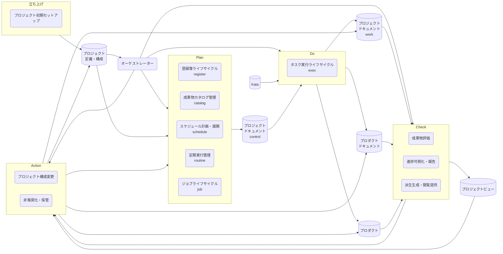
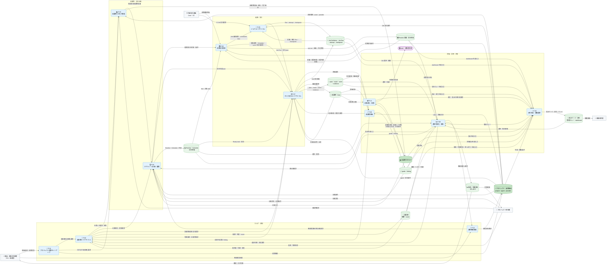
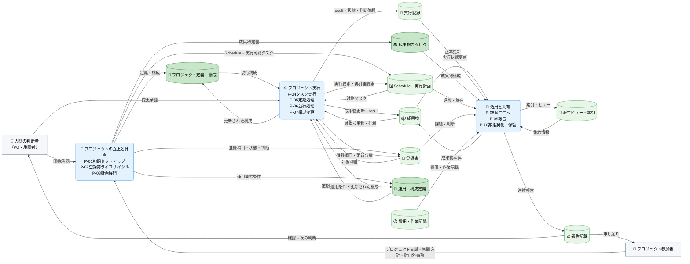
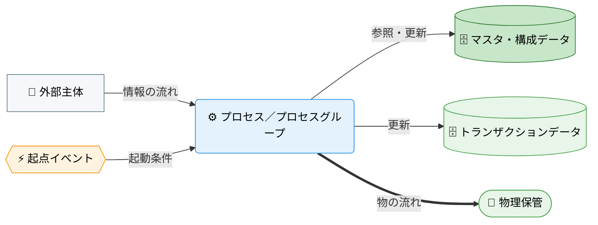

---
specdojo:
  id: prj-0001:cdfd-overview
  type: flow
  status: ready
  rulebook: specdojo:cdfd-overview-rulebook
  based_on: []
  supersedes: []
---

# 概念データフロー図（全体概要）: SpecDojo

本書は、SpecDojo のプロジェクトの立上・計画から実行、活用と共有までを、十のプロセス領域と領域間の情報・イベントの流れとして定義する全体概要である。

## 1. 目的

仕様で知識と作業をつなぐというプロジェクト方針に沿い、人と AI Agent が同じ正本から計画・実行・判断を引き継げる全体境界を合意するために使用する。対象者は、対象範囲を承認する PO、全体の業務仕様を整理する BA、領域別 CDFD を設計入力として使う ARC、領域分割の重複・欠落を確認する QE である。

## 2. 適用範囲

- 対象は、プロジェクト開始から登録簿ライフサイクル、計画展開、タスク実行、定期・並行処理、構成変更、派生生成、報告、非推奨化・保管までの情報の受け渡しである。
- 本書は十のプロセス領域の全体境界を示す概念データフローである。個別コマンド、ファイル単位の更新、領域内の必須・条件付きプロセスの分割、状態遷移、例外復旧、実装エビデンスは、各領域別 CDFD が定める粒度で詳細化する。
- `list`、`where`、`status`、`validate`、`dry-run` など、状態や成果物を変更しない参照・検証操作は独立した業務フローに含めず、各領域を支える補助操作として扱う。
- 人間と AI Agent の責任分担の原則は [[prj-0001:prj-overview|プロジェクト概要]] に従う。

## 3. プロセス領域

業務は十のプロセス領域に分かれる。十領域の分割、領域 ID、領域間の受け渡しに関する規則は本書を正本とし、各領域内の詳細規則は対応する領域別 CDFD を正本とする。主要入力・主要出力・データストアは「個別プロセス領域主要入出力」、委譲境界は「委譲境界」に記載する。

<!-- prettier-ignore -->
| 領域 ID | プロセス領域 | 業務目的 | 主な担当 | 起点イベント | 領域別 CDFD |
| --- | --- | --- | --- | --- | --- |
| `P-01` | 初期セットアップ | プロジェクトの目的と運用方針を、計画と実行を開始できる正本へ展開する。 | PM、BA | 新しいプロジェクトの開始が承認された | [[prj-0001:cdfd-init\|初期セットアップ]] |
| `P-02` | 登録簿ライフサイクル | 計画外事項、判断、リスク、課題を継続的に追跡し、判断と次の行動へつなぐ。 | PM、PO | 計画外事項または判断事項が発生した | [[prj-0001:cdfd-register-lifecycle\|登録簿ライフサイクル]] |
| `P-03` | 計画展開 | 成果物カタログと実行方針から、依存と実行可能性を確認できる計画を作る。 | PM | カタログと計画方針が準備または変更された | [[prj-0001:cdfd-catalog-planning\|カタログ〜計画展開]] |
| `P-04` | タスク実行 | 実行可能なタスクを人または AI Agent が担当し、成果物と検証可能な実行結果を残す。 | タスク owner、レビュー担当 | 実行可能なタスクが選択された | [[prj-0001:cdfd-task-execution\|タスク実行ライフサイクル]] |
| `P-05` | 定期処理 | 定義された時期・条件に基づき、継続的な確認または実行を起動して結果を反映する。 | PM、運用担当 | 定期実行の期限または条件が到来した | [[prj-0001:cdfd-routine\|定期処理]] |
| `P-06` | 並行処理 | 独立して進められる複数の実行単位を分離し、競合を管理しながら結果を統合する。 | PM、タスク owner | 独立した実行可能タスクが複数存在する | [[prj-0001:cdfd-multi-project\|複数プロジェクト・ブランチ並行処理]] |
| `P-07` | 構成変更 | agent、provider、プロジェクト構成の承認済み変更を、後続実行の条件へ反映する。 | PM、PO | 運用構成の変更が承認された | [[prj-0001:cdfd-agent-config-operation\|agent・provider 構成の運用変更]] |
| `P-08` | 派生生成 | 正本の更新を、利用者が参照できる成果物、索引、ビューへ一貫して展開する。 | BA、運用担当 | 正本が更新された、または派生生成が要求された | [[prj-0001:cdfd-derived-content\|成果物・派生ビュー・索引生成]] |
| `P-09` | 報告 | 進捗、判断、課題、費用・参加負荷を、確認者が次の判断に使える情報へまとめる。 | PM、BA | 節目、判断時点、または報告時期が到来した | [[prj-0001:cdfd-reporting\|進捗監視・報告・ログ管理]] |
| `P-10` | 非推奨化・保管 | 役割を終えた、または新IDへ引き継がれた文書を非推奨化し、誤参照を防ぐ保管場所へ移す。 | PM、ARC | 文書が新IDへ引き継がれた、または継続利用しないと判断された | [[prj-0001:cdfd-deprecation\|非推奨化・保管]] |

revised

<!-- prettier-ignore -->
| 領域 ID | プロセス領域 | 業務目的 | 主な担当 | 起点イベント | 起動イベント | 領域別 CDFD |
| --- | --- | --- | --- | --- | --- | --- |
| `P-01` | プロジェクト初期セットアップ | プロジェクトの目的と運用方針を、計画と実行を開始できる初期状態へ展開する。 | PO、PM、BA | 新しいプロジェクトの開始が承認された | `config init`、`catalog scaffold`、`register scaffold` | [[prj-0001:cdfd-init\|初期セットアップ]] |
| `P-02` | 登録簿ライフサイクル | todo / question / risk / issue / change-request / decision / note を起票し、状態・判断・次の行動を継続的に管理する。 | 全参加者（管理責任: PM） | 追跡、対応、確認、または判断が必要な事項が発生した | `register` | [[prj-0001:cdfd-register-lifecycle\|登録簿ライフサイクル]] |
| `P-03` | 成果物カタログ管理 | 必要な成果物とその関係、完了条件を定義・検証し、成果物本体を準備できる正本にする。 | BA、ARC、成果物 owner | 対象範囲または必要な成果物が決定・変更された | `catalog`、`deliverable scaffold` | [[prj-0001:cdfd-catalog-planning\|カタログ〜計画展開]] |
| `P-04` | スケジュール計画・展開 | 成果物カタログと実行方針から、依存、順序、担当、節目を持つ実行可能な計画を作る。 | PM、成果物 owner | 検証済みの成果物カタログと計画方針が準備または変更された | `schedule`、`timeline`、`exec refresh` | [[prj-0001:cdfd-catalog-planning\|カタログ〜計画展開]] |
| `P-05` | 定期実行管理 | 定義された時期・条件から実行機会を選択し、対象処理を起動して次回判定に使える結果を残す。 | PM、運用担当 | 定期実行の期限・条件が到来した、または即時実行が要求された | `routine` | [[prj-0001:cdfd-routine\|定期処理]] |
| `P-06` | ジョブライフサイクル | 再利用可能な Job Definition から冪等な Job Run を生成・実行し、attempt、結果、checkpoint を管理する。 | Job owner、実行担当、運用担当 | Job の手動・定期・CI 実行が要求された | `job`、`exec run --job` | [[prj-0001:cdfd-routine\|定期処理]] |
| `P-07` | タスク実行ライフサイクル | 実行可能な task または登録項目を人・AI Agent に割り当て、成果物、検証結果、状態遷移を監査可能に残す。 | task owner、レビュー担当、運用担当 | 実行対象が選択され、実行条件を満たした | `exec`、`exec worktree`、`--parallel` | [[prj-0001:cdfd-task-execution\|タスク実行ライフサイクル]]、[[prj-0001:cdfd-multi-project\|複数プロジェクト・ブランチ並行処理]] |
| `P-08` | 成果物評価 | kata または成果物を共通の観点と rubric で評価し、再評価可能な grade と finding を残す。 | QE、レビュー担当、成果物 owner | 評価対象が作成・更新された、または再評価が要求された | `grade` | 新規作成 |
| `P-09` | 進捗可視化・報告 | 進捗、判断、課題、実行状況を、確認者が次の判断に使える情報へ集約して伝達する。 | PM、BA | 節目、判断時点、または報告時期が到来した | `dashboard build`、生成済みの実行・登録簿ビュー | [[prj-0001:cdfd-reporting\|進捗監視・報告・ログ管理]] |
| `P-10` | 派生生成・閲覧提供 | 正本の更新を、利用者が参照できる成果物、表示ページ、索引、ビューへ一貫して展開する。 | BA、ARC、運用担当 | 正本が更新された、派生生成が要求された、または閲覧環境の起動が要求された | `build`、`watch`、`yaml-pages`、`index`、`docs:dev` | [[prj-0001:cdfd-derived-content\|成果物・派生ビュー・索引生成]] |
| `P-11` | 非推奨化・保管 | 役割を終えた、または新 ID へ引き継がれた文書を非推奨化し、誤参照を防ぐ保管場所へ移す。 | PM、ARC | 文書が新 ID へ引き継がれた、または継続利用しないと判断された | `deliverable trash` | [[prj-0001:cdfd-deprecation\|非推奨化・保管]] |
| `P-12` | 運用構成管理 | agent、provider、project 構成の承認済み変更を、後続の計画・実行・評価条件へ反映する。 | PO、PM、ARC、運用担当 | 運用構成の変更が承認された | `config scaffold`、`agent`、project 構成操作 | [[prj-0001:cdfd-agent-config-operation\|agent・provider 構成の運用変更]] |

## 4. 概念データフロー（概要）

### 4.1. revised のプロセス領域に基づく概念データフロー

本図は、revised で定義した十二領域を業務の性質が近い四つのプロセスグループへまとめ、プロセス間の委譲、外部主体からの起動、およびデータストアとの主要な受け渡しを示す。矢印は固定の一括実行順ではなく、情報または実行要求の受け渡しを表す。各領域は起点イベントを満たした場合に起動し、すべての領域を毎回通過することを意味しない。

凡例: 青い角丸長方形は revised の業務プロセス領域、四角は外部主体、円柱はデータストアを表す。濃い緑はマスタ・構成データ、薄い緑はトランザクションデータ、紫のスタジアム形は非推奨文書の保管領域である。プロセス間の矢印は委譲する情報または実行要求、データストアとの矢印は主要な参照または更新を表す。

### 4.2. 比較用の既存概念データフロー

次の図は、従来の十領域を三つのプロセスグループへまとめた概念データフローであり、revised との差分を比較するために残す。領域 ID と境界は revised へ読み替えず、従来定義を表す図として扱う。

凡例: 角丸長方形はプロセスグループ（内訳の領域 ID は「プロセス領域」の一覧表を参照）、四角は外部主体、`-->` は情報の流れを表す。円柱はデータストアで、濃い緑はマスタ・構成データ、薄い緑はトランザクションデータを表す（サブ分類の判定基準は「凡例（本プロダクト共通）」を参照）。個々の領域の起点イベントは「プロセス領域」の一覧表に記載し、本図では省略する。本図は情報の全体関係を対象とし、現物の流れは対象外とする。色・絵文字の割り当ては「凡例（本プロダクト共通）」を参照する。

## 5. 個別プロセス領域主要入出力

### 5.1. プロジェクトの立上と計画（P-01〜P-03）

プロジェクトを開始し、計画外事項を管理しながら、成果物カタログと実行方針から実行可能性を確認できる計画を立てる。初期セットアップで正本を整え、登録簿ライフサイクルで計画外の判断を継続的に扱い、計画展開で Schedule・実行計画を作る。

<!-- prettier-ignore -->
| 領域 ID | プロセス領域 | 主要入力 | 主要出力 | データストア |
| --- | --- | --- | --- | --- |
| `P-01` | 初期セットアップ | プロジェクト文脈、初期方針、参加条件 | プロジェクト定義・構成、成果物カタログの初期状態、運用開始条件 | プロジェクト定義・構成、成果物カタログ、運用・構成定義 |
| `P-02` | 登録簿ライフサイクル | 事項の内容、影響、提起者の期待 | 登録項目、状態、判断、次の行動 | 登録簿 |
| `P-03` | 計画展開 | 成果物カタログ、依存、計画方針、登録簿の制約 | Schedule、実行計画、実行可能なタスク情報 | 成果物カタログ、Schedule・実行計画 |

### 5.2. プロジェクト実行（P-04〜P-07）

実行可能なタスクを、単発・定期・並行のいずれの形でも実行し、必要に応じて実行体制（agent・provider・プロジェクト構成）を変更する。タスク実行が基本形であり、定期処理・並行処理はその時間的・並列的な拡張、構成変更は実行条件の見直しを担う。

<!-- prettier-ignore -->
| 領域 ID | プロセス領域 | 主要入力 | 主要出力 | データストア |
| --- | --- | --- | --- | --- |
| `P-04` | タスク実行 | Schedule、edit / review plan、対象成果物、判断済みの前提 | 更新成果物、result、実行状態、判断依頼 | 成果物、実行記録 |
| `P-05` | 定期処理 | 定期処理定義、Schedule、登録簿・実行状態 | 実行要求、更新された状態、継続判断材料 | 運用・構成定義、Schedule・実行計画、登録簿、実行記録 |
| `P-06` | 並行処理 | 実行可能なタスク、依存、並行処理条件 | 実行割当、分離された作業結果、統合状態 | 運用・構成定義、Schedule・実行計画、実行記録 |
| `P-07` | 構成変更 | 変更要求、現行構成、影響・代替案、承認結果 | 更新された構成、適用条件、再計画要求 | 登録簿、プロジェクト定義・構成、運用・構成定義 |

### 5.3. 活用と共有（P-08〜P-10）

プロジェクトの立上と計画・プロジェクト実行が生み出した成果物・実行記録を、利用者が参照できる形へ変換し、判断材料として届ける。派生生成は成果物・索引・ビューを作り、報告は進捗・課題・判断材料をまとめて人間の判断者・参加者へ引き渡す。非推奨化・保管は、役割を終えた文書を安全に退避し、現行の成果物との混同を防ぐ。

<!-- prettier-ignore -->
| 領域 ID | プロセス領域 | 主要入力 | 主要出力 | データストア |
| --- | --- | --- | --- | --- |
| `P-08` | 派生生成 | 成果物カタログ、Schedule、成果物、実行記録 | 成果物本体、派生ビュー、索引、タイムライン | 成果物、実行記録、派生ビュー・索引 |
| `P-09` | 報告 | Schedule、登録簿、実行記録、派生ビュー、費用・作業記録 | 進捗報告、判断材料、申し送り | 実行記録、派生ビュー・索引、報告記録 |
| `P-10` | 非推奨化・保管 | 対象文書、非推奨化の判断、新ID（該当する場合） | 更新した成果物カタログ、保管先へ移動した文書 | 成果物、成果物カタログ |

## 6. 委譲境界

各領域が対象外として他領域へ委ねる境界を示す。詳細化先は「プロセス領域」（3章）の領域別 CDFD 列を参照する。

<!-- prettier-ignore -->
| 領域 ID | プロセス領域 | 委譲境界 |
| --- | --- | --- |
| `P-01` | 初期セットアップ | 初期生成のみを扱い、登録簿の継続管理は `P-02`、計画展開は `P-03`、タスク実行は `P-04`、運用開始後の構成変更は `P-07` に委譲する。 |
| `P-02` | 登録簿ライフサイクル | 計画済みタスクの実行は `P-04`、計画への展開は `P-03` に委譲する。 |
| `P-03` | 計画展開 | 成果物の編集は `P-04`、派生ビュー生成は `P-08` に委譲する。 |
| `P-04` | タスク実行 | 定期起動は `P-05`、並行割当と統合は `P-06` に委譲する。 |
| `P-05` | 定期処理 | 個々のタスク処理は `P-04`、複数実行の分離は `P-06` に委譲する。 |
| `P-06` | 並行処理 | タスク内部の正常・例外処理は `P-04`、運用条件の変更は `P-07` に委譲する。 |
| `P-07` | 構成変更 | 初回構築は `P-01`、変更後の計画再展開は `P-03` に委譲する。 |
| `P-08` | 派生生成 | 正本の内容更新は `P-04`、派生物を使った判断材料の作成は `P-09` に委譲する。 |
| `P-09` | 報告 | 正本の更新や状態遷移を行わず、判断後の変更は `P-02`、`P-03`、`P-07` へ戻す。 |
| `P-10` | 非推奨化・保管 | 新IDでの文書再作成は元の領域（例: `P-02`）に委譲する。恒久的な削除・復元の方針は本領域の対象外であり、未定義とする。 |

## 7. 凡例（本プロダクト共通）

本プロダクトの全 CDFD（本書および領域別 CDFD）が共通して参照するノード形状・色・絵文字の対応を示す。個々の CDFD は、以下の定義を再掲せず、本章への参照に留める。

<!-- prettier-ignore -->
| 概念 | 形状 | 色 | 絵文字例 |
| --- | --- | --- | --- |
| プロセス／プロセスグループ | 角丸長方形 | 青（`#e3f2fd` / `#1e88e5`） | 業務内容が伝わる絵文字（例: ⚙️） |
| 起点イベント | 六角形 | 橙（`#fff3e0` / `#fb8c00`） | 出来事が伝わる絵文字（例: 🚦） |
| データストア（マスタ・構成データ） | 円柱 | 濃い緑（`#c8e6c9` / `#2e7d32`） | 保管物が伝わる絵文字（例: 📐） |
| データストア（トランザクションデータ） | 円柱 | 薄い緑（`#e8f5e9` / `#43a047`） | 保管物が伝わる絵文字（例: 📒） |
| 物理保管 | スタジアム形 | 薄い緑（トランザクションデータと同じ） | 保管場所が伝わる絵文字（例: 🏬） |
| 外部主体 | 四角 | グレー（`#f5f7fa` / `#607d8b`） | 主体が伝わる絵文字（例: 👤） |
| 情報の流れ | ラベル付き `-->` | — | — |
| 物の流れ | ラベル付き `==>` | — | — |

データストアの色分けは、大分類「データストア」の中の業務上のサブ分類を表す。マスタ・構成データは、他のプロセスから参照される比較的安定した基準情報（プロジェクト定義・構成、成果物カタログ、運用・構成定義など）を指す。トランザクションデータは、業務活動に伴い都度更新される記録（登録簿、実行記録、報告記録など）を指す。物理保管は現物の保管先であり、マスタ・構成データとトランザクションデータのいずれの区分にも属さないため、便宜上トランザクションデータと同じ色を用いる。

ノード形状・線種そのものの記法は `specdojo:cdfd-mermaid-rulebook` に従う。本章は、その記法に基づき本プロダクトが実際に採用する色・絵文字の割り当てを固定する。
