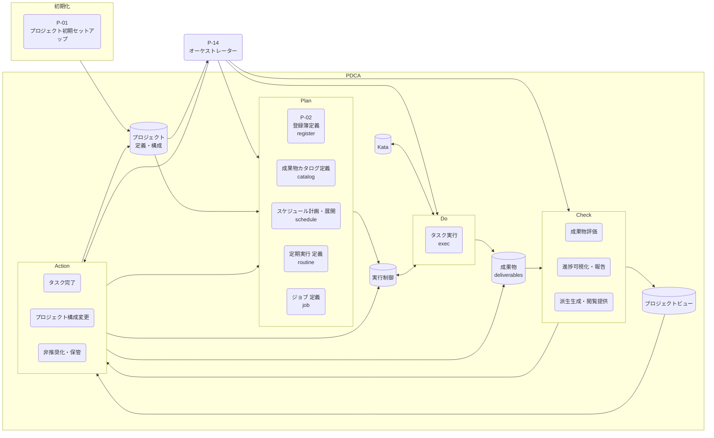

---
specdojo:
  id: cdfd-overview
  type: flow
  status: ready
  rulebook: specdojo:cdfd-overview-rulebook
  based_on: []
  supersedes: []
---

# 概念データフロー図（全体概要）: SpecDojo

本書は、SpecDojo を活用したプロジェクト運営の全体概要について、立ち上げから成果物作成、レビュー、承認までをPDCAサイクルに沿った業務プロセスとして整理する。

## 1. 目的

SpecDojoを活用した仕様駆動開発の全体感を、プロセス領域とデータの連関として整理し、後続のユースケース別のデータフローの位置付けを明確にする。

## 2. 適用範囲

- 対象は、SpecDojoを用いたプロジェクト開始から、成果物作成・改造の計画(P), 実行(D), 評価(C), 改善(A)を含むプロジェクトライフサイクル全体である。
- 本書は12のプロセス領域の全体境界を示す概念データフローである。個別コマンド、ファイル単位の更新、領域内の必須・条件付きプロセスの分割、状態遷移、例外復旧、実装エビデンスは、各ユースケース別CDFD で詳細化する。
- `list`、`where`、`status`、`validate`、`dry-run` など、状態や成果物を変更しない参照・検証操作は独立した業務フローに含めず、各領域を支える補助操作として扱う。

## 3. プロセス領域

業務は13のプロセス領域に分かれる。13のプロセス領域の分割、領域 ID、領域間の受け渡しに関する規則は本書を正本とし、詳細のプロセス、イベント、データストア等についてはユースケース別の CDFD を正本とする。
主要入力・主要出力・データストアは「個別プロセス領域主要入出力」、委譲境界は「委譲境界」に記載する。

<!-- prettier-ignore -->
| 領域 ID | プロセス領域 | 業務目的 | 主な担当 | 起点イベント |
| --- | --- | --- | --- | --- |
| `P-01` | プロジェクト初期セットアップ | プロジェクトの推進環境を整備する。 | PO, ARC | POが新しいプロジェクトを立ち上げた |
| `P-02` | 登録簿定義 | ticketベースで気付いたTODOや問題・課題、メモ、決定事項等を記録する。 | 全員 | タスクや課題等が判明した、意思決定した |
| `P-03` | 成果物カタログ定義 | プロジェクトの成果物を定義する | 全員 | 何を成果物として管理するかの判断が確定した |
| `P-04` | スケジュール計画展開 | 成果物カタログに基づき、作成する成果物毎のタスクをスケジュールに展開する | PM | 成果物カタログが整備された |
| `P-05` | 定期実行定義 | 定義された時期・条件に基づき、継続的な確認または実行を定義する。 | PM, 運用担当 | 指定された時期または条件が到来した |
| `P-06` | ジョブ定義 | runner が直接実行する決定論的コマンド、または agent へ委譲する判断を定義する。 | 全員 | 何を定期的・定型的に実行するかが判明した |
| `P-07` | タスク実行 | 実行可能なタスクを人または AI Agent が担当し、成果物と検証可能な実行結果を残す。 | タスク owner | 実行指示された |
| `P-08` | 成果物評価 | 成果物の内容を確認し、品質や適合性を評価する。 | レビュー担当者 | 成果物が作成された |
| `P-09` | 進捗可視化報告 | プロジェクトの進捗状況を可視化し、関係者に報告する。 | PM | 定期的な報告時期が到来した |
| `P-10` | 派生生成閲覧提供 | 派生成果物の生成および閲覧を提供する。 | ARC | 派生成果物の生成が要求された |
| `P-11` | タスク完了 | 人またはagentが実行したタスクの評価が完了したことを記録する。 | PO, PM | タスクの評価が完了した |
| `P-12` | 運用構成管理 | プロジェクトの運用構成を変更管理する。 | ARC | 運用構成の変更が承認された |
| `P-13` | 非推奨化保管 | 役割を終えた、または新IDへ引き継がれた文書を非推奨化し、誤参照を防ぐ保管場所へ移す。 | PM, ARC | 文書が新IDへ引き継がれた、または継続利用しないと判断された |
| `P-14` | オーケストレーター | プロジェクト全体のタスクやプロセスのPDCAを調整・管理する。 | 全員 | プロジェクトが開始された、PDCAの各サイクルが到来した |

<!-- note
P-01: repository からsetupするケース、prjからsetupするケース、Detached Unitのケースなど複数あり
gradeは成果物評価に入れる
タイムラインどうする？
-->

## 4. 概念データフロー（概要）

本図は、13領域を業務の性質が近い四つのプロセスグループへまとめ、プロセス間の委譲、外部主体からの起動、および主なデータストアとの主要な受け渡しを示す。矢印は固定の一括実行順ではなく、情報または実行要求の受け渡しを表す。各領域は起点イベントを満たした場合に起動し、すべての領域を毎回通過することを意味しない。

凡例: 後述

## 5. 個別プロセス領域主要入出力

### 5.1. 初期化

プロジェクトのリポジトリやprojectの初期化を行う。

<!-- prettier-ignore -->
| 領域 ID | プロセス領域 | 主要入力 | 主要出力 | データストア |
| --- | --- | --- | --- | --- |
| `P-01` | 初期セットアップ | | |  |

### 5.2. Plan（P-02〜P-06）

実行可能なタスクを、単発・定期・並行のいずれの形でも実行し、必要に応じて実行体制（agent・provider・プロジェクト構成）を変更する。タスク実行が基本形であり、定期処理・並行処理はその時間的・並列的な拡張、構成変更は実行条件の見直しを担う。

<!-- prettier-ignore -->
| 領域 ID | プロセス領域 | 主要入力 | 主要出力 | データストア |
| --- | --- | --- | --- | --- |
| `P-02` | 登録簿定義 | | | |
| `P-03` | 成果物カタログ定義 | | |  |
| `P-04` | スケジュール計画展開 | | |  |
| `P-05` | 定期実行定義 | | |  |
| `P-06` | ジョブ定義 | | |  |

### 5.3. Do（P-07）

プロジェクトの立上と計画・プロジェクト実行が生み出した成果物・実行記録を、利用者が参照できる形へ変換し、判断材料として届ける。派生生成は成果物・索引・ビューを作り、報告は進捗・課題・判断材料をまとめて人間の判断者・参加者へ引き渡す。非推奨化・保管は、役割を終えた文書を安全に退避し、現行の成果物との混同を防ぐ。

<!-- prettier-ignore -->
| 領域 ID | プロセス領域 | 主要入力 | 主要出力 | データストア |
| --- | --- | --- | --- | --- |
| `P-07` | タスク実行 | | | |

### 5.4. Check（P-08〜10）

<!-- prettier-ignore -->
| 領域 ID | プロセス領域 | 主要入力 | 主要出力 | データストア |
| --- | --- | --- | --- | --- |
| `P-08` | 派生生成 | | | |
| `P-09` | 報告 | | | |
| `P-10` | 非推奨化・保管 | | | |

### 5.5. Action（P-11〜P-13）

<!-- prettier-ignore -->
| 領域 ID | プロセス領域 | 主要入力 | 主要出力 | データストア |
| --- | --- | --- | --- | --- |
| `P-11` | タスク完了 | | | |
| `P-12` | 運用構成管理 | | | |
| `P-13` | 非推奨化保管 | | | |

### 5.6. オーケストレーター（P-14）

<!-- prettier-ignore -->
| 領域 ID | プロセス領域 | 主要入力 | 主要出力 | データストア |
| --- | --- | --- | --- | --- |
| `P-14` | オーケストレーター | | | |

## 6. ユースケース別CDFD一覧

<!-- prettier-ignore -->
| ケース ID | ユースケース | 業務目的 | ユースケース別 CDFD |
| --- | --- | --- | --- |
| `C-01` | 登録簿起票から完了まで | 登録簿の作成から完了までの一連の業務を管理する | |
| `C-02` |  | | |

## 7. 凡例（本プロダクト共通）

本プロダクトの全 CDFD（本書およびユースケース別 CDFD）が共通して参照するノード形状・色・絵文字の対応を示す。個々の CDFD は、以下の定義を再掲せず、本章への参照に留める。

<!-- prettier-ignore -->
| 概念 | 形状 | 色 | 絵文字例 |
| --- | --- | --- | --- |
| プロセス／プロセスグループ | 角丸長方形 | 青（`#e3f2fd` / `#1e88e5`） | 業務内容が伝わる絵文字（例: ⚙️） |
| 起点イベント | 六角形 | 橙（`#fff3e0` / `#fb8c00`） | 出来事が伝わる絵文字（例: 🚦） |
| データストア（マスタ・構成データ） | 円柱 | 濃い緑（`#c8e6c9` / `#2e7d32`） | 保管物が伝わる絵文字（例: 📐） |
| データストア（トランザクションデータ） | 円柱 | 薄い緑（`#e8f5e9` / `#43a047`） | 保管物が伝わる絵文字（例: 📒） |
| 物理保管 | スタジアム形 | 薄い緑（トランザクションデータと同じ） | 保管場所が伝わる絵文字（例: 🏬） |
| 外部主体 | 四角 | グレー（`#f5f7fa` / `#607d8b`） | 主体が伝わる絵文字（例: 👤） |
| 情報の流れ | ラベル付き `-->` | — | — |
| 物の流れ | ラベル付き `==>` | — | — |

データストアの色分けは、大分類「データストア」の中の業務上のサブ分類を表す。マスタ・構成データは、他のプロセスから参照される比較的安定した基準情報（プロジェクト定義・構成、成果物カタログ、運用・構成定義など）を指す。トランザクションデータは、業務活動に伴い都度更新される記録（登録簿、実行記録、報告記録など）を指す。物理保管は現物の保管先であり、マスタ・構成データとトランザクションデータのいずれの区分にも属さないため、便宜上トランザクションデータと同じ色を用いる。

ノード形状・線種そのものの記法は `specdojo:cdfd-mermaid-rulebook` に従う。本章は、その記法に基づき本プロダクトが実際に採用する色・絵文字の割り当てを固定する。
