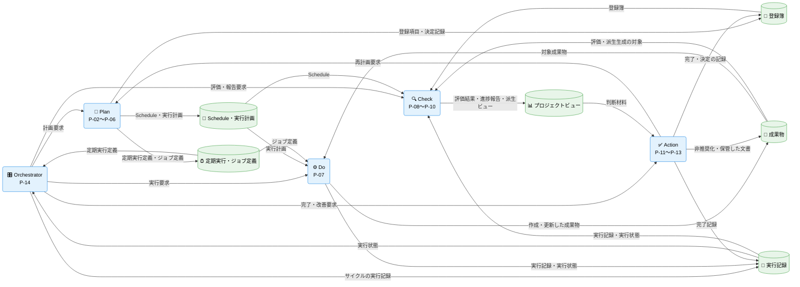
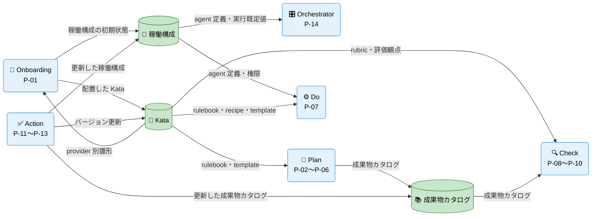

---
specdojo:
  id: cdfd-overview
  type: flow
  status: ready
  rulebook: specdojo:cdfd-overview-rulebook
  based_on: []
  supersedes: []
---

# 概念データフロー図（全体概要）: SpecDojo

本書は、SpecDojo を活用したプロジェクト運営の全体概要について、立ち上げから成果物作成、レビュー、承認までを PDCA サイクルに沿った業務プロセスとして整理する。

## 1. 目的

SpecDojo を活用した仕様駆動開発の全体像を、プロセス領域とデータの連関として整理し、後続のユースケース別 CDFD の位置付けを明確にする。対象者と利用場面は次のとおり。

- PO は、プロジェクト運営の対象範囲と領域分割を承認する。
- BA は、各ユースケース別 CDFD がどの領域を横断するかを本書で確認し、詳細化する。
- ARC は、データストアと領域間の受け渡しを設計入力として使う。
- QE は、領域とユースケースの対応から重複・欠落を確認する。

## 2. 適用範囲

- 対象は、SpecDojo を用いたプロジェクト開始から、成果物作成・改造の計画（P）、実行（D）、評価（C）、改善（A）を含むプロジェクトライフサイクル全体である。
- 本書が扱うのは、プロセス領域の分割と、領域間・データストア間の受け渡しまでである。各領域の内部（個別コマンドの操作手順、ファイル単位の更新内容、領域内の処理の分岐、状態遷移、例外時の復旧手順）は対象外とし、ユースケース別 CDFD で詳細化する。
- `list`、`where`、`status`、`validate`、`dry-run` など、状態や成果物を変更しない参照・検証操作は独立した業務フローに含めず、各領域を支える補助操作として扱う。
- 人間と AI Agent の責任分担は、承認、完了判断、構成変更の承認、非推奨化の判断を人間が担い、AI Agent は成果物の作成・評価・派生生成を担う、という原則に従う。本書の各領域はこの原則を前提とし、人間の判断を自動処理に置き換えない。

## 3. プロセス領域

業務は 14 のプロセス領域に分かれる。プロセス領域の分割、領域 ID、領域間の受け渡しに関する規則は本書を正本とし、領域内のプロセス、イベント、データストアの詳細はユースケース別 CDFD を正本とする。主要入力・主要出力・データストアは「個別プロセス領域主要入出力」、領域とユースケースの対応は「ユースケース別 CDFD 一覧」に記載する。

### 3.1. Onboarding（P-01）

<!-- prettier-ignore -->
| 領域 ID | プロセス領域 | 業務目的 | 主な担当 | 起点イベント |
| --- | --- | --- | --- | --- |
| `P-01` | プロジェクト初期セットアップ | プロジェクトの推進環境を整備する。 | PO、ARC | PO が新しいプロジェクトを立ち上げた |

### 3.2. Plan（P-02〜P-06）

<!-- prettier-ignore -->
| 領域 ID | プロセス領域 | 業務目的 | 主な担当 | 起点イベント |
| --- | --- | --- | --- | --- |
| `P-02` | 登録簿定義 | ticket ベースで気付いた TODO や問題・課題、メモ、決定事項等を記録する。 | 全員 | タスクや課題等が判明した、意思決定した |
| `P-03` | 成果物カタログ定義 | プロジェクトの成果物を定義する。 | 全員 | 何を成果物として管理するかの判断が確定した |
| `P-04` | スケジュール計画展開 | 成果物カタログに基づき、作成する成果物ごとのタスクをスケジュールに展開する。 | PM | 成果物カタログが整備された |
| `P-05` | 定期実行定義 | 定義された時期・条件に基づき、継続的な確認または実行を定義する。 | PM、運用担当 | 指定された時期または条件が到来した |
| `P-06` | ジョブ定義 | runner が直接実行する決定論的コマンド、または agent へ委譲する判断を定義する。 | 全員 | 何を定期的・定型的に実行するかが判明した |

### 3.3. Do（P-07）

<!-- prettier-ignore -->
| 領域 ID | プロセス領域 | 業務目的 | 主な担当 | 起点イベント |
| --- | --- | --- | --- | --- |
| `P-07` | タスク実行 | 実行可能なタスクを人または AI Agent が担当し、成果物と検証可能な実行結果を残す。 | タスク owner | 実行指示された |

### 3.4. Check（P-08〜P-10）

<!-- prettier-ignore -->
| 領域 ID | プロセス領域 | 業務目的 | 主な担当 | 起点イベント |
| --- | --- | --- | --- | --- |
| `P-08` | 成果物評価 | 成果物の内容を確認し、品質や適合性を評価する。 | レビュー担当者 | 成果物が作成された |
| `P-09` | 進捗可視化報告 | プロジェクトの進捗状況を可視化し、関係者に報告する。 | PM | 定期的な報告時期が到来した |
| `P-10` | 派生生成閲覧提供 | 派生成果物の生成および閲覧を提供する。 | ARC | 派生成果物の生成が要求された |

### 3.5. Action（P-11〜P-13）

<!-- prettier-ignore -->
| 領域 ID | プロセス領域 | 業務目的 | 主な担当 | 起点イベント |
| --- | --- | --- | --- | --- |
| `P-11` | タスク完了 | 人または agent が実行したタスクの評価が完了したことを記録する。 | PO、PM | タスクの評価が完了した |
| `P-12` | 稼働構成管理 | SpecDojo の稼働構成を変更管理する。 | ARC | 稼働構成の変更が承認された |
| `P-13` | 非推奨化保管 | 役割を終えた、または新 ID へ引き継がれた文書を非推奨化し、誤参照を防ぐ保管場所へ移す。 | PM、ARC | 文書が新 ID へ引き継がれた、または継続利用しないと判断された |

### 3.6. オーケストレーター（P-14）

<!-- prettier-ignore -->
| 領域 ID | プロセス領域 | 業務目的 | 主な担当 | 起点イベント |
| --- | --- | --- | --- | --- |
| `P-14` | オーケストレーター | プロジェクト全体のタスクやプロセスの PDCA を調整・管理する。 | 全員 | プロジェクトが開始された、PDCA の各サイクルが到来した |

<!-- note
P-01: repository からsetupするケース、prjからsetupするケース、Detached Unitのケースなど複数あり
タイムラインどうする？
-->

## 4. データストア一覧

SpecDojo のプロジェクト運営で読み書きするデータストアを、マスタ・構成データとトランザクションデータに分けて示す。`<project-id>` は `docs/ja/projects/<project-id>/` を指す。Git リポジトリ、exec worktree、開発環境の設定（サイトビルド、Git hook、devcontainer、lint）は業務データストアとして扱わない。

### 4.1. マスタ・構成データ

<!-- prettier-ignore -->
| データストア | 主な内容 | 主な物理保管先 | 主な書き手 | 図の表記 |
| --- | --- | --- | --- | --- |
| 稼働構成 | SpecDojo を稼働させる最低限の設定。リポジトリ層は SpecDojo の依存とバージョン、プロジェクト登録・パス設定、実行既定値、索引規則、agent 権限、オーケストレーター・executor・reporter の定義と入口指示。プロジェクト層はメンバー、ロール、レビュー観点 | `package.json`、 `.specdojo/`、 `.claude/`、 `.codex/`、 `.opencode/`、 `.agents/`、 `.github/agents/`、 `CLAUDE.md`、 `AGENTS.md`、 `<project-id>/030-project-management/pm-members.yaml`、 `pm-roles.yaml`、 `pm-review-viewpoints.yaml` | `P-01`、`P-12` | 稼働構成 |
| Kata | rulebook、recipe、template、sample、standard、schema、plan・result テンプレート、既定レビュー観点、評価 rubric、provider 別の agent 定義・設定の雛形、agent 向けの記述ルールと skill | `docs/ja/specdojo/`、 `docs/specdojo/schemas/`、 `templates/<provider>/`、 `.github/instructions/`、 `.claude/rules/`、 `.claude/skills/`、 `.agents/skills/` | `P-01`（配置）、`P-12`（バージョン更新）。内容は product 側で保守 | Kata |
| 成果物カタログ | 成果物 ID、種別、依存、owner、完了条件 | `<project-id>/010-deliverables-catalog/dct-*.yaml` | `P-03`、`P-13` | 成果物カタログ |

### 4.2. トランザクションデータ

<!-- prettier-ignore -->
| データストア | 主な内容 | 主な物理保管先 | 主な書き手 | 図の表記 |
| --- | --- | --- | --- | --- |
| 登録簿 | 登録項目の個票、登録簿索引、状態遷移イベント | `<project-id>/controls/project-register/` | `P-02`、`P-07`、`P-11` | 登録簿 |
| Schedule | 既定値、マイルストーン、成果物種別ごとの展開方針、タイムライン | `<project-id>/schedule/sch-*.yaml`、 `<project-id>/timeline/` | `P-04` | Schedule・実行計画 |
| 実行計画（plan） | タスクごとの実施手順、対象文書、完了条件 | `<project-id>/execution/exec/plans/` | `P-04`、`P-14` | Schedule・実行計画 |
| 定期実行定義 | 周期・条件、対象ジョブ、次回判定に使う状態 | `<project-id>/routines/rtn-*.yaml` | `P-05` | 定期実行・ジョブ定義 |
| ジョブ定義 | 実行手順、runner 直接実行か agent 委譲か、成功条件 | `<project-id>/jobs/job-*.yaml` | `P-06` | 定期実行・ジョブ定義 |
| 実行記録 | result、状態遷移イベント、evidence、trial、ジョブ実行記録、agent 実行ログ | `<project-id>/execution/exec/`、 `<project-id>/execution/jobs/runs/`、 `logs/` | `P-07`、`P-14` | 実行記録 |
| 成果物 | プロジェクトで作成・更新する成果物本体。プロジェクト定義（概要、憲章、スコープ）や計画書も含む | `docs/ja/product/`、 `<project-id>/` 配下の各成果物 | `P-07` | 成果物 |
| 保管庫（trash） | 非推奨化して退避した文書 | `docs/ja/product/trash/`、 `<project-id>/trash/` | `P-13` | 成果物（統合） |
| 評価結果 | 完了条件の判定、grade、finding | `<project-id>/execution/grade/`、 成果物 Frontmatter の `grade` | `P-08` | プロジェクトビュー（統合） |
| 進捗報告 | ダッシュボード、クリティカルパス、ガントチャート、各種ログの生成ビュー | `<project-id>/execution/generated/`、 `<project-id>/controls/generated/` | `P-09` | プロジェクトビュー（統合） |
| 派生ビュー・索引 | YAML の閲覧ページ、文書索引、サイトビルド出力 | 各 `generated/`、 `.specdojo/doc-index.json` | `P-10` | プロジェクトビュー（統合） |

「図の表記」列は、「概念データフロー（概要）」に載せる際の名称である。図では次の方針でまとめる。

- Schedule と実行計画、定期実行定義とジョブ定義は、それぞれ同じ領域群が書き同じ領域群が読むため、対で 1 つのデータストアにまとめる。
- 保管庫は成果物の退避先であり、成果物と分けて描くと Action からの流れが重複するため「成果物」に含める。
- 評価結果、進捗報告、派生ビュー・索引は、いずれも Check が生成し Action の判断材料になる生成物のため「プロジェクトビュー」に統合する。
- 統合前の個々のデータストアは「個別プロセス領域主要入出力」のデータストア列で識別する。

## 5. 概念データフロー（概要）

本章は、14 領域を Onboarding、Orchestrator、Plan、Do、Check、Action の六つのプロセスグループにまとめ、各プロセスグループを 1 つの代表ノードで表す。データストアは「データストア一覧」の「図の表記」で定めた 9 つを配置する。一つの図では受け渡しを追いにくいため、トランザクションデータに着目した図と、マスタ・構成データに着目した図に分ける。両図でプロセスグループとデータストアの名称は同一であり、Orchestrator から各プロセスグループへの要求はトランザクションの図にのみ描く。

矢印は固定の一括実行順ではなく、情報または実行要求の受け渡しを表す。各領域は起点イベントを満たした場合に起動し、すべての領域を毎回通過することを意味しない。PO、PM、ARC などの参加者は各領域の担当として業務プロセスの内側にいるため、外部主体としては描かない。プロセスグループ内部の領域間フローは図から省略し、各領域の主要入出力は「個別プロセス領域主要入出力」に記載する。データストアを更新するエッジは、更新前の参照を含む（例: Action から稼働構成への「更新した稼働構成」は現行の稼働構成の参照を伴う）。

### 5.1. トランザクションデータの流れ

Orchestrator が PDCA を駆動し、Plan が作る実行の指示（登録簿、Schedule・実行計画、定期実行・ジョブ定義）を Do が消費して成果物と実行記録を生み、Check がそれらをプロジェクトビューへ変換し、Action が判断結果を記録へ戻す流れを示す。

凡例は「凡例（本プロダクト共通）」に従う。`-->` は情報の流れであり、本図は現物の流れを対象外とする。本図はトランザクションデータのみを配置し、マスタ・構成データとの受け渡しは「マスタ・構成データの流れ」に示す。各領域の起点イベントと担当は「プロセス領域」の表に記載し、本図では省略する。本図に外部主体はない。

### 5.2. マスタ・構成データの流れ

Onboarding が Kata を配置して稼働構成を生成し、Plan が成果物カタログを定義し、各プロセスグループがこれらを基準情報として参照し、Action が承認済みの変更を反映する流れを示す。

凡例は「凡例（本プロダクト共通）」に従う。`-->` は情報の流れであり、本図は現物の流れを対象外とする。本図はマスタ・構成データのみを配置し、Orchestrator から各プロセスグループへの要求とトランザクションデータとの受け渡しは「トランザクションデータの流れ」に示す。本図に外部主体はない。

## 6. 個別プロセス領域主要入出力

データストア名は「概念データフロー（概要）」と同じ名称を使い、必要に応じて括弧内で具体的な保管対象を補足する。

### 6.1. Onboarding（P-01）

SpecDojo を導入して Kata をプロジェクト環境に配置し、その雛形から以後の計画・実行・評価が参照する稼働構成の初期状態を整える。

<!-- prettier-ignore -->
| 領域 ID | プロセス領域 | 主要入力 | 主要出力 | データストア |
| --- | --- | --- | --- | --- |
| `P-01` | プロジェクト初期セットアップ | プロジェクトの目的・文脈、参加メンバーとロール、利用する agent・provider、Kata の provider 別雛形 | 配置した Kata、稼働構成の初期状態、登録簿の雛形（必要な場合） | Kata、稼働構成 |

### 6.2. Plan（P-02〜P-06）

稼働構成と成果物カタログを起点に、何を成果物として管理し、いつ・誰が・どのような形で実行するかを定義する。登録簿は計画外事項と判断を継続的に受け止め、成果物カタログとスケジュールは成果物単位の実行計画を作り、定期実行定義とジョブ定義は繰り返し・定型の実行を計画へ組み込む。登録簿、Schedule・実行計画、定期実行・ジョブ定義が Do の実行指示になり、成果物カタログは計画展開の基準になる。

<!-- prettier-ignore -->
| 領域 ID | プロセス領域 | 主要入力 | 主要出力 | データストア |
| --- | --- | --- | --- | --- |
| `P-02` | 登録簿定義 | 判明した TODO・問題・課題・メモ、意思決定の内容、提起者と影響範囲 | 登録項目（種別、状態、担当、次の行動）、決定記録 | 登録簿 |
| `P-03` | 成果物カタログ定義 | プロジェクトの目的・スコープ、管理対象とする成果物の判断、Kata の rulebook・template | 成果物カタログ（成果物 ID、種別、依存、完了条件） | 成果物カタログ、Kata |
| `P-04` | スケジュール計画展開 | 成果物カタログ、依存関係、担当ロール、節目 | Schedule、成果物ごとのタスクと実行計画（plan）、実行可能なタスク情報 | 成果物カタログ、Schedule、実行計画 |
| `P-05` | 定期実行定義 | 継続的に確認・実行する対象、時期・条件、対象ジョブまたはタスク | 定期実行定義（周期、条件、次回判定に使う状態） | 定期実行定義 |
| `P-06` | ジョブ定義 | 定型的に実行する処理、runner が直接実行するコマンド、agent へ委譲する判断 | ジョブ定義（実行手順、成功条件、委譲先） | ジョブ定義 |

### 6.3. Do（P-07）

Plan が定義した実行指示に基づき、人または AI Agent がタスクを実行して成果物を作成・更新する。実行は Kata の rulebook・recipe・template を参照し、成果物とともに検証可能な実行記録を残す。定期実行・ジョブ・並行実行はいずれもタスク実行の実行形態であり、独立した領域にはしない。

<!-- prettier-ignore -->
| 領域 ID | プロセス領域 | 主要入力 | 主要出力 | データストア |
| --- | --- | --- | --- | --- |
| `P-07` | タスク実行 | 実行計画（plan）、実行指示（定期実行定義・ジョブ定義由来を含む）、対象成果物、Kata の rulebook・recipe・template、稼働構成 | 作成・更新した成果物、実行記録（result）、実行状態、判断依頼 | Kata、稼働構成、実行計画、定期実行定義、ジョブ定義、実行記録、成果物 |

### 6.4. Check（P-08〜P-10）

Do が生み出した成果物と実行記録を評価・可視化し、参加者が次の判断に使える形へ変換する。成果物評価は Kata の観点で品質・適合性を判定し、進捗可視化報告は登録簿・実行記録から進捗と課題をまとめ、派生生成閲覧提供は成果物を閲覧可能な形へ展開する。出力はプロジェクトビューへ集約され、Action の判断材料になる。

<!-- prettier-ignore -->
| 領域 ID | プロセス領域 | 主要入力 | 主要出力 | データストア |
| --- | --- | --- | --- | --- |
| `P-08` | 成果物評価 | 作成・更新された成果物、対応する rulebook、評価 rubric・観点 | 評価結果（grade、finding、要修正事項）、再評価の要否 | Kata、成果物、評価結果 |
| `P-09` | 進捗可視化報告 | Schedule、登録簿、実行記録、実行状態、評価結果 | 進捗報告、課題・判断事項の一覧、申し送り | Schedule、登録簿、実行記録、評価結果、進捗報告 |
| `P-10` | 派生生成閲覧提供 | 成果物、成果物カタログ、実行記録 | 派生ビュー、索引、閲覧用ページ、閲覧環境 | 成果物、成果物カタログ、実行記録、派生ビュー・索引 |

### 6.5. Action（P-11〜P-13）

Check の結果と参加者の判断に基づき、実行の完了、稼働構成の見直し、役割を終えた文書の退避を行う。タスク完了は評価済みタスクの完了を確定し、稼働構成管理は承認済みの構成変更を稼働構成へ反映し、非推奨化保管は現行成果物との混同を防ぐ。いずれも人間の判断を前提とし、判断の結果を稼働構成、Schedule・実行計画、登録簿、成果物へ戻す。

<!-- prettier-ignore -->
| 領域 ID | プロセス領域 | 主要入力 | 主要出力 | データストア |
| --- | --- | --- | --- | --- |
| `P-11` | タスク完了 | 評価結果、完了条件、PO・PM の完了判断 | 完了状態のタスク・登録項目、完了記録、後続タスクの解放 | 登録簿、実行記録 |
| `P-12` | 稼働構成管理 | 構成変更要求、現行の稼働構成、影響・代替案、承認結果 | 更新した稼働構成（SpecDojo のバージョン更新に伴う Kata の再配置を含む）、適用条件、再計画要求 | 稼働構成、Kata、登録簿 |
| `P-13` | 非推奨化保管 | 対象文書、非推奨化の判断、引き継ぎ先の新 ID（該当する場合） | 非推奨化した文書、保管先へ移した文書、更新した成果物カタログ | 成果物、保管庫（trash）、成果物カタログ |

### 6.6. オーケストレーター（P-14）

稼働構成に基づき、Plan・Do・Check・Action の各プロセスグループへ計画・実行・評価・改善の要求を発行し、PDCA サイクルを回す。参加者との対話から意図を読み取って要求へ変換する対話型の運転と、定期実行定義に基づく自動運転の両方を含む。個々の領域の内部処理は担当せず、要求の発行と結果の受け取りに責務を限定する。

<!-- prettier-ignore -->
| 領域 ID | プロセス領域 | 主要入力 | 主要出力 | データストア |
| --- | --- | --- | --- | --- |
| `P-14` | オーケストレーター | 稼働構成、参加者の意図、定期実行定義、実行状態 | Plan・Do・Check・Action への要求、サイクルの実行記録 | 稼働構成、定期実行定義、ジョブ定義、実行記録 |

## 7. ユースケース別 CDFD 一覧

各ユースケースは複数のプロセス領域を横断する。ユースケース別 CDFD は、横断する領域の内部プロセス、起点イベント、データストア、状態遷移、例外復旧を詳細化する。ユースケース別 CDFD の ID は `cdfd-uc-<topic>` 形式の仮置き名とし、作成時に確定する。現行の領域別 CDFD は、対応するユースケース別 CDFD へ統合するまでの参考文書として「現行の領域別 CDFD」列に示す。

<!-- prettier-ignore -->
| ケース ID | ユースケース | 業務目的 | ユースケース別 CDFD | 現行の領域別 CDFD |
| --- | --- | --- | --- | --- |
| `C-01` | プロジェクト立ち上げ | SpecDojo を導入して Kata を配置し、稼働構成の初期状態を整えて運用を開始できる状態にする。成果物カタログの定義は `C-03` で扱う | `cdfd-uc-project-setup`（未作成） | `cdfd-init` |
| `C-02` | 登録簿起票から完了まで | 登録項目の起票から、対応、評価、完了記録までの一連の業務を管理する | `cdfd-uc-register`（未作成） | `cdfd-register-lifecycle` |
| `C-03` | 成果物の作成から完了まで | 成果物カタログの定義からタスク展開、実行、評価、完了記録までを管理する | `cdfd-uc-deliverable`（未作成） | `cdfd-catalog-planning`、`cdfd-task-execution`、`cdfd-multi-project` |
| `C-04` | 定期実行とジョブの運転 | 定期実行定義とジョブ定義に基づく実行を起動し、結果を次回判定へ反映する | `cdfd-uc-routine-job`（未作成） | `cdfd-routine` |
| `C-05` | 進捗報告と閲覧提供 | 進捗・課題を可視化して報告し、成果物と派生ビューを閲覧できる形で提供する | `cdfd-uc-reporting`（未作成） | `cdfd-reporting`、`cdfd-derived-content` |
| `C-06` | 稼働構成の変更 | agent・provider・project 登録・メンバーなど稼働構成の変更要求を承認し、後続の計画・実行へ反映する | `cdfd-uc-config-change`（未作成） | `cdfd-agent-config-operation` |
| `C-07` | 文書の非推奨化と保管 | 役割を終えた文書を非推奨化し、保管先へ移して成果物カタログを更新する | `cdfd-uc-deprecation`（未作成） | `cdfd-deprecation` |

ユースケースが横断するプロセス領域を次に示す。○ は当該ユースケースの主経路に含まれる領域、△ は条件付きで経由する領域を表す。すべての領域が少なくとも一つのユースケースに含まれることで、領域分割の欠落がないことを確認する。

<!-- prettier-ignore -->
| ケース ID | P-01 | P-02 | P-03 | P-04 | P-05 | P-06 | P-07 | P-08 | P-09 | P-10 | P-11 | P-12 | P-13 | P-14 |
| --- | --- | --- | --- | --- | --- | --- | --- | --- | --- | --- | --- | --- | --- | --- |
| `C-01` | ○ | | | | | | | | | | | | | ○ |
| `C-02` | | ○ | | △ | | | ○ | ○ | | | ○ | | | ○ |
| `C-03` | | △ | ○ | ○ | | | ○ | ○ | | | ○ | | | ○ |
| `C-04` | | | | | ○ | ○ | ○ | △ | | | △ | | | ○ |
| `C-05` | | | | | | | | | ○ | ○ | | | | ○ |
| `C-06` | | ○ | | △ | | | | | | | | ○ | | ○ |
| `C-07` | | | ○ | | | | | | | △ | | | ○ | ○ |

## 8. 凡例（本プロダクト共通）

本プロダクトの全 CDFD（本書およびユースケース別 CDFD）が共通して参照するノード形状・色・絵文字の対応を示す。個々の CDFD は、以下の定義を再掲せず、本章への参照に留める。

<!-- prettier-ignore -->
| 概念 | 形状 | 色 | 絵文字例 |
| --- | --- | --- | --- |
| プロセス／プロセスグループ | 角丸長方形 | 青（`#e3f2fd` / `#1e88e5`） | 業務内容が伝わる絵文字（例: ⚙️） |
| 起点イベント | 六角形 | 橙（`#fff3e0` / `#fb8c00`） | 出来事が伝わる絵文字（例: 🚦） |
| データストア（マスタ・構成データ） | 円柱 | 濃い緑（`#c8e6c9` / `#2e7d32`） | 保管物が伝わる絵文字（例: 📐） |
| データストア（トランザクションデータ） | 円柱 | 薄い緑（`#e8f5e9` / `#43a047`） | 保管物が伝わる絵文字（例: 📒） |
| 物理保管 | スタジアム形 | 薄い緑（トランザクションデータと同じ） | 保管場所が伝わる絵文字（例: 🏬） |
| 外部主体 | 四角 | グレー（`#f5f7fa` / `#607d8b`） | 主体が伝わる絵文字（例: 👤） |
| 情報の流れ | ラベル付き `-->` | — | — |
| 物の流れ | ラベル付き `==>` | — | — |

データストアの色分けは、大分類「データストア」の中の業務上のサブ分類を表す。マスタ・構成データは、他のプロセスから参照される比較的安定した基準情報（稼働構成、成果物カタログ、Kata など）を指す。トランザクションデータは、業務活動に伴い都度更新される記録（登録簿、実行記録、成果物、報告記録など）を指す。物理保管は現物の保管先であり、マスタ・構成データとトランザクションデータのいずれの区分にも属さないため、便宜上トランザクションデータと同じ色を用いる。

ノード形状・線種そのものの記法は `specdojo:cdfd-mermaid-rulebook` に従う。本章は、その記法に基づき本プロダクトが実際に採用する色・絵文字の割り当てを固定する。
