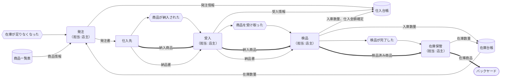
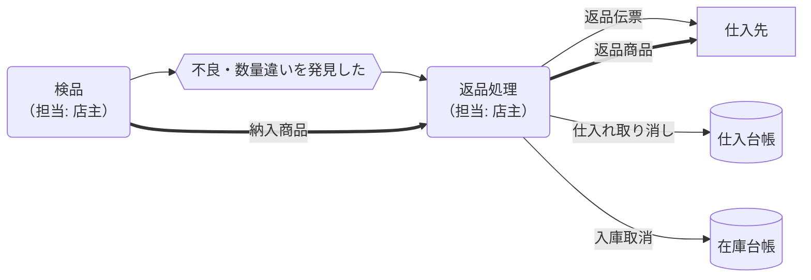

# 調達概念データフロー（現状）

凡例と記号の意味は[cdfd-mermaid-rules.md](../../../handbook/rules/cdfd-mermaid-rules.md)を参照してください。

## 調達プロセス概要

| プロセス | 業務内容                                                                         | 担当 | 業務が発生するイベント   | インプット                 | アウトプット                                               |
| -------- | -------------------------------------------------------------------------------- | ---- | ------------------------ | -------------------------- | ---------------------------------------------------------- |
| 発注     | 問屋・メーカーに商品を注文する。必要数量・品目を決定。                           | 店主 | 在庫が足りなくなった     | 在庫商品数量、販売商品数量 | 発注書                                                     |
| 受入     | 納品物を受け取る。                                                               | 店主 | 商品が納入された         | 納入商品、納品書           | 受入情報                                                   |
| 検品     | 数量・品質・価格を確認し、問題がなければ在庫へ回す。不良があれば返品処理を行う。 | 店主 | 商品を受け取った         | 納入商品、納品書           | 検品済み商品、検品済み商品情報、不良時は返品商品・返品伝票 |
| 返品処理 | 不良品・数量違いの商品を仕入先に返送する。                                       | 店主 | 不良・数量違いを発見した | 検品結果                   | 返品商品、返品伝票                                         |
| 在庫保管 | 商品をバックヤードに保管し、賞味期限・残数を管理。                               | 店主 | 検品が完了した           | 検品済み商品               | 在庫商品                                                   |

## 発注、受入、検品、在庫保管

## 返品

