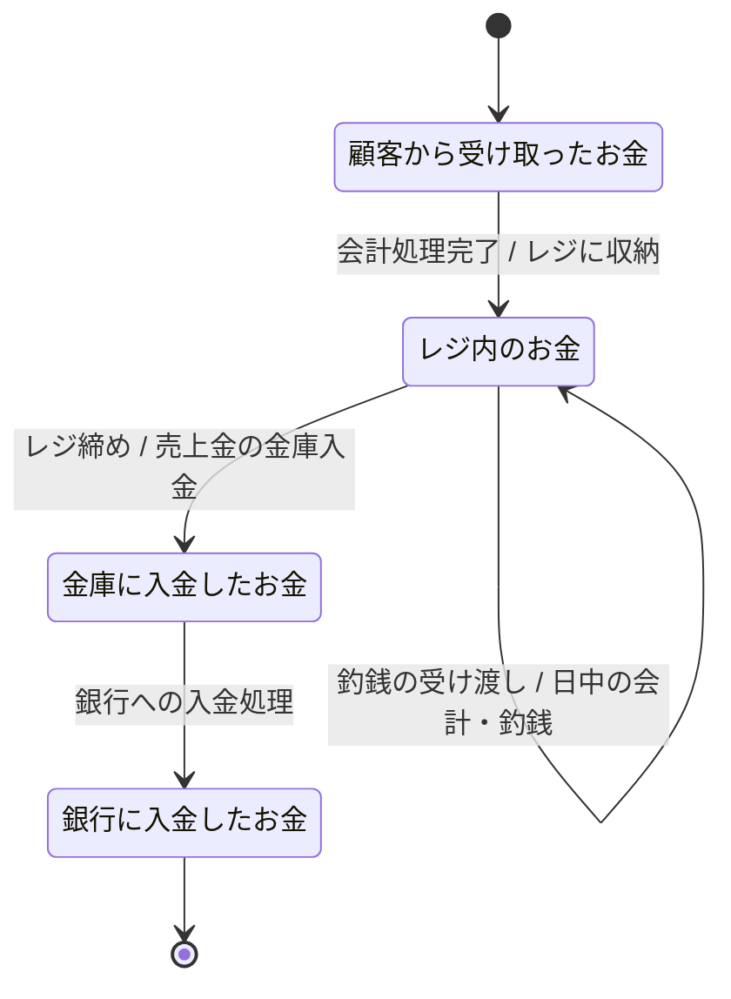

## 概要

現状業務における「お金」の概念的な状態遷移を表します。
状態名・イベント名は「お金のステータス（現状）」をもとに、業務で使われる呼称・行為に合わせて定義しています。

## 概念状態遷移図（CSTD）

## 状態の説明

### 顧客から受け取ったお金

会計直後に顧客から受け取った売上金。まだレジ内の残高として整理される前の段階。

### レジ内のお金

レジに入っている現金全体。営業中に使う釣銭と売上金の合算であり、営業中の管理単位となる。

### 釣銭準備金（参考状態）

営業開始前にレジに用意されているおつり用のお金。本図では「状態遷移の途中で新たにお金が投入される起点」として扱い、レジ内のお金に合流するイメージで管理する（詳細な遷移は別途検討）。

### 金庫に入金したお金

レジ締め後、レジから金庫に移された保管金。「一時保管」の段階であり、会計帳簿とレジ記録の両方で管理される。

### 銀行に入金したお金

金庫から銀行口座に入金されたお金。売上金が会計上確定される最終状態。

## 今後の検討メモ

- 「釣銭準備金」の状態を、営業開始前・営業終了後のお金の流れとして別図（例：営業日ごとの現金管理フロー）で表現するか要検討。
- レジ内のお金から金庫に移すタイミング（中締め／終業時など）を、レジ記録・会計帳簿との対応関係とあわせて詳細化する余地がある。
- 銀行入金後のお金の扱い（例：会計上の科目分解など）は、会計システム側のモデルで別途表現する想定。
