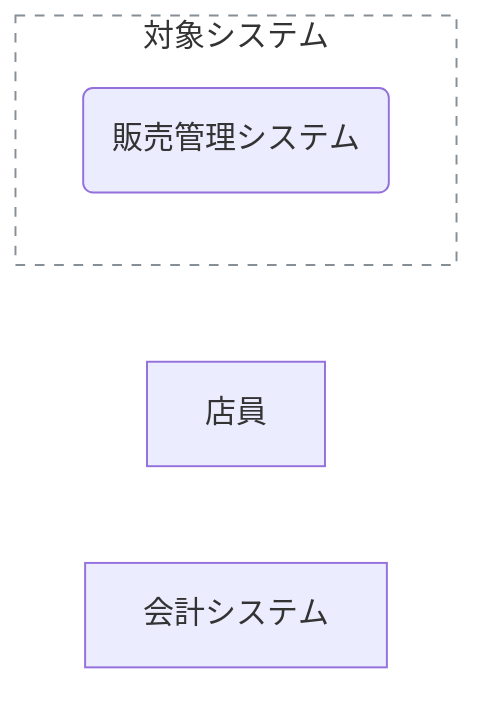
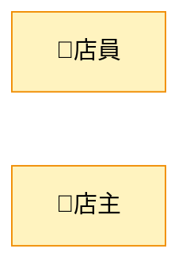
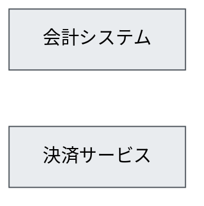
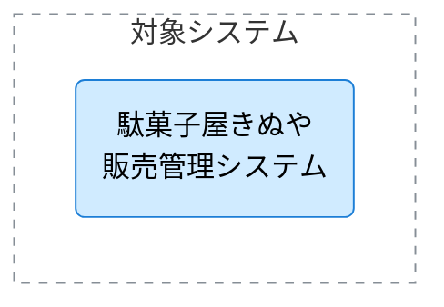
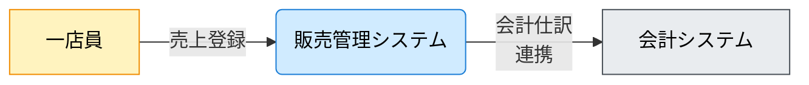
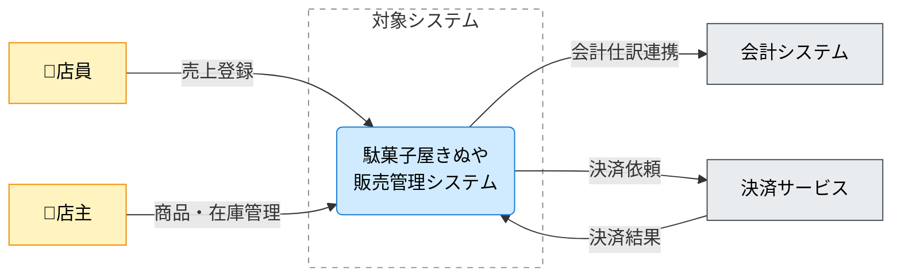
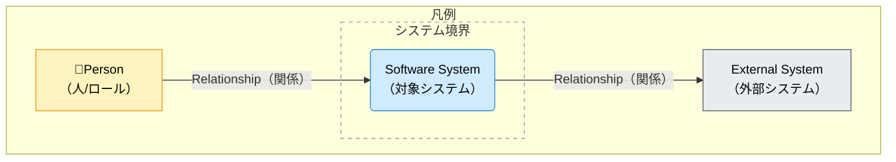

---
specdojo:
  id: specdojo:cxd-mermaid-rulebook
  type: rulebook
  status: draft
  target_format: markdown
  recipe: undecided
  sample: specdojo:cxd-sample
  template: undecided
  based_on:
    - specdojo:rulebook-authoring-standard
  grade:
    rubric: grade-rubric-v1
    target: kata
    verdict: needs-work
    score: 84
    graded_at: "2026-09-02T14:32:30.292Z"
    graded_by: gemma-expert-executor
    content_hash: 3ebcb73f27a918b0f1358c20cdc5460179ef738617f9c5985ebd44666c2873e7
    categories:
      consistency: { score: 63 }
      usability: { score: 100 }
      architecture: { score: 100 }
      quality: { score: 75 }
    viewpoints:
      vp-arc-cross-document-consistency: { level: 3, score: 75 }
      vp-arc-conciseness: { level: 4, score: 100 }
      vp-arc-single-responsibility: { level: 4, score: 100 }
      vp-qe-verifiability: { level: 4, score: 100 }
      vp-qe-omissions-consistency: { level: 2, score: 50 }
      vp-qe-kata-conformance: { level: 2, score: 50 }
      vp-ux-readability: { level: 4, score: 100 }
      vp-ux-language-consistency: { level: 4, score: 100 }
      vp-arc-document-structure: { level: 4, score: 100 }
    findings: { blocker: 0, major: 2, minor: 1, note: 0 }
---

# Mermaid を用いたC4コンテキスト図 作成ルール

C4 Context Diagram (CXD) Documentation Rules using Mermaid

本ドキュメントは、アーキテクチャ設計のために、**Mermaid の `flowchart` 構文を使って C4 コンテキスト図（システムコンテキスト）を描く際の標準ルール**です。

C4 コンテキスト図は「対象システム」と、その周辺の **利用者（人）**・**外部システム**・**関係（やり取り）** を、概念レベルで合意するために用います。

---

## 1. 全体方針

- Mermaid の **`flowchart` を C4 コンテキスト図風に利用**する。

- 対象は「システム境界の外側との関係」であり、内部構造（コンテナ/コンポーネント）や実装詳細は含めない。
- 図は「正確さ（過剰な詳細）」よりも「解釈が割れないこと（合意）」を優先する。
- 1つの図には **対象システムを1つ**だけ置く（複数対象は図を分ける）。

## 2. C4要素と Mermaid 記号の対応

C4 の要素を、以下のように Mermaid の記号にマッピングする。

| C4要素                                   | 意味                       | Mermaid での表現例                                       |
| ---------------------------------------- | -------------------------- | -------------------------------------------------------- |
| Person（人/ロール）                      | 利用者・関係者             | `店員["店員"]`                                           |
| Software System（対象システム）          | この図の中心となるシステム | `販売管理システム("駄菓子屋きぬや<br>販売管理システム")` |
| External Software System（外部システム） | 連携先システム             | `会計システム["会計システム"]`                           |
| System Boundary（境界）                  | 対象システムの範囲         | `subgraph 境界["対象システム"] ... end`                  |
| Relationship（関係）                     | 依存・利用・連携（概念）   | `店員 -->\| "売上登録" \| 販売管理システム`              |

## 2.1 標準の色分け（推奨）

C4コンテキスト図は色が必須ではありませんが、読み手が「人 / 対象システム / 外部システム」を一目で区別できるよう、以下の色分けを推奨します。

- Person（人/ロール）: 暖色系
- 対象システム（Software System）: 寒色系（主役）
- 外部システム（External System）: 無彩色系（脇役）
- 境界（System Boundary）: 破線枠

Mermaid `flowchart` では `classDef` + `class`、境界は `style` を使用します。

### 2.1.1 標準スタイル定義（コピーして利用）

<!-- specdojo:finding id=F001 severity=minor rule=vp-arc-cross-document-consistency サンプルのH1におけるルールブックへのリンク先ファイル名が、実際のもの（cxd-mermaid-rulebook.md）と不整合である。 -->

<!-- specdojo:finding id=F002 severity=major rule=vp-qe-omissions-consistency 成果物の配置場所、ファイル命名規則、および Frontmatter の詳細定義など, 管理上の必須ルールが欠落している。 -->


<!-- specdojo:finding id=F003 severity=major rule=vp-qe-kata-conformance rulebook としての責務（成果物の識別・管理定義）が不足しており、作図リファレンスの構成になっている。 -->

```plainText
flowchart LR
  classDef person fill:#fff3bf,stroke:#f08c00,color:#000;
  classDef system fill:#d0ebff,stroke:#1c7ed6,color:#000;
  classDef external fill:#e9ecef,stroke:#495057,color:#000;
  style 境界 fill:#ffffff,fill-opacity:0,stroke:#868e96,stroke-width:1px,stroke-dasharray: 5 5;
```

### 2.1.2 適用ルール

- Personノードには `person` クラスを付ける
- 対象システムノードには `system` クラスを付ける
- 外部システムノードには `external` クラスを付ける
- 境界は `subgraph 境界[...]` として、`style 境界 ...` で枠線を指定する

例:



```plainText
flowchart LR
  店員["店員"]
  会計システム["会計システム"]
  subgraph 境界["対象システム"]
    販売管理システム("販売管理システム")
  end

  class 店員 person;
  class 販売管理システム system;
  class 会計システム external;
  style 境界 fill:#ffffff,fill-opacity:0,stroke:#868e96,stroke-width:1px,stroke-dasharray: 5 5;
```

## 3. ノードのルール

### 3.1 Person（人/ロール）

- **四角 `[]`** を使用する。
- 表示ラベルは業務ロール/主体を短い日本語で表す。

例:



```plainText
flowchart LR
  店員["👤店員"]
  店主["👤店主"]

  classDef person fill:#fff3bf,stroke:#f08c00,color:#000;
  class 店員,店主 person;
```

### 3.2 Software System（対象システム）

- **角丸長方形 `()`** を使用する。
- 図の中心として扱い、表示ラベルは「システム名（＋必要なら短い補足）」とする。
- 改行は `<br>` を使用してよい（長文化防止）。

例:


```plainText
flowchart LR
  販売管理システム("駄菓子屋きぬや<br>販売管理システム")

  classDef system fill:#d0ebff,stroke:#1c7ed6,color:#000;
  class 販売管理システム system;
```

### 3.3 External Software System（外部システム）

- **四角 `[]`** を使用する。
- 表示ラベルは外部システムの一般名（例: 決済、会計、EC、配送など）。

例:



```plainText
flowchart LR
  会計システム["会計システム"]
  決済サービス["決済サービス"]

  classDef external fill:#e9ecef,stroke:#495057,color:#000;
  class 会計システム,決済サービス external;
```

### 3.4 System Boundary（境界）

- 対象システムは **サブグラフ `subgraph ... end`** で囲う。
- 境界内には、原則として **対象システムのノード1つ**だけを置く（コンテキスト図の過密化防止）。

例:



```plainText
flowchart LR
  subgraph 境界["対象システム"]
    販売管理システム("駄菓子屋きぬや<br>販売管理システム")
  end

  classDef system fill:#d0ebff,stroke:#1c7ed6,color:#000;
  class 販売管理システム system;
  style 境界 fill:#ffffff,fill-opacity:0,stroke:#868e96,stroke-width:1px,stroke-dasharray: 5 5;
```

## 4. エッジ（関係）のルール

### 4.1 方向

- `A --> B` を基本とする。
- 方向は「主たる依存/利用/送信の向き」が分かるように統一する。
  - 例: 人がシステムを利用する: `人 -->|"利用"| 対象システム`
  - 例: 対象システムが外部システムに連携する: `対象システム -->|"連携"| 外部システム`

### 4.2 ラベル

- すべてのエッジにラベルを付ける（「何の関係か」を合意するため）。
- ラベルは **短い名詞句**または **短い動詞句**で書く。
  - 例: `売上登録` / `在庫照会` / `仕入データ連携` / `入金結果を受信`
- 長い場合は `<br>` で改行してよい。

例:



```plainText
flowchart LR
  店員["一店員"] -->|"売上登録"| 販売管理システム("販売管理システム")
  販売管理システム -->|"会計仕訳<br>連携"| 会計システム["会計システム"]

  classDef person fill:#fff3bf,stroke:#f08c00,color:#000;
  classDef system fill:#d0ebff,stroke:#1c7ed6,color:#000;
  classDef external fill:#e9ecef,stroke:#495057,color:#000;
  class 店員 person;
  class 販売管理システム system;
  class 会計システム external;
```

---

## 5. 命名・表記ルール

- ノードIDは日本語でもよいが、記号や空白は避け、短い識別子にする（例: `販売管理システム`, `会計システム`, `店員`）。
- 表示ラベルは `"..."` で囲ってよい（混乱を避けるため、必要に応じて統一）。
- 同じ主体/システムは、図の中で名称を揺らさない。

---

## 6. 禁止事項

| 項目                                                  | 理由                              |
| ----------------------------------------------------- | --------------------------------- |
| 物理テーブル名・物理カラム名・SQL全文                 | コンテキスト図の粒度を超える      |
| APIエンドポイント/HTTPメソッド/リクエストJSON等の詳細 | IF仕様に記述する                  |
| 実装クラス/関数名、具体的な技術スタックの列挙         | 変更に弱い                        |
| 対象システムの内部プロセス/内部データストアの詳細     | コンテナ図/コンポーネント図で表す |
| 矢印ラベルなしの関係                                  | 合意が取れない                    |

---

## 7. サンプル（最小）



```plainText
flowchart LR
  店員["👤店員"]
  店主["👤店主"]

  会計システム["会計システム"]
  決済サービス["決済サービス"]

  subgraph 境界["対象システム"]
    販売管理システム("駄菓子屋きぬや<br>販売管理システム")
  end

  店員 -->|"売上登録"| 販売管理システム
  店主 -->|"商品・在庫管理"| 販売管理システム

  販売管理システム -->|"会計仕訳連携"| 会計システム
  販売管理システム -->|"決済依頼"| 決済サービス
  決済サービス -->|"決済結果"| 販売管理システム

  classDef person fill:#fff3bf,stroke:#f08c00,color:#000;
  classDef system fill:#d0ebff,stroke:#1c7ed6,color:#000;
  classDef external fill:#e9ecef,stroke:#495057,color:#000;
  class 店員,店主 person;
  class 販売管理システム system;
  class 会計システム,決済サービス external;
  style 境界 fill:#ffffff,fill-opacity:0,stroke:#868e96,stroke-width:1px,stroke-dasharray: 5 5;
```

## 8. 凡例（推奨）

凡例は下記のように表現する（必要な場合のみ）。



```plainText
flowchart LR
  subgraph 凡例["凡例"]
    direction LR
    人["👤Person<br>（人/ロール）"]

    subgraph 境界例["システム境界"]
      対象("Software System<br>（対象システム）")
    end
    外部["External System<br>（外部システム）"]

    人 -->|"Relationship（関係）"| 対象
    対象 -->|"Relationship（関係）"| 外部
  end

  classDef person fill:#fff3bf,stroke:#f08c00,color:#000;
  classDef system fill:#d0ebff,stroke:#1c7ed6,color:#000;
  classDef external fill:#e9ecef,stroke:#495057,color:#000;
  class 人 person;
  class 対象 system;
  class 外部 external;
  style 境界例 fill:#ffffff,fill-opacity:0,stroke:#868e96,stroke-width:1px,stroke-dasharray: 5 5;
```
