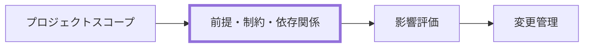

---
specdojo:
  id: specdojo:prj-assumptions-constraints-dependencies-rulebook
  type: rulebook
  status: ready
  target_format: markdown
  recipe: specdojo:prj-assumptions-constraints-dependencies-recipe
  sample: specdojo:prj-assumptions-constraints-dependencies-sample
  template: specdojo:prj-assumptions-constraints-dependencies-template
  based_on:
    - specdojo:rulebook-authoring-standard
  supersedes: []
  grade:
    rubric: grade-rubric-v1
    target: kata
    verdict: needs-work
    score: 78
    graded_at: "2026-09-03T06:16:48.818Z"
    graded_by: codex-expert-executor
    content_hash: 19794ab9632cb2fd254b19e2556db7c21f3efd17203d8b77ebde487aa56c3674
    categories:
      consistency: { score: 63 }
      usability: { score: 92 }
      architecture: { score: 100 }
      quality: { score: 63 }
    viewpoints:
      vp-arc-cross-document-consistency: { level: 2, score: 50 }
      vp-arc-conciseness: { level: 4, score: 100 }
      vp-arc-single-responsibility: { level: 4, score: 100 }
      vp-qe-verifiability: { level: 3, score: 75 }
      vp-qe-omissions-consistency: { level: 3, score: 75 }
      vp-qe-kata-conformance: { level: 2, score: 50 }
      vp-ux-readability: { level: 4, score: 100 }
      vp-ux-language-consistency: { level: 3, score: 75 }
      vp-arc-document-structure: { level: 4, score: 100 }
    findings: { blocker: 0, major: 2, minor: 6, note: 0 }
---

# 前提・制約・依存関係 作成ルール

Assumptions, Constraints and Dependencies Documentation Rulebook

本書は、プロジェクトの成立条件、守るべき境界、外部または先行成果物への依存を、変更時に判断できる形で整理する規約である。構造・必須項目・禁止事項は本書を正とし、作り方は recipe、粒度は sample、記入の骨組みは template を参照する。

## 1. 全体方針

- 対象は、プロジェクトの前提条件、制約事項、依存関係、およびそれらの変化に対する影響評価と変更管理である。
- 各項目は、条件だけで終わらせず、影響、確認方法、変化または逸脱のトリガー、所有者、対応方針を一組で記載する。
- 前提は「成立するものとして置く条件」、制約は「守るべき限界」、依存関係は「他者・外部サービス・先行成果物などから受ける条件」として分離する。
- スコープなど上位文書で確定済みの決定事項（対象外、境界の判断基準、責務境界）は行として再掲しない。該当章の冒頭で参照先を明示して委譲し、本書には上位文書に現れない成立条件・限界・依存だけを登録する。
- 上位文書がすでに継続的な監視・記録先を持つ事項（判断ゲートの記録先が明示された章など）は、内容を要約して再登録せず参照にとどめる。上位文書が結論だけを示し継続監視の仕組みを持たない場合は、監視方法・トリガー・所有者・対応方針を付与して運用可能な形に展開してよいが、その場合は展開元の上位文書と章を明示する。
- 文書は計画・設計・実装の詳細やリスク登録簿を代替しない。必要な詳細はそれぞれの成果物に委譲する。
- AI Agent は作成・確認を支援できるが、承認、公開可否、エスカレーションなどの最終判断を委ねない。

## 2. 位置づけと用語定義

### 2.1. 位置づけ

本書はスコープで定めた境界を受け、実行上の成立条件と変更時の判断材料を明示する。前提・制約・依存が変化した結果としてリスク、変更要求、計画へ影響を伝える。

### 2.2. 用語定義

| 用語     | 定義                                                                                         |
| -------- | -------------------------------------------------------------------------------------------- |
| 前提条件 | プロジェクトの計画または進行が成立するものとして置く条件。崩れた場合の影響と確認方法を伴う。 |
| 制約事項 | 予算、期限、公開範囲、技術選択、責務境界など、逸脱してはならない限界。                       |
| 依存関係 | 外部組織、サービス、先行成果物、意思決定などが提供または確定することを必要とする関係。       |
| トリガー | 前提の崩壊、制約の逸脱、依存先の変化を検知して見直しを始める条件。                           |
| 所有者   | 項目の状態確認と一次対応を担うロールまたは責任者。最終判断者とは区別する。                   |

## 3. ファイル命名・ID規則

### 3.1. 配置

- 成果物は `docs/ja/projects/<project-id>/020-project-definition/prj-assumptions-constraints-dependencies.md` に配置する。
- rulebook は `docs/ja/specdojo/rulebooks/prj-assumptions-constraints-dependencies-rulebook.md` に配置する。
- recipe、sample、template は、それぞれ `docs/ja/specdojo/recipes/`、`samples/`、`templates/` の同じ prefix を持つファイルに配置する。

<!-- specdojo:finding id=F003 severity=minor rule=vp-qe-verifiability 各表と変更記録で項目 ID を必須の追跡キーとして使う一方, 「ドキュメント ID」では文書 ID しか定義していないため, 前提・制約・依存ごとの接頭辞, 文書内一意性, 採番後の不変性を規定する必要がある。 -->
<!-- specdojo:finding id=F004 severity=minor rule=vp-qe-omissions-consistency sample は `ACD-A01`・`ACD-C01`・`ACD-D01` を使用し, template も種別別 ID を要求しているが, rulebook は項目 ID の形式・一意性・安定性を定義していないため, 必須キーの規則として追加する必要がある。 -->

### 3.2. ドキュメント ID

- 成果物 ID: `<project-id>:prj-assumptions-constraints-dependencies`
- rulebook ID: `specdojo:prj-assumptions-constraints-dependencies-rulebook`
- 実践の型 ID: `specdojo:prj-assumptions-constraints-dependencies-recipe`、`specdojo:prj-assumptions-constraints-dependencies-sample`、`specdojo:prj-assumptions-constraints-dependencies-template`

### 3.3. ファイル名

- 成果物: `prj-assumptions-constraints-dependencies.md`
- 実践の型: `prj-assumptions-constraints-dependencies-{rulebook,recipe,sample,template}.md`
- 日本語の表示名を使う場合も、ID とファイル名は一意で検索可能な英小文字・ハイフン区切りを維持する。

## 4. 推奨 Frontmatter 項目

### 4.1. 設定内容

| 項目       | 説明                                                         | 必須 |
| ---------- | ------------------------------------------------------------ | ---- |
| id         | `<project-id>:prj-assumptions-constraints-dependencies`      | ○    |
| type       | `project`                                                    | ○    |
| status     | `draft` / `ready` / `deprecated`                             | ○    |
| rulebook   | `specdojo:prj-assumptions-constraints-dependencies-rulebook` | ○    |
| based_on   | 直接参照した上位成果物の ID 配列                             | 任意 |
| supersedes | 置き換える旧成果物の ID 配列                                 | 任意 |

### 4.2. 推奨ルール

- `based_on` には、内容の根拠として直接参照した文書だけを記載する。
- 未確定事項は _TODO_:、意思決定待ちは _UNDECIDED_:、仮置きの前提は _ASSUMPTION_: で明示する。
- H1 には成果物の表示名を置き、frontmatter に `title` を重複して持たせない。

## 5. 本文構成（標準テンプレ）

本文は以下の見出しを順序どおりに置く。

| 番号 | 見出し             | 必須 | 内容                                       |
| ---- | ------------------ | ---- | ------------------------------------------ |
| 1    | 前提条件           | ○    | 成立条件、根拠、影響、監視、変化時の対応   |
| 2    | 制約事項           | ○    | 守るべき限界、適用範囲、逸脱の検知、対応   |
| 3    | 依存関係           | ○    | 依存先、必要な理由、成立条件、変化時の対応 |
| 4    | 影響評価と対応方針 | ○    | 前提・制約・依存の変化に共通する評価と対応 |
| 5    | 監視・変更管理     | ○    | 見直す契機、記録する情報、判断責任の扱い   |

## 6. 記述ガイド

### 6.1. 前提条件

- 前提には、なぜその条件を置くかを示す根拠と、崩れた場合の影響を記載する。
- 確認方法は「誰が何を見れば変化を検知できるか」が分かる表現にする。
- 根拠が不足する場合は事実として断定せず、_ASSUMPTION_: または _TODO_: として確認先を残す。
- スコープで定義済みの境界に該当する前提は再掲せず、章冒頭でスコープの該当章へ委譲する。追加する前提がない場合は、その旨と追加時の記載条件を明記する（章は省略しない）。

<!-- specdojo:finding id=F001 severity=major rule=vp-arc-cross-document-consistency 継続提供される基盤を依存関係とする本規定に対し, recipe の「4.1. 前提条件」は「店頭で使う端末を利用できる」を前提の例とし, sample の ACD-D01 は同じ端末可用性を依存関係としているため, 誤登録を防ぐよう分類を統一する必要がある。 -->
<!-- specdojo:finding id=F005 severity=major rule=vp-qe-kata-conformance rulebook と sample は継続利用する端末・作業基盤を依存関係として扱うが, recipe は店頭端末の利用可能性を前提条件の例としているため, recipe による適用結果が rulebook に反しないよう分類例を統一する必要がある。 -->
<!-- specdojo:finding id=F006 severity=minor rule=vp-qe-kata-conformance `rulebook-authoring-standard` は章参照を章タイトルで記載するよう求めているが, 「依存関係（6.3.）」は番号で参照しているため, 「依存関係」のような章タイトル参照へ改める必要がある。 -->

- リポジトリ、作業環境、外部ツールなど、外部から継続的に提供される基盤の可用性は、前提条件ではなく依存関係（6.3.）として扱う。

推奨表:

| ID  | 内容 | 根拠 | 影響 | 監視・確認方法 | 変化のトリガー | 所有者 | 対応方針 |
| --- | ---- | ---- | ---- | -------------- | -------------- | ------ | -------- |

### 6.2. 制約事項

- 制約には、適用範囲と、逸脱したと判断する条件を記載する。
- 技術制約は、特定製品名の列挙ではなく、選択の自由度、互換性、公開適性、運用上の限界として書く。
- 公開情報の制約は、個人情報・機密情報・非公開情報を扱わない方針と、検知時の除去または判断手順を併記する。
- スコープの対象外・境界の判断基準と同内容の制約は再掲しない。本章では、上位文書に現れない運用上の制約だけを扱う。

推奨表:

| ID  | 内容 | 適用範囲 | 影響 | 監視・確認方法 | 逸脱のトリガー | 所有者 | 対応方針 |
| --- | ---- | -------- | ---- | -------------- | -------------- | ------ | -------- |

### 6.3. 依存関係

- 依存先は、外部サービスだけでなく、先行成果物、承認、意思決定、提供物も含めて明示する。
- 依存が満たされた状態を、受領物、確認条件、期限または判断イベントで書く。
- 依存先の詳細な契約条件や実装方式は、必要な管理・設計成果物へ委譲する。
- 意思決定待ちの依存は、プロジェクト登録簿の項目として登録し、本書からは登録項目 ID を参照する。決定後に本書へ影響がある場合は該当項目へ反映する。

推奨表:

<!-- specdojo:finding id=F002 severity=minor rule=vp-arc-cross-document-consistency 依存関係の推奨表は「内容または依存先」「確認方法または成立条件」等を用いる一方, template と sample は「依存先・条件」「受領・成立条件」等を用いているため, 列の必須意味が揺れないよう名称を統一する必要がある。 -->
<!-- specdojo:finding id=F007 severity=minor rule=vp-qe-kata-conformance rulebook の依存関係表と template・sample の列名が一致せず, 成立条件と確認方法の必須性が異なって読めるため, rulebook を正本として同一の項目定義へ揃える必要がある。 -->
<!-- specdojo:finding id=F008 severity=minor rule=vp-ux-language-consistency 「内容または依存先」「影響・必要な理由」「確認方法または成立条件」「トリガー」は, template・sample の「依存先・条件」「必要となる理由」「受領・成立条件」「変化のトリガー」と表記と意味範囲が異なるため, 読み手が同じ必須項目として認識できる名称へ統一する必要がある。 -->

| ID  | 内容または依存先 | 影響・必要な理由 | 確認方法または成立条件 | トリガー | 所有者 | 対応方針 |
| --- | ---------------- | ---------------- | ---------------------- | -------- | ------ | -------- |

### 6.4. 影響評価と対応方針

- 影響は、スコープ、期日、費用、品質、公開適性、運用責任など、該当する領域を具体的に示す。
- 対応方針には、除去、軽減、受容、再判断のいずれを行うかと、次に判断する人を記載する。
- 一次対応を担うロールと最終判断者を区別し、人間の判断が必要な範囲を明示する。

推奨表:

| 変化の種別 | 主な影響領域 | 最初に確認すること | 一次対応・判断 | 対応方針 |
| ---------- | ------------ | ------------------ | -------------- | -------- |

### 6.5. 監視・変更管理

- 「定期的に確認する」ではなく、スコープまたは実践の型一式が変わったときなど、具体的な見直しの契機を記載する。
- 変更記録には、項目 ID、変化内容、影響範囲、判断者、対応状況を残す。記録先はプロジェクト登録簿を第一候補とし、未定なら _TODO_: とする。
- 文書構造・配置・命名・技術制約・参照資料の整合確認を担うロールと、公開可否やスコープ変更などの最終判断を行う人間の責任者を区別して明示する。

## 7. 禁止事項

| 禁止事項                                         | 理由                                           |
| ------------------------------------------------ | ---------------------------------------------- |
| スコープ等の上位文書の決定事項を行として再掲する | 正本との二重管理になり、更新漏れと矛盾を招く。 |
| 前提・制約・依存を種別なしに混在させる           | 条件の性質と対応方法を区別できない。           |
| 影響、トリガー、所有者、対応方針のない登録       | 変化時に判断・対応へ使えない。                 |
| 根拠のない確定値や外部環境の断定                 | 誤った前提を固定し、更新漏れを招く。           |
| Agent に最終判断、承認、公開可否を委ねる         | 人間の判断責任を代替してしまう。               |
| API、DB、契約書全文などの詳細を記載する          | 本書の責務を越え、詳細成果物と重複する。       |
| 個人情報、非公開情報、機密情報を記載する         | 公開・再利用の前提を損なう。                   |
