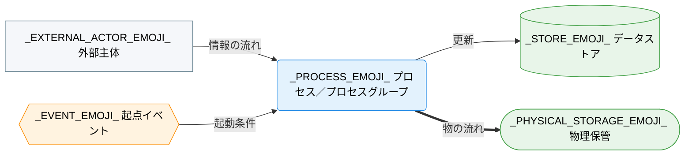

---
specdojo:
  id: specdojo:cdfd-overview-template
  type: template
  status: ready
  frontmatter_template:
    specdojo:
      id: _AUTHORITY_:cdfd-overview
      type: flow
      status: draft
      rulebook: specdojo:cdfd-overview-rulebook
      based_on: []
      supersedes: []
  grade:
    rubric: grade-rubric-v1
    target: kata
    verdict: needs-work
    score: 48
    graded_at: "2026-09-06T05:51:38.448Z"
    graded_by: codex-expert-executor
    content_hash: ef80e6262149fdfab02e78b1160dce0c385a7483dc8ce8e47a11e54fc399f0b2
    categories:
      consistency: { score: 25 }
      usability: { score: 58 }
      architecture: { score: 100 }
      quality: { score: 25 }
    viewpoints:
      vp-arc-cross-document-consistency: { level: 1, score: 25 }
      vp-arc-conciseness: { level: 4, score: 100 }
      vp-arc-single-responsibility: { level: 4, score: 100 }
      vp-qe-verifiability: { level: 1, score: 25 }
      vp-qe-omissions-consistency: { level: 1, score: 25 }
      vp-qe-kata-conformance: { level: 1, score: 25 }
      vp-ux-readability: { level: 1, score: 25 }
      vp-ux-language-consistency: { level: 2, score: 50 }
      vp-arc-document-structure: { level: 4, score: 100 }
    findings: { blocker: 0, major: 18, minor: 1, note: 0 }
---

# 概念データフロー図（全体概要）: _TARGET_NAME_

_TODO_: 誰が、どの業務または運用の対象境界と領域間フローを合意するために使う全体概要かを 1〜3 文で記述する。

## 1. 目的

_TODO_: この全体概要を使用する対象者（対象範囲を承認する役割、領域別 CDFD を設計入力として使う役割、領域分割の重複・欠落を確認する役割等）と、利用場面（承認、領域別詳細化、設計入力、網羅性確認等）を結び付けて 1〜3 文で記述する。「分かりやすくする」のような曖昧な表現ではなく、利用結果を判定できる表現にする。

## 2. 適用範囲

- 対象: _TODO_: 開始点、終了点、対象業務、組織、システム境界を記述する。
- 対象外・補助操作: _TODO_: 補助操作、領域内の手順、実装詳細、別成果物や外部主体へ委譲する事項を記述する。
- 責任分担: _TODO_: 人間と AI Agent の責任分担の原則を本文で再定義せず、対応する文書への参照を記述する（例: `[[_AUTHORITY_:prj-overview|プロジェクト概要]]`）。

## 3. プロセス領域

_TODO_: 業務がいくつのプロセス領域に分かれるかを一文で記述する（例: "業務は N のプロセス領域に分かれる"）。主要入力・主要出力・データストアは「個別プロセス領域主要入出力」、委譲境界は「委譲境界」に記載する。

<!-- prettier-ignore -->
| 領域 ID | プロセス領域 | 業務目的 | 主な担当 | 起点イベント | 領域別 CDFD |
| --- | --- | --- | --- | --- | --- |
| `_PROCESS_AREA_ID_` | _PROCESS_AREA_NAME_ | _BUSINESS_PURPOSE_ | _OWNER_ROLE_ | _START_EVENT_ | `_DETAIL_CDFD_ID_` |
| `_PROCESS_AREA_ID_` | _PROCESS_AREA_NAME_ | _BUSINESS_PURPOSE_ | _OWNER_ROLE_ | _START_EVENT_ | `_DETAIL_CDFD_ID_` |

<!-- 領域が3件以上ある場合は、同じ形式で行を追加する。 -->

## 4. 概念データフロー（概要）

<!-- specdojo:finding id=F001 severity=major rule=vp-arc-cross-document-consistency line=29 現物を含む受け渡しを一つの図で追える場合に単一図を使うよう指示しているが、提示された単一図には物理保管ノードと現物エッジがなく、recipe が求める現物フローを表現できないため、単一図にも対応する骨組みを追加するか選択条件を情報フロー限定へ修正する必要がある。 -->
<!-- specdojo:finding id=F003 severity=major rule=vp-arc-cross-document-consistency line=29 プロセスグループを一つの代表ノードとして扱う指示は、`cdfd-mermaid-rulebook` がプロセスグループを `subgraph` と定義し代表ノードの代替を禁止する規則と両立しないため、業務上のグループと視覚上のサブグラフの表現を統一する必要がある。 -->
<!-- specdojo:finding id=F005 severity=major rule=vp-qe-verifiability line=29 単一図の採用条件に物理保管との受け渡しを含めながら単一図には物理保管の記入欄がないため、選択された図が条件を満たしたか pass / fail を判定できない。 -->
<!-- specdojo:finding id=F006 severity=major rule=vp-qe-verifiability line=29 グループ代表ノードを使用する場合のグループ ID、名称、構成領域および複数の領域別 CDFD との対応欄がなく、一覧の全領域が図へ過不足なく対応したか検証できない。 -->
<!-- specdojo:finding id=F010 severity=major rule=vp-qe-omissions-consistency line=29 プロセスグループを代表ノードにする場合に必要なグループ識別子、構成領域、一覧行との対応を記録する骨組みが欠落している。 -->
<!-- specdojo:finding id=F012 severity=major rule=vp-qe-kata-conformance line=29 recipe が現物の受け渡しを物理保管とともに図示するよう求めるのに、単一図を選ぶ経路ではその適用先となるプレースホルダーが提供されていない。 -->
<!-- specdojo:finding id=F014 severity=major rule=vp-qe-kata-conformance line=29 overview kata のグループ代表ノード方式と包含する `cdfd-mermaid-rulebook` の `subgraph` 方式が競合し、グループ化した生成物を両 rulebook へ同時準拠させられない。 -->
<!-- specdojo:finding id=F016 severity=major rule=vp-ux-readability line=29 物理保管を含む受け渡しを追える場合に単一図を選ぶよう案内した直後、その単一図は現物を対象外としているため、読者がどの図構成を採用すべきか判断できない。 -->
<!-- specdojo:finding id=F017 severity=major rule=vp-ux-readability line=29 複数領域をグループ代表ノードへまとめる手順に、グループ名と構成領域を図・一覧・詳細化先の間で追跡する方法がなく、代表ノード数が上限を超えた読者が対応関係を理解できない。 -->
<!-- specdojo:finding id=F018 severity=major rule=vp-ux-language-consistency line=29 本テンプレートの「プロセスグループ」は複数領域を代替する角丸代表ノードを意味するが、参照先の `cdfd-mermaid-rulebook` では同語を `subgraph` と定義して代表ノードの代替を禁止しているため、用語と表現を一意に統一する必要がある。 -->

_TODO_: 代表ノードの数がおおむね7〜9件を超える場合は、業務の性質が近い領域をプロセスグループへまとめ、代表ノードをグループ単位にする。外部主体・物理保管・データストアとの受け渡しを一つの図で追える場合は、下記の単一図をそのまま使う。一画面で追いにくい場合だけ、「4.1. 外部主体と物理保管に着目した概要フロー」「4.2. データストアに着目した概要フロー」に分ける。

<!-- 単一図で足りる場合は、以下の図・凡例をそのまま使い、4.1/4.2 の見出しごと削除する。二図に分ける場合は、この単一図・凡例を削除し、4.1/4.2 を使う。 -->

<!-- specdojo:finding id=F008 severity=major rule=vp-qe-omissions-consistency line=33 単一図の骨組みに物理保管ノード、物理保管用 class 指定、現物エッジがなく、現物フローが存在する単一図を生成できない。 -->

<!-- specdojo:finding id=F002 severity=major rule=vp-arc-cross-document-consistency line=53 起点イベントを概要図から省略すると明記しているが、recipe は各領域の起点イベントを図からたどれることを求め、包含先の `cdfd-mermaid-rulebook` もイベントを必須としているため、図示要否を成果物間で統一する必要がある。 -->
<!-- specdojo:finding id=F009 severity=major rule=vp-qe-omissions-consistency line=53 主たる概要図すべてから起点イベントのノードと起動条件エッジが省略され、recipe および包含する記法 rulebook の必須図要素を満たせない。 -->
<!-- specdojo:finding id=F013 severity=major rule=vp-qe-kata-conformance line=53 recipe と `cdfd-mermaid-rulebook` が図示対象とする起点イベントをテンプレートが明示的に省略しており、作成手順から骨組みへの適用結果が一致しない。 -->

凡例: 角丸長方形はプロセス領域またはプロセスグループ（内訳は「プロセス領域」の一覧表を参照）、円柱はデータストア、四角は外部主体、`-->` は情報の流れを表す。個々の領域の起点イベントは「プロセス領域」の一覧表に記載し、本図では省略する。本図は情報の流れを対象とし、現物の流れは対象外とする。色・絵文字の割り当ては、「凡例（本プロダクト共通）」を設けた場合はそちらを参照し、設けない場合はこの凡例内で完結させる。

### 4.1. 外部主体と物理保管に着目した概要フロー

<!-- specdojo:finding id=F019 severity=minor rule=vp-ux-language-consistency line=77 同じ `==＞` を本行では「現物・現金の流れ」、共通凡例では「物の流れ」と呼んでいるため、現金を含む範囲が変わったように読めない一つの正式名称へ統一する必要がある。 -->

凡例: 角丸長方形はプロセス領域（内訳は「プロセス領域」の一覧表を参照）、スタジアム形は物理保管、四角は外部主体、`==>` は現物・現金の流れを表す。情報の流れはデータストアに着目した概要フロー（4.2）を参照する。色・絵文字の割り当ては「凡例（本プロダクト共通）」を参照する。

### 4.2. データストアに着目した概要フロー

凡例: 角丸長方形はプロセス領域（内訳は「プロセス領域」の一覧表を参照）、円柱はデータストア、四角は外部主体、`-->` は情報の流れを表す。現物の流れは外部主体と物理保管に着目した概要フロー（4.1）を参照する。色・絵文字の割り当ては「凡例（本プロダクト共通）」を参照する。

## 5. 個別プロセス領域主要入出力

<!-- プロセスグループを設けない場合は、以下のグループ見出し（5.1、5.2）を省略し、表だけを直接並べる。 -->

### 5.1. _AREA_GROUP_NAME_（_PROCESS_AREA_ID_ 〜 _PROCESS_AREA_ID_）

_TODO_: グループが扱う範囲を数行で要約する。業務目的、主な担当、起点イベントは「プロセス領域」（3章）と重複させず記載しない。

<!-- prettier-ignore -->
| 領域 ID | プロセス領域 | 主要入力 | 主要出力 | データストア |
| --- | --- | --- | --- | --- |
| `_PROCESS_AREA_ID_` | _PROCESS_AREA_NAME_ | _MAIN_INPUTS_ | _MAIN_OUTPUTS_ | _DATA_STORES_ |
| `_PROCESS_AREA_ID_` | _PROCESS_AREA_NAME_ | _MAIN_INPUTS_ | _MAIN_OUTPUTS_ | _DATA_STORES_ |

<!-- グループ内に領域が3件以上ある場合は、同じ形式で行を追加する。 -->

### 5.2. _AREA_GROUP_NAME_（_PROCESS_AREA_ID_ 〜 _PROCESS_AREA_ID_）

_TODO_: グループが扱う範囲を数行で要約する。

<!-- prettier-ignore -->
| 領域 ID | プロセス領域 | 主要入力 | 主要出力 | データストア |
| --- | --- | --- | --- | --- |
| `_PROCESS_AREA_ID_` | _PROCESS_AREA_NAME_ | _MAIN_INPUTS_ | _MAIN_OUTPUTS_ | _DATA_STORES_ |

<!-- グループが3件以上ある場合は、5.3 として「グループ要約＋表」の構成を繰り返す。 -->

## 6. 委譲境界

<!-- specdojo:finding id=F007 severity=major rule=vp-qe-verifiability line=132 委譲境界の指示と表には具体的な委譲先領域 ID を必須とする記入条件がなく、rulebook が要求する委譲先の有無を判定できないため、委譲事項と委譲先 ID を明示的に分ける必要がある。 -->

_TODO_: 各領域が対象外として他領域へ委ねる境界を記述する。詳細化先（正本としての役割を持つ領域別 CDFD）は「プロセス領域」（3章）の領域別 CDFD 列を参照する前提とし、本章では再掲しない。

<!-- prettier-ignore -->
<!-- specdojo:finding id=F011 severity=major rule=vp-qe-omissions-consistency line=135 委譲境界表に委譲先領域 ID の専用列または必須プレースホルダーがなく、他領域へ委ねる事項と委譲先の対応が欠落し得る。 -->

| 領域 ID             | プロセス領域        | 委譲境界              |
| ------------------- | ------------------- | --------------------- |
| `_PROCESS_AREA_ID_` | _PROCESS_AREA_NAME_ | _DELEGATION_BOUNDARY_ |
| `_PROCESS_AREA_ID_` | _PROCESS_AREA_NAME_ | _DELEGATION_BOUNDARY_ |

<!-- 一覧表の全領域を、グループ分けせず領域 ID 順の一つの表にまとめる。3件以上ある場合は同じ形式で行を追加する。 -->

_TODO_: 本プロダクトに複数の領域別 CDFD があり、共通の凡例を参照させる場合のみ、以下の「7. 凡例（本プロダクト共通）」章を残す。単一の CDFD しかない場合は、この章ごと削除する。

## 7. 凡例（本プロダクト共通）

_TARGET_NAME_ の全 CDFD（本書および領域別 CDFD）が共通して参照するノード形状・色・絵文字の対応を示す。個々の CDFD は、以下の定義を再掲せず、本章への参照に留める。

<!-- prettier-ignore -->
| 概念 | 形状 | 色 | 絵文字例 |
| --- | --- | --- | --- |
| プロセス／プロセスグループ | 角丸長方形 | 青（`#e3f2fd` / `#1e88e5`） | _TODO_: 業務内容が伝わる絵文字例 |
| 起点イベント | 六角形 | 橙（`#fff3e0` / `#fb8c00`） | _TODO_: 出来事が伝わる絵文字例 |
| データストア | 円柱 | 緑（`#e8f5e9` / `#43a047`） | _TODO_: 保管物が伝わる絵文字例 |
| 物理保管 | スタジアム形 | 緑（データストアと同じ） | _TODO_: 保管場所が伝わる絵文字例 |
| 外部主体 | 四角 | グレー（`#f5f7fa` / `#607d8b`） | _TODO_: 主体が伝わる絵文字例 |
| 情報の流れ | ラベル付き `-->` | — | — |
| 物の流れ | ラベル付き `==>` | — | — |

ノード形状・線種そのものの記法は `specdojo:cdfd-mermaid-rulebook` に従う。本章は、その記法に基づき _TARGET_NAME_ が実際に採用する色・絵文字の割り当てを固定する。

<!-- specdojo:finding id=F004 severity=major rule=vp-arc-cross-document-consistency line=185 条件付きの「未決事項」章は recipe と整合する一方、overview rulebook の標準本文構成と記述ガイドに同章が定義されていないため、適用条件と必須列を rulebook を含む kata 全体で統一する必要がある。 -->
<!-- specdojo:finding id=F015 severity=major rule=vp-qe-kata-conformance line=185 recipe が要求し template が提供する未決事項章を overview rulebook が定義しておらず、recipe-guided と fully-guided で生成物の必須構成が変わる。 -->
<!-- 未決事項がある場合のみ、以下の章を追加する。ない場合は章ごと削除する。

## 8. 未決事項

| 論点 | 影響 | 決定者 | 決定時期 |
| --- | --- | --- | --- |
| _UNDECIDED_: _TODO_ | _IMPACT_ | _DECISION_ROLE_ | _DECISION_TIMING_ |

-->
