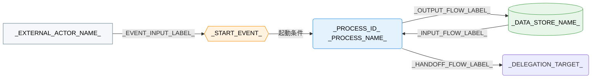

---
specdojo:
  id: specdojo:cdfd-template
  type: template
  status: ready
  frontmatter_template:
    specdojo:
      id: _AUTHORITY_:cdfd-_DOMAIN_ID_
      type: flow
      status: draft
      rulebook: specdojo:cdfd-rulebook
      based_on:
        - _AUTHORITY_:cdfd-overview
      supersedes: []
  grade:
    rubric: grade-rubric-v1
    target: kata
    verdict: needs-work
    score: 53
    graded_at: "2026-09-06T06:18:57.054Z"
    graded_by: codex-expert-executor
    content_hash: 1b7b52ad17468be4aa8f3977bbd2be2957f48bd958bfc16dd187ed327bc005dd
    categories:
      consistency: { score: 25 }
      usability: { score: 75 }
      architecture: { score: 100 }
      quality: { score: 25 }
    viewpoints:
      vp-arc-cross-document-consistency: { level: 1, score: 25 }
      vp-arc-conciseness: { level: 4, score: 100 }
      vp-arc-single-responsibility: { level: 4, score: 100 }
      vp-qe-verifiability: { level: 1, score: 25 }
      vp-qe-omissions-consistency: { level: 1, score: 25 }
      vp-qe-kata-conformance: { level: 1, score: 25 }
      vp-ux-readability: { level: 3, score: 75 }
      vp-ux-language-consistency: { level: 2, score: 50 }
      vp-arc-document-structure: { level: 4, score: 100 }
    findings: { blocker: 0, major: 13, minor: 1, note: 0 }
---

# 概念データフロー図（領域別）: _DOMAIN_NAME_

_TODO_: 全体概要のどの領域を詳細化し、誰が領域内フロー、必須・条件付きの境界、主要例外、領域外への委譲を合意・利用する CDFD かを 1〜3 文で記述する。

## 1. 目的

_TODO_: 誰が、領域内フロー、必須・条件付きの境界、主要例外、委譲境界のどれを合意または後続利用するかを 1〜3 文で記述する。「分かりやすくする」のような曖昧な表現ではなく、「〇〇が起動条件と例外の境界を承認する」のように利用結果を判定できる表現にする。

## 2. 適用範囲

- 対象: _TODO_: どのイベントから、どの出力または状態がそろうまでを対象にするかを記述する。
- 対象外: _TODO_: 隣接領域、補助操作、実装詳細のどこから先を対象外にするかを記述する。
- 責任分担: _TODO_: 人間と AI Agent の責任分担の原則を本文で再定義せず、対応する文書への参照を記述する（例: `[[_AUTHORITY_:prj-overview|プロジェクト概要]]`）。
- 用語: _TODO_: 特定プロジェクトの実行計画・スケジュール上のフェーズ名や、実装検討段階だけで使われる仮称を使わず、前提知識のない読者が読める語彙で記述する。

## 3. 領域内プロセス一覧

_TODO_: 主要入力・主要出力・データストアは「個別プロセス主要入出力」（5章）へ記載し、本章の列には含めない。

<!-- prettier-ignore -->
<!-- specdojo:finding id=F001 severity=major rule=vp-arc-cross-document-consistency line=23 rulebook は必須性を「必須／条件付き／選択」の三分類とする一方, プレースホルダーが `_REQUIRED_OR_CONDITIONAL_` に限定されているため, 「選択」を含む正式分類を表現できるよう修正する必要がある。 -->
<!-- specdojo:finding id=F004 severity=major rule=vp-qe-verifiability line=23 `_REQUIRED_OR_CONDITIONAL_` では rulebook が許容する「選択」を記録できず, 選択プロセスの必須性を pass / fail 判定できないため, 三分類を明示する必要がある。 -->
<!-- specdojo:finding id=F007 severity=major rule=vp-qe-omissions-consistency line=23 rulebook の必須性分類に含まれる「選択」がプレースホルダーと本文の案内から欠落しているため, 「必須／条件付き／選択」を漏れなく提示する必要がある。 -->
<!-- specdojo:finding id=F010 severity=major rule=vp-qe-kata-conformance line=23 template が必須性を必須・条件付きの二分類に限定しており, rulebook の「必須／条件付き／選択」という型を完全には実装していないため, プレースホルダーと関連案内を三分類へ統一する必要がある。 -->
<!-- specdojo:finding id=F014 severity=major rule=vp-ux-language-consistency line=23 必須性の正式ラベル「必須／条件付き／選択」と `_REQUIRED_OR_CONDITIONAL_` が一致せず, 「選択」と「条件付き」を混同させるため, プレースホルダーと本文中の分類表記を正式な三分類へ統一する必要がある。 -->

| プロセス ID    | プロセス       | 業務目的           | 主な担当     | 起動条件          | 必須性                    |
| -------------- | -------------- | ------------------ | ------------ | ----------------- | ------------------------- |
| `_PROCESS_ID_` | _PROCESS_NAME_ | _BUSINESS_PURPOSE_ | _OWNER_ROLE_ | _START_CONDITION_ | _REQUIRED_OR_CONDITIONAL_ |

<!-- specdojo:finding id=F002 severity=major rule=vp-arc-cross-document-consistency line=25 例示行が1行しかないのに行追加を「3プロセス以上」の場合だけ指示しており, 2プロセスの領域で一方が一覧・図から欠落し得るため, 「複数ある場合」に修正する必要がある。 -->
<!-- specdojo:finding id=F005 severity=major rule=vp-qe-verifiability line=25 2プロセス時の行追加条件が定義されておらず, 全プロセスが一覧と図へ一度ずつ登場したか判定できないため, 2件以上なら行を追加する指示へ修正する必要がある。 -->
<!-- specdojo:finding id=F008 severity=major rule=vp-qe-omissions-consistency line=25 「3プロセス以上」という条件では2プロセス目が領域内プロセス一覧から欠落し得るため, 全プロセスを記載する条件へ修正する必要がある。 -->
<!-- specdojo:finding id=F011 severity=major rule=vp-qe-kata-conformance line=25 recipe と rulebook は全プロセスの追跡を要求するが, template は2プロセス時の行追加を案内していないため, 件数にかかわらず全プロセスを一覧化する骨組みに修正する必要がある。 -->
<!-- specdojo:finding id=F013 severity=minor rule=vp-ux-readability line=25 「3プロセス以上」の場合だけ行を追加する記述では, 領域内またはグループ内がちょうど2プロセスの場合の扱いが不明確になるため, line 88 の同種コメントとともに「複数ある場合」へ統一する必要がある。 -->
<!-- 領域内に3プロセス以上ある場合は、同じ形式で行を追加する。 -->

## 4. 概念データフロー

_TODO_: 一覧の各行を一つのプロセスノードとして配置し、起点イベント、主要なデータストア、必要な外部主体、委譲先をつなぐ。プロセスの性質（必須・条件付きなど）によって図が追いにくい場合は、業務の性質が近いプロセスをまとめて複数の図に分割できる（例: 「4.1. 必須プロセスのフロー」「4.2. 条件付きプロセスのフロー」）。

<!-- 単一図で足りる場合は、以下の図・凡例をそのまま使う。図を分ける場合は、この単一図・凡例を削除し、4.1/4.2 の見出しで分割する。 -->

凡例: 角丸長方形は一つのプロセス、六角形は起点イベント、円柱はデータストア、四角は外部主体、`-->` は情報の流れを表す。色・絵文字の割り当ては、対象プロダクトの全体概要が「凡例（本プロダクト共通）」を設けている場合はそちらを参照し、設けていない場合はこの凡例内で完結させる。_TODO_: 領域外ノード（委譲先）は代表ノードだけを示し、内部処理を対象外と明記する。現物の流れを扱う場合は `==>` の意味を追記し、扱わない場合は「本図は現物の流れを扱わない」と明記する。

<!-- プロセスの性質によって図を分ける場合は、単一図を削除し、以下のように分割する。両図に登場する共通ノードは、いずれかの凡例で同一の対象を指すことを明記する。

### 4.1. 必須プロセスのフロー

（上記と同様の Mermaid 図・凡例を必須プロセスだけで構成する）

### 4.2. 条件付きプロセスのフロー

（条件付きプロセスだけで構成し、必須プロセスのフローと共有するノードがあれば凡例で明記する）

-->

## 5. 個別プロセス主要入出力

<!-- プロセスグループを設けない場合は、以下のグループ見出し（5.1、5.2）を省略し、表だけを直接並べる。概念データフロー（4章）を複数図に分けた場合は、同じ単位でグループ化する。 -->

### 5.1. _PROCESS_GROUP_NAME_（_PROCESS_ID_ 〜 _PROCESS_ID_）

_TODO_: グループが扱う範囲を数行で要約する。業務目的、主な担当、起動条件、必須性は「領域内プロセス一覧」（3章）と重複させず記載しない。

<!-- prettier-ignore -->
| プロセス ID | プロセス | 主要入力 | 主要出力 | データストア |
| --- | --- | --- | --- | --- |
| `_PROCESS_ID_` | _PROCESS_NAME_ | _MAIN_INPUTS_ | _MAIN_OUTPUTS_ | _DATA_STORES_ |

<!-- specdojo:finding id=F003 severity=major rule=vp-arc-cross-document-consistency line=88 グループ内の例示行が1行しかないのに行追加を「3プロセス以上」の場合だけ指示しており, 2プロセスのグループで一方が主要入出力表から欠落し得るため, 「複数ある場合」に修正する必要がある。 -->
<!-- specdojo:finding id=F006 severity=major rule=vp-qe-verifiability line=88 2プロセスのグループで主要入出力表の全件性を判定できないため, 2件以上なら行を追加する指示へ修正する必要がある。 -->
<!-- specdojo:finding id=F009 severity=major rule=vp-qe-omissions-consistency line=88 「3プロセス以上」という条件では2プロセス目が個別プロセス主要入出力から欠落し得るため, グループ内の全プロセスを記載する条件へ修正する必要がある。 -->
<!-- specdojo:finding id=F012 severity=major rule=vp-qe-kata-conformance line=88 recipe と rulebook は各プロセスの主要入出力を要求するが, template は2プロセスのグループで2行目を追加させない案内になっているため, 全プロセスを収容できる指示へ修正する必要がある。 -->
<!-- グループ内に3プロセス以上ある場合は、同じ形式で行を追加する。 -->

### 5.2. _PROCESS_GROUP_NAME_（_PROCESS_ID_ 〜 _PROCESS_ID_）

_TODO_: グループが扱う範囲を数行で要約する。

<!-- prettier-ignore -->
| プロセス ID | プロセス | 主要入力 | 主要出力 | データストア |
| --- | --- | --- | --- | --- |
| `_PROCESS_ID_` | _PROCESS_NAME_ | _MAIN_INPUTS_ | _MAIN_OUTPUTS_ | _DATA_STORES_ |

<!-- グループが3件以上ある場合は、5.3として「グループ要約＋表」の構成を繰り返す。 -->

## 6. 主要例外と領域外への委譲

### 6.1. 主要例外

| 例外 ID          | 対象プロセス   | 検出条件              | 本領域での扱い       | 継続・再開条件                |
| ---------------- | -------------- | --------------------- | -------------------- | ----------------------------- |
| `_EXCEPTION_ID_` | `_PROCESS_ID_` | _DETECTION_CONDITION_ | _EXCEPTION_HANDLING_ | _RESUME_OR_HANDOFF_CONDITION_ |

<!-- 主要例外が複数ある場合は、同じ形式で行を追加する。 -->

### 6.2. 領域外への委譲

| 委譲先                | 委譲する事項               | 引き渡す情報          | 本領域へ戻す条件   |
| --------------------- | -------------------------- | --------------------- | ------------------ |
| `_DELEGATION_TARGET_` | _DELEGATED_RESPONSIBILITY_ | _HANDOFF_INFORMATION_ | _RETURN_CONDITION_ |

<!-- 委譲先が複数ある場合は、同じ形式で行を追加する。委譲先に対応する領域別 CDFD がある場合は、委譲先名にその CDFD への参照を併記する。 -->

<!-- 未決事項がある場合のみ、以下の章を追加する。ない場合は章ごと削除する。

## 7. 未決事項

| 論点                | 影響するプロセス・例外・委譲 | 決定者          | 決定時期          |
| ------------------- | ---------------------------- | --------------- | ----------------- |
| _UNDECIDED_: _TODO_ | _IMPACTED_IDS_OR_TARGETS_    | _DECISION_ROLE_ | _DECISION_TIMING_ |

-->
