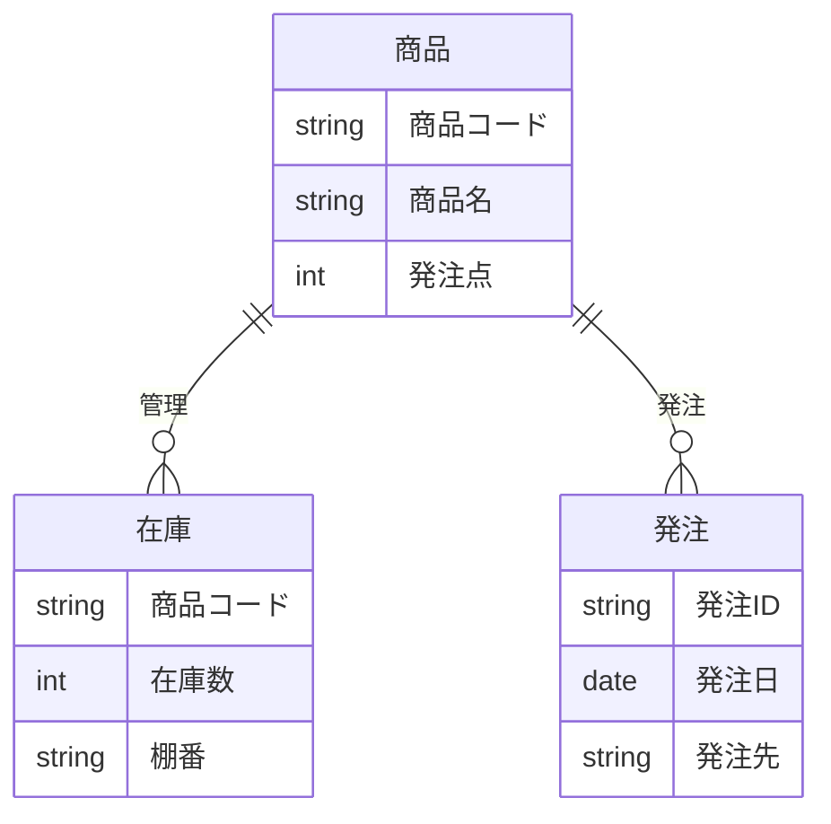

# 010-論理設計

テーブルやエンティティの論理構造をER図などで定義します。

## ドキュメントの目的

- 業務システムで扱うデータの論理構造（テーブル・エンティティ・関連）を明確化し、設計・開発・テスト・運用の品質を高める。
- DB設計・実装・運用の根拠とする。

## ドキュメントの内容

ドキュメントには、少なくとも以下を含めます。

- 論理設計ER図（Mermaid記法等）
- 各テーブル・エンティティの概要・関連
- サンプル（小売業務システム例）

## なぜこのドキュメントが必要か

- データの論理構造を明確にすることで、設計・開発・テスト・運用の品質と効率を高める。
- DB設計・実装・運用の認識ズレ・トラブルを防ぐ。

## このドキュメントがないとどう困るか

- データの論理構造が曖昧になり、設計・開発・運用で誤解や手戻りが発生する。
- DB設計・実装・運用の認識ズレによる品質低下・トラブルにつながる。

## サンプル

### 論理設計ER図（小売業務システム例/Mermaid記法）

---

注：上記は例です。実プロジェクトの論理設計ER図を具体的に記載してください。
