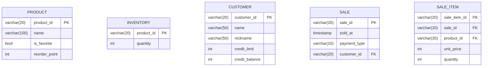

# DB 物理設計（簡略）

```mermaid
erDiagram
  PRODUCT {
    varchar(20) product_id PK
    varchar(100) name
    bool is_favorite
    int reorder_point
  }

  INVENTORY {
    varchar(20) product_id PK
    int quantity
  }

  CUSTOMER {
    varchar(20) customer_id PK
    varchar(50) name
    varchar(50) nickname
    int credit_limit
    int credit_balance
  }

  SALE {
    varchar(20) sale_id PK
    timestamp sold_at
    varchar(10) payment_type
    varchar(20) customer_id FK
  }

  SALE_ITEM {
    varchar(20) sale_item_id PK
    varchar(20) sale_id FK
    varchar(20) product_id FK
    int unit_price
    int quantity
  }
```

- 主なインデックス例
  - INVENTORY(product_id)
  - SALE(sold_at)
  - SALE_ITEM(sale_id)
