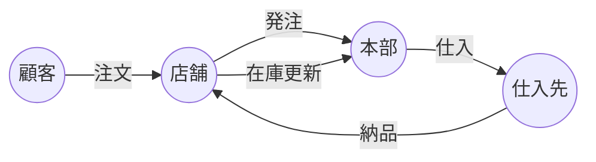

# 040-概念データフロー図

業務レベルでの情報の流れを Mermaid のフローチャートで表現します。

## ドキュメントの目的

- 業務・システムで扱う情報の流れ（データの受け渡し・処理）を可視化し、関係者間の認識を揃える。
- 要件定義・設計・テスト・運用時のデータ連携や処理順序の根拠とする。

## ドキュメントの内容

ドキュメントには、少なくとも以下を含めます。

- 業務・システム間のデータフロー図（Mermaid記法）
- 各データフローの概要・目的・関係者
- サンプル（小売業務システム例）

## なぜこのドキュメントが必要か

- データの流れを可視化することで、設計・開発・テスト・運用の品質と効率を高める。
- データ連携や処理順序の認識ズレ・トラブルを防ぐ。

## このドキュメントがないとどう困るか

- データの流れが曖昧になり、設計・開発・運用で誤解や手戻りが発生する。
- データ連携や処理順序の認識ズレによる品質低下・トラブルにつながる。

## サンプル

### 概念データフロー図例（Mermaid記法）

---

注：上記は例です。実プロジェクトの業務・システム間のデータフローを具体的に記載してください。
