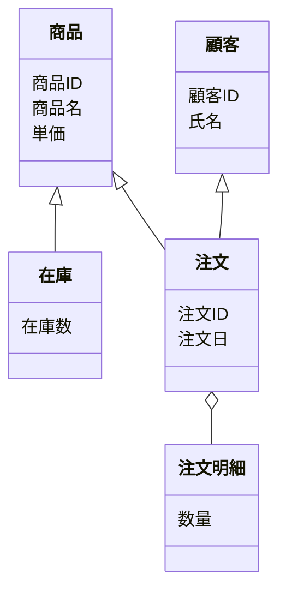

# 050-概念クラス図

業務上のエンティティ（商品、顧客など）の関係を Mermaid の classDiagram で表現します。

## ドキュメントの目的

- 業務・システムで扱う主要エンティティとその関係性を可視化し、設計・開発・テスト・運用の共通認識を作る。
- 要件定義・設計・データ連携時の根拠とする。

## ドキュメントの内容

ドキュメントには、少なくとも以下を含めます。

- 業務・システムの主要エンティティ一覧
- エンティティ間の関係（関連・集約・継承など）
- サンプル（小売業務システム例）

## なぜこのドキュメントが必要か

- エンティティと関係性を明確にすることで、設計・開発・テスト・運用の品質と効率を高める。
- 業務・システム間の認識ズレや手戻り・トラブルを防ぐ。

## このドキュメントがないとどう困るか

- エンティティや関係性が曖昧になり、設計・開発・運用で誤解や手戻りが発生する。
- 業務・システム間の認識ズレによる品質低下・トラブルにつながる。

## サンプル

### 概念クラス図例（Mermaid記法）

---

注：上記は例です。実プロジェクトのエンティティ・属性・関係を具体的に記載してください。
