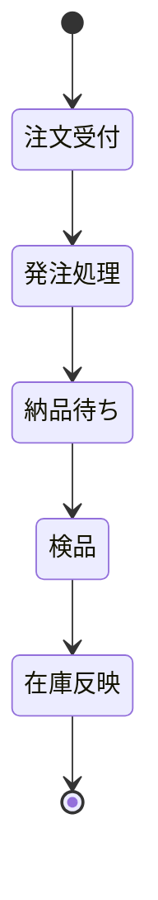

# 070-状態遷移図

受注や販売などの業務オブジェクトの状態変化を Mermaid のステート図で表現します。

## ドキュメントの目的

- 業務・システムで扱う主要オブジェクト（受注・販売など）の状態変化を可視化し、設計・開発・テスト・運用の品質を高める。
- 要件定義・設計・運用時の状態管理や処理順序の根拠とする。

## ドキュメントの内容

ドキュメントには、少なくとも以下を含めます。

- 業務・システムの主要オブジェクトの状態遷移図（Mermaid記法）
- 各状態・遷移の概要・条件
- サンプル（小売業務システム例）

## なぜこのドキュメントが必要か

- 状態遷移を明確にすることで、設計・開発・テスト・運用の品質と効率を高める。
- 状態管理や処理順序の認識ズレ・トラブルを防ぐ。

## このドキュメントがないとどう困るか

- 状態遷移が曖昧になり、設計・開発・運用で誤解や手戻りが発生する。
- 状態管理や処理順序の認識ズレによる品質低下・トラブルにつながる。

## サンプル

### 状態遷移図例（Mermaid記法）

---

注：上記は例です。実プロジェクトの業務オブジェクト・状態・遷移を具体的に記載してください。
