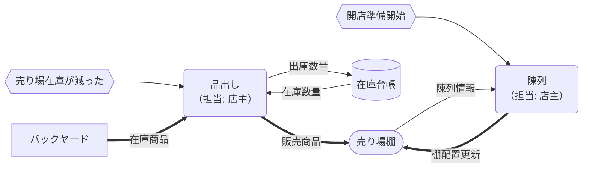
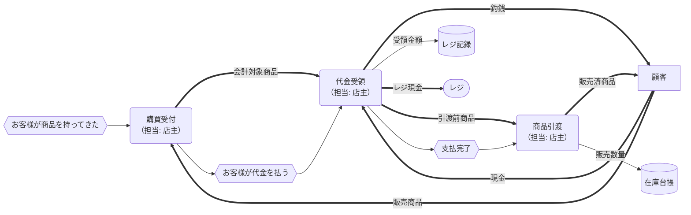
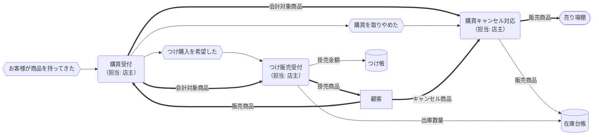

# 販売概念データフロー図（現状）

凡例と記号の意味は[mermaid-dfd-rules.md](mermaid-dfd-rules.md)を参照してください。

## 販売プロセス概要

| プロセス           | 業務内容                                             | 担当 | 業務が発生するイベント         | インプット                 | アウトプット                         |
| ------------------ | ---------------------------------------------------- | ---- | ------------------------------ | -------------------------- | ------------------------------------ |
| 品出し             | 売り場棚の商品の減った分をバックヤードから補充する。 | 店主 | 売り場在庫が足りなくなった     | 在庫商品数量、販売商品数量 | 販売商品                             |
| 陳列               | 売り場棚に商品を整える。                             | 店主 | 開店の準備を始めた             | 販売商品                   | 販売商品                             |
| 購買受付           | お客様が選んだ商品を受け取り、販売手続きを開始。     | 店主 | お客様が商品をレジに持ってきた | 販売商品                   | 請求金額、会計対象商品               |
| 代金受領           | 現金で代金を受け取る。                               | 店主 | お客様が代金を払った           | 会計対象商品、受領現金     | 領収書、釣銭、レジ現金の更新、売上金 |
| 商品引渡           | 袋詰め・提供などを行い、お客様に商品を渡す。         | 店主 | お客様が代金を支払った         | 会計対象商品               | 販売済商品、販売数量情報             |
| 購買キャンセル対応 | お客様が購入を取りやめた商品を棚に戻す。             | 店主 | お客様が購買を取りやめた       | 会計対象商品               | 販売商品                             |
| つけ販売受付       | お客様の希望で代金を後払いとして記録。               | 店主 | お客様がつけ購入を希望した     | 会計対象商品               | 掛払商品、掛売伝票、つけ金額情報     |

## 品出し、陳列

## 購買受付、代金受領、商品引渡し

## 例外処理：購買キャンセル対応、つけ販売受付

