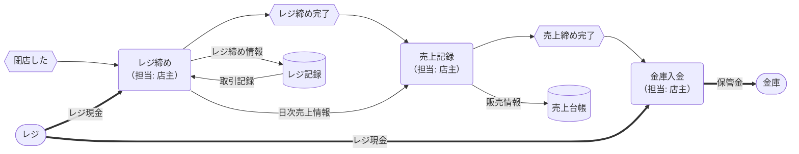
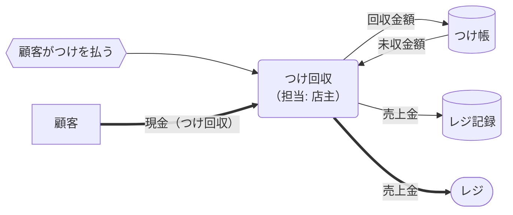
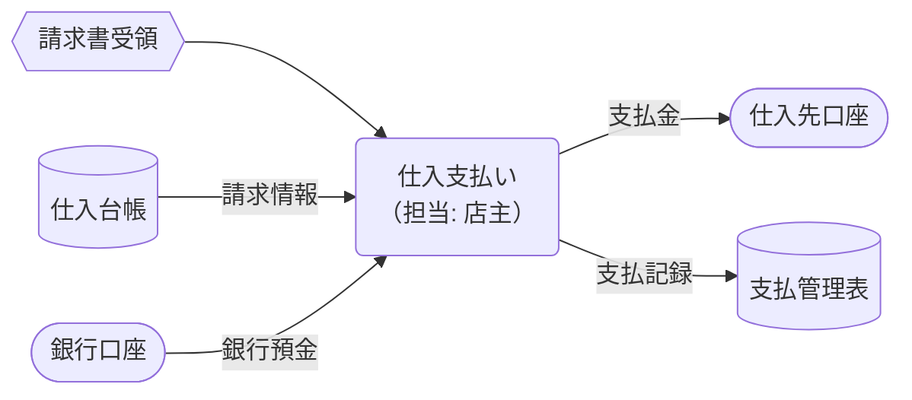
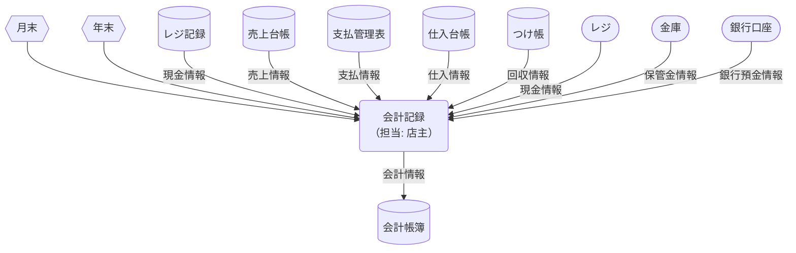

# 会計概念データフロー図（現状）

凡例と記号の意味は[cdfd-mermaid-rules.md](cdfd-mermaid-rules.md)を参照してください。

## 会計プロセス概要

| プロセス   | 業務内容                                       | 担当 | 業務が発生するイベント | インプット                       | アウトプット                                    |
| ---------- | ---------------------------------------------- | ---- | ---------------------- | -------------------------------- | ----------------------------------------------- |
| レジ締め   | 売上金とレジ内現金を照合し、差額を確認する。   | 店主 | 閉店した               | 前回レジ締め情報、レジ現金       | 本日レジ締め情報                                |
| 売上記録   | 日次売上を帳簿に記録する。                     | 店主 | レジ締めが終わった     | 本日レジ締め情報                 | 売上台帳                                        |
| 金庫入金   | 日次売上を金庫に保管。                         | 店主 | 売り上げ記録が終わった | レジ現金                         | 本日売上情報、保管金（＝レジ現金 − 釣銭準備金） |
| つけ回収   | つけ払い分の入金を受け取り、つけ帳を更新。     | 店主 | 顧客がつけを払った     | 売上金、未収金情報               | 掛売領収書、掛売金                              |
| 仕入支払い | 問屋や仕入先への支払いを実施。                 | 店主 | 請求書を受領した       | 請求書、請求金額情報             | 支払い金額情報                                  |
| 会計記録   | 月次・年次で売上・仕入・経費をまとめ、帳簿化。 | 店主 | 月末や年末になった     | 月間・年間の売上・仕入・経費情報 | 月次、年次の決算情報                            |

## 日次売上

## 例外処理：つけ回収

## 仕入支払い

## 決算

