# Mermaid を用いたデータフロー図（DFD）作成ルール

本ドキュメントは、業務分析・要求定義のために、**Mermaid の `flowchart` 構文を使って DFD（データフロー図）を描く際の標準ルール**です。

---

## 1. 全体方針

- Mermaid の **`flowchart` を DFD 風に利用**する。
- DFD の要素を、以下のように Mermaid の記号にマッピングする：

| 概念             | 意味                             | Mermaid での表現例                                   |
| ---------------- | -------------------------------- | ---------------------------------------------------- |
| プロセス         | 業務もしくはシステム内の処理     | 角丸長方形: `入荷受付("入荷受付<br>（担当: 店主）")` |
| プロセスグループ | 関連するプロセスのまとまり       | サブグラフ: `subgraph 入荷 ... end`                  |
| データストア     | DB・ファイル・紙の台帳等         | 円柱: `在庫DB[("在庫DB")]`                           |
| 物理保管         | 商品の物理的な保管場所（棚など） | 円柱: `在庫棚(["在庫棚"])`                           |
| 外部主体         | 仕入先・顧客などの外部           | 四角: `仕入先["仕入先"]`                             |
| イベント         | 業務発生のトリガー               | 六角形: `商品が納入された{{"商品が納入された"}}`     |
| 情報の流れ       | データが移動する流れ             | 細い矢印: `-->` + ラベル                             |
| 物理的な流れ     | 商品・現物などの流れ             | 太い矢印: `==>` + ラベル                             |

---

## 2. ノードのルール

### 2.1 プロセス

人が行う業務やシステム内の処理を表す。

- **角丸長方形 `()`** を使う。
- ノードIDは日本語を用いる。ID と表示ラベルは原則同じにする。
- 表示ラベルは日本語で、業務名が一目で分かるようにする。""で囲う。
- 業務を行う担当ロールは、表示ラベルに `<br>（担当: ロール）` の形式で併記する。省略も可。

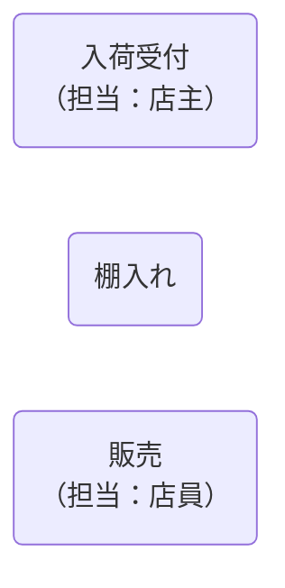

- ノード名は、**業務名（日本語）を短く**書き、必要に応じて改行で補足してもよい。
- 改行は `<br>` を使用する。

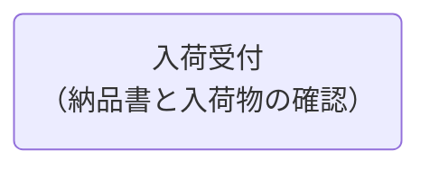

業務プロセスの責任主体（人/ロール）を DFD 上で簡易表示したい場合、以下方針とします。

| 項目       | 推奨表現                                                               | 例                                             |
| ---------- | ---------------------------------------------------------------------- | ---------------------------------------------- |
| 表示方法   | 業務名の表示ラベルに `<br>` 改行し「（担当: ロール）」を括弧付きで併記 | `入荷受付("入荷受付<br>（担当: 店主）")`       |
| 複数ロール | 「・」区切りで列挙（責任と実作業を区別したい時は日本語で補足）         | `返品処理("返品処理<br>（担当: 店主・店員）")` |
| 長文化防止 | ロール名は最小限（店主 / 店員 / 経理 など）                            | -                                              |
| 詳細責務   | 必要に応じてDFD外（RACI表や別ドキュメント）で管理                      | -                                              |

補足: DFD は本来「データの変換と流れ」を主目的とするため、担当表記は過度に装飾せず、分析段階の可読性向上に留める。正式な責務定義は RACI などで合意形成してください。

### 2.2 プロセスグループ

関連する複数のプロセスをグループ化して表現する。

- **サブグラフ `subgraph ... end`** を使う。
- サブグラフ名は日本語でよい。業務のまとまりを示す短い名称を付ける。
- 複数のプロセスの記載を省略する場合は、`...プロセス群`と記載して、１プロセスで表現する。

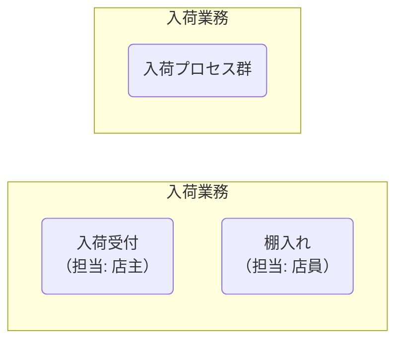

- サブグラフ内のプロセス間も、通常通り `-->` や `==>` でつなげる。
- サブグラフをまたぐフローも記述できる。

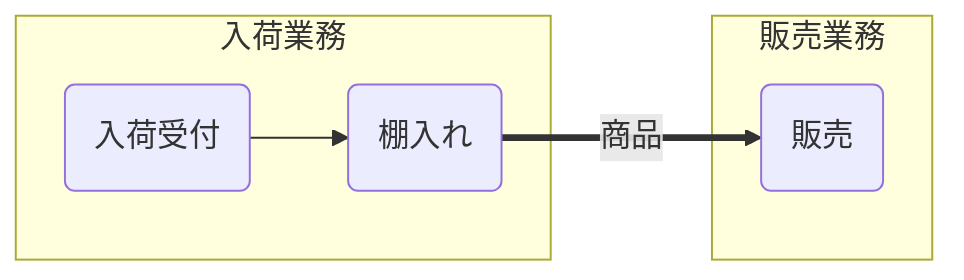

- サブグラフの方向は `direction TB`（縦）や `direction LR`（横）で指定可能。省略時は親フローチャートの方向に従う。

### 2.2 データストア（DB・ファイル・紙）

- **円柱ノード `[(...)]`** をデータストアとして使う。
- DB・ファイル・紙など、媒体が違っても **記号は同じ**。媒体は名称で区別する。

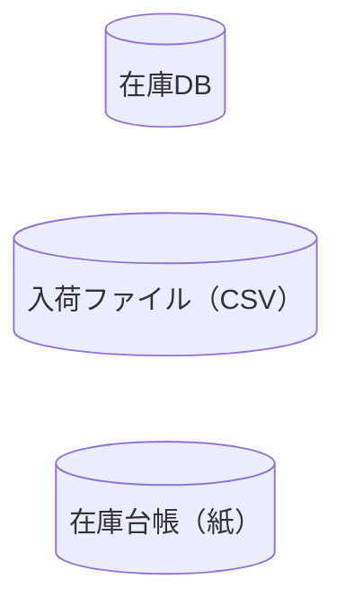

- 原則として「論理的なデータのまとまり」を 1 データストアとして表現する。

### 2.3 外部主体（外部エンティティ）

- **四角のノード `[]`** を使う。

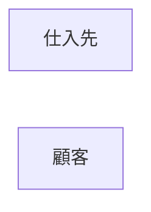

### 2.4 イベント（業務発生のトリガー）

- 業務を開始させる条件・トリガーは **六角形 `{{...}}`** で表す。
- ノードIDも日本語とし、ID とラベルを同じにしてよい。

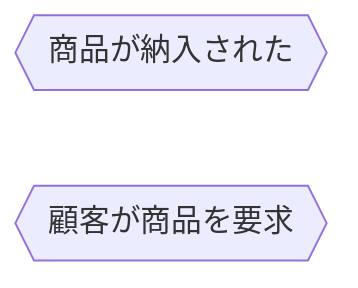

- イベントは **外部主体や他プロセスからの入力 → イベント → プロセス** という形でつなげる。


---

## 3. エッジ（矢印）のルール

### 3.1 情報の流れ（データフロー）

- **通常の矢印 `-->`** を「情報の流れ」として使う。
- edge ラベルに「流れる情報の内容」を記載する。

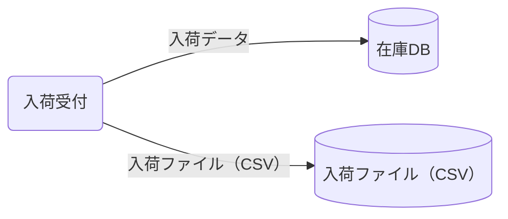

- ラベルは **何の情報かが分かる日本語**で書く。
- 詳細が必要な場合は `<br>` で改行して列挙してよい。

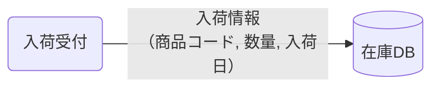

### 3.2 物の流れ（商品・現物）

- **太い矢印 `==>`** を「物理的な流れ」として使う。
- ラベルに「流れる物」を記載する。


- 「情報 `-->`」「物 `==>`」という対応を **必ず凡例に明記**する。

### 3.3 イベントと業務の関係

- イベントからプロセスへは **情報としてのトリガー**として `-->` でつなぐ。


---

## 4. 命名・表記ルール

- **ノードIDは日本語**を使用してよい。
  例: `入荷受付("入荷受付")`, `在庫DB[("在庫DB")]`, `商品が納入された{{"商品が納入された"}}`
- ID と表示ラベルを分けることもできるが、混乱を避けるため **基本は同じ**にする。
- 表示ラベルは日本語で、業務やデータ内容が一目で分かるようにする。
- データフローのラベルは、「〇〇情報」「〇〇データ」「〇〇依頼」など、**名詞形**を基本とする。
- イベントは「〜された」「〜が発生」「〜を要求」のように、**事象を短い文で表現**する。
- 担当ロール併記は `<br>（担当: ロール）` を表示ラベル末尾に加える。ノードIDは担当併記前の業務名を用い、表示ラベルのみ拡張する。

---

## 5. DFD のサンプル（情報＋物＋イベント＋媒体）

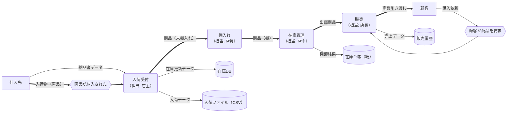

---

## 6. 凡例

凡例は下記のように表現します。

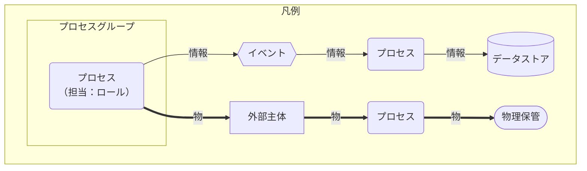

※ 必要なら `classDef` で色などを定義してもよい（プロジェクトポリシーに応じて）。

---

## 7. 生成 AI への指示テンプレート

生成 AI にデータフロー図を作らせるときは、以下のような指示を与える。

> - Mermaid の `flowchart` 構文を使ってデータフロー図（DFD）を書いてください。
> - **プロセス**は角丸長方形 `()`、**プロセスグループ**はサブグラフ `subgraph ... end`、**データストア**（DB・ファイル・紙）は円柱 `[(  )]`、**物理保管場所**は `([ ])`、**外部主体**は四角 `[]`、**イベント**は六角形 `{{  }}` を使ってください。
> - プロセスグループ内の複数プロセスを省略する場合は、1つの角丸長方形ノードで `...プロセス群` のように記載してください（例: `入荷プロセス群")`）。
> - ノードIDは日本語を使用し、原則として表示ラベルと同じにしてください。ただし、漢字、ひらがな、カタカナ、数値のみとして、数値から始めるのは避けてください（理由：記号を使うとmermaidのエラーになります）。
> - 表示ラベルは日本語で、業務名やデータ内容が一目で分かるようにしてください。また、""で囲ってください。
> - 業務プロセスの担当ロールは `<br>（担当: ロール）` の形式で表示ラベルに併記してください（省略も可）。ノードIDは担当併記前の業務名を用いてください。
> - **情報の流れ**は `-->` を使い、edge ラベルに流れる情報の内容を日本語で記載してください。
> - **物理的な流れ**（商品・現物）は `==>` を使い、edge ラベルに流れる物を記載してください。
> - イベントは六角形ノードとして定義し、外部主体や他プロセスからイベントへ、イベントからプロセスへ `-->` で接続してください。ただし、概要のDFDではイベントノードを省略してもよいです。
> - `凡例`はこのファイル [cdfd-mermaid-rules.md](cdfd-mermaid-rules.md)を参照するように記載ください。
> - 必要に応じて `<br>` を用いてノードやエッジラベルを改行してください。
> - 結果は ` ```mermaid ～``` ` のコードブロックとして出力してください。

このテンプレートをコピーして、生成 AI のプロンプトに貼り付けて利用してください。なお、[cdfd-mermaid-instruction.md](cdfd-mermaid-instruction.md)として別ファイルに保存しています。
