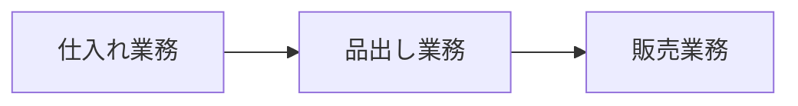
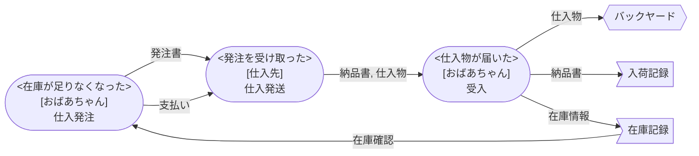
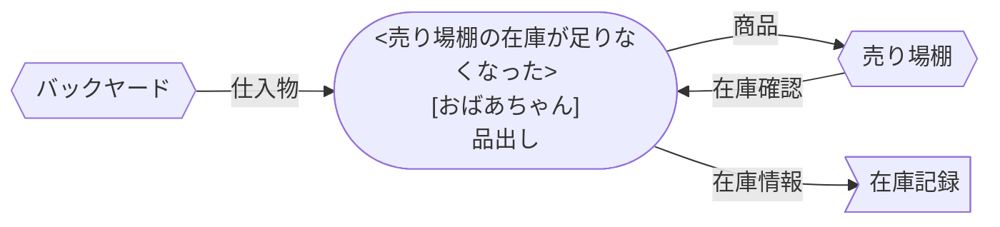
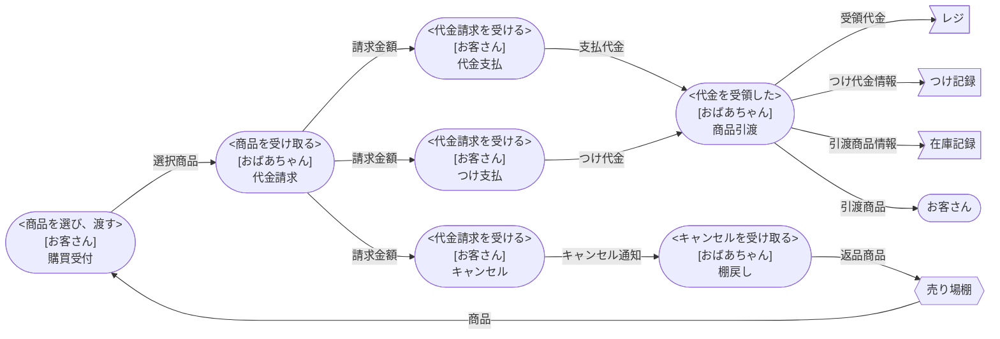

# 販売管理概念データフロー図（現状）

## 全体フロー

```mermaid
flowchart LR
  仕入れ業務[仕入れ業務]
  品出し業務[品出し業務]
  販売業務[販売業務]

  仕入れ業務 --> 品出し業務
  品出し業務 --> 販売業務
```

## 仕入れ業務

```mermaid
flowchart LR
  仕入発注(["<在庫が足りなくなった><br/>[おばあちゃん]<br/>仕入発注"])
  仕入発送(["<発注を受け取った><br/>[仕入先]<br/>仕入発送"])
  受入(["<仕入物が届いた><br/>[おばあちゃん]<br/>受入"])
  バックヤード{{バックヤード}}
  入荷記録>入荷記録]
  在庫記録>在庫記録]

  在庫記録-->|在庫確認| 仕入発注
  仕入発注 -->|発注書| 仕入発送
  仕入発注 -->|支払い| 仕入発送

  仕入発送 -->|納品書, 仕入物| 受入
  受入 -->|仕入物| バックヤード
  受入 -->|納品書| 入荷記録
  受入 -->|在庫情報| 在庫記録
```

## 品出し業務

```mermaid
flowchart LR
  バックヤード{{バックヤード}}
  品出し(["<売り場棚の在庫が足りなくなった><br/>[おばあちゃん]<br/>品出し"])
  売り場棚{{売り場棚}}
  在庫記録>在庫記録]

  売り場棚 -->|在庫確認| 品出し
  バックヤード -->|仕入物| 品出し
  品出し -->|商品| 売り場棚
  品出し -->|在庫情報| 在庫記録
```

## 販売業務

```mermaid
flowchart LR
  購買受付(["<商品を選び、渡す><br/>[お客さん]<br/>購買受付"])
  代金請求(["<商品を受け取る><br/>[おばあちゃん]<br/>代金請求"])
  代金支払(["<代金請求を受ける><br/>[お客さん]<br/>代金支払"])
  つけ支払(["<代金請求を受ける><br/>[お客さん]<br/>つけ支払"])
  キャンセル(["<代金請求を受ける><br/>[お客さん]<br/>キャンセル"])
  商品引渡(["<代金を受領した><br/>[おばあちゃん]<br/>商品引渡"])
  商品受領([お客さん])
  棚戻し(["<キャンセルを受け取る><br/>[おばあちゃん]<br/>棚戻し"])
  在庫記録>在庫記録]
  つけ記録>つけ記録]
  レジ>レジ]
  売り場棚{{売り場棚}}

  売り場棚 -->|商品| 購買受付
  購買受付 -->|選択商品| 代金請求

  代金請求 -->|請求金額| 代金支払
  代金請求 -->|請求金額| つけ支払
  代金請求 -->|請求金額| キャンセル

  代金支払 -->|支払代金| 商品引渡
  つけ支払 -->|つけ代金| 商品引渡
  キャンセル -->|キャンセル通知| 棚戻し

  棚戻し -->|返品商品| 売り場棚

  商品引渡 -->|受領代金| レジ
  商品引渡 -->|つけ代金情報| つけ記録
  商品引渡 -->|引渡商品情報| 在庫記録
  商品引渡 -->|引渡商品| 商品受領
```
